# Consultry video journey graph

**Status:** ERP/process-management video narrative approved; detailed model remains a recommendation, not a locked product-scope decision  
**Source composition:** [`pitch-scene.jsx`](./pitch-scene.jsx)  
**Detailed scene index:** [`video-redline-index.md`](./video-redline-index.md)  
**Open decisions:** [`video-redline-qa.md`](./video-redline-qa.md)  
**Analysis date:** 2026-07-10

## 1. Why this graph exists

This file maps the current video journey, the recommended replacement journey, and the relationships between product functions. It uses explicit **subject — predicate — object** triplets so that the narrative can later be consumed as a graph, checked against product definitions, or translated into scene implementation work.

The graph distinguishes three evidence layers:

- **Product Vision under refinement:** the narrative target. Existing phase boundaries are non-governing until the vision is complete.
- **Current build definitions:** useful evidence and terminology, but not a reason to remove vision capabilities in this redline.
- **Demo scenario:** fictional customer, documents, metrics and people used only to make the journey concrete.

## 2. Current product-definition sources

The current, non-archived product-definition files are the evidence baseline. Links below are local and relative to this video project.

| Authority | Local latest file | What it controls here |
|---|---|---|
| Context anchor | [`_CONTEXT-AND-MEMORY.md`](../../../product-definition/_CONTEXT-AND-MEMORY.md) | Read-first summary, locked decisions and current candidate status. |
| Terminology and governance | [`Consultry-Alignment-Control-Plane-v1.0.md`](../../../product-definition/Consultry-Alignment-Control-Plane-v1.0.md) | Canonical names, H1 proof contract and source-of-truth rules. |
| MVP scope | [`Consultry-MVP-PRD-v1.0.md`](../../../product-definition/Consultry-MVP-PRD-v1.0.md) | What can be presented as built first; explicit out-of-scope claims. |
| Domain language | [`Consultry-Business-Domain-Definition-v1.0.md`](../../../product-definition/Consultry-Business-Domain-Definition-v1.0.md) | Definitions of Signal, Opportunity, ProposalDraft, TeamShape, ProjectStatus and invariants. |
| Feature and flow model | [`Consultry-Phase-1-MVP-Specs-and-Flow-Canvas-v1.0.md`](../../../product-definition/Consultry-Phase-1-MVP-Specs-and-Flow-Canvas-v1.0.md) | F1–F6 flows and the end-to-end H1 path. |
| Full horizon map | [`Consultry-Product-Vision-v1.0.md`](../../../product-definition/Consultry-Product-Vision-v1.0.md) | H1/H2/H3 boundaries and module catalog. |
| Technical entity model | [`Consultry-MVP-Technical-Foundation-v1.0.md`](../../../product-definition/Consultry-MVP-Technical-Foundation-v1.0.md) | Entities, SourceBinding, AuditEvent and integration posture. |
| Pain evidence | [`Consultry-Feature-Pain-Map-v1.0.md`](../../../product-definition/Consultry-Feature-Pain-Map-v1.0.md) | Why the Win and Work scenes exist. |
| Measurement | [`Consultry-MVP-Measurement-Spec-v1.0.md`](../../../product-definition/Consultry-MVP-Measurement-Spec-v1.0.md) | Five-day proof slice, approval and adoption measurement. |
| Project/Knowledge Intelligence depth | [`Consultry-Project-Intelligence-Symbiosis-Graph-v1.0.md`](../../../product-definition/Consultry-Project-Intelligence-Symbiosis-Graph-v1.0.md) | Evidence for a core Product Vision use case; prior phase labels do not constrain this redline. |

Do not use files under `product-definition/_archive/` as current product authority. The target-persona file is explicitly date-stale and is not treated as binding.

## 3. Narrative recommendation

### 3.1 Replace the current case

| Current video case | Recommended case |
|---|---|
| `Bank AG · AWS Cloud Transformation` | `Hansa Maschinenbau AG · ERP-Migration & Prozessmanagement` |
| Net-new-looking public signals | Existing-client, source-bound signals led by a contract option window |
| Cloud/Security product bundle | Process assessment, ERP target architecture, migration concept and rollout roadmap |
| Named cloud specialists | Keep named matching and People Scores; replace with ERP/process-management roles |
| Outreach email | Internal, grounded concept/proposal section |
| Named CV package | Keep CV generation; replace cloud content with ERP/process experience and methods |
| Offer + contract + “Deal closed” | Human-approved internal `ProposalDraft`; ready for internal review/export |
| Newly won project appears instantly | Same previously won project after a visible time jump |

### 3.2 Why this case fits the target boutique

The replacement is neither pure strategy nor pure implementation. It lets an IT and process consulting boutique demonstrate:

- process analysis across Order-to-Cash, Procure-to-Pay and master-data management;
- a process-management target operating model with owners, governance and KPIs;
- ERP target architecture, integrations, data migration and cutover planning;
- adoption, enablement and rollout-wave management;
- reuse of prior delivery artefacts and methods;
- a small, credible multidisciplinary TeamShape;
- a grounded concept/proposal rather than a generic sales email.

All customer names, consultants, clauses, figures, references and artefacts in this recommendation are intentionally fictional demo data.

## 4. Recommended user journey

```mermaid
flowchart LR
  A["Contract option signal"] --> C["Signal cluster"]
  B["Consultant logs need from project work"] --> C
  B2["LinkedIn Mail"] --> C
  C --> D["Human approval"]
  D --> E["Opportunity"]
  E --> F["Opportunity workspace"]
  F --> G["EvidencePack + NeedMap"]
  G --> H["Named team matching + People Scores"]
  H --> CV["CV generation"]
  CV --> I["ConceptPlan"]
  I --> J["GroundedDraftSection"]
  J -.-> K["Optional ReviewIssues metadata"]
  J --> L["Human approval"]
  L --> M["Internal ProposalDraft / PDF or Markdown export"]
  M -. "time jump: later, after human-led win" .-> N["Same active ERP project"]
  N --> N2["Deep Knowledge + Project Data Intelligence"]
  N2 --> O["Default ProjectStatus without person activity"]
  O --> P["Meeting-prep draft with sources"]
```

### 4.1 Extensible journey rail

The rail is not a fixed five-stage boundary. Use two abstraction levels:

**Macro chapters:**

`Gewinnen → Arbeiten → Wirkung`

**Expanded operational rail:**

`Signal → Opportunity → Kontext → Team → Konzept → Freigabe → Projekt → Wirkung`

1. **Signal** — contract, consultant worklog, LinkedIn Mail and project evidence converge.
2. **Opportunity** — the user qualifies and approves the chance.
3. **Kontext** — EvidencePack, NeedMap, Knowledge and Project Data become visible.
4. **Team** — named matching, People Scores and availability/collisions.
5. **Konzept** — ConceptPlan, CV package and GroundedDraftSection are composed.
6. **Freigabe** — human-owned internal approval/export readiness.
7. **Projekt** — after a visible time jump, the same previously won project becomes active work context.
8. **Wirkung** — the existing business-case scene; its content is preserved.

The UI may collapse to macro chapters for overview moments and expand to operational stages during the detailed journey.

## 5. Scenario objects

| Object | Recommended demo content | Narrative role |
|---|---|---|
| Account | Hansa Maschinenbau AG | Fictional existing client |
| Primary Signal A | Contract option/extension window opens in 120 days, linked to the clause | Source-bound commercial trigger |
| Primary Signal B | Internal consultant logs need `X` from active project work in the Consultry Workspace | Human field signal and knowledge feedback loop |
| Supporting Signal | LinkedIn Mail from the customer context | Relationship/context signal |
| Supporting Signal | Workshop note: five sites use inconsistent Order-to-Cash and Procure-to-Pay processes | Firm source |
| Supporting Signal | Connected process/ERP project data: recurring master-data breaks and manual handoffs | Core cross-source Project/Knowledge Intelligence |
| Opportunity | ERP-Migration & Prozessmanagement | Qualified growth opportunity |
| NeedMap | harmonise core processes; define ownership; improve master data; map integrations; prepare migration waves | Concept input |
| EvidencePack | contract clause, consultant worklog, LinkedIn Mail, project data, fictional reference, trustworthy sources and internal methods | Grounding input |
| Named team | Max — ERP Process Lead; Lena — ERP Solution & Integration Architect; Jonas — Data Migration & Change Lead | Named matching with People Scores retained |
| CV package | ERP/process experience, project references, methods and availability for the matched team | Generated named collateral retained |
| ConceptPlan | Discovery → Fit-to-Standard → Migration Pilot → Rollout | Concept structure |
| GroundedDraftSection | “Vorgehensmodell und Migration Welle 1,” with sentence-level provenance | Primary generated artefact |
| ReviewIssues | optional contextual warnings, not a primary payoff card | Supporting quality metadata |
| ProposalDraft | internal version 0.1, approved by consultant author | Human-owned internal artefact |
| Project Intelligence | deep connection of Knowledge, Project Data, artefacts and work context | Core use case |
| ProjectStatus | default deliverable-level status for the same previously won ERP project | Work surface; no person activity by default |

## 6. Functionality relationship map

| From | Relationship | To | Product consequence |
|---|---|---|---|
| Contract/document | produces | source-bound Signal | Avoids speculative lead generation. |
| Signal | is qualified into | Opportunity | Requires explanation, sources and human approval. |
| Opportunity | scopes | Opportunity workspace | All AI work inherits the active object context. |
| Opportunity | requests | EvidencePack | Evidence precedes drafting. |
| EvidencePack | informs | NeedMap | Needs must be traceable to sources. |
| NeedMap | constrains | ConceptPlan | The plan solves evidenced needs, not a generic template. |
| Consultant profiles | feed | named team matching and People Scores | Named staffing is retained in the Product Vision. |
| Named team + CVs | reality-check | ConceptPlan/ProposalDraft | Deliverability and credibility are visible. |
| KnowledgeAsset | grounds | GroundedDraftSection | Firm facts require SourceBinding. |
| ExternalSource | grounds | External facts | Freshness and source policy apply. |
| Model expertise | contributes | methodology wording | It is labelled as expertise, not presented as fact. |
| ReviewIssue | optionally warns | approval | It supports review but is not a headline payoff object. |
| ApprovalEvent | promotes | draft version | AI suggestions do not become binding by themselves. |
| ProposalDraft | exports to | internal PDF/Markdown | Human approval remains explicit. |
| Knowledge + Project Data | connect through | Project Intelligence | Deep references are a core Product Vision use case. |
| Project data | informs | default ProjectStatus | Default status avoids person-specific activity; detail views may drill down. |
| Project context | grounds | meeting-prep draft | The assistant retrieves; the human remains responsible. |

## 7. Triplet graph

Triplet syntax is `subject — predicate — object`. Qualifiers in brackets describe horizon, source class or recommendation status.

### 7.1 Source-of-truth triplets

- `_CONTEXT-AND-MEMORY` — summarizes — current locked and candidate state.
- `Product-Vision Refinement mode` — makes non-governing for this redline — existing phase boundaries.
- `Alignment Control Plane` — defines — canonical naming hierarchy.
- `MVP PRD` — owns — H1 build scope.
- `Product Vision` — owns — H1/H2/H3 horizon map.
- `Business Domain Definition` — defines — ubiquitous domain language.
- `Phase-1 Specs` — defines — concrete F1–F6 flows.
- `Project Intelligence document` — supplies depth for — a core Product Vision use case.
- `Archived product files` — must not override — current non-archived definitions.

### 7.2 Canonical domain triplets

- `Signal` — is a raw precursor to — `Opportunity`.
- `Opportunity` — is a qualified — chance with rationale, sources and status.
- `Opportunity` — is created only after — human approval.
- `Tender` — can create — `Opportunity`.
- `Existing-client Signal` — can create — `Opportunity`.
- `Opportunity` — anchors — `ProposalDraft`.
- `ProposalDraft` — contains — `Konzept`.
- `ProposalDraft` — remains — human-owned internal artefact in this narrative.
- `ProposalDraft` — must not imply — autonomous customer acceptance.
- `Firm-Fact` — requires — `CitationLink/SourceBinding`.
- `External-Fact` — requires — `CitationLink/SourceBinding`.
- `Model-Expertise` — must be labelled as — methodology rather than fact.
- `Recommendation` — requires before binding — `ApprovalEvent`.
- `ApprovalEvent` — produces — auditable human responsibility.
- `ConsultantProfile` — feeds — named team matching.
- `Named team matching` — produces — People Scores and selected consultants.
- `Named consultants` — produce — CV package.
- `ProjectStatus` — aggregates — deliverable progress.
- `ProjectStatus` — must not expose by default — individual performance.

### 7.3 Recommended demo triplets

- `Hansa Maschinenbau AG` — is modelled as — existing Account.
- `Contract clause 12.3` — indicates — option window in 120 days [fictional demo].
- `Contract clause 12.3` — grounds — primary Signal A.
- `Internal consultant` — observes during project work — customer need X [fictional demo].
- `Internal consultant` — logs through — Consultry Workspace.
- `Consultant worklog` — grounds — primary Signal B.
- `LinkedIn Mail` — contributes context to — Signal cluster [fictional demo].
- `Workshop note` — evidences — inconsistent O2C and P2P processes across sites [fictional demo].
- `ERP process report` — evidences — master-data breaks and manual handoffs [fictional demo].
- `Primary Signal` — triggers — qualification recommendation.
- `Account lead` — approves — Opportunity activation.
- `Opportunity` — is titled — ERP-Migration & Prozessmanagement.
- `Opportunity` — owns — EvidencePack.
- `EvidencePack` — contains — contract clause.
- `EvidencePack` — contains — workshop note.
- `EvidencePack` — contains — ERP process report.
- `EvidencePack` — contains — prior reference asset.
- `EvidencePack` — contains — external method source.
- `EvidencePack` — generates — NeedMap.
- `NeedMap` — identifies — Order-to-Cash harmonisation.
- `NeedMap` — identifies — Procure-to-Pay harmonisation.
- `NeedMap` — identifies — master-data readiness.
- `NeedMap` — identifies — process ownership and governance.
- `NeedMap` — identifies — migration waves and adoption.
- `Opportunity` — requests — named team matching.
- `Named team` — includes — Max as ERP Process Lead [fictional demo].
- `Named team` — includes — Lena as ERP Solution & Integration Architect [fictional demo].
- `Named team` — includes — Jonas as Data Migration & Change Lead [fictional demo].
- `People Scores` — explain — role fit and project evidence.
- `Named team` — generates — ERP/process CV package.
- `ConceptPlan` — sequences — Discovery, Fit-to-Standard, Migration Pilot, Rollout.
- `GroundedDraftSection` — implements — ConceptPlan phase “Migration Pilot”.
- `ReviewIssues` — optionally flag — missing or stale evidence.
- `Consultant author` — approves — ProposalDraft version 0.1.
- `ProposalDraft version 0.1` — is exported as — internal PDF/Markdown.

### 7.4 Video/function triplets

- `Signal Radar scene` — visualises — source-bound Signal intake.
- `Opportunity approval scene` — visualises — Recommendation → Explanation → Approval → Audit.
- `Opportunity workspace scene` — should visualise — EvidencePack and NeedMap before draft generation.
- `Team scene` — should visualise — named matching, People Scores and ERP-role fit.
- `CV scene` — should visualise — ERP/process experience and references.
- `Concept Canvas scene` — should visualise — EvidencePack, named team, CVs, ConceptPlan and GroundedDraftSection.
- `Review payoff scene` — should replace — Deal closed.
- `Work scene` — should be labelled as — same previously won project after a time jump.
- `Project Intelligence scene` — should connect — Knowledge, Project Data and work artefacts deeply.
- `Project dashboard` — should display — deliverable-level ProjectStatus.
- `Meeting-prep scene` — should display — grounded draft plus source links.
- `Business-case scene` — should represent — effect/ROI rather than Faktura product.

### 7.5 Owner-decision triplets

- `Product Vision refinement` — precedes — final scope boundaries.
- `Named staffing` — remains in — the vision narrative.
- `People Scores` — remain in — the vision narrative.
- `CV package generation` — remains in — the vision narrative.
- `Deep Project/Knowledge Intelligence` — is — a core use case.
- `LinkedIn Mail` — remains — a signal source.
- `Outreach email workflow` — is removed from — the primary narrative.
- `ReviewIssues` — remain as — optional supporting metadata.
- `Deal closed automation` — is replaced by — human-owned internal approval/export readiness.
- `Active ERP project` — is — the same project previously won.
- `Opportunity-to-Project transition` — requires — a visible time jump.
- `Default ProjectStatus` — excludes — person-specific activity.
- `Project detail drill-down` — may include — person-specific information.
- `Business-case content` — remains — unchanged in the current pass.
- `Voiceover` — remains — muted.
- `Music` — remains — muted.
- `Composition format` — remains — current `.dc.html`/React project.
- `Scene verification points` — are derived from — dynamic source timings.
- `Journey rail` — can switch between — macro and expanded abstraction levels.
- `Macro rail` — contains — Gewinnen, Arbeiten, Wirkung.
- `Expanded rail` — contains — Signal, Opportunity, Kontext, Team, Konzept, Freigabe, Projekt, Wirkung.
- `Human approval` — remains responsible for — binding narrative transitions.

## 8. Current-to-target journey redline

| Current relationship | Problem | Target relationship |
|---|---|---|
| Public article + LinkedIn + RFP + internal note → “New Opportunity” | Sources do not yet express the desired consulting feedback loop. | Contract option signal + consultant-logged need from project work + LinkedIn Mail + connected project evidence → qualified Opportunity. |
| Opportunity → outreach email → “Versand geplant” | The owner removed outreach from the primary narrative. | Opportunity → EvidencePack/NeedMap → grounded internal concept section. |
| Opportunity → named matching → CVs | Cloud/security content is wrong for the new case. | Keep named matching, People Scores and CV generation; replace with ERP/process roles and evidence. |
| Canvas → Angebot & Vertrag | Payoff does not foreground the approved concept objects. | Canvas → EvidencePack + named team/CVs + ConceptPlan + GroundedDraftSection; ReviewIssues only as supporting metadata. |
| AI generates bundle → Deal closed | Collapses human review, customer decision and commercial process into an autonomous-looking action. | AI prepares source-grounded draft → consultant reviews/approves → “internal review ready”. |
| Deal closed → active project | Implies instant conversion and creates an unexplained lifecycle jump. | Same previously won project after an explicit time jump: `Später · im gewonnenen Projekt`. |
| Jira/ERP/DMS + project artefacts → project intelligence | Current scene depth is fragmented. | Treat deep Knowledge/Project Data connections as a core use case; keep person activity out of the default view. |
| Faktura → business case | Rail label is misleading. | Rename rail stage to `Wirkung`; preserve business-scene content unchanged. |

## 9. Recommended implementation order

1. Use Product-Vision Refinement mode; do not remove capabilities solely because of current phase boundaries.
2. Replace global scenario vocabulary and apply the approved stage rail.
3. Rebuild Signal intake around the contract trigger, consultant worklog and LinkedIn Mail.
4. Rebuild the Opportunity workspace around EvidencePack, NeedMap and Approval; remove outreach email.
5. Keep and reframe named team matching, People Scores and CV generation for ERP/process roles.
6. Replace offer/contract/deal-close payoff with EvidencePack, team/CVs, ConceptPlan, GroundedDraftSection and human approval; keep ReviewIssues secondary.
7. Show the same previously won project after an explicit time jump.
8. Make deep Knowledge/Project Data connection a core Work scene while keeping person activity out of the default status view.
9. Rename the rail stage to Wirkung without reworking business-scene content.
10. Preserve current length, mute audio, derive checks from dynamic scene timings and refresh the handover after implementation.
