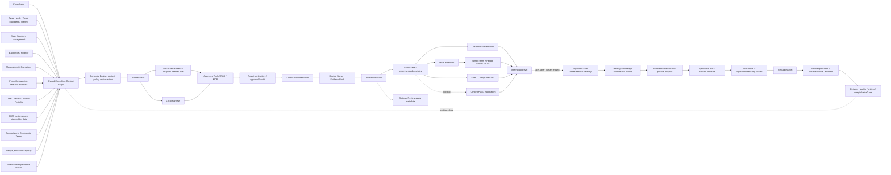

# Consultry video journey graph

**Status:** Consulting-OS Product Vision scope approved; ERP/process demo remains one vertical proof path, not a product boundary
**Source composition:** [`pitch-scene.jsx`](./pitch-scene.jsx)  
**Detailed scene index:** [`video-redline-index.md`](./video-redline-index.md)  
**Open decisions:** [`video-redline-qa.md`](./video-redline-qa.md)  
**Analysis date:** 2026-07-11

## 1. Why this graph exists

This file maps the current video journey, the recommended replacement journey, and the relationships between product functions. It uses explicit **subject — predicate — object** triplets so that the narrative can later be consumed as a graph, checked against product definitions, or translated into scene implementation work.

The graph distinguishes three evidence layers:

- **Product Vision under refinement:** the narrative target. Existing phase boundaries are non-governing until the vision is complete.
- **Current build definitions:** useful evidence and terminology, but not a reason to remove vision capabilities in this redline.
- **Demo scenario:** fictional customer, documents, metrics and people used only to make the journey concrete.

## 2. Current product-definition sources

The current, non-archived product-definition files are the evidence baseline. Links below are local and relative to this video project.

| Authority | Local latest file | What it controls here |
|---|---|---|
| Context anchor | [`_CONTEXT-AND-MEMORY.md`](../../../product-definition/_CONTEXT-AND-MEMORY.md) | Read-first summary, locked decisions and current candidate status. |
| Terminology and governance | [`Consultry-Alignment-Control-Plane-v1.0.md`](../../../product-definition/Consultry-Alignment-Control-Plane-v1.0.md) | Canonical names, H1 proof contract and source-of-truth rules. |
| MVP scope | [`Consultry-MVP-PRD-v1.0.md`](../../../product-definition/Consultry-MVP-PRD-v1.0.md) | What can be presented as built first; explicit out-of-scope claims. |
| Domain language | [`Consultry-Business-Domain-Definition-v1.0.md`](../../../product-definition/Consultry-Business-Domain-Definition-v1.0.md) | Definitions of Signal, Opportunity, ProposalDraft, TeamShape, ProjectStatus and invariants. |
| Feature and flow model | [`Consultry-Phase-1-MVP-Specs-and-Flow-Canvas-v1.0.md`](../../../product-definition/Consultry-Phase-1-MVP-Specs-and-Flow-Canvas-v1.0.md) | F1–F6 flows and the end-to-end H1 path. |
| Full horizon map | [`Consultry-Product-Vision-v1.0.md`](../../../product-definition/Consultry-Product-Vision-v1.0.md) | H1/H2/H3 boundaries and module catalog. |
| Technical entity model | [`Consultry-MVP-Technical-Foundation-v1.0.md`](../../../product-definition/Consultry-MVP-Technical-Foundation-v1.0.md) | Entities, SourceBinding, AuditEvent and integration posture. |
| Pain evidence | [`Consultry-Feature-Pain-Map-v1.0.md`](../../../product-definition/Consultry-Feature-Pain-Map-v1.0.md) | Why the Win and Work scenes exist. |
| Measurement | [`Consultry-MVP-Measurement-Spec-v1.0.md`](../../../product-definition/Consultry-MVP-Measurement-Spec-v1.0.md) | Five-day proof slice, approval and adoption measurement. |
| Project/Knowledge Intelligence depth | [`Consultry-Project-Intelligence-Symbiosis-Graph-v1.0.md`](../../../product-definition/Consultry-Project-Intelligence-Symbiosis-Graph-v1.0.md) | Evidence for a core Product Vision use case; prior phase labels do not constrain this redline. |

Do not use files under `product-definition/_archive/` as current product authority. The target-persona file is explicitly date-stale and is not treated as binding.

## 2a. Product-Vision and demo scope contract

The Product Vision is the full **AI-native Consulting Operating System**:

`Clients & Growth ↔ Consultants & Teams ↔ Offers & Commercials ↔ Projects & Delivery ↔ Knowledge & Methods ↔ Finance & Impact`

AI Workspace, Project/Knowledge Intelligence, Collaboration & Approvals, Governance/Audit and the Integrations Backbone connect these domains. The system is an operating and orchestration layer across specialist sources; it is not limited to acquisition and does not need to replace every CRM, ERP, PSA, DMS, collaboration or accounting system.

The demo is a **vertical proof slice through the OS**, not a scope diagram. It may execute one path deeply while showing adjacent paths more shallowly, but it must not privilege a single actor or mandatory entry point. The centre is a shared **Consulting Context Graph**: Project/Knowledge is enriched by consultants and synchronized with Offer/Service/Product Portfolio, CRM/customer data, Contracts/Commercial Terms, People/Capacity and Finance/Operations. Sales, Team Leads/Team Managers, Staffing, Backoffice, Finance, consultants and management all contribute to and act from this context. The Consultry Engine compiles job-scoped context into `HarnessPack`s; virtualized or local harnesses use approved Tools, RAG, MCP and Connector Grants before verification, approval and audit.

Project/Knowledge Intelligence includes a second compounding loop: parallel or prior project work may form an explained `ProblemPattern` and `SymbiosisLink`; humans validate a `ReuseCandidate`; customer-specific material passes abstraction, de-identification and Contract/IP/Confidentiality/Usage-Rights review; the result becomes a versioned `ReusableAsset`, a governed `ReuseApplication`, optionally a `ServiceBundleCandidate`, and finally a source-bound `ReuseValueCase` across delivery, quality, pricing and margin. Raw customer artefacts never move across accounts merely because the model found similarity.

- `Product Vision` = full Consulting OS capability space.
- `H1/H2/H3` = rollout order and capability depth, not product membership.
- `Opportunity-to-Concept` = starting wedge, not whole-product scope.
- `Demo journey` = one explanatory route, not an exhaustive module list.

## 3. Narrative recommendation

### 3.1 Replace the current case

| Current video case | Recommended case |
|---|---|
| `Bank AG · AWS Cloud Transformation` | `Hansa Maschinenbau AG · ERP-Migration & Prozessmanagement` |
| Net-new-looking public signals | A context-grounded ERP need informed by project knowledge, consultant input, service portfolio, CRM/customer data, contracts, staffing and commercial/finance context |
| Cloud/Security product bundle | Process assessment, ERP target architecture, migration concept and rollout roadmap |
| Named cloud specialists | Keep named matching and People Scores; replace with ERP/process-management roles |
| Outreach email | Opportunity + EvidencePack review with a human-owned next-step decision |
| Named CV package | Keep CV generation; replace cloud content with ERP/process experience and methods |
| Offer + contract + “Deal closed” | Human-approved internal `ProposalDraft`; ready for internal review/export |
| Newly won project appears instantly | Same previously won project after a visible time jump |

### 3.2 Why this case fits the target boutique

The replacement is neither pure strategy nor pure implementation. It lets an IT and process consulting boutique demonstrate:

- process analysis across Order-to-Cash, Procure-to-Pay and master-data management;
- a process-management target operating model with owners, governance and KPIs;
- ERP target architecture, integrations, data migration and cutover planning;
- adoption, enablement and rollout-wave management;
- reuse of prior delivery artefacts and methods;
- a small, credible multidisciplinary TeamShape;
- a grounded concept/proposal rather than a generic sales email.

All customer names, consultants, clauses, figures, references and artefacts in this recommendation are intentionally fictional demo data.

## 4. Recommended user journey

### 4.1 Extensible journey rail

The rail is not a fixed five-stage boundary. Use two abstraction levels:

**OS-cycle chapters — circular, no mandatory first stage:**

`Capture ↔ Understand ↔ Decide ↔ Coordinate ↔ Execute ↔ Reuse ↔ Learn & Steer`

**Expanded operational rail:**

`Consulting Context → Observation → Signal & EvidencePack → Decision → ActionCase → Team/Commercials/Delivery → Approval → Active Project → ProblemPattern & SymbiosisLink → ReusableAsset & ReuseApplication → Value/Learning → Consulting Context`

1. **Consulting Context** — project knowledge, consultant input, portfolio, CRM, contracts, people/capacity and finance form one source-bound operating context.
2. **Observation** — a consultant or authorized source records what happened without filling a sales funnel.
3. **Signal & EvidencePack** — Consultry classifies, enriches and routes the observation with the relevant customer, project, contract, team and source context.
4. **Decision** — the responsible human confirms, edits, rejects or holds the evidenced hypothesis.
5. **ActionCase** — the system coordinates customer conversation, delivery action, team extension, capability work, offer/change request or optional elaboration.
6. **Team/Commercials** — the selected route activates staffing, leadership, sales and/or finance work surfaces.
7. **Freigabe** — the selected action receives human-owned internal approval.
8. **Projekt & Delivery** — the approved action becomes coordinated work.
9. **Symbiosis & Assetization** — similar work becomes an explained Pattern/Candidate and, after rights/fachliche review, a governed ReusableAsset.
10. **Reuse, Value & Learning** — project application, Service Bundle and actual delivery/quality/pricing/margin effects update the shared context for every role.

The UI may collapse to macro chapters for overview moments and expand to operational stages during the detailed journey.

## 5. Scenario objects

| Object | Recommended demo content | Narrative role |
|---|---|---|
| Account | Hansa Maschinenbau AG | Fictional existing client |
| Offer/Service/Product Portfolio | ERP/process assessment, migration architecture, data/cutover and change capabilities plus reusable proof assets | Defines what Consultry can credibly recommend and deliver |
| CRM/Customer Context | account history, stakeholders, relationship activity, prior opportunities and consent | Grounds customer fit, access and continuity |
| Contract Context | existing agreement, option window, SOW, scope/change mechanism and commercial terms | Grounds timing, obligations and viable commercial actions |
| People/Capacity Context | roles, skills, experience, availability and team constraints | Grounds staffing and deliverability |
| Finance/Operations Context | time/cost actuals, forecast, margin and billing readiness | Grounds economic decisions and impact |
| Team Lead Control Room | team/staffing/structure plus revenue/forecast/margin and delivery/invoice-readiness risks | Role-based cross-domain steering surface |
| Capability Planning | skill supply versus weighted signals, opportunities, contracted work, portfolio and market demand | Personal development, academy and hiring/partner planning |
| External Skill Demand | approved LinkedIn/XING/jobboard/customer-career-page/certification-provider evidence | Secondary signal for skills, certifications, vendor/product demand and hiring profiles |
| Primary Signal | Tobias learns in the active ERP migration project that the customer wants to accelerate the timeline and logs it in the Consultry Workspace | Human-authored, project-bound field signal and Delivery→Growth feedback loop; routed to the responsible account owner |
| Supporting Signal | Contract option/extension window opens in 120 days, linked to the clause | Source-bound commercial context |
| Supporting Signal | LinkedIn Mail from the customer context | Relationship/context signal |
| Supporting Signal | Workshop note: five sites use inconsistent Order-to-Cash and Procure-to-Pay processes | Firm source |
| Supporting Signal | Connected process/ERP project data: recurring master-data breaks and manual handoffs | Core cross-source Project/Knowledge Intelligence |
| Opportunity | ERP-Migration & Prozessmanagement | Qualified growth opportunity |
| NeedMap | harmonise core processes; define ownership; improve master data; map integrations; prepare migration waves | Concept input |
| EvidencePack | contract clause, consultant worklog, LinkedIn Mail, project data, fictional reference, trustworthy sources and internal methods | Grounding input |
| Named team | Max — ERP Process Lead; Lena — ERP Solution & Integration Architect; Jonas — Data Migration & Change Lead | Named matching with People Scores retained |
| CV package | ERP/process experience, project references, methods and availability for the matched team | Generated named collateral retained |
| ConceptPlan | Discovery → Fit-to-Standard → Migration Pilot → Rollout | Optional elaboration for complex needs, not a default sales prerequisite |
| GroundedDraftSection | “Vorgehensmodell und Migration Welle 1,” with sentence-level provenance | Optional output when elaboration is selected |
| ReviewIssues | optional contextual warnings, not a primary payoff card | Supporting quality metadata |
| ProposalDraft | internal version 0.1, approved by consultant author | Human-owned internal artefact |
| Project Intelligence | deep connection of Knowledge, Project Data, artefacts and work context | Core use case |
| ProjectStatus | default deliverable-level status for the same previously won ERP project | Work surface; no person activity by default |
| Parallel Project | fictional second SAP S/4HANA migration context with similar data-mapping/cutover work | Demonstrates cross-project pattern detection without exposing raw customer data |
| ProblemPattern | recurring S/4HANA migration-readiness and cutover problem | Abstracted cross-project problem object |
| SymbiosisLink | evidence-bound relation between the Hansa work and the parallel project | Explains overlap and differences; not a people score |
| ReuseCandidate | proposed `S/4HANA Migration Readiness & Cutover Blueprint` | Human-review object before assetization |
| ReusableAsset | versioned, abstracted blueprint with applicability, exclusions, lineage, owner and rights state | Governed firm capability |
| ReuseApplication | application/adaptation of the exact asset version in the target project | Connects knowledge back to delivery |
| ServiceBundleCandidate | Accelerated ERP Migration Readiness package using approved assets and proof | Offer-portfolio projection; not automatically published |
| ReuseValueCase | baseline versus actual internal effort, delivery time, quality, price/revenue, cost and margin under the stated contract model | Economic learning with T&M/fixed-price separation |

## 6. Functionality relationship map

| From | Relationship | To | Product consequence |
|---|---|---|---|
| Offer/Service/Product Portfolio | constrains and enables | recommended actions | Recommendations match real capabilities, delivery models and proof assets. |
| CRM/Customer Context | grounds | account and stakeholder state | Growth and delivery decisions retain customer history and relationship context. |
| Contracts/Commercial Terms | constrain and enable | timing, scope and change mechanisms | Commercial actions remain contract-aware. |
| Project/Knowledge + Consultant Input | enrich | Shared Consulting Context | Delivery experience compounds into reusable operating intelligence. |
| Parallel Project Work | forms when evidence supports it | ProblemPattern + SymbiosisLink | Similarity is explained through shared and different traits, not asserted by an opaque score. |
| ProblemPattern + SymbiosisLink | may create after human review | ReuseCandidate | Pattern detection does not publish knowledge automatically. |
| ReuseCandidate | passes through | abstraction, de-identification, Contract/IP/Confidentiality/Usage-Rights review | Customer boundaries remain enforceable. |
| Approved ReuseCandidate | becomes | versioned ReusableAsset | The asset has its own owner, lineage, applicability, exclusions, rights and approval state. |
| ReusableAsset | may be used through | ReuseApplication | The target project sees fit, differences, exact version and adaptation plan. |
| ReusableAsset + proven Applications | may inform | ServiceBundleCandidate | Repeated delivery capability can enter the Offer/Service/Product Portfolio. |
| ReuseApplication + actuals | produce | ReuseValueCase | Delivery time, quality, pricing, cost and margin learning remain traceable. |
| People/Capacity + Finance/Operations | reality-check | recommendations and approvals | Staffing and economics remain connected to action. |
| Team Lead Control Room | combines | People/Capacity, ProjectStatus, Contract/SOW, Time/Expense and Finance/Billing | Team and commercial risks become visible in one role-based view. |
| Team Lead Gap Detector | explains and proposes responses to | staffing, structure, delivery and invoice-readiness gaps | Suggestions include sources, owner, expected effect and approval need. |
| Capability Demand Forecast | combines | signals, weighted opportunities, contracts/current work, portfolio trends and source-bound market indicators | Future skill demand is explicit by capability, vendor/product, timing and confidence. |
| Skill Supply Map | derives from | project evidence, deliverables, CVs, certifications, methods, availability and learning goals | Development recommendations use evidence, not opaque scores. |
| Capability Gap | may be closed by | training, certification, mentoring, rotation, hiring profile or partner capacity | Consultry compares build/buy/partner options. |
| Second Brain / Consulting Context Graph | supplies job-scoped context to | Consultry Engine | Models receive bounded, source-bound context rather than unrestricted tenant access. |
| Consultry Engine | compiles and governs | HarnessPack | Data, tools, policies, credentials and output contracts are explicit. |
| HarnessPack | runs in | virtualized or local Harness | Execution can be close to cloud or local tools without changing governance. |
| Harness | uses | approved Tools, RAG, MCP and Connector Grants | AI capabilities are explicit, scoped and auditable. |
| ResultVerifier + Human Approval | gate | persistence and external effects | No unverified or autonomous binding action. |
| Contract/document | produces | source-bound Signal | Avoids speculative lead generation. |
| Observation | is classified/enriched into | Signal | The consultant records the project fact without completing commercial fields. |
| Signal | is reviewed through | Decision | Explanation, sources, owner and alternatives precede action. |
| Decision | creates when action is warranted | ActionCase | Delivery, customer, team, capability and commercial branches share one coordination object. |
| ActionCase | may create on the commercial branch | Opportunity or ChangeCase | Opportunity is not the universal destination of every signal. |
| Opportunity | scopes | Opportunity workspace | All AI work inherits the active object context. |
| Opportunity | requests | EvidencePack | Evidence precedes drafting. |
| EvidencePack | informs | NeedMap and human validation | Needs must be traceable to sources before a next step is recommended. |
| Human validation | unlocks | recommended next step | No autonomous commercial transition. |
| Recommended next step | may select | customer conversation, team extension, offer/change request or optional ConceptPlan | Concept work is conditional, not mandatory. |
| NeedMap | constrains | optional ConceptPlan | If selected, the plan solves evidenced needs rather than a generic template. |
| Consultant profiles | feed | named team matching and People Scores | Named staffing is retained in the Product Vision. |
| Named team + CVs | reality-check | ConceptPlan/ProposalDraft | Deliverability and credibility are visible. |
| KnowledgeAsset | grounds | GroundedDraftSection | Firm facts require SourceBinding. |
| ExternalSource | grounds | External facts | Freshness and source policy apply. |
| Model expertise | contributes | methodology wording | It is labelled as expertise, not presented as fact. |
| ReviewIssue | optionally warns | approval | It supports review but is not a headline payoff object. |
| ApprovalEvent | promotes | draft version | AI suggestions do not become binding by themselves. |
| ProposalDraft | exports to | internal PDF/Markdown | Human approval remains explicit. |
| Knowledge + Project Data | connect through | Project Intelligence | Deep references are a core Product Vision use case. |
| Project data | informs | default ProjectStatus | Default status avoids person-specific activity; detail views may drill down. |
| Project context | grounds | meeting-prep draft | The assistant retrieves; the human remains responsible. |

## 7. Triplet graph

Triplet syntax is `subject — predicate — object`. Qualifiers in brackets describe horizon, source class or recommendation status.

### 7.1 Source-of-truth triplets

- `_CONTEXT-AND-MEMORY` — summarizes — current locked and candidate state.
- `Product-Vision Refinement mode` — makes non-governing for this redline — existing phase boundaries.
- `Alignment Control Plane` — defines — canonical naming hierarchy.
- `MVP PRD` — owns — H1 build scope.
- `Product Vision` — owns — H1/H2/H3 horizon map.
- `Business Domain Definition` — defines — ubiquitous domain language.
- `Phase-1 Specs` — defines — concrete F1–F6 flows.
- `Project Intelligence document` — supplies depth for — a core Product Vision use case.
- `Archived product files` — must not override — current non-archived definitions.

### 7.2 Canonical domain triplets

- `Observation` — is — a raw, intentionally captured human or integrated project/customer event.
- `Signal` — is — an enriched, explainable and routed hypothesis built from one or more Observations and EvidenceItems.
- `Decision` — validates, edits, rejects or holds — `Signal/Recommendation`.
- `ActionCase` — coordinates — Delivery, Customer, Team, Capability and Commercial actions.
- `Opportunity` — is — a qualified commercial demand node created only on the commercial branch.
- `Opportunity` — requires — rationale, sources, status and human responsibility.
- `Tender` — can create — `Opportunity`.
- `Existing-client Signal` — can create — `Opportunity`.
- `Opportunity` — anchors — `ProposalDraft`.
- `ProposalDraft` — contains — `Konzept`.
- `ProposalDraft` — remains — human-owned internal artefact in this narrative.
- `ProposalDraft` — must not imply — autonomous customer acceptance.
- `Firm-Fact` — requires — `CitationLink/SourceBinding`.
- `External-Fact` — requires — `CitationLink/SourceBinding`.
- `Model-Expertise` — must be labelled as — methodology rather than fact.
- `Recommendation` — requires before binding — `ApprovalEvent`.
- `ApprovalEvent` — produces — auditable human responsibility.
- `ConsultantProfile` — feeds — named team matching.
- `Named team matching` — produces — People Scores and selected consultants.
- `Named consultants` — produce — CV package.
- `ProjectStatus` — aggregates — deliverable progress.
- `ProjectStatus` — must not expose by default — individual performance.
- `ProblemPattern` — abstracts — recurring cross-project problem structure.
- `SymbiosisLink` — explains — similarity, complementarity or conflict between project work with SourceBindings.
- `ReuseCandidate` — requires before assetization — human fachliche validation.
- `ReusableAsset` — is distinct from — raw customer/project artefact.
- `ReusableAsset` — requires before cross-account use — abstraction, de-identification, RightsState, ReuseScope, Approval and Audit.
- `ReuseApplication` — pins — exact asset version, target project, fit and adaptation plan.
- `ServiceBundleCandidate` — combines — approved assets, target problem, delivery model, pricing model and proof.
- `ReuseValueCase` — separates — actual T&M effort from fixed-price/outcome/accelerated-delivery economics.

### 7.3 Recommended demo triplets

- `Hansa Maschinenbau AG` — is modelled as — existing Account.
- `Contract clause 12.3` — indicates — option window in 120 days [fictional demo].
- `Contract clause 12.3` — grounds — primary Signal A.
- `Internal consultant` — observes during project work — customer need X [fictional demo].
- `Internal consultant` — logs through — Consultry Workspace.
- `Consultant worklog` — grounds — primary Signal B.
- `LinkedIn Mail` — contributes context to — Signal cluster [fictional demo].
- `Workshop note` — evidences — inconsistent O2C and P2P processes across sites [fictional demo].
- `ERP process report` — evidences — master-data breaks and manual handoffs [fictional demo].
- `Primary Signal` — triggers — qualification recommendation.
- `Account lead` — approves — Opportunity activation.
- `Opportunity` — is titled — ERP-Migration & Prozessmanagement.
- `Opportunity` — owns — EvidencePack.
- `EvidencePack` — contains — contract clause.
- `EvidencePack` — contains — workshop note.
- `EvidencePack` — contains — ERP process report.
- `EvidencePack` — contains — prior reference asset.
- `EvidencePack` — contains — external method source.
- `EvidencePack` — generates — NeedMap.
- `NeedMap` — identifies — Order-to-Cash harmonisation.
- `NeedMap` — identifies — Procure-to-Pay harmonisation.
- `NeedMap` — identifies — master-data readiness.
- `NeedMap` — identifies — process ownership and governance.
- `NeedMap` — identifies — migration waves and adoption.
- `Opportunity` — requests — named team matching.
- `Named team` — includes — Max as ERP Process Lead [fictional demo].
- `Named team` — includes — Lena as ERP Solution & Integration Architect [fictional demo].
- `Named team` — includes — Jonas as Data Migration & Change Lead [fictional demo].
- `People Scores` — explain — role fit and project evidence.
- `Named team` — generates — ERP/process CV package.
- `ConceptPlan` — sequences — Discovery, Fit-to-Standard, Migration Pilot, Rollout.
- `GroundedDraftSection` — implements — ConceptPlan phase “Migration Pilot”.
- `ReviewIssues` — optionally flag — missing or stale evidence.
- `Consultant author` — approves — ProposalDraft version 0.1.
- `ProposalDraft version 0.1` — is exported as — internal PDF/Markdown.
- `Hansa ERP project work` — shares a fictional recurring pattern with — parallel SAP S/4HANA migration work.
- `Project Intelligence` — suggests — ProblemPattern + SymbiosisLink with overlap and difference evidence.
- `Practice Lead` — validates — ReuseCandidate [fictional demo].
- `Contract/Governance review` — constrains — ReuseScope and RightsState [fictional demo].
- `Approved ReuseCandidate` — becomes — S/4HANA Migration Readiness & Cutover Blueprint v1.0 [fictional demo].
- `Target Project Lead` — accepts/adapts — ReuseApplication [fictional demo].
- `Offer/Service/Product Portfolio` — receives after review — Accelerated ERP Migration Readiness ServiceBundleCandidate [fictional demo].
- `Finance/Outcome context` — measures — ReuseValueCase without fictional T&M billing [fictional demo].

### 7.4 Video/function triplets

- `Demo entry scene` — may begin with — any credible role or operational event in the shared Consulting Context.
- `Context scene` — should connect — Project/Knowledge, consultant input, portfolio, CRM, contracts, people/capacity and finance/operations.
- `Signal scene` — should visualise — one explainable result of that multi-role, source-bound context.
- `Opportunity approval scene` — visualises — Recommendation → Explanation → Approval → Audit.
- `Opportunity workspace scene` — should visualise — EvidencePack and NeedMap before draft generation.
- `Team scene` — should visualise — named matching, People Scores and ERP-role fit.
- `CV scene` — should visualise — ERP/process experience and references.
- `Opportunity Canvas scene` — should visualise — EvidencePack, the selected next step and named team/CVs; ConceptPlan and GroundedDraftSection remain optional branches.
- `Review payoff scene` — should replace — Deal closed.
- `Work scene` — should be labelled as — same previously won project after a time jump.
- `Project Intelligence scene` — should connect — Knowledge, Project Data and work artefacts deeply.
- `Project dashboard` — should display — deliverable-level ProjectStatus.
- `Meeting-prep scene` — should display — grounded draft plus source links.
- `Business-case scene` — should represent — effect/ROI rather than Faktura product.
- `Project Intelligence scene` — should reveal — parallel project work and explain the shared ProblemPattern.
- `Symbiosis/Assetization scene` — should show — ReuseCandidate, source projects, differences, rights state and human review.
- `Reuse/Value scene` — should show — exact asset version applied, delivery/quality effect and contract-aware economic learning.

### 7.5 Owner-decision triplets

- `Product Vision refinement` — precedes — final scope boundaries.
- `Consulting Operating System` — defines — the whole Product Vision across customer growth, people, commercials, delivery, knowledge, finance and governance.
- `Opportunity-to-Concept` — is — a starting wedge and proof slice, not the product scope.
- `Role-neutral demo entry` — proves — cross-role orchestration through a shared Consulting Context rather than a single-actor funnel.
- `Consultants` — enrich — Project and Knowledge Context.
- `Consultants in customer projects` — act as — the human "Krake im Projekt beim Kunden": a distributed, intentional and source-bound sensing network for delivery context, existing-client needs, capability shifts and follow-on work.
- `Consultant observation` — becomes usable only through — intentional logging, SourceBinding and human validation.
- `Consultant sensing` — must not become — hidden monitoring, signal quotas or automatic outreach.
- `Offer/Service/Product Portfolio` — informs — fit, methods, deliverability and commercial options.
- `CRM and customer data` — inform — account, stakeholder, relationship and opportunity context.
- `Contracts and Commercial Terms` — inform — obligations, options, timing, scope and change mechanisms.
- `Team Leads, Team Managers and Staffing` — coordinate through — People, Capacity and Delivery Context.
- `Team Lead Control Room` — visualizes — team, staffing, structure, revenue, forecast, margin, delivery and invoice readiness.
- `Invoice-readiness risk` — may include — missing time/receipts, contract/SOW mismatch, rate conflict, unbilled work, scope creep or blocked approval.
- `Gap-resolution suggestion` — proposes — reassignment, evidence completion, allocation correction, Change Request, billing completion or approval escalation.
- `Personal Development module` — connects — consultant skill evidence with future and contracted demand.
- `Current demand` — includes — Auftragssignale, weighted Opportunities, Contracts/SOWs and active order/project pipeline.
- `Strategic demand` — includes — Offer/Service/Product trends, internal revenue/share trends and source-bound external market indicators.
- `Capability-demand priority` — orders — contracted existing-client work, existing-client signals/CRM/contracts, internal pipeline/portfolio, external skill-market indicators, then later potential-client signals.
- `LinkedIn/XING/job-market evidence` — supports — skill/certification demand analysis, especially for existing customers.
- `External job-market evidence` — requires — approved/licensed access, source terms, Freshness, market definition and Confidence.
- `Individual development recommendation` — may propose — training, certification, mentoring, shadowing or project rotation.
- `Capability plan` — may propose — academy cohort, hiring profile, partner capacity or build/buy/partner scenario.
- `Hiring recommendation` — describes — a role/capability profile, not automatic candidate selection.
- `Person-specific development suggestion` — must not become — hidden performance ranking or automated employment decision.
- `Backoffice and Finance` — coordinate through — cost, margin, billing, compliance and operational actuals.
- `Backoffice automation` — is — a Vision-Core domain with high-frequency efficiency potential.
- `Expense and travel operators` — prepare — receipt capture, policy checks and project/cost-centre allocation.
- `Business-meal operators` — prepare — receipt, participant/customer context and hospitality documentation.
- `Billing operators` — connect — contracts, services, time, expenses and invoice drafts.
- `License/subscription operators` — monitor — inventory, usage, cost and renewals.
- `Booking, payment, sending, cancellation or contract mutation` — requires — explicit tool scope, policy, approval and audit.
- `Named staffing` — remains in — the vision narrative.
- `People Scores` — remain in — the vision narrative.
- `CV package generation` — remains in — the vision narrative.
- `Deep Project/Knowledge Intelligence` — is — a core use case.
- `LinkedIn Mail` — remains — a signal source.
- `Outreach email workflow` — is removed from — the primary narrative.
- `ReviewIssues` — remain as — optional supporting metadata.
- `Deal closed automation` — is replaced by — human-owned internal approval/export readiness.
- `Active ERP project` — is — the same project previously won.
- `Opportunity-to-Project transition` — requires — a visible time jump.
- `Default ProjectStatus` — excludes — person-specific activity.
- `Project detail drill-down` — may include — person-specific information.
- `Business-case content` — remains — unchanged in the current pass.
- `Documentation-first hold` — prevents until user resumes — visible HyperFrames scene changes and validation.
- `Project Symbiosis/Assetization` — is — Product-Vision-Core, not a search-only Knowledge feature.
- `Cross-customer raw artefact reuse` — is prohibited by — customer boundary, abstraction, de-identification, rights, approval and audit.
- `T&M value accounting` — records — actual worked/billed effort, never fictitious saved hours.
- `Voiceover` — remains — muted.
- `Music` — remains — muted.
- `Composition format` — remains — current `.dc.html`/React project.
- `Scene verification points` — are derived from — dynamic source timings.
- `Journey rail` — can switch between — macro and expanded abstraction levels.
- `OS-cycle rail` — contains — Kontext, Erkennen, Entscheiden, Orchestrieren, Ausführen, Lernen/Steuern.
- `Expanded demo rail` — contains — Consulting Context, Bedarf/Signal, Opportunity/EvidencePack, Validierung, Nächster Schritt, Team/Commercials, Freigabe, Projekt/Delivery, Wissen/Finance/Wirkung.
- `Human approval` — remains responsible for — binding narrative transitions.

## 8. Current-to-target journey redline

| Current relationship | Problem | Target relationship |
|---|---|---|
| Public article + LinkedIn + RFP + internal note → “New Opportunity” | Starts in acquisition and makes the product look like a signal/lead tool. | Consultant Observation in active customer project → Signal + EvidencePack → human Decision → ActionCase; Opportunity/ChangeCase only if the commercial branch is selected. |
| Opportunity → outreach email → “Versand geplant” | The owner removed outreach from the primary narrative. | Opportunity → EvidencePack → human validation → recommended next step. |
| Opportunity → named matching → CVs | Cloud/security content is wrong for the new case. | Keep named matching, People Scores and CV generation; replace with ERP/process roles and evidence. |
| Canvas → Angebot & Vertrag | Payoff implies concept production for every sales motion. | Canvas → EvidencePack + selected next step + named team/CVs; ConceptPlan/GroundedDraftSection remain optional branches and ReviewIssues supporting metadata. |
| AI generates bundle → Deal closed | Collapses human review, customer decision and commercial process into an autonomous-looking action. | AI prepares source-grounded draft → consultant reviews/approves → “internal review ready”. |
| Deal closed → active project | Implies instant conversion and creates an unexplained lifecycle jump. | Same previously won project after an explicit time jump: `Später · im gewonnenen Projekt`. |
| Jira/ERP/DMS + project artefacts → project intelligence | Current scene depth is fragmented. | Treat deep Knowledge/Project Data connections as a core use case; keep person activity out of the default view. |
| Faktura → business case | Rail label is misleading. | Rename rail stage to `Wirkung`; preserve business-scene content unchanged. |
| Project dashboard → isolated meeting-prep output | Stops at individual project productivity and does not prove corpus compounding. | Active ERP work + parallel project evidence → ProblemPattern/SymbiosisLink → ReuseCandidate → governed ReusableAsset/ReuseApplication. |
| Generic business-case chart | Does not trace value back to project work, asset version or contract model. | ReuseValueCase links source projects, asset/application version, delivery/quality actuals and contract-aware pricing/margin assumptions. |

## 9. Recommended implementation order

1. Use Product-Vision Refinement mode; do not remove capabilities solely because of current phase boundaries.
2. Establish the Consulting-OS frame and shared Context Graph; do not prescribe one mandatory actor or entry scene.
3. Complete and review the documentation model before any visible composition change.
4. When visible work resumes, replace the universal Signal→Opportunity implication with Observation→Signal→Decision→ActionCase.
5. Extend the late project/knowledge sequence with ProblemPattern→SymbiosisLink→ReuseCandidate→ReusableAsset/ReuseApplication and a traceable ReuseValueCase, while preserving the current duration unless explicitly revised.
6. Show the harmony between Project/Knowledge, consultant input, portfolio, CRM, contracts, Team/Capacity and Finance/Operations before or while the ERP need becomes actionable.
7. Rebuild the Opportunity workspace around EvidencePack, human validation and a recommended next step; remove outreach email.
8. Keep and reframe named team matching, People Scores and CV generation for ERP/process roles.
9. Replace offer/contract/deal-close payoff with EvidencePack, the selected next step, team/CVs and human approval; keep ConceptPlan/GroundedDraftSection optional and ReviewIssues secondary.
10. Show the same previously won project after an explicit time jump.
11. Make deep Knowledge/Project Data connection a core Work scene while keeping person activity out of the default status view.
12. Evolve the rail from an acquisition sequence into the OS cycle and add Reuse without turning frames into navigation modules.
13. Preserve current length and audio-mute requirements unless explicitly revised; derive future checks from dynamic scene timings and refresh the handover after implementation.
