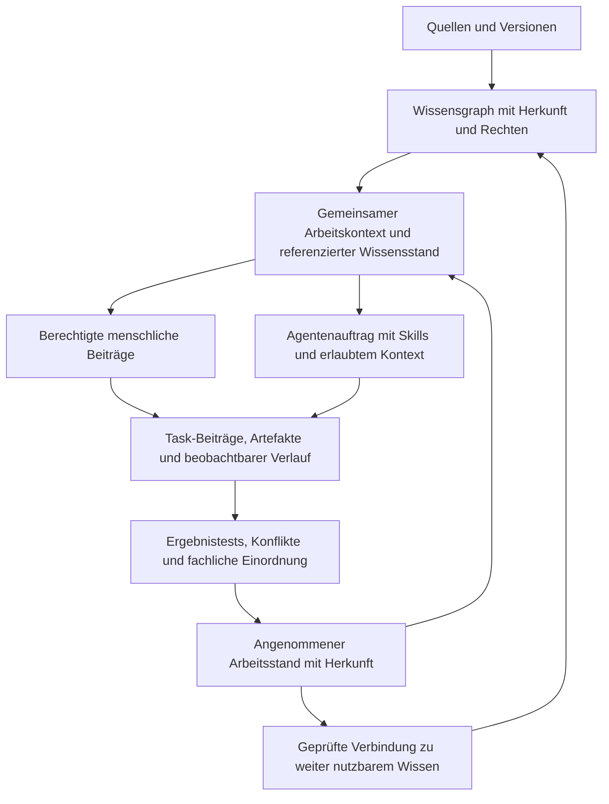

# Consultry — technischer Einstieg

Stand: 14.09.2026. Arbeitsentwurf aus [PRODUCT](PRODUCT.md), [DECISIONS](DECISIONS.md), der [Ledger-Session](archive/session-2026-09-05-wissensledger/INSIGHTS.md) und der [Recherche zu adaptiven Harnesses](archive/research-2026-09-13-harness-graph-ledger/REPORT.md). Erstfall und Implementierung sind offen. Seit D-0914-F01 sind Beratungsfälle Anwendungskandidaten, keine Produktgrenze. Grundschutz gilt für alle; D-0914-F04 öffnet Zusatzisolation/private Modellbereitstellung als gesonderte Option, ohne einen Hostingstack auszuwählen.

## Was der erste Durchlauf zeigen soll

Ein Solo-Founder, Team oder Unternehmen bringt Wissen einfach ein. Berechtigte Menschen und Agents verwenden es für einen konkreten Arbeitsjob und ein benutzbares Ergebnis. Consultry bewahrt den Arbeitsstand über Sitzungen hinweg, erklärt seine Herkunft und erkennt betroffene Arbeit, wenn sich eine Grundlage ändert. Die folgenden Beratungsfälle sind Kandidaten, kein ausschließliches Zielkundenschema.

Als inhaltliche Kandidaten bleiben eine laufende Projektanalyse mit Konzept-/Planentwurf, ein Bestandskunden-/Projektbrief oder die Bearbeitung einer Ausschreibung erhalten. Die in der anderen Session vorgeschlagene Vertragsanalyse war ein Beispiel. Keiner dieser Fälle ist bereits als alleiniger Produkt-Wedge oder verbindlicher erster Build gewählt. Eine vollständige Mock-UI ist keine Startvoraussetzung.

## Zusammenhang von Kern, Ledger und Zusammenarbeit

Das Diagramm zeigt den Arbeitskreislauf. Es ist nicht die physische DAG-Speicherstruktur: Historische Ereignisse verweisen auf frühere Ereignisse; die fachlichen Wissensbeziehungen und wiederholten Arbeitsabläufe dürfen Zyklen bilden. Mehrere Graphrollen verlangen nicht automatisch mehrere Datenbanken.

## Kleine technische Verträge, am Erstfall zu konkretisieren

| Vertrag | Muss erkennbar machen | Offen bleibt |
|---|---|---|
| Arbeitsauftrag | Ziel, verantwortliche Person, menschliche/maschinelle Teilnehmer, beabsichtigtes Ergebnis und benötigte Inputs | endgültige Objektgrenzen und UI |
| Kontextbereitstellung | referenzierter Ausgangsstand, tatsächlich ausgelieferte Ausschnitte, Identität, Zweck und Rechte | Retrieval-/Graph-Engine und API-Schema |
| Agentenlauf | Auftrag, passende Skill-Versionen, bereitgestellter Kontext, erlaubte Tools, Beiträge, Stop-/Recovery-Zustand | konkrete Runtime und Parallelisierung |
| Gemeinsamer Arbeitsstand | welche Beiträge gelten, welche widersprechen, wer oder welche Regel sie für welchen Zweck angenommen hat | Quoren, Checkpoints und Konfliktalgorithmus |
| Ergebnis | Artefakt-/Planversion, Quellenbezug, prüfbare Kriterien, fachliche Bewertung und offene Unsicherheit | endgültiges Format und UX-Ablauf |
| Fortschreibung | neue Grundlage, betroffene Tasks/Ergebnisse, erhaltene frühere Zustände und gezielte Aktualisierung | Aktualisierungsfenster und technische Ereignisverarbeitung |

Die Rolle beschreibt den Beitrag, Berechtigungen werden gesondert geprüft. Eine maschinelle Identität, ihre Skill-Definition und ein konkreter Run müssen für die Zurechnung unterscheidbar sein.

## Adaptiver Harness: Ziel und Kontext statt Schrittzwang

Aktuelle Richtung: vorhandene leistungsfähige Ausführung anbinden und unnötige Verfahrensvorgaben vermeiden. Die folgenden Mechaniken sind Forschungsableitungen, keine bereits ratifizierte Architektur; Belege und Grenzen stehen im [Research-Bericht](archive/research-2026-09-13-harness-graph-ledger/REPORT.md).

- **Agentengeführter Weg:** Ziel, zulässige Tools, relevante Quellen und Ergebnisanforderungen bereitstellen. Der Agent darf Methoden wechseln, Kontext nachladen und seinen Plan aktualisieren, ohne jede Anpassung genehmigen zu lassen.
- **Dauerhafter Kern, austauschbare Ausführung:** Firmen-/Task-Wissen nicht an das aktuelle Kontextfenster oder einen bestimmten Client binden. Kompakten laufenden Zustand mit gezielt abrufbaren Quellen, Artefakten und Ereignissen verbinden.
- **Optionale prozedurale Sicht im Core Skill Graph:** passende Vorgehenshilfen lokal abrufen. Ein zusätzlicher Guidance-Agent ist eine Vergleichsvariante, kein Default. Der tatsächlich entstandene Execution Graph ist nicht mit der wiederverwendbaren Verfahrenshilfe identisch.
- **Quellenbezogene Änderungen:** Ingest und Agentenbeiträge können Änderungskandidaten mit Quellen-/Kontextversion, betroffenen Beziehungen und Prüfergebnissen erzeugen. Formale Integrität ersetzt keine semantische Richtigkeit; neue Wissensbeiträge brauchen nicht pauschal menschliche Vorabfreigabe.
- **Separater Lernlauf:** beobachtete Fehler und Erfolge in Skill-/Verfahrenskandidaten verdichten; auf anderen Fällen prüfen, versionieren und rücknehmbar übernehmen. Keine stillen Änderungen an laufend verwendeten Skill-Versionen, Zugriffsregeln oder verbindlichen Ergebnisanforderungen.
- **Weniger Hilfskonstruktionen bei mehr Modellfähigkeit:** Schrittpläne, Resets, zusätzliche Agents und Kritikschleifen sind entfernbare Optimierungen. Nach Modellwechsel Nutzen erneut prüfen; Ergebnisqualität, Nacharbeit und Gesamtaufwand zählen.

Zugriffs-/Empfängerprüfung, erlaubte Außenwirkungen und Recovery-Schutz werden außerhalb frei editierbarer Verfahrenshinweise durchgesetzt. Mehr Freiheit im Lösungsweg ist keine Erweiterung von Befugnissen. Geprüfte automatische Übernahme von Lernkandidaten kann später innerhalb vorab freigegebener Regeln möglich sein; kein universelles Zwei-Menschen-Gate.

Pi ist ein konkreter OSS-Integrationskandidat, kein gewählter Stack. ASKS dient wegen nichtkommerzieller Release-Lizenzen zunächst nur als Architekturreferenz. Harness-of-Harness ist Forschungsreferenz, nicht schon verfügbare HoH-lite-Integration. A*-Thought-V2 ist modellinterne Forschung und keine implementierbare Black-Box-API-Erweiterung. Keine dieser Referenzen erzwingt ein allgemeines Framework, eine neue Datenbank oder Modelltraining.

## Gemeinsamer Wissensstand und parallele Arbeit

Empfohlener erster Mechanismus: Ein Auftrag referenziert einen Ausgangsstand. Agenten erhalten ihre jeweils zulässigen Ausschnitte. Neue Beiträge können automatisch erfasst werden; ihre Speicherung ist noch keine fachliche Annahme. Widersprüchliche Beiträge bleiben sichtbar, bis eine passende Annahmeregel oder verantwortliche Einordnung greift.

Ein angenommener neuer Stand erhält einen nachvollziehbaren Bezug zu seinen Vorgängern. Bereits laufende Tasks behalten ihren verwendeten Stand; erforderliche Aktualisierung wird erkennbar und vor relevanter Ergebnisübernahme behandelt. Es wird kein organisationsweiter Wissenskonsens für jede kleine Änderung verlangt.

Task-Zweige gehören zur gemeinsamen Historie. „Rückführung“ ist die geprüfte logische Verbindung geeigneter Beiträge mit der akzeptierten Sicht des jeweiligen Bereichs. Organisationsweite Wiederverwendung muss zusätzlich zur lokalen Task-Annahme zulässig sein. Fehlerursachen und erfolgreiche Vorgehensweisen können als Lernkandidaten verbunden werden; automatische Änderungen an Skills oder Policies brauchen eigene Tests und Versionierung.

Diese Mechanik ist ein Vorschlag zur Erfüllung der bestätigten Nutzerrichtung. Ein privates überprüfbares Ereignisprotokoll und ein dezentraler Ansatz bleiben Vergleichskandidaten. DID, Signaturen, externe Verankerung und Konsensprotokoll werden anhand des benötigten Vertrauensmodells gewählt. Konsens oder kryptografische Nachweise allein belegen keine sachliche Richtigkeit.

## Sensible Arbeit und gemeinsame Sicht

Consultry muss Datenberechtigung und zulässigen Verarbeitungsweg durchsetzen, einschließlich Import/OCR, Extraktion, Suche, Graph-Traversierung, Kontextbereitstellung, Tools, Ergebnissen und deren Empfängern. Herkunftssystemrechte und zusätzliche Klienten-/Projektgrenzen sind zu berücksichtigen.

Ein Agent, der mehr sehen darf als ein Group-Chat-Teilnehmer, darf geschützte Erkenntnisse nicht über eine Zusammenfassung an diesen Teilnehmer weitergeben. Entweder ist das Ergebnis für den Empfängerkreis freigegeben oder es bleibt in einem engeren Bereich. Der konkrete Interaktionsmechanismus ist zu erproben.

Die Antwort an einen extern modellgestützten Client wie Codex ist selbst ein Datenweg. Ein lokaler API-/MCP-Endpunkt schützt nicht automatisch den Inhalt, den der Client an sein Modell weiterreicht. Konkrete Anbieter- und Hostingfragen sind aus diesem Dokument ausgeklammert.

Dokumentinhalte können keine Rechte oder Systemregeln erteilen. Ableitungen, Quellennamen, Metadaten, Caches und Historie behalten ihren Schutzbedarf. Rechtewiderruf begrenzt spätere Zugriffe; bereits ausgegebene Kopien lassen sich dadurch nicht zurückholen. Fehlende oder gelöschte Evidenz muss als Rekonstruktionslücke erkennbar bleiben.

Das Produktziel umfasst rechtlich eingeordnete sensible Verarbeitung. DSGVO, Auftragsverarbeitung und gegebenenfalls EU AI Act sind im konkreten Fall zu berücksichtigen. Der Ledger unterstützt den Nachweis, ist aber kein eigenständiger Konformitätsbeleg. Diese Konsolidierung führt keine neue Rechtsprüfung durch.

## Ein überprüfbarer Durchlauf — Empfehlung

1. Einen realen Beratungsjob und sein Ergebnis wählen; das Testmaterial kann synthetisch sein.
2. Eine begrenzte Quellenfamilie importieren, mit Versionsbezug, Firmenmethode und zwei getrennten Klientenkontexten. Eine zweite Beratung im Test prüft Mandantentrennung.
3. Einen gemeinsam zugänglichen Auftrag mit menschlichen und maschinellen Beiträgen bearbeiten. Für den Kollaborationstest bieten sich zwei menschliche Identitäten und zwei Agentenrollen an; das ist ein Testaufbau, keine Mindestbesetzung jeder Arbeit.
4. Einen hilfreichen Entwurf erzeugen und seine prüfbaren Teile sowie verbleibende fachliche Fragen sichtbar machen.
5. Eine Quelle ändern, parallel widersprechende Beiträge erzeugen und den neuen Arbeitsstand nachvollziehbar annehmen.
6. Mit einer weiteren berechtigten Sitzung fortsetzen; Herkunft, aktueller Stand und bisherige Ergebnisse müssen wieder verfügbar sein.
7. Einen passenden Beitrag für weitere Arbeit nutzen und gleichzeitig unerlaubten Zugriff oder Sharing gezielt verweigern.

## Ergebnis- und Grenztests

| Test | Erwartung |
|---|---|
| Import wiederholen / Quelle ändern | keine unnötigen Duplikate; neue Version und betroffene Beziehungen nachvollziehbar |
| Zwei Agents verwenden verschiedene Stände | verwendete Stände sichtbar; kein unbemerkter Wechsel oder Überschreiben |
| Parallel widersprüchliche Beiträge | beide erhalten; Annahme für benannten Zweck begründet |
| Neuer Mensch oder Agent tritt bei | nur aktuell berechtigte Sicht; kein Zugriff durch bloße Teilnahme |
| Agent teilt Ergebnis in einer Gruppe | Empfängerrechte gelten auch für Ableitungen und Metadaten |
| Berechtigung wird während der Arbeit entzogen | weitere Abrufe gesperrt, bereits ausgelieferte Inhalte als bekannte Grenze dokumentiert |
| Versteckte Anweisungen in Quellen | keine Änderung von Rechten, Tools oder verbindlichen Regeln |
| Mitarbeiter setzt Agentenfreigabe auf „alles erlauben“ | Organisationsregeln und zulässige Delegation werden dadurch nicht erweitert |
| Agent versucht unzulässiges Löschen oder Schreiben | Aktion vor der Wirkung durchsetzen beziehungsweise verweigern; ein Ledger-Eintrag nach der Aktion genügt nicht |
| Sitzung beenden und später fortsetzen | Arbeitsstand, Kontext-/Skill-Versionen und Ergebnis aus dem Kern rekonstruierbar |
| Retry / Unterbrechung | keine doppelte fachliche Wirkung; erkennbarer Recovery-Stand |
| Agentenmehrheit bestätigt falsche Aussage | Einigkeit bleibt getrennt von Evidenz und menschlicher Verantwortung |
| Trajectory als Lernmuster verwenden | beobachtbare Grundlage, Eignung und Rechte prüfen; keine Selbstzertifizierung |
| Laufzeitkontext verdichten | benötigte Quellen und frühere Beobachtungen bleiben berechtigt nachladbar; kein stiller Evidenzverlust |
| Prozedurale Hilfe entfernen oder Modell wechseln | gleiche Ergebnis-/Rechtstests weiter erfüllen; Aufwand und Nacharbeit vergleichen |
| Lernkandidat verbessert Mittelwert, verletzt aber Rechte | nicht übernehmen; Sicherheitsfehler nicht gegen Qualitätsgewinn verrechnen |
| Beratungsartefakt bewerten | verifizierbare Kriterien testen; fachliche, proxybasierte, verzögerte und untestbare Outcomes getrennt halten |

Fachliche Qualität wird an Brauchbarkeit, fehlenden Perspektiven und Nacharbeit eines Consultants beurteilt. Ein Vergleich mit einfacher Suche bei gleichem Korpus und gleichen Modellbedingungen kann den Nutzen des Graphen untersuchen. Mehr Knoten und mehr Agenten sind dafür kein Erfolgsmaß.

Für die Harness-Hilfen getrennt vergleichen: **A** schlanker Agent mit gleichem Auftrag/Kontextzugang → **B** zusätzlich direkt abgerufenes lokales Verfahrenswissen → **C** zusätzlich generierte situative Guidance. A→B prüft zusätzliches Wissen, nicht isoliert Graphbeziehungen; dafür wäre eine inhaltsgleiche unverbundene Darstellung zu vergleichen. Zusätzliche Aufrufe vollständig in Kosten und Laufzeit einrechnen. Erst anschließend Lernänderungen auf separaten Fällen testen. Wiederholungen, Fallgruppen und neue Quellversionen verhindern, dass ein günstiger Einzelrun als allgemeiner Nachweis gilt.

## Engineering-Leitlinien für den späteren Bau

Die frühere Nutzeranforderung bleibt erhalten: WBS-Items unter 800 selbst geschriebenen LOC einschließlich Tests; kleine überprüfbare Änderungen mit Unit- und Mock-Integrationstests sowie Mutation Testing für geänderte produktive Logik je PR. Echte Integrationstests müssen die Daten-/Clientkette und relevante Rechtefehler zusätzlich prüfen. Für reine Dokumentationsänderungen wird kein künstlicher Mutation-Lauf verlangt.

Gemeinsame kleine Verträge werden vor parallelen Implementierungen abgestimmt. Danach sind getrennte Worktrees für Quellen-/Kontextkern, Client-/Harness-Anbindung und Tests sinnvoll. Der konkrete WBS entsteht aus dem ausgewählten Erstfall; der alte Mock-WBS ist eine Referenz für Arbeitsorganisation, keine Backend-Aufgabenliste.

Als Nächstes wird [W1](DECISIONS.md#aktueller-wayfinder-ab-10092026) konkretisiert. Vollständige UI-Flows, allgemeines Harness Framework, Blockchain-Auswahl, universelles Domain Model und Modellhosting blockieren diese fachliche Auswahl nicht.
