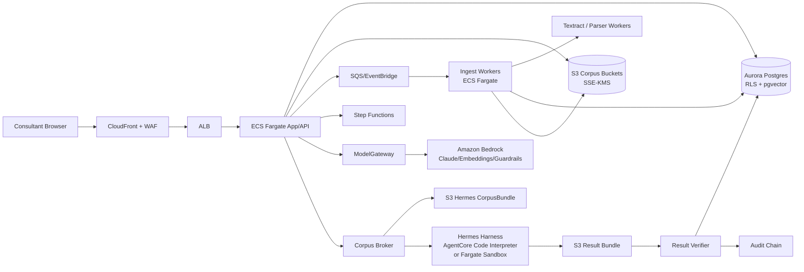

# Consultry - MVP AWS & Hermes Harness Architecture v1.0

**Status:** Architekturplan / Planning Source. ADR-001/002 sind accepted; Detail-WBS bleibt planungsleitend, aber MVP-Scope bleibt im MVP-PRD.  
**Datum:** 27.06.2026  
**Rolle im Doc-Stack:** Konkretisiert den AWS-nativen MVP-Build und den **Hermes Harness**: eine kontrollierte Cloud-Sandbox mit streng begrenztem Korpus-Zugriff.  
**Bezug:** [MVP-PRD](./Consultry-MVP-PRD-v1.0.md), [MVP-Technical-Foundation](./Consultry-MVP-Technical-Foundation-v1.0.md), [MVP Architecture ADR](./Consultry-MVP-Architecture-ADR-v1.0.md), [MVP-Foundation-Decisions](./Consultry-MVP-Foundation-Decisions-v1.0.md), [Onboarding-Korpus-Ritual](./Consultry-Onboarding-Corpus-Ritual-v1.0.md).

> **Kurzfassung.** Consultry bleibt eine Multi-Tenant-EU-SaaS. Nach ADR-001/002 ist die MVP-Planungsbasis: **eu-central-1**, **Aurora PostgreSQL Serverless v2 + pgvector**, **S3 + KMS** fuer Dokumente und Korpus-Bundles, **Amazon Bedrock** fuer Inferenz, **ECS Fargate + Step Functions/SQS** fuer App- und Worker-Flows, plus **Hermes Harness** als bounded, isolierte Ausfuehrungsebene. Hermes bekommt **nie freien Tenant-Korpuszugriff**, sondern nur ein pro Job erzeugtes, unveraenderliches Korpus-/Harness-Bundle mit Quellspannen.

---

## 1. Entscheidungen

| ID | Entscheidung | MVP-Plan |
|---|---|---|
| A1 | Region | Primaer **AWS Frankfurt / eu-central-1**. Keine Cross-Region-Datenbewegung im MVP. |
| A2 | Datenbank | **Aurora PostgreSQL Serverless v2 + pgvector** ersetzt Neon nach ADR-001. RLS bleibt Pflicht. |
| A3 | Dokumente | **S3**, SSE-KMS, tenant-prefixes, raw/extracted/bundle/export getrennt. |
| A4 | Vektor/Retrieval | App-owned Retrieval in Aurora/pgvector als Source of Truth. Bedrock Knowledge Bases optional fuer Spaeterevaluierung, nicht fuer harte Citation-Gates. |
| A5 | Inferenz | **Amazon Bedrock via PrivateLink/VPC Endpoint**; Modellzugriff nur ueber `ModelGateway`. |
| A6 | Hermes Harness | Kontrollierte Sandbox fuer Operator-Ausfuehrung, Parsing, Evaluation und Draft-Vorbereitung. Kein direkter State-Mutator. |
| A7 | Sandbox-Runtime | Primaer: **Amazon Bedrock AgentCore Code Interpreter** im Sandbox/VPC-Modus, falls Region/Quota/Security passt. Fallback: **ECS Fargate RunTask** mit no-egress Security Group. |
| A8 | Corpus Access | Nur ueber `CorpusBundle` in S3: read-only, job-scoped, TTL, KMS encryption context, source-map inklusive. |
| A9 | Audit | Jede Operator-/Hermes-/Model-Aktion schreibt `AuditEntry`; Resultate werden erst nach Validierung persistiert. |

**Bewusste Revision gegen bestehende Docs:** ADR-001 ersetzt das fruehere `T3` (Neon Postgres + pgvector) durch Aurora PostgreSQL + pgvector, behaelt aber RLS, relationales graph-ready Schema und Source-Binding-Regeln unveraendert.

---

## 2. Zielbild



**Interpretation:** Die normale App bleibt deterministisch. Hermes ist eine isolierte Werkbank fuer begrenzte Jobs. Der Korpus wird vorher von der trusted App-Seite zugeschnitten. Hermes darf nichts direkt in Aurora schreiben.

---

## 3. AWS Service Map

| Aufgabe | AWS-Service | Warum |
|---|---|---|
| Web/API | ECS Fargate hinter ALB | Weniger Lambda-Zersplitterung, gut fuer TypeScript-Monolith + spaetere Services. |
| Hintergrundjobs | SQS + Step Functions + ECS Fargate | Saubere Retry-/Timeout-/Audit-Grenzen fuer Ingest, Drafting und Hermes-Jobs. |
| Datenbank | Aurora PostgreSQL Serverless v2 | Postgres-RLS, Transaktionen, Audit, pgvector und AWS-native Betriebsgrenze. |
| Vektoren | pgvector in Aurora | CitationLink- und Tenant-Gates bleiben app-owned. |
| Dokumente | S3 | Raw docs, extracted text, page images, Korpus-Bundles, Export-Artefakte. |
| Verschluesselung | KMS CMKs | Tenant-/environment-scoped Keys, encryption context fuer tenant_id/job_id. |
| Inferenz | Amazon Bedrock Runtime | Ein klarer EU-Betrieb im MVP; abstrahierbar fuer spaeteren Azure-Fallback. |
| Guardrails | Bedrock Guardrails + eigene Gates | PII/Sensitive-Filter und Grounding-Pruefung als Zusatz, nicht als einzige Sicherung. |
| Sandbox | AgentCore Code Interpreter oder ECS Fargate | Verwaltete Sandbox bevorzugt; Fargate als kontrollierbarer Fallback. |
| Netzwerk | VPC Private Subnets + PrivateLink | Kein oeffentlicher Datenbank-/Sandboxzugriff; Bedrock privat erreichbar. |
| Secrets | Secrets Manager | DB credentials, Connector tokens, API secrets. |
| Observability | CloudWatch, X-Ray/OTel, CloudTrail | Trace je request/correlation_id, Audit fuer Security und Debugging. |
| Security posture | GuardDuty, Security Hub, AWS Config, Macie optional | Baseline fuer Pilotfaehigkeit bei Security-Beratungen. |

---

## 4. Kernkomponenten

### 4.1 App/API

**Empfehlung:** Ein modularer TypeScript-Monolith auf ECS Fargate.

Module:
- `IdentityTenantModule`: Tenant, User, RBAC, Works-Council-Mode.
- `CorpusModule`: Documents, assets, chunking, source bindings.
- `OpportunityModule`: Bestandskunden-Hinweise, Tender Intake, Opportunity.
- `ConceptModule`: Konzept-Canvas, DraftSections, Approval.
- `WorkModule`: Profile, TimeEntry, ProjectStatus, PersonalNote.
- `HermesModule`: Job creation, bundle creation, sandbox orchestration.
- `ModelGatewayModule`: Bedrock model calls, prompt registry, guardrails, quotas.
- `AuditModule`: append-only AuditEntry chain.

**Warum nicht Lambda-only:** Dokument-Ingest, Office/PDF-Parsing, lange Drafting-Jobs und Sandbox-Koordination werden schnell laenger als typische Request/Response-Flows. ECS + SQS/Step Functions ist pragmatischer.

### 4.2 Aurora PostgreSQL

Pflicht-Tabellen im MVP:
- `tenants`, `users`, `memberships`, `rbac_roles`
- `documents`, `document_versions`, `document_pages`
- `chunks`, `chunk_embeddings`, `source_bindings`
- `knowledge_assets`, `knowledge_asset_versions`
- `opportunities`, `tenders`, `contract_windows`
- `proposal_drafts`, `draft_sections`, `citation_links`
- `team_shapes`, `consultant_profiles`, `skills`
- `time_entries`, `personal_notes`, `project_statuses`
- `hermes_jobs`, `hermes_job_bundles`, `hermes_results`
- `audit_entries`

RLS-Regel:
- Jede tenant-geteilte Tabelle hat `tenant_id`.
- `SET app.tenant_id = ...` pro DB-Session/Transaction.
- Policies erzwingen `tenant_id = current_setting('app.tenant_id')`.
- Systemjobs verwenden ebenfalls tenant-scoped Sessions; keine globalen Worker-Queries ohne explizite Tenant-Grenze.

Vector-Regel:
- Embeddings liegen in `chunk_embeddings`.
- Retrieval filtert immer zuerst `tenant_id`, `document_scope`, `source_policy`, `visibility`.
- Hermes bekommt nicht das Retrieval-API direkt, sondern ein bereits erzeugtes Bundle.

### 4.3 S3 Buckets

| Bucket | Inhalt | Zugriff |
|---|---|---|
| `consultry-raw-docs-{env}` | Originaluploads | App/Ingest read-write, Hermes nie. |
| `consultry-extracted-{env}` | Text, OCR, page images, normalized markdown | App/Ingest, eingeschraenkt. |
| `consultry-hermes-bundles-{env}` | Pro Job erzeugte Korpus-Bundles | Hermes read-only pro Prefix. |
| `consultry-hermes-results-{env}` | Sandbox-Ausgaben | Hermes write-only pro Prefix; Verifier read. |
| `consultry-exports-{env}` | PDF/MD-Exports | App write, User download via signed URL. |

Prefix-Schema:

```text
s3://consultry-hermes-bundles-prod/tenant/{tenant_id}/job/{job_id}/manifest.json
s3://consultry-hermes-bundles-prod/tenant/{tenant_id}/job/{job_id}/chunks/*.jsonl
s3://consultry-hermes-bundles-prod/tenant/{tenant_id}/job/{job_id}/source-map.json
```

KMS encryption context:

```json
{
  "tenant_id": "t_123",
  "job_id": "hj_456",
  "data_class": "corpus_bundle"
}
```

---

## 5. Hermes Harness

### 5.1 Definition

**Hermes Harness** ist Consultrys kontrollierte Ausfuehrungsebene fuer Aufgaben, die mehr brauchen als einen reinen Modell-Call:

- Dokumente und Tabellen analysieren.
- Zuschlagskriterien in Strukturen ueberfuehren.
- Vertragsfristen extrahieren.
- Quellen gegen Draft-Aussagen pruefen.
- Konzeptabschnitte mit striktem Output-Schema vorbereiten.
- Edit-Distanz- und Faithfulness-Evals laufen lassen.

Hermes ist **kein autonomer Agent** im MVP. Hermes darf:
- lesen, rechnen, strukturieren, vorschlagen, pruefen.

Hermes darf nicht:
- direkt Datenbankzustand aendern,
- externe Systeme anschreiben,
- Tenant-Korpus durchsuchen,
- ohne Freigabe neue Tools aufrufen,
- unbounded Web-Zugriff verwenden.

### 5.2 Hermes-Komponenten

| Komponente | Job |
|---|---|
| `HermesGateway` | Nimmt einen Bounded-Operator-Job entgegen und validiert Intent, Tenant, Actor, Budget, Toolset. |
| `CorpusBroker` | Schneidet aus Retrieval-Ergebnissen ein minimales Korpus-Bundle mit SourceMap. |
| `HermesRunner` | Startet AgentCore Code Interpreter oder Fargate Sandbox. |
| `ToolCapsule` | Versionierte Tools im Container/Image: Parser, scoring, citation-check, schema validator. |
| `ResultVerifier` | Prueft Output gegen Schema, SourceMap, CitationLink-Regeln und Faithfulness-Gates. |
| `AuditWriter` | Schreibt OperatorCall, BundleCreated, SandboxStarted, ResultVerified, ResultRejected. |

### 5.3 CorpusBundle-Vertrag

`manifest.json`:

```json
{
  "schema_version": "1.0",
  "tenant_id": "t_123",
  "job_id": "hj_456",
  "operator": "draft-concept-section",
  "allowed_tools": ["read_bundle", "rank_chunks", "draft_json", "check_citations"],
  "forbidden": ["network_egress", "db_write", "tenant_wide_search"],
  "input_files": ["chunks/chunks.jsonl", "source-map.json"],
  "output_schema": "schemas/draft_section_result.v1.json",
  "ttl_minutes": 60,
  "created_by": "user_789",
  "correlation_id": "corr_abc"
}
```

`chunks.jsonl`:

```json
{"chunk_id":"ch_1","document_id":"doc_1","page":4,"span_start":818,"span_end":1240,"text":"...","source_class":"Firm-Fact"}
{"chunk_id":"ch_2","document_id":"doc_2","page":1,"span_start":10,"span_end":400,"text":"...","source_class":"External-Fact"}
```

`result.json`:

```json
{
  "job_id": "hj_456",
  "status": "proposed",
  "draft_sections": [
    {
      "section_key": "approach",
      "text": "...",
      "claims": [
        {
          "claim_text": "...",
          "provenance_class": "Firm-Fact",
          "source_binding": {"chunk_id": "ch_1", "span_start": 880, "span_end": 940}
        }
      ]
    }
  ],
  "open_issues": [
    {"kind": "missing_source", "severity": "blocker", "text": "..."}
  ]
}
```

### 5.4 Sandbox-Runtime Optionen

| Option | Einsatz | Pro | Contra |
|---|---|---|---|
| AgentCore Code Interpreter | MVP bevorzugt, wenn in eu-central-1 verfuegbar und Security-Tests bestehen | Managed Sandbox, IAM runtime role, Sandbox/Public network mode, VPC-Anbindung moeglich | Neuer Service; Quotas/Region/Debugging vor Pilot pruefen. |
| ECS Fargate RunTask | Fallback oder fuer eigene Toolchain | Voll kontrollierbar, private subnets, SG no-egress, ECR image digest pinning | Mehr Eigenbetrieb, mehr Hardening-Aufwand. |

**Empfehlung:** Architektur so bauen, dass `HermesRunner` austauschbar ist. Die Produktlogik kennt nur `HermesJob`, `CorpusBundle`, `ResultBundle`, nicht die konkrete Runtime.

### 5.5 Hermes IAM

Pro Job:
- Kein long-lived secret.
- Runtime role oder task role nur fuer:
  - `s3:GetObject` auf genau `hermes-bundles/tenant/{tenant_id}/job/{job_id}/*`
  - `s3:PutObject` auf genau `hermes-results/tenant/{tenant_id}/job/{job_id}/*`
  - `kms:Decrypt` nur mit passendem encryption context.
  - `logs:PutLogEvents` in job-scoped log group.
- Explizit kein `rds:*`, kein `secretsmanager:GetSecretValue` fuer App-Secrets, kein breiter `s3:ListBucket`, kein `bedrock:InvokeModel` aus der Sandbox, solange Modell-Calls ueber `ModelGateway` laufen.

**Grundsatz:** Hermes verarbeitet ein Paket. Hermes holt sich nicht selbst neues Wissen.

---

## 6. End-to-End Flows

### 6.1 Upload und Korpus-Ingest

1. User laedt Dokument per signed S3 upload hoch.
2. S3 event -> SQS `document.ingest.requested`.
3. Ingest Worker:
   - Viren-/Dateityppruefung.
   - Textextraktion: Office/PDF parser; OCR/Textract fuer gescannte PDFs.
   - Chunking mit page/span metadata.
   - Klassifikation: Vertrag, Proposal, Referenz, CV, Methode.
   - Embeddings via Bedrock Embeddings ueber `ModelGateway`.
   - Persistenz in Aurora: `documents`, `chunks`, `chunk_embeddings`, `source_bindings`.
4. Audit: `DocumentUploaded`, `TextExtracted`, `ChunksIndexed`, `EmbeddingCreated`.

### 6.2 Bestandskunden-Hinweis

1. Vertrag wird hochgeladen.
2. `contract-window-extract` Job erzeugt ein Korpus-Bundle mit Vertragstext und SourceMap.
3. Hermes extrahiert Fristen/Optionen als strukturiertes JSON.
4. ResultVerifier prueft:
   - jede Frist zeigt auf eine konkrete Klauselspanne,
   - Datum plausibel,
   - keine neue Behauptung ohne Quelle.
5. App erzeugt `contract_window` + `opportunity` als Vorschlag.
6. Consultant bestaetigt oder verwirft.

### 6.3 Tender zu Konzeptabschnitt

1. Tender kommt via Upload oder TED/eForms-Polling.
2. `tender-criteria-map` extrahiert Kriterien und Gewichtung.
3. Trusted Retriever holt:
   - relevante Capability Statements,
   - Referenzen,
   - Methodikbausteine,
   - anonyme TeamShape,
   - externe Quellen nur aus Whitelist.
4. CorpusBroker baut Bundle.
5. Hermes erzeugt `draft_section_result.v1`.
6. ResultVerifier:
   - SourceBinding fuer Firm/External-Facts,
   - Model-Expertise klar markiert,
   - Faithfulness-Check je Claim,
   - offene Issues statt stiller Glattung.
7. DraftSection wird im Canvas als Vorschlag gespeichert.
8. Mensch gibt frei.

### 6.4 Work-Agent Time-Capture

1. In-Tool-Aktivitaeten erzeugen event-basierte Arbeitskontexte.
2. Hermes darf Summary/TimeEntry-Vorschlaege aus **nur diesem Tages-/Projektkontext** erstellen.
3. Kein Personenvergleich, kein Performance-Score.
4. Consultant bestaetigt.
5. Erst bestaetigte Vorschlaege werden `TimeEntry`.

---

## 7. Security & Compliance

### 7.1 Harte Grenzen

- **Datenbank nicht oeffentlich.**
- **Hermes ohne freien Internetzugang.**
- **Hermes ohne direkten DB-Zugriff.**
- **Hermes ohne Tenant-weite S3-Rechte.**
- **Modellzugriff nur ueber ModelGateway.**
- **Keine AI-Schreibzugriffe.**
- **Jeder faktische Output braucht SourceBinding oder wird blockiert.**

### 7.2 Netzwerk

VPC:
- 2-3 private Subnets ueber mehrere AZs.
- ALB in public subnets, App/Workers/DB in private subnets.
- Aurora ohne public endpoint.
- Hermes in private connectivity / sandbox mode.

VPC Endpoints:
- S3 gateway endpoint.
- Bedrock + bedrock-runtime interface endpoints.
- Bedrock AgentCore endpoint, falls AgentCore genutzt wird.
- ECR api/dkr, CloudWatch Logs, Secrets Manager, KMS, SQS, STS.
- NAT nur fuer bewusst erlaubte externe Pulls (TED/eForms, Whitelist-Research), nicht fuer Hermes.

### 7.3 Prompt Injection und Korpus-Sicherheit

Ingest:
- Dokumentinhalt wird als Daten behandelt, nicht als Instruktion.
- Prompt-Templates trennen Systemregeln, Nutzerauftrag, Korpusauszuege.
- Hermes ToolCapsule ignoriert Instruktionen aus Korpus-Chunks.

Output:
- JSON schema validation.
- SourceMap validation.
- Bedrock Guardrails fuer sensitive information, prompt attack und grounding als Zusatzschicht.
- Eigener Faithfulness-Check bleibt Pflicht, weil Vergabe-/Firm-Facts fachlich verteidigbar sein muessen.

### 7.4 Logs

- Keine Volltexte in CloudWatch.
- Logs enthalten job_id, tenant_id hash, document_id, chunk_id, keine Rohspannen.
- Rohresultate in S3 Result Bucket mit kurzer TTL.
- AuditEntry in Aurora ist append-only und hash-verkettet.

---

## 8. Deployment & Environments

AWS Accounts:
- `consultry-dev`
- `consultry-staging`
- `consultry-prod`
- `consultry-security-log-archive`

CI/CD:
- GitHub Actions mit OIDC zu AWS.
- IaC mit AWS CDK oder Terraform.
- ECR images per immutable digest.
- DB-Migrationen in eigener Pipeline mit approval fuer prod.
- Prompt-Versionen als Git-Artefakt: `prompt_id@version`.

Release-Ringe:
1. Local/dev mit synthetic corpus.
2. Staging mit anonymisiertem Pilot-Korpus.
3. Prod Pilot #0.
4. Externer Pilot #1.

---

## 9. MVP-Bauplan

### Woche 0 - Entscheidungen

- Aurora als ADR-001-Baseline in IaC/Schema umsetzen.
- AgentCore Code Interpreter Region/Quota/Security pruefen.
- KMS-Key-Strategie entscheiden: per env oder per tenant.
- RLS-Prototyp fuer `documents/chunks/audit_entries`.

### Woche 1 - AWS Foundation

- AWS accounts, VPC, subnets, endpoints.
- Aurora Serverless v2, Secrets Manager, KMS.
- ECS cluster, ALB, base API.
- CloudTrail, GuardDuty, CloudWatch baseline.

### Woche 2 - Tenant & Corpus

- Tenant/RBAC/RLS.
- S3 upload flow.
- Document metadata + raw/extracted bucket split.
- Basic parser worker.

### Woche 3 - Retrieval & SourceBinding

- Chunking mit page/span.
- Embeddings via Bedrock.
- pgvector retrieval mit tenant filter.
- CitationLink data gate.

### Woche 4 - Hermes v0

- `HermesJob`, `CorpusBundle`, `ResultBundle`.
- AgentCore oder Fargate runner.
- No-egress sandbox policy.
- ResultVerifier + Audit.

### Woche 5 - Concept Loop

- Tender/contract extraction jobs.
- Draft section job.
- Concept Canvas Vorschlag -> Menschliche Freigabe.
- Export MD/PDF intern.

### Woche 6 - Hardening & Pilot

- Security review gegen #0 Cybersecurity-Partner.
- Abuse tests: prompt injection, bundle overreach, tenant breakout, source spoofing.
- Mini-Eval: 20-50 Faelle fuer Firm-Fact/External-Fact/Model-Expertise.
- Pilot #0 mit 1 Vertrag + 3-5 Proposals.

---

## 10. Offene Entscheidungen

| ID | Frage | Empfehlung |
|---|---|---|
| O1 | Aurora statt Neon verbindlich? | ✅ Ja, entschieden durch ADR-001. Kein Hybrid. |
| O2 | AgentCore oder Fargate fuer Hermes v0? | AgentCore testen; Fargate fallback fertig halten. |
| O3 | Bedrock Knowledge Bases nutzen? | Nur optional. App-owned Retrieval bleibt Source of Truth. |
| O4 | Tenant-KMS-Key pro Tenant? | MVP: env key + encryption context; H2: tenant keys fuer groessere Kunden. |
| O5 | Externe Quellen im MVP? | Ja, aber nur Whitelist und nicht aus Hermes heraus. |
| O6 | DMS/SharePoint Connector ab Pilot? | Read-only Connector als H1.5; MVP kann mit Upload starten. |
| O7 | Bedrock Guardrails als Gate? | Ja als Zusatz, aber nicht statt eigener Citation/Faithfulness Gates. |

---

## 11. AWS-Doku-Stand, auf dem dieser Plan basiert

- Aurora PostgreSQL kann als Bedrock Knowledge Base Vector Store mit `pgvector` genutzt werden; AWS dokumentiert Aurora PostgreSQL-Versionen und `pgvector`-Voraussetzungen.  
  https://docs.aws.amazon.com/AmazonRDS/latest/AuroraUserGuide/AuroraPostgreSQL.VectorDB.html
- Bedrock Knowledge Bases koennen S3 als Datenquelle nutzen; S3 muss in derselben Region wie die Knowledge Base liegen.  
  https://docs.aws.amazon.com/bedrock/latest/userguide/s3-data-source-connector.html
- Bedrock Knowledge Bases unterstuetzen mehrere Datenquellen/Connectoren; fuer Consultry bleibt App-owned Retrieval trotzdem das harte Gate.  
  https://docs.aws.amazon.com/bedrock/latest/userguide/data-source-connectors.html
- Amazon Bedrock kann ueber AWS PrivateLink/VPC Interface Endpoints aus privaten Subnets erreicht werden.  
  https://docs.aws.amazon.com/bedrock/latest/userguide/vpc-interface-endpoints.html
- Bedrock Guardrails bieten u. a. Sensitive-Information-Filter, Prompt-Attack-Filter und Contextual Grounding Checks.  
  https://docs.aws.amazon.com/bedrock/latest/userguide/guardrails.html
- AgentCore Code Interpreter ist eine AWS-Sandbox fuer sichere Codeausfuehrung; beim Erstellen kann Netzwerkmodus und IAM runtime role gesetzt werden.  
  https://docs.aws.amazon.com/bedrock-agentcore/latest/devguide/code-interpreter-tool.html  
  https://docs.aws.amazon.com/bedrock-agentcore/latest/devguide/code-interpreter-create.html
- AgentCore Runtime/Tools koennen per VPC-Konnektivitaet private Ressourcen erreichen; AWS empfiehlt private Subnets, least privilege und VPC Endpoints.  
  https://docs.aws.amazon.com/bedrock-agentcore/latest/devguide/agentcore-vpc.html
- ECS task roles geben Containern scoped AWS-Rechte; execution roles sind separat fuer Image Pull/Logs/Secrets.  
  https://docs.aws.amazon.com/AmazonECS/latest/developerguide/task-iam-roles.html  
  https://docs.aws.amazon.com/AmazonECS/latest/developerguide/task_execution_IAM_role.html

---

## 12. Architektur-Prinzipien fuer Reviews

1. **Hermes bekommt ein Paket, nicht den Korpus.**
2. **Der Korpus bleibt app-owned und tenant-isoliert.**
3. **Jeder AI-Vorschlag ist ein Vorschlag, kein State-Write.**
4. **Jede faktische Aussage braucht eine Quelle.**
5. **Jede Quelle muss auf Dokument, Seite und Spanne zurueckfuehren.**
6. **Sandbox ohne oeffentlichen Ausweg.**
7. **Modellaufrufe nur ueber ModelGateway.**
8. **Audit ist ein Produktfeature, nicht nur Logging.**

---

*Ende v1.0 - naechster Schritt: O1/O2 entscheiden und daraus eine schmale Implementation-Spec fuer `HermesJob`, `CorpusBundle`, IAM policies und Aurora-RLS ableiten.*
