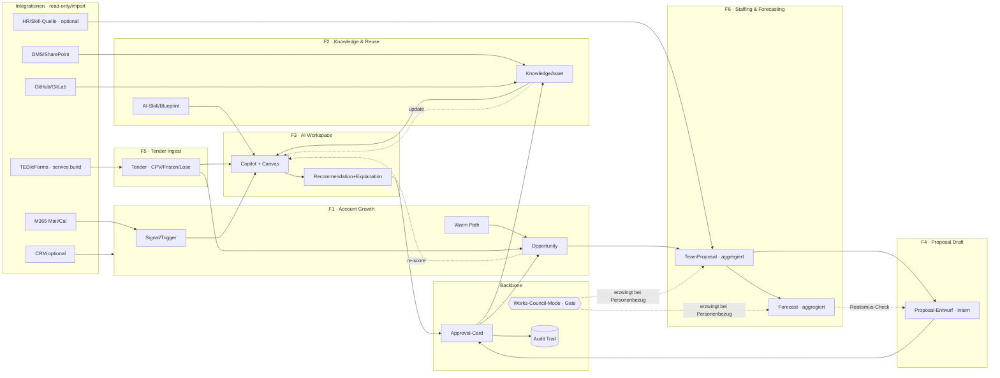

# Consultry — Phase 1 MVP: Feature-Specs, Flow-Sammlung & AI-Context-Canvas v1.0

## Giga-sharpened Specs für die ersten Funktionen

**Status:** Draft zur Scope-Bestätigung
**Datum:** 30. Mai 2026
**Scope:** Phase 1 (MVP) — die drei ersten Kernfunktionen + verpflichtender Backbone
**Bezug:** [PRD v4.0](./Consultry-PRD-v4.0-DACH-Operating-System.md), [Product Document v1.0](./Consultry-Product-Document-v1.0.md), [Module Refinement v1.0](./Consultry-Module-Refinement-v1.0.md), [User Journeys v1.0](./Consultry-User-Journeys-v1.0.md), [Target Personas v1.0](./Consultry-Target-Personas-v1.0.md)

> **Lesehinweis.** Dieses Dokument schärft die Phase-1-Funktionen und ist die Brücke zwischen Produktstrategie (Wedges, Module) und Build (Surfaces, Objekte, AI-Verhalten, Prompts). Pro Feature ein Spec-Kapitel, je eine **Flow-Sammlung** (konkret + abstrakt/AI-dynamisch), dann **Cross-/Integration-Flows**, **Symbiose-Features** und der **Spec/AI-Context + Prompt-Engineering Collab-Canvas**.
>
> **Update 30.05. (v1.1-Scope):** Phase 1 umfasst jetzt **sechs** Funktionen — F1 Account Growth, F2 Knowledge & Reuse, F3 AI Workspace, **F4 Proposal Draft**, **F5 Tender Ingest**, **F6 Staffing & Forecasting** — plus den Approvals/Governance-Backbone. F5 und F6 wurden auf Wunsch aus Phase 2/3 vorgezogen; die daraus folgende Scope- und Compliance-Konsequenz ist in §4A.3 und §10 markiert.

---

## 0. Phase-1-Scope — zur Bestätigung

### 0.1 Was in Phase 1 giga-geschärft wird (diese drei + Backbone)

| # | Feature (Modul) | Rolle in Phase 1 | Wedge-Bezug |
|---|---|---|---|
| **F1** | **Account Growth System** | Primärer Kaufgrund. Bestandskunde → Signal/Trigger → qualifizierte Opportunity. | Primär-Wedge: *Bestandskunden-Expansion & Proposal* |
| **F2** | **Knowledge & Reuse System** | Verstärker. Wiederverwendbare Referenzen, Methoden, Assets, AI-Skills mit Quellenbindung. | Verstärker-Wedge: *Wissenstransfer, Reuse & Readiness* |
| **F3** | **AI Workspace** | Die AI-native Interaktions- und Empfehlungsschicht über F1 + F2. | Querschnitt: macht F1+F2 erst „AI-native" |
| **F4** | **Proposal Draft** (war F1b-Stub) | **Heraufgestuft 30.05.:** vom Stub zur vollwertigen Phase-1-Funktion. Aus freigegebener Opportunity wird ein strukturierter, editierbarer Proposal-Entwurf — **kein Send-Out**. | Primär-Wedge: schließt Opportunity → erstes Angebot |
| **F5** | **Tender Ingest** | **Neu in Phase 1 (30.05.):** TED/eForms, service.bund u. ä. einlesen, strukturieren (CPV, Fristen, Lose, Eignung) und gegen Firmenprofil matchen. **Kein autonomes Einreichen.** | vorgezogener vertikaler Wedge (Public-Sector-nahe Segmente) |
| **F6** | **Staffing & Forecasting** | **Neu in Phase 1 (30.05.):** Teamvorschläge (Matching) + Kapazitäts-/Auslastungs-Forecast. **Aggregiert vor personenbezogen, personenscharf nur mit Gate.** | Verstärker-Wedge: „Können wir das glaubwürdig liefern?" |
| **B** | **Approvals + Governance/Audit Backbone** | **Kein eigenes verkaufbares Feature**, sondern verpflichtender Querschnitt unter allen Features. | Produkt-Default (DACH-Compliance) |

> **Bestätigt (1):** Account Growth bleibt der Primär-Wedge und das *erste sichtbare* Feature; Knowledge & AI Workspace sind die direkten Verstärker.
>
> **Bestätigt (2 · 30.05.):** Phase 1 endet nicht bei der Opportunity, sondern beim **Proposal Draft** (interner Entwurf, kein Versand). Siehe §2.7.
>
> **⚠️ Scope-Erweiterung (3 · 30.05.):** **Tender Ingest (F5)** und **Staffing & Forecasting (F6)** werden nach **Phase 1 vorgezogen.** Das weicht bewusst von der bisherigen Priorisierung ab (beide waren Phase 2/3). **Konsequenz:** Scope, Datenbedarf und **Compliance-Last steigen deutlich** — F6 ist nach AI Act potenziell Hochrisiko (Worker Management / Task Allocation) und in DE mitbestimmungspflichtig (BetrVG §87/§94, BDSG §26). Siehe §4A-Compliance und offene Entscheidung §10.4. Spezs unter §4A.

### 0.2 Was Phase 1 bewusst NICHT ist

- **Proposal Draft ist drin** (interner Entwurf), aber **kein Proposal-Send-Out, kein Pricing-Engine, kein Contract Drafting** (→ Phase 2)
- **Tender Ingest ist drin** (Lesen, Strukturieren, Matchen, Bid-Paket-Vorbereitung), aber **kein autonomes Einreichen, keine Vollständigkeits-/Vergabe-Zusage** (→ Phase 2+)
- **Staffing & Forecasting ist drin** (Teamvorschlag + Kapazitäts-Forecast), aber **kein People-Scoring, kein Burnout-/Performance-Scoring; personenscharf nur mit Gate** (Default: aggregiert)
- Kein Time/Expense, kein Invoice Prep, kein DATEV/ELSTER-Handoff (→ Phase 3)
- Kein Net-New-Prospecting
- Kein offener Prompt-Marktplatz ohne Governance

Phase 1 deckt jetzt die ganze Vorderkante ab: **„Signal/Tender → qualifizierte, begründete Opportunity → Teamvorschlag + Forecast → interner Proposal-Entwurf"** — durchgehend mit Quellenbindung und Approval, aber **ohne** Versand, Pricing, Contract, Submission oder personenscharfes Scoring.

### 0.3 Phase-1-Erfolgssignale (aus Product Document v1.0)

- Bestandskundenchancen werden **früher und strukturierter** sichtbar.
- Wissensbausteine verkürzen Proposal-/Onboarding-Vorbereitung **messbar**.
- AI-Empfehlungen werden als **brauchbare Entscheidungshilfe** akzeptiert (nicht als Black Box).
- Design Partner verstehen den Kaufgrund **in wenigen Minuten**.

---

## 1. Gemeinsame Fundamente (gelten für F1–F3)

### 1.1 Der AI-Vertrag (nicht verhandelbar)

Jede relevante AI-Ausgabe in Phase 1 folgt demselben Vier-Takt:

```
Recommendation  →  Explanation  →  Human Approval  →  Audit Trail
(Vorschlag)        (Begründung +     (editierbar,        (Herkunft +
                    Quelle +          freigabepflichtig)   Version +
                    Unsicherheit)                          Wer/Wann)
```

Default-Regeln:
- **Nichts wird autonom verbindlich.** Vorschlag ≠ Datensatz.
- **Keine unsourced Claims.** Jede Behauptung trägt Herkunft + Confidence.
- **Aggregiert vor personenbezogen.** Personenscharfe Sichten nur mit Gate.
- **Editierbar.** Der Mensch korrigiert den Draft, das System lernt den Edit nicht heimlich in fremde Speicher.

### 1.2 Kern-Objekte (Phase-1-Datenmodell, minimal)

| Objekt | Gehört zu | Kurzbeschreibung |
|---|---|---|
| `Account` | F1 | Bestandskunde, Tenant-isoliert |
| `Stakeholder` | F1 | Person/Rolle beim Account, Warm-Path-Knoten |
| `Signal` / `Trigger` | F1 | Ereignis/Hinweis (intern oder integriert), das eine Chance nahelegt |
| `Opportunity` | F1 | qualifizierte Chance mit Status, Begründung, Quellen |
| `ProposalDraft` | F4 | interner Angebots-Entwurf, an eine Opportunity gebunden, versioniert (kein Versand) |
| `WarmPath` | F1 | belastbarer Beziehungspfad zu einem Stakeholder |
| `KnowledgeAsset` | F2 | Referenz/Methode/Report/Skript/Runbook/Blueprint, versioniert, mit Source |
| `AISkill` / `Workflow-Blueprint` | F2/F3 | wiederverwendbare AI-native Arbeitsfähigkeit (Prompt + Kontext + Owner + Version) |
| `Tender` | F5 | Ausschreibung: Quelle, CPV, Fristen, Lose, Eignungskriterien, Dokumentenanforderungen, Match-Score |
| `ConsultantProfile` | F6 | Skills, Zertifikate, Projekterfahrung, Availability (personenbezogen → Gate-pflichtig für scharfe Sichten) |
| `TeamProposal` | F6 | begründeter Staffing-/Matching-Vorschlag für eine Opportunity/Tender (mit Alternativen) |
| `Forecast` | F6 | Kapazitäts-/Auslastungsprognose, **Default aggregiert** (Team/Practice), personenscharf nur mit Gate |
| `Recommendation` | F3 | AI-Vorschlag mit Explanation, Sources, Confidence, Status |
| `ApprovalEvent` | B | Freigabe/Ablehnung/Edit mit Wer/Wann/Warum |
| `AuditRecord` | B | unveränderliche Spur über alle obigen |

### 1.3 Rollen (Phase 1, vereinfacht)

- **Account/BD Lead** — Haupt-Operator von F1.
- **Practice Lead** — qualifiziert Opportunities, kuratiert Knowledge.
- **Senior Consultant** — Knowledge-Contributor, AI-Skill-Autor.
- **Managing Partner** — „Scan-Entscheider"-Modus: Cockpit + Approval-Cards.
- **Works-Council-Mode** — schaltet personenbezogene Sichten global frei/gated (**Default: AN = personenscharf gated**, seit Aufnahme von F6 — siehe §4A.3).

### 1.4 Phase-1-Oberflächen (Surfaces)

- **Cockpit / Dashboard** (Basis) — rollenbasierter Einstieg, Top-Signale, offene Approvals.
- **Notification Center** (P0/P1) — priorisierte Trigger & Freigaben.
- **Opportunity Detail / Approval-Card** — das zentrale Entscheidungsobjekt.
- **Knowledge Workspace** — Suche, Asset-Detail, Reuse-Aktion.
- **AI Copilot (Basis)** — kontextgebundener Assistent als Querschnitt-Surface.
- **Proposal Canvas** (F4) — editierbarer Angebots-Entwurf mit Version History.
- **Tender Board** (F5) — Tender-Liste, strukturierte Tender-Sicht, Match + Bid-Checkliste.
- **Staffing/Forecast-Sicht** (F6) — Teamvorschlag + aggregierter Kapazitäts-Forecast (personenscharf gated).

---

## 2. Feature-Spec F1 — Account Growth System

### 2.1 One-Liner

> *Macht aus verstreuten Bestandskunden-Signalen früh und strukturiert eine **qualifizierte, begründete Opportunity** — mit nachvollziehbarem Warm Path und verknüpften Reuse-Assets.*

### 2.2 Job-to-be-done

`Welches Folgegeschäft ist bei welchem Bestandskunden gerade realistisch, warum, und über welchen Weg gehen wir es an?`

### 2.3 In-Scope (Phase 1)

- Account- & Stakeholder-Modell mit Tenant-Isolation.
- **Signal/Trigger-Erfassung**: nativ (manuell, Notiz) + integriert (E-Mail/Kalender/DMS read-only, optional CRM-Import).
- **Warm-Path-Sichtbarkeit**: wer kennt wen, wie belastbar.
- **Opportunity-Qualifizierung**: AI-Vorschlag mit Begründung, Quellen, Confidence → Approval-Card.
- White-Space-Hinweise auf Account-Ebene (welche Leistung fehlt bei welchem Account).
- Cockpit-Liste „Top-Chancen" + Notification der stärksten Trigger.

### 2.4 Out-of-Scope (Phase 1)

- Proposal-Generierung / -Versand, Pricing, Contract (Phase 2).
- Teamvorschlag/Staffing (Phase 2).
- Net-New-Discovery / generisches Prospecting.
- Autonome Outreach-Mails aus dem Produkt.

### 2.5 AI-Verhalten (darf / nur-mit-Gate / niemals)

- **Darf:** Signale clustern, Opportunity-Hypothese formulieren, Warm Path vorschlagen, Begründung + Quellen liefern, priorisieren.
- **Nur mit Gate:** Opportunity in „aktiv verfolgt" überführen; personenbezogene Stakeholder-Einschätzungen.
- **Niemals per Default:** Chance autonom an Kunden kommunizieren; unbelegte Trigger als Fakt; Account-Daten in generischen Memory mischen.

### 2.6 Erfolgsmetriken

- Time-to-first-qualified-Opportunity (Ziel: < 10 Min ab Signal).
- Anteil Opportunities mit vollständiger Begründung + Quelle (Ziel: 100 %).
- „Früher sichtbar"-Quote: Anteil Chancen, die vor dem üblichen manuellen Erkennen aufpoppen.

### 2.7 Proposal Draft (F4 · heraufgestuft 30.05.)

> **Entscheidung:** Phase 1 reicht von der freigegebenen Opportunity bis zu einem **internen Proposal-Entwurf**. Kein Versand, kein Pricing-Engine, kein Contract. (Vormals „Stub" — jetzt vollwertige Phase-1-Funktion F4.)

**One-Liner.** *Aus der begründeten, freigegebenen Opportunity, den verknüpften Reuse-Assets und (falls vorhanden) dem Teamvorschlag aus F6 wird per AI-Skill ein strukturierter, editierbarer **Proposal-Entwurf** im Canvas — der erste greifbare Angebots-Beweis, intern.*

**In-Scope (Phase 1):**
- `ProposalDraft`-Objekt (neu): an genau eine `Opportunity` gebunden, versioniert.
- AI-Skill `draft-proposal` (F2/F3): erzeugt Gliederung + Kerntext aus Opportunity-Begründung + angehängten Assets, **quellengebunden**.
- Editierbarer Canvas (F3) mit Version History; Übernahme nur über Approval-Card (B).
- Export als internes Dokument (PDF/Markdown) zum **manuellen** Weiterverarbeiten außerhalb des Produkts.

**Out-of-Scope (Phase 1):**
- Kein Versand/Outbound aus dem Produkt (read-only/import-Prinzip bleibt, siehe §6.2).
- Kein Pricing-/Kalkulations-Engine, keine Tagessätze, kein Commercial-Draft.
- Kein Teamvorschlag/CV-Paket (Staffing → Phase 2), kein Contract Drafting (→ Phase 2).
- Keine Kunden-spezifische Formatierung/Corporate-Template-Engine (→ Phase 2).

**AI-Verhalten (darf / nur-mit-Gate / niemals):**
- **Darf:** Gliederung + Entwurfstext aus vorhandenem, freigegebenem Kontext erzeugen; Assets als Belege einbinden; Lücken markieren.
- **Nur mit Gate:** Übernahme als „Proposal-Entwurf v1"; Einbeziehung personenbezogener Stakeholder-Aussagen.
- **Niemals per Default:** Versand; erfundene Referenzen/Zahlen; Pricing-Aussagen; unsourced Claims als belegt darstellen.

**Erfolgsmetriken:**
- Zeit von freigegebener Opportunity → erstem Proposal-Entwurf (Ziel: < 5 Min).
- Anteil Entwürfe, die ohne Neuschreiben weiterverarbeitet werden (Edit-Distanz sinkend).
- Anteil Entwurfs-Absätze mit nachvollziehbarer Quelle/Asset-Bindung (Ziel: hoch).

---

## 3. Feature-Spec F2 — Knowledge & Reuse System

### 3.1 One-Liner

> *Verwandelt vorhandenes Projektwissen, Delivery-Artefakte und AI-Skills in **auffindbare, wiederverwendbare, quellengebundene Bausteine** — damit Proposal- und Onboarding-Vorbereitung nicht jedes Mal von vorn startet.*

### 3.2 Job-to-be-done

`Was haben wir schon gebaut/gelernt, das ich für diesen Account/dieses Thema jetzt wiederverwenden kann — und woher kommt es?`

### 3.3 In-Scope (Phase 1)

- `KnowledgeAsset`-Modell: Referenz, Methode, Report, Skript, Runbook, Repository-Template/Blueprint.
- **Capture**: Upload + Ingest (DMS/Repo read-only) + AI-Verdichtung zu wiederverwendbarem Baustein.
- **Quellenbindung**: jeder verdichtete Baustein zeigt Herkunft (Anthropic-Citations-Muster).
- **Suche & Retrieval**: semantisch, Tenant-isoliert, mit Filter (Thema/Kunde/Typ).
- **AI-Skills / Workflow-Blueprints** als First-Class-Objekt: versioniert, mit Owner, Kontext, Artefakt-Bezug (kein Prompt-Zoo).
- **Reuse-Aktion**: Asset an `Account`/`Opportunity` anhängen (Brücke zu F1).

### 3.4 Out-of-Scope (Phase 1)

- Vollständiges DMS / Git-Hosting / GitHub-Ersatz.
- Repository-**Erstellung** aus Blueprints (nur Quelle, nicht Ziel — Phase 2+).
- Cross-Tenant-Knowledge-Retrieval (nur mit explizitem Gate, nicht Default).
- Offener Prompt-Marktplatz.

### 3.5 AI-Verhalten (darf / nur-mit-Gate / niemals)

- **Darf:** Artefakte verdichten, taggen, Duplikate erkennen, passende Assets zu Kontext vorschlagen, Skills empfehlen.
- **Nur mit Gate:** Cross-Tenant-Retrieval; externe Enrichment-Quellen; Skill-Veröffentlichung tenant-weit.
- **Niemals per Default:** Kundendaten/Artefakte über Tenants mischen; verdichtete Claims ohne Quelle ausgeben; Wissen ohne Version/Owner publizieren.

### 3.6 Erfolgsmetriken

- Reuse-Rate: Anteil Opportunities/Proposals mit ≥ 1 angehängtem Asset.
- Sucherfolg: Anteil Suchen mit akzeptiertem Treffer.
- Capture-Aufwand: Zeit von Upload bis wiederverwendbarem Baustein (Ziel: < 2 Min).

---

## 4. Feature-Spec F3 — AI Workspace

### 4.1 One-Liner

> *Die AI-native Schicht, die F1 und F2 bedienbar macht: ein kontextgebundener Copilot + ein **editierbarer Canvas** mit Version History, der Empfehlungen erklärt, Quellen zeigt und Freigaben einsammelt.*

### 4.2 Job-to-be-done

`Hilf mir, mit dem Kontext aus Account + Wissen schneller eine belastbare, erklärte Entscheidung/Artefakt zu erzeugen — ohne die Kontrolle abzugeben.`

### 4.3 In-Scope (Phase 1)

- **Kontextgebundener Copilot (Basis)**: kennt aktuellen `Account`/`Opportunity`/`Asset`-Kontext (Muster: NotebookLM/Projects/Context IQ).
- **Editierbarer Canvas (Basis)**: AI-Draft, vom Menschen editierbar, mit Version History (Muster: OpenAI Canvas).
- **Structured Outputs**: Empfehlungen als strukturierte, workflow-fähige Datensätze (nicht nur Fließtext).
- **Explanation-Panel**: Begründung + Quellen + Confidence neben jeder Empfehlung.
- **Approval-Hook**: jede Übernahme in F1/F2 läuft über die Approval-Card (Backbone B).
- **AI-Skill-Runner (Basis)**: einen kuratierten Workflow-Blueprint aus F2 ausführen.

### 4.4 Out-of-Scope (Phase 1)

- Voller Copilot mit Multi-Step-Agentik / autonome Aktionsketten (Phase 2).
- Deep-Research-Pipelines mit externer Web-Recherche als Default.
- Generierung externer Artefakte (Proposals/Verträge) zum Versand.

### 4.5 AI-Verhalten (darf / nur-mit-Gate / niemals)

- **Darf:** draften, zusammenfassen, erklären, strukturieren, Skills ausführen, priorisieren — alles editierbar.
- **Nur mit Gate:** AI-Zusammenfassungen in externe Artefakte übertragen; Empfehlungen tenant-weit ausrollen.
- **Niemals per Default:** heimlich autonome Entscheidungen; Claims ohne Herkunft/Version; Kundendaten in generischen Memory.

### 4.6 Erfolgsmetriken

- Akzeptanzrate der Empfehlungen nach Edit (Ziel: hoch & steigend).
- Anteil Empfehlungen mit sichtbarer Quelle (Ziel: 100 %).
- Edit-Distanz: wie viel der Mensch nachbessern muss (sinkend = besser).

---

## 4A. Vorgezogene Feature-Specs (Scope-Erweiterung 30.05.)

> Diese beiden Funktionen waren in der Strategie (Product Document v1.0 / PRD v4.0) bewusst **Phase 2/3**. Sie werden auf ausdrücklichen Wunsch nach Phase 1 vorgezogen. Die Specs halten die DACH-Guardrails aus PRD v4.0 §4.4 (Tenders) und §4.1 (People Planning) ein.

### 4A.1 Feature-Spec F5 — Tender Ingest

**One-Liner.** *Liest öffentliche Ausschreibungen aus offiziellen Quellen ein, strukturiert sie (CPV, Fristen, Lose, Eignung, Dokumente) und matcht sie gegen Firmenprofil + Kapazität — als qualifizierte Chance, **nicht** als autonome Einreichung.*

**Job-to-be-done.** `Welche Ausschreibung passt zu uns, ist fristgerecht machbar, und was müssen wir dafür liefern?`

**In-Scope (Phase 1):**
- Ingest aus **TED/eForms**, **service.bund.de** und ähnlichen Quellen (read-only).
- Strukturierung: CPV-Codes, Fristen, Lose, Eignungs-/Ausschlusskriterien, Dokumentenanforderungen.
- **Match** gegen Firmenprofil, Referenzen (F2) und Kapazität (F6).
- Überführung in `Opportunity` (gleicher Qualifizierungs-/Approval-Pfad wie F1).
- Bid-Paket-Vorbereitung: Checkliste der geforderten Unterlagen + Verknüpfung passender Assets.

**Out-of-Scope (Phase 1):**
- **Kein autonomes Einreichen / keine Submission** (PRD v4.0 §4.4).
- Keine Zusage „Compliance vollständig" / „Vergabesicherheit".
- Keine Fristen-Automatik mit Rechtswirkung (nur Hinweise/Reminder).
- Keine Vollabdeckung aller Vergabeplattformen (segmentselektiv).

**AI-Verhalten (darf / nur-mit-Gate / niemals):**
- **Darf:** lesen, strukturieren, zusammenfassen, matchen, Bid-Entwürfe vorbereiten, Quellen zeigen.
- **Nur mit Gate:** Tender → aktiv verfolgte Opportunity; Einreichungsunterlagen „final"; formale Vollständigkeit als „erfüllt" markieren.
- **Niemals per Default:** autonom einreichen; formale Fehler als „nur Hinweis" abtun; vollständige Vergabesicherheit suggerieren.

**Erfolgsmetriken:** Trefferquote relevanter Tenders; Zeit Ingest → strukturierte Bewertung; Anteil Tenders mit nachvollziehbarem Match-Grund.

### 4A.2 Feature-Spec F6 — Staffing & Forecasting

> **⚠️ Compliance-kritisch.** Siehe §4A.3, bevor gebaut wird.

**One-Liner.** *Erzeugt belastbare, begründete Teamvorschläge (Matching) und Kapazitäts-/Auslastungs-Forecasts — **standardmäßig aggregiert** (Team/Practice), personenscharf nur mit explizitem Gate.*

**Job-to-be-done.** `Können wir das glaubwürdig liefern — mit welchem Team, und wo sind Kapazitäts-/Skill-Lücken?`

**In-Scope (Phase 1):**
- `ConsultantProfile`: Skills, Zertifikate, Projekterfahrung, Availability (strukturiert, nicht nur CV-Freifeld).
- `TeamProposal`: Matching-Vorschlag für eine Opportunity/Tender, **mit Begründung + Alternativen + Confidence**.
- `Forecast`: Kapazitäts-/Auslastungsprognose auf **Team-/Practice-Ebene** (Default aggregiert).
- Sichtbarkeit von Skill-Gaps und Bench-/Überlastungs-Risiken **auf aggregierter Ebene**.
- Einspeisung des Teamvorschlags in F4 (Proposal Draft).

**Out-of-Scope (Phase 1):**
- **Kein People-Scoring, kein Burnout-/Performance-/Persönlichkeits-Scoring** (PRD v4.0 §4.1).
- Keine Black-Box-Rankings von Personen.
- Keine automatische Leistungsbeurteilung; keine personenscharfe Planung ohne Gate.
- Kein voller Capacity Planner / keine Workforce-Optimierung (das bleibt spätere Phase).

**AI-Verhalten (darf / nur-mit-Gate / niemals):**
- **Darf:** aggregierte Forecasts, Team-/Skill-Gap-Sichten, begründete Matching-Vorschläge mit Alternativen.
- **Nur mit Gate:** personenbezogene Auslastungs-/Workload-Analysen; personenscharfes Forecasting bis Einzelberater; individualisierte Entwicklungsempfehlungen mit operativer Wirkung. **Gate = Works-Council-Mode + dokumentierte Freigabe.**
- **Niemals per Default:** personenbezogenes Ranking/Scoring; Entscheidungen ohne Begründung; personenscharfe Daten ohne Consent-/Mitbestimmungs-Mode.

**Erfolgsmetriken:** Akzeptanz der Teamvorschläge als „plausibel"; frühere Sichtbarkeit von Skill-/Bench-Risiken; Anteil Vorschläge mit nachvollziehbarer Begründung (Ziel: 100 %).

### 4A.3 Compliance-Konsequenz dieser Erweiterung

Mit F6 wird Consultry in Phase 1 **mitbestimmungs- und AI-Act-relevant**. Das ist kein Legal-Appendix, sondern Produktlogik:

- **AI Act:** Systeme für Worker Management / Task Allocation können **Hochrisiko** sein → Transparenz, Human Oversight, dokumentierte Freigabe sind Pflicht-Defaults.
- **BetrVG §87/§94:** technische Systeme zur Verhaltens-/Leistungskontrolle und Beurteilungsgrundsätze sind **mitbestimmungspflichtig** → `Works-Council-Mode` muss echte Produktfunktion sein.
- **BDSG §26 / DSGVO:** Beschäftigtendaten nur zweckgebunden, datenminimiert, Consent freiwillig.

**Produktentscheidung (Default):** `Works-Council-Mode = AN`, alle personenscharfen F6-Sichten **gated**, F6-Defaults **aggregiert**. (Das ist die strengere Auslegung der bisher offenen §10.4.)

---

## 5. Flow-Sammlung (pro Feature: konkret + abstrakt/AI-dynamisch)

> Zwei Ebenen pro Feature: **Konkrete Flows** (deterministisch, klickbar) und **abstrakte/dynamische AI-Flows** (high-level, nicht-deterministisch, weil der Copilot Reihenfolge & Tiefe selbst wählt). Die abstrakten Flows sind absichtlich als *Capability-Schleifen* statt fixe Screens beschrieben.

### 5.1 Account Growth — konkrete Flows

1. **Signal → Opportunity (Happy Path)**: Signal landet → Cockpit/Notification → öffnen → AI-Qualifizierung lesen → editieren → freigeben → Opportunity aktiv.
2. **Manuelles Signal erfassen**: BD legt Notiz/Trigger an → AI schlägt Opportunity-Hypothese vor.
3. **Warm-Path-Lookup**: Account öffnen → „wer kennt wen" → belastbarsten Pfad markieren.
4. **White-Space-Review**: Account-Detail → fehlende Leistungen → Chance erzeugen.
5. **Opportunity ablehnen/zurückstellen**: Approval-Card → „nicht jetzt" mit Grund → Audit.
6. **Trigger-Triage (MP-Modus)**: Managing Partner scannt nur Approval-Cards → freigeben/ablehnen.
7. **Opportunity → Proposal-Stub**: freigegebene Opportunity → `draft-proposal` → Canvas-Entwurf editieren → Approval → interner Export (kein Versand).

### 5.2 Account Growth — abstrakte / AI-dynamische Flows

- **Continuous-Signal-Sense-Loop**: System beobachtet eingebundene Quellen, clustert schwache Signale zu einer Hypothese, *wann es genug ist* entscheidet das Modell + Schwellenwert.
- **Explain-on-Demand**: Nutzer fragt „warum diese Chance?" → Copilot rekonstruiert Begründungskette aus Signalen + Assets, on the fly.
- **Reprioritize-Dynamic**: bei neuem Signal ordnet der Copilot die Top-Chancen neu, mit Diff-Erklärung („hochgestuft, weil …").

### 5.3 Knowledge & Reuse — konkrete Flows

1. **Capture → Baustein**: Upload/Ingest → AI verdichtet → Quelle prüfen → speichern.
2. **Suche → Reuse**: Suchbegriff → Treffer → an Opportunity/Account anhängen.
3. **AI-Skill anlegen**: Prompt + Kontext + Owner + Version → kuratiert speichern.
4. **AI-Skill ausführen**: Skill wählen → auf aktuellen Kontext anwenden → Output editieren.
5. **Duplikat-Merge**: System schlägt Zusammenführung vor → bestätigen.
6. **Quellen-Audit**: Asset öffnen → Herkunft + Version + wer verdichtet.

### 5.4 Knowledge & Reuse — abstrakte / AI-dynamische Flows

- **Just-in-time-Reuse**: während F1/F3-Arbeit schlägt das System ungefragt passende Assets/Skills vor (kontextgetrieben, nicht menügetrieben).
- **Knowledge-Gap-Sense**: Copilot erkennt, dass für ein Thema kein Asset existiert, und schlägt Capture vor.
- **Source-Faithfulness-Check**: bevor ein Baustein wiederverwendet wird, prüft das Modell, ob die Quelle die Aussage noch trägt.

### 5.5 AI Workspace — konkrete Flows

1. **Copilot-Frage im Kontext**: Account/Opportunity offen → fragen → erklärte Antwort mit Quellen.
2. **Draft im Canvas → Edit → Übernahme**: AI-Draft → editieren → via Approval in F1/F2 übernehmen.
3. **Empfehlung mit Explanation-Panel**: Vorschlag prüfen → Quellen aufklappen → freigeben.
4. **Skill-Runner**: Blueprint aus F2 ausführen → strukturierter Output → Canvas.
5. **Version-History-Rollback**: frühere Canvas-Version wiederherstellen.

### 5.6 AI Workspace — abstrakte / AI-dynamische Flows

- **Context-Assembly-Loop**: Copilot entscheidet selbst, welche Account-/Knowledge-Objekte er als Kontext zieht, und legt das offen.
- **Recommend-Explain-Approve-Cycle** als generischer Motor hinter *jeder* AI-Aktion (siehe §1.1) — feature-übergreifend wiederverwendet.
- **Tool-/Skill-Selection-Dynamic**: bei einer Aufgabe wählt der Copilot den passenden AI-Skill aus F2 selbst aus (mit Begründung), statt fixem Menü.

### 5.7 Tender Ingest (F5) — Flows

**Konkret:** 1) Ingest → Tender-Liste; 2) Tender öffnen → strukturierte Sicht (CPV/Fristen/Lose/Eignung); 3) Match gegen Profil + Kapazität (F6) → Score mit Begründung; 4) Tender → Opportunity (Approval); 5) Bid-Paket-Checkliste → passende Assets (F2) anhängen.
**Abstrakt/AI-dynamisch:** *Continuous-Tender-Sense* (laufendes Screening neuer Tenders gegen Firmenprofil); *Eligibility-Gap-Check* (Modell prüft, welche Eignungskriterien wir (nicht) erfüllen, mit Quelle).

### 5.8 Staffing & Forecasting (F6) — Flows

**Konkret:** 1) Opportunity/Tender → `suggest-team` → Teamvorschlag + Alternativen (aggregiert); 2) Skill-Gap-Sicht auf Team-/Practice-Ebene; 3) Forecast-Sicht (aggregiert) → Bench-/Überlastungs-Hinweise; 4) Teamvorschlag → in F4 Proposal übernehmen (Approval); 5) **Gated:** personenscharfe Sicht öffnen → Works-Council-Mode-Prompt → Freigabe → Audit.
**Abstrakt/AI-dynamisch:** *Deliverability-Sense* (Copilot bewertet „können wir liefern?" aus Profil+Forecast, on the fly); *Reforecast-on-change* (neue Opportunity/Allocation → aggregierter Forecast aktualisiert sich mit Diff-Erklärung).

---

## 6. Cross- / Integration-Flows

### 6.1 Interne Cross-Flows (F1 ↔ F2 ↔ F3)

- **CF-1 — Signal → Reuse → Opportunity**: F1-Signal triggert F3-Copilot, der F2-Assets zieht und eine *belegte* Opportunity baut.
- **CF-2 — Opportunity → Knowledge-Gap**: Beim Qualifizieren erkennt F3 fehlendes Wissen und legt in F2 einen Capture-Task an.
- **CF-3 — Asset-Update → Re-Score**: Neues/aktualisiertes F2-Asset lässt F3 betroffene F1-Opportunities neu bewerten.
- **CF-4 — Approval überall**: Jede Übernahme in F1/F2 aus F3 läuft durch denselben Backbone-Approval (B) → ein Audit-Strom.
- **CF-5 — Tender → Opportunity → Team → Proposal**: F5-Tender wird zur Opportunity (F1), F6 liefert Teamvorschlag + Forecast, F4 baut daraus den Proposal-Entwurf — ein durchgehender, belegter Pfad.
- **CF-6 — Forecast ↔ Proposal-Realismus**: F6-Kapazitätssicht fließt als Plausibilitäts-Check in den F4-Entwurf („machbar mit Team X bis Frist Y").
- **CF-7 — Gate-Propagation**: Sobald F6 personenscharf wird, erzwingt der Backbone (B) Works-Council-Mode + Freigabe über alle abhängigen Flows hinweg.

### 6.2 Externe Integration-Flows (Phase 1: read-only / Import-first)

| Quelle | Phase-1-Rolle | Richtung |
|---|---|---|
| E-Mail / Kalender (M365) | Signal- & Warm-Path-Input | read-only |
| DMS / SharePoint | Knowledge-Capture-Quelle | read-only |
| GitHub / GitLab | Repo-Templates/Skripte als Assets | read-only (Quelle) |
| CRM (optional) | Account-/Stakeholder-Import | Import |
| Jira (optional) | schwache Delivery-Signale | read-only |
| **TED/eForms, service.bund** (F5) | Tender-Ingest | read-only |
| **HR / Skill-Quelle** (F6, optional) | Consultant-Profile/Availability-Import | Import (Gate-pflichtig bei Personenbezug) |

> **Source-of-Truth-Regel (Phase 1):** Consultry führt `Account`, `Opportunity`, `KnowledgeAsset`, `AISkill`, `Tender`, `ConsultantProfile`, `TeamProposal`, `Forecast`, `ProposalDraft` **nativ**. Alles aus Integrationen ist **Vorschlag/Input**, nie automatisch verbindlicher Datensatz. DATEV/ELSTER/Time/Invoice: bewusst **nicht** in Phase 1.

> **Bestätigt (30.05.):** Phase 1 nutzt nur **read-only / Import** (kein Schreibzugriff nach außen, kein Mailversand, **keine autonome Tender-Submission**).

---

## 7. Symbiose-Features (entstehen erst durch F1–F6 zusammen)

Diese Features sind **emergent** — sie sind kein weiteres Modul, sondern der eigentliche „AI-native"-Beweis:

1. **Begründete Opportunity mit Reuse-Belegen** — eine Chance, die ihre Begründung *aus echtem Firmenwissen* zieht (F1×F2×F3). Das ist der Demo-Moment.
2. **Self-enriching Knowledge** — jede freigegebene Opportunity macht Assets sichtbarer/besser getaggt (Nutzung verbessert Reuse).
3. **Explain-anything** — überall im Produkt „warum?" fragen → erklärte, quellengebundene Antwort.
4. **Context-aware Skill-Suggestion** — der richtige AI-Skill wird im richtigen Moment vorgeschlagen, nicht gesucht.
5. **Single Audit Stream** — eine durchgehende, mitbestimmungsfähige Spur über Wissen, Empfehlung und Entscheidung (Verkaufsargument für MP/COO/Betriebsrat).
6. **End-to-end Bid-Pfad** — *Tender/Signal → begründete Opportunity → realistischer Teamvorschlag + Forecast → Proposal-Entwurf*, alles belegt und freigegeben in **einem** System (F5×F1×F6×F4). Das ist der vollständige Phase-1-Demo-Bogen.
7. **„Can we deliver?"-Reality-Check** — der Forecast (F6) hält den Proposal-Entwurf (F4) ehrlich: kein Angebot, das die Kapazität nicht trägt.

---

## 8. Spec / AI-Context + Prompt-Engineering Collab-Canvas

> Der „Canvas" hat zwei Zwecke: (a) **Build-Canvas** — pro Feature ein wiederverwendbarer AI-Context- und Prompt-Block, an dem Produkt + Engineering + AI gemeinsam arbeiten. (b) **Werbe-Canvas** — eine verdichtete Feature-Übersicht, die die Phase-1-Hauptfunktionen auf breiter Basis „vermarktet" (Sales/Design-Partner).

### 8.1 AI-Context-Blocks (pro Feature, wiederverwendbar)

**Globaler System-Context (gilt für alle Skills):**
```
Du bist Consultrys AI-Workspace für DACH-IT-/Digitalisierungsberatungen.
Immer: Empfehlung → Begründung → Quelle → Confidence. Nichts autonom verbindlich.
Tenant-isoliert. Keine unsourced Claims. Aggregiert vor personenbezogen.
Output bei Entscheidungen: strukturiert (Structured Output), editierbar, freigabepflichtig.
```

**F1 — Account-Context-Block:**
```
Kontext: <Account, Stakeholder, jüngste Signale/Trigger, Warm Paths, White-Space>.
Aufgabe: Forme aus den Signalen eine Opportunity-Hypothese.
Liefere: {opportunity_title, rationale[], sources[], warm_path, confidence, suggested_next_step}.
Verbote: keine Kundenkommunikation, keine unbelegten Trigger.
```

**F2 — Knowledge-Context-Block:**
```
Kontext: <vorhandene KnowledgeAssets, Tags, Quellen, aktueller Arbeitskontext>.
Aufgabe: Verdichte/Finde wiederverwendbare Bausteine mit Quellenbindung.
Liefere: {asset_summary, source_refs[], reuse_fit_for_context, version}.
Verbote: kein Cross-Tenant ohne Gate, keine verdichtung ohne Quelle.
```

**F3 — Workspace-Context-Block:**
```
Kontext: <aktives Objekt (Account/Opportunity/Asset), gewählter AI-Skill>.
Aufgabe: Erzeuge einen editierbaren Canvas-Draft + Explanation-Panel.
Liefere: {draft, explanation, sources[], confidence, approval_required: true}.
```

**F5 — Tender-Context-Block:**
```
Kontext: <Tender-Rohquelle (TED/eForms/service.bund), Firmenprofil, Referenzen (F2), Kapazität (F6)>.
Aufgabe: Strukturiere den Tender und bewerte den Fit.
Liefere: {cpv[], deadlines[], lots[], eligibility[], required_docs[], match_score, match_rationale[], sources[]}.
Verbote: kein autonomes Einreichen; keine Zusage „Compliance vollständig"/„Vergabesicherheit".
```

**F6 — Staffing/Forecast-Context-Block:**
```
Kontext: <Opportunity/Tender, ConsultantProfiles (aggregiert), Availability, Allocation, Pipeline>.
Aufgabe: Schlage ein Team vor + liefere aggregierten Kapazitäts-Forecast.
Liefere: {team_proposal, alternatives[], skill_gaps[], forecast_aggregated, rationale[], confidence}.
Default: AGGREGIERT (Team/Practice). Personenscharf NUR wenn works_council_mode==on UND freigabe vorhanden.
Verbote: kein People-/Burnout-/Performance-Scoring; keine Black-Box-Rankings; keine Entscheidung ohne Begründung.
```

### 8.2 Reusable Prompt-/Skill-Blueprints (Phase-1-Set)

| Blueprint | Feature | Input → Output |
|---|---|---|
| `qualify-opportunity` | F1 | Signale → begründete Opportunity (Structured) |
| `find-warm-path` | F1 | Stakeholder-Graph → belastbarster Pfad + Begründung |
| `condense-asset` | F2 | Rohartefakt → quellengebundener Baustein |
| `match-reuse` | F2/F3 | Arbeitskontext → Top-Assets/Skills |
| `draft-proposal` | F4/F3 | Opportunity + Assets (+ Teamvorschlag) → strukturierter, quellengebundener Proposal-Entwurf (intern) |
| `ingest-tender` | F5 | TED/eForms-Quelle → strukturierter Tender (CPV/Fristen/Lose/Eignung) + Match-Score |
| `suggest-team` | F6 | Opportunity/Tender + Profile + Forecast → begründeter Teamvorschlag + Alternativen (aggregiert) |
| `forecast-capacity` | F6 | Allocation + Pipeline → aggregierter Kapazitäts-/Auslastungs-Forecast (personenscharf nur mit Gate) |
| `explain-recommendation` | F3 | beliebige Empfehlung → Begründungskette + Quellen |

> Jeder Blueprint = versioniert, Owner, Kontext-Bindung, Audit. **Kein Prompt-Zoo.**

### 8.3 Integration-Hooks (Canvas-Sicht)

```
[M365 Mail/Cal] ─read→ F1 Signals
[DMS/SharePoint] ─read→ F2 Capture
[GitHub/GitLab] ─read→ F2 Assets (Repo-Templates/Skripte)
[CRM] ─import→ F1 Accounts/Stakeholder
   (alle: Vorschlag, nie auto-verbindlich)
```

### 8.4 Werbe-Canvas — Phase-1-Hauptfunktionen auf breiter Basis

> Für Sales/Design-Partner. Eine Zeile pro Hauptfunktion, Nutzen-zuerst.

- **Account Growth** — *„Sieh Bestandskunden-Chancen früher — mit Begründung statt Bauchgefühl."*
- **Knowledge & Reuse** — *„Nie wieder bei null anfangen: dein Firmenwissen, wiederverwendbar und quellengebunden."*
- **AI Workspace** — *„Ein Copilot, der erklärt und dir die Kontrolle lässt — nichts passiert ohne deine Freigabe."*
- **Proposal Draft** — *„Von der Chance zum ersten Angebotsentwurf in Minuten — quellengebunden, intern, editierbar."*
- **Tender Ingest** — *„Passende öffentliche Ausschreibungen früh erkennen und strukturiert bewerten — ohne Vergabe-Blindflug."*
- **Staffing & Forecasting** — *„Können wir das liefern? Begründete Teamvorschläge und ehrliche Kapazitätssicht — aggregiert, betriebsratsfest."*
- **Symbiose** — *„Chancen, die ihre Begründung aus eurem echten Wissen ziehen. Mit einem Audit-Strom, der auch dem Betriebsrat standhält."*

---

## 9. Visuelle Canvas (Flow- & Integrations-Diagramm)

> Markdown ist die Source of Truth; das Mermaid-Diagramm unten ist die eingebettete visuelle Sicht. Eine kollaborative **FigJam-Variante** desselben Diagramms kann zusätzlich erzeugt werden (siehe Hinweis am Ende).



---

## 10. Offene Entscheidungen vor dem Build (bitte bestätigen)

1. ✅ **Scope-Hierarchie** (§0.1): Account Growth = erstes sichtbares Feature, Knowledge + AI Workspace als direkte Verstärker — **bestätigt 30.05.**
2. ✅ **Integration-Tiefe** (§6.2): Phase 1 nur read-only/import, kein Schreibzugriff/Versand, keine autonome Tender-Submission — **bestätigt 30.05.**
3. ✅ **Phase-1-Endartefakt**: Opportunity **+ Proposal Draft** (F4, kein Versand) — **bestätigt & eingearbeitet 30.05.** (§2.7)
4. ⚠️ **Personenbezug (Works-Council-Default)**: Durch das Vorziehen von **F6** ist dies jetzt **build-blockierend**, nicht mehr nice-to-have. Spec-Default gesetzt: **Works-Council-Mode = AN, F6 aggregiert, personenscharf nur gated** (§4A.3). **Bitte final bestätigen.**
5. ✅ **Canvas-Form**: Mermaid (eingebettet) reicht vorerst; FigJam auf Zuruf — **entschieden 30.05.**
6. ⚠️ **Scope-Erweiterung Tender + Staffing/Forecasting** (§4A): Beide nach Phase 1 vorgezogen (waren Phase 2/3). **Konsequenzen, die zu bestätigen sind:**
   - **größerer Phase-1-Scope & längere Time-to-first-Value** (mehr Surfaces, mehr Datenbedarf),
   - **höherer Datenbedarf** (Consultant-Profile/Availability für F6; Vergabe-Quellen-Anbindung für F5),
   - **AI-Act-/Mitbestimmungs-Last** wird Phase-1-Pflicht (F6) → Works-Council-Mode, Human Oversight, Audit von Tag 1.
   - **Empfehlung:** F6 in Phase 1 bewusst **„aggregiert/read-only-Light"** halten (Matching + aggregierter Forecast), tiefes Capacity-Planning weiter später — sonst kippt der MVP-Scope.

> **Offene Punkte: 4 und 6** (Works-Council-Default + Bestätigung der Scope-/Compliance-Konsequenzen).

---

*Ende v1.0 — Draft zur Bestätigung. Nach Freigabe: Verfeinerung je Feature in eigene Build-Tickets + FigJam-Canvas.*
