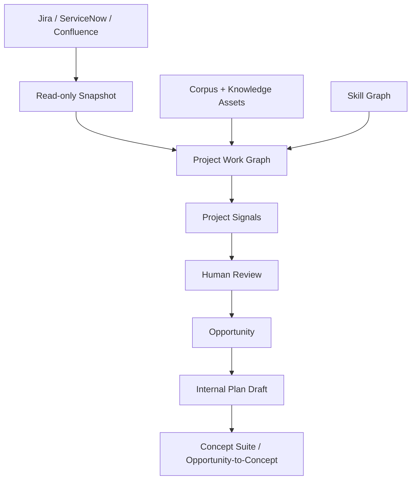

# Consultry - Project Intelligence & Symbiosis Graph v1.0

**Status:** Source-Candidate / Strategic Suite Candidate, nicht H1-MVP-locked  
**Datum:** 28.06.2026  
**Rolle im Doc-Stack:** Erweitert Work, Knowledge & Reuse und Opportunity-to-Concept um eine projektuebergreifende Analyse-Schicht ueber bestehende Projektmanagement-, ITSM- und Knowledge-Tools.  
**Bezug:** [Product Vision](./Consultry-Product-Vision-v1.0.md), [MVP-Technical-Foundation](./Consultry-MVP-Technical-Foundation-v1.0.md), [Virtual Harness & Second Brain Refinement](./Consultry-MVP-Virtual-Harness-Second-Brain-Refinement-v1.0.md), [Alignment Control Plane](./Consultry-Alignment-Control-Plane-v1.0.md).

> **Kurzfassung.** Consultry soll kein eigenes Jira, ServiceNow oder Projektmanagement-System nachbauen. Der starke Hebel ist ein **Project Intelligence Layer**: Jira/Atlassian, Confluence, ServiceNow, GitHub/GitLab, M365 und lokale Projektartefakte werden read-only/snapshot in den Second Brain gezogen. Daraus entsteht ein **Symbiosis Graph**, der zeigt, woran Teams arbeiten, welche Requirements/Pain Points/Ziele dahinter stehen, wo Arbeit redundant ist, wo Teams gegeneinander laufen, welche Assets wiederverwendbar sind und welche Projekt-Signale zu neuen Opportunities fuehren koennen.

---

## 1. Strategische These

Opportunity-to-Concept ist nicht nur ein Akquise-Workflow. Die besten Akquise-Signale entstehen oft aus laufender Arbeit:

- Ein Kunde baut Workarounds, weil ein Pain noch nicht geloest ist.
- Zwei Teams loesen aehnliche Probleme unabgestimmt.
- Ein Projekt erzeugt eine Methode, ein Runbook, eine Referenz oder ein Skill-Profil, das direkt fuer den naechsten Pitch relevant ist.
- Jira/ServiceNow/Confluence enthalten Requirements, Incidents, Epics, Change Requests und Decision Trails, die besseres Angebot, bessere Delivery und bessere Folgegeschaefts-Signale liefern.

Der Moat ist nicht Project Management. Der Moat ist **Work Knowledge → Symbiosis Links → Opportunity Signal → Internal Plan**.

---

## 2. Was Das Modul Ist

**Name-Kandidat:** Project Intelligence & Symbiosis Graph  
**Interner Kurzname:** Project Radar  
**Kategorie:** Work/Knowledge/Opportunity bridge

| Aufgabe | Beschreibung |
|---|---|
| Project Work Memory | laufende und abgeschlossene Arbeit als source-bound Graph: Projekte, Epics, Tickets, Incidents, Decisions, Requirements, Deliverables |
| Symbiosis Links | Verbindung zwischen Projekten, Teams, Skills, Assets, Pain Points, Angeboten und Referenzen |
| Redundancy Detection | doppelte oder sehr aehnliche Work Items, parallele Loesungen, wiederholte Fragestellungen |
| Conflict Detection | Teams arbeiten auf widerspruechliche Ziele, doppelte Ownership, unklare Dependencies |
| Opportunity Signals | ungelöste Requirements, neue Pains, Anschlussphasen, Support-/Incident-Cluster, Change-Requests |
| Internal Plan Generation | aus Opportunity + Project Knowledge + Skill Graph + Proof Assets entsteht ein interner Vorgehensplan |

---

## 3. Was Es Nicht Ist

- Kein Jira-/ServiceNow-Ersatz.
- Kein autonomes Ticket-Mutation-System.
- Kein Personen-Performance-Scoring.
- Kein Activity-Monitoring einzelner Consultants.
- Kein LinkedIn-Scraping.
- Kein autonomer Outreach ueber Clay/Apollo/LinkedIn.
- Kein H1-MVP-Scope, solange Opportunity-to-Concept und Work-Adoption nicht validiert sind.

**MVP-nahe erlaubte Form:** read-only/snapshot Import und Analyse im Hintergrund, wenn ein Pilotkunde die Daten sauber freigibt. Outputs bleiben Vorschlaege, keine automatisch geaenderten Tickets.

---

## 4. Integrationsfamilie

| Quelle | Adapter-Idee | Relevante Objekte | Grenze |
|---|---|---|---|
| Jira / Atlassian | Jira Cloud REST API, JQL search, webhooks where approved | Projects, Epics, Issues, Sprints, Status, Links, Comments, Attachments metadata | read-only/snapshot; no issue mutation in H1 |
| Confluence | Confluence REST API / CQL search | Pages, Spaces, Decisions, Runbooks, Meeting Notes, Requirements | read-only, space allowlist, source spans |
| ServiceNow | Table API / approved ITSM tables | Incidents, Problems, Changes, Requests, CMDB refs | read-only tables/views, role-scoped service account |
| GitHub/GitLab | repo/issues/PR/MR snapshots | delivery evidence, code/runbook links, architecture decisions | read-only app permissions |
| M365 / Google Drive | docs/files/export/delta | project docs, proposals, meeting notes, plans | folder allowlist, hashes |
| Clay/Apollo | enrichment snapshots | company/account/person/company context for approved GTM use cases | import only, no sequences/outbound |
| LinkedIn / X / web signals | approved/public or user-provided URLs/exports only | public role/org/change signals where lawful | no scraping, no private profile ingestion without legal basis |

Official source basis for the API surface: Atlassian documents Jira Cloud REST issue search and webhooks; Confluence documents REST/CQL search and content APIs; ServiceNow documents REST APIs and the Table API for table records.

---

## 5. Core Objects

```text
ProjectWorkSource
  source_type {Jira, Confluence, ServiceNow, GitHub, GitLab, M365, GoogleDrive, LocalFiles}
  tenant_id, connector_grant_id, source_scope, sync_cursor, last_snapshot_hash

ProjectWorkItem
  source_ref, project_ref, work_type {Epic, Story, Task, Bug, Incident, Change, Request, Decision, Requirement}
  title, status, priority, dates, labels, source_bindings[], owner_team_ref?

ProjectRequirement
  work_item_ref, need_statement, pain_point, target_outcome, acceptance_hint, evidence_spans[]

ProjectSignal
  kind {UnmetRequirement, RepeatedIncident, ExpansionHint, DuplicateWork, DeliveryRisk, ReuseOpportunity}
  source_refs[], confidence, review_state, suggested_next_action

SymbiosisLink
  subject_ref, predicate, object_ref, evidence_refs[], link_type
  examples: work_item_reuses_asset, team_solves_same_requirement, project_generates_reference

RedundancyFinding
  work_item_refs[], similarity_basis, overlap_summary, suggested_resolution, reviewer

ConflictFinding
  work_item_refs[], conflict_type {DuplicateOwnership, OpposingRequirement, DependencyMismatch, ScopeOverlap}
  explanation, source_refs[], reviewer

InternalPlanDraft
  opportunity_ref, requirements[], relevant_assets[], skill_shape, delivery_steps[], risks[], source_bindings[]
```

---

## 6. Symbiosis Patterns

| Pattern | Example | Added Value |
|---|---|---|
| Duplicate Work | Zwei Teams bauen aehnliche Migration-Runbooks in verschiedenen Jira-Projekten | Konsolidierung, weniger Doppelarbeit, reusable asset |
| Hidden Reuse | Ein Incident-Cluster passt zu einer existierenden Methodik oder einem frueheren Projekt | schnellerer Plan, bessere Evidence |
| Delivery-to-Sales Signal | Viele Change Requests zeigen naechste Projektphase | Bestandskunden-Opportunity |
| Requirement-to-Skill | Requirements matchen Skill Graph und Project Experience | glaubwuerdige TeamShape und interner Plan |
| Conflict Link | Zwei Teams verfolgen widerspruechliche Zielbilder oder Dependencies | Management-Hinweis ohne Personen-Scoring |
| Tender-to-Project Memory | Ausschreibungsanforderung matcht fruehere Epics/Deliverables | belegbarer Proposal-Abschnitt |

---

## 7. Flow: Project Work Zu Opportunity



1. Connector importiert freigegebene Projekt-/ITSM-/Knowledge-Daten als Snapshot.
2. Project Work Graph extrahiert Requirements, Pain Points, Ziele, Decisions, Deliverables und Evidence.
3. Symbiosis Engine findet Redundanzen, Konflikte, Reuse-Moeglichkeiten und Opportunity-Signale.
4. Mensch bestaetigt oder verwirft ein Signal.
5. Consultry erzeugt Opportunity + InternalPlanDraft mit SourceBindings, SkillShape und relevanten Referenzen.
6. Concept Suite nutzt diesen Plan als starkes Input-Artefakt.

---

## 8. Safety / Governance

| Risiko | Guardrail |
|---|---|
| Mitarbeiterueberwachung | team-/artefaktzentrierte Analyse; keine individuelle Produktivitaetsbewertung |
| Ticket-Mutation | read-only/snapshot im H1/H2-start; writeback nur spaeter per ADR und Approval |
| Falsche Redundanz-Erkennung | Finding bleibt Vorschlag mit SourceBindings und ReviewState |
| Tool-Sprawl | Jira/ServiceNow/Confluence bleiben operative Systeme; Consultry ist Analyse-/Planungsschicht |
| Verdecktes Prospecting | Clay/Apollo/LinkedIn nur als approved enrichment/signal input, keine Outreach-Automation |
| Betriebsrat/AI Act | aggregiert/anonym by default; personenscharf nur mit WC-Mode und dokumentierter Rechtsgrundlage |

---

## 9. Horizon Placement

| Horizont | Rolle |
|---|---|
| H1 MVP | Nur duennes Substrat: ProjectStatus, Knowledge/Reuse, optional read-only fixtures fuer Project Work. Kein ausgebautes Project Radar. |
| H2 | Project Intelligence & Symbiosis Graph als Work/Knowledge-Erweiterung nach Win/Work-Proof. Jira/Confluence/ServiceNow read-only connectors, Redundancy/Reuse/Opportunity signals. |
| H3+ | Breitere Portfolio Intelligence, optional bidirektionale PM-Integrationen mit Approval und Governance, falls Kunden das wirklich wollen. |

---

## 10. WBS-Skizze Fuer Spaeter

| ID | Paket | Inhalt | Max LOC | Akzeptanz |
|---|---|---|---:|---|
| PI-01 | Project Work schema | work sources, work items, requirements, signals | 1000 | fixture graph roundtrip |
| PI-02 | Jira connector | read-only project/issue snapshot via JQL allowlist | 1000 | project allowlist enforced |
| PI-03 | Confluence connector | page/search snapshot with source spans | 900 | page evidence spans preserved |
| PI-04 | ServiceNow connector | read-only approved tables/views | 1000 | unapproved table rejected |
| PI-05 | SymbiosisLink engine v0 | similar work/reuse/opportunity links | 1000 | fixture finds expected links |
| PI-06 | Redundancy/Conflict findings | duplicate and conflict candidates with review state | 900 | no finding persists without evidence |
| PI-07 | InternalPlanDraft builder | opportunity + project memory + skill graph plan | 1000 | plan includes source-bound assets and risks |
| PI-08 | Review UI slice | approve/dismiss signal, create Opportunity | 900 | no auto-opportunity without human review |

---

## 11. Source Basis

- Atlassian Jira Cloud REST API issue search / JQL: https://developer.atlassian.com/cloud/jira/platform/rest/v3/api-group-issue-search/
- Atlassian Jira Cloud REST API webhooks: https://developer.atlassian.com/cloud/jira/platform/rest/v3/api-group-webhooks/
- Atlassian Confluence Cloud REST API / search: https://developer.atlassian.com/cloud/confluence/rest/v1/api-group-search/
- Atlassian Confluence Cloud REST API v2 reference: https://developer.atlassian.com/cloud/confluence/rest/
- ServiceNow REST API / Table API: https://www.servicenow.com/docs/r/api-reference/rest-apis/c_TableAPI.html

---

*Ende v1.0 - explizit als strategische Idee aufgenommen: Project Work Intelligence ueber bestehende PM-/ITSM-Systeme, nicht als eigenes PM-System.*
