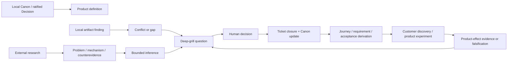
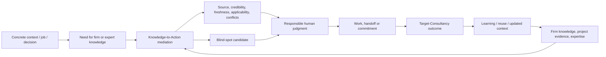
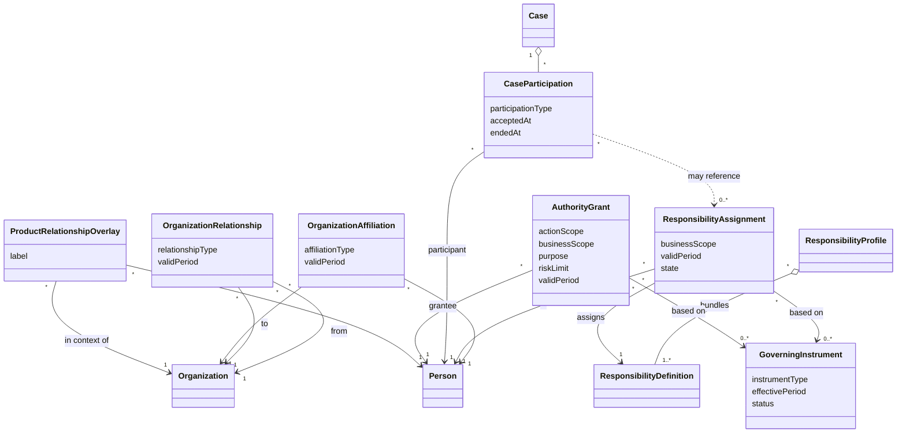
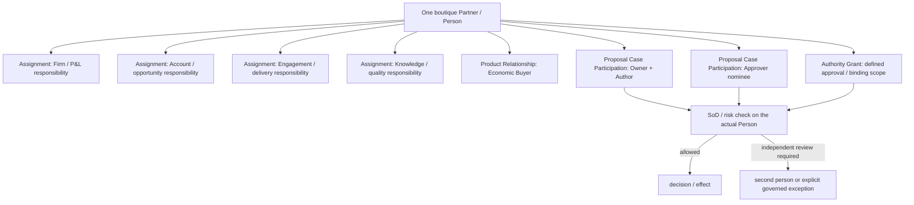
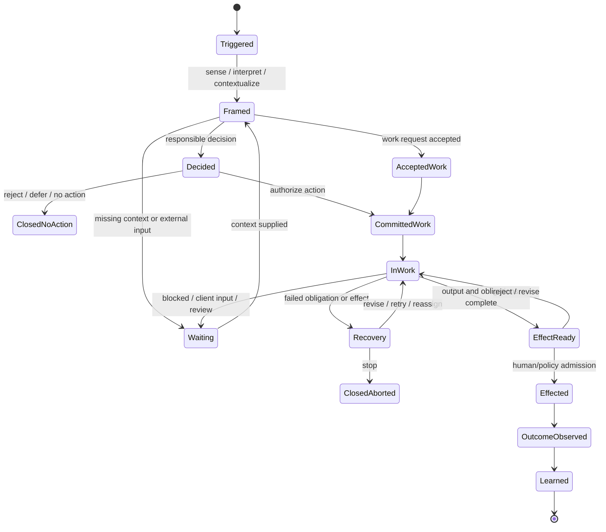
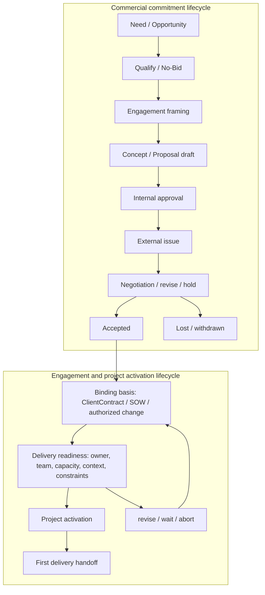
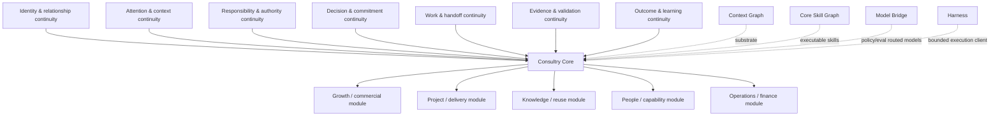
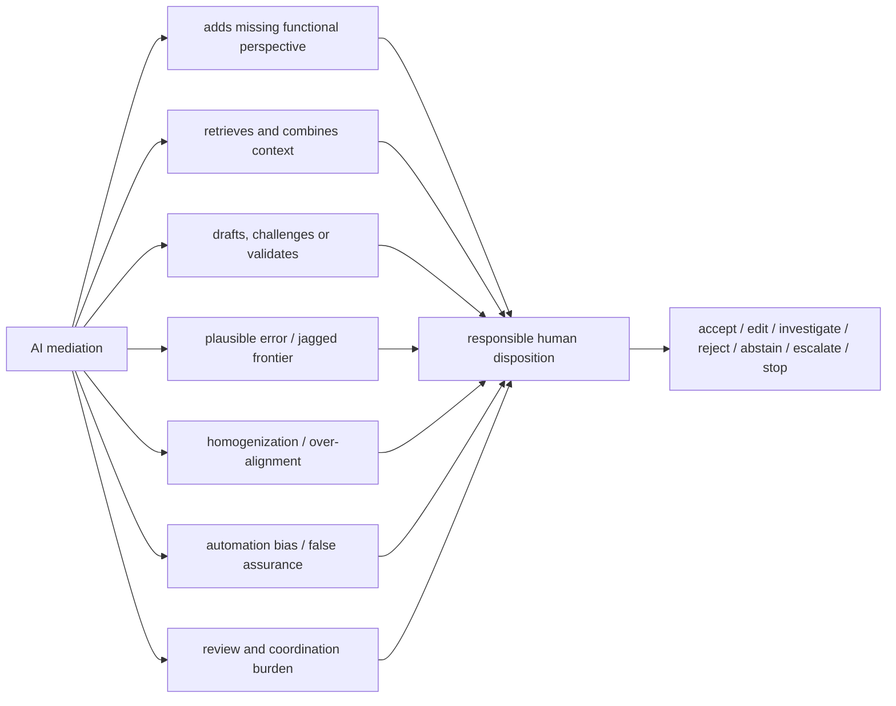
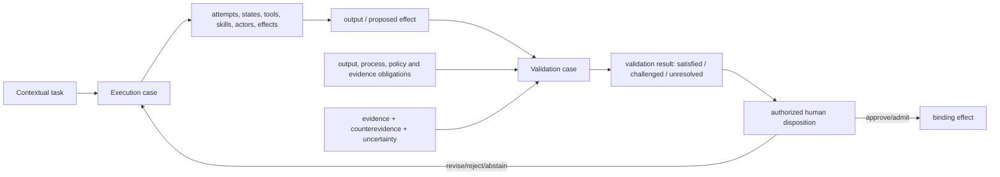
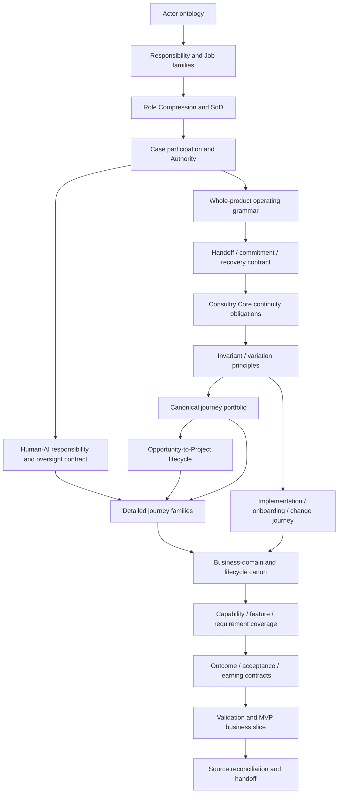

# Relationship Maps

Diese Diagramme erklären Relationships; sie sind kein technisches Architekturdesign.

## 1. Evidenz- und Entscheidungslogik

## 2. Target-Consultancy Value Mechanism

## 3. Actor, Responsibility und Authority

Die folgende Arbeitsfassung spiegelt die in **Define the Product Actor Ontology** ratifizierte fachliche Grenze. Product Relationships bleiben absichtlich ein leichtes Overlay; technische Agent-/Harness-Identitäten werden erst nach dem Product Handoff spezifiziert.

`Target Consultancy`, `Client Organization` und weitere Organisationsstellungen klassifizieren kontextuelle `OrganizationRelationship`s; sie erzeugen keine neue Organization-/Person-Identität. `ResponsibilityProfile` ist ein konfigurierbares Bundle für organisatorische Rollen, Jobprofile oder Workspace-Projektionen, nicht die accountable Zuordnung selbst. `ProductRelationshipOverlay` bleibt nur ein Label zur Abgrenzung von Identität, Responsibility, Participation, Authority und Permission; eine feinere Taxonomie ist bewusst nicht modelliert.

Die vier kanonischen Actor-/Responsibility-Konzepte sind `ResponsibilityDefinition`, `ResponsibilityAssignment`, `CaseParticipation` und `AuthorityGrant`. Keines impliziert eines der anderen. Technische Autorisierung wird kontextuell aus Authority, Identität/Product Relationship, Policy, Rechten/Vertraulichkeit, Resource/Action und aktuellem State entschieden; sie ist keine direkte Kante in diesem fachlichen Graphen.

AI bleibt fachlich ein bounded `AIExecutionSubject`: Sie darf einem human-owned Case zurechenbar beitragen oder policy-begrenzt ausführen, aber keine `ResponsibilityAssignment`, accountable Case Ownership, menschliche Approval oder bindende Business Authority besitzen. Diese Grenze setzt keine technische Identity-/Principal-/Runtime-Struktur voraus.

## 4. Role Compression ohne Authority Collapse

## 5. Whole-Product Business Grammar

`Observation`, `Signal`, `Opportunity`, `ChangeCase`, `Project`, `ReusableAsset` und andere Domain Objects implementieren passende Branches; sie werden nicht in jeden Job gezwungen.

## 6. Opportunity-to-Project als gekoppelte Lifecycles

## 7. Consultry Core als Continuity Backbone

## 8. AI als Bridge und als neue Blind-Spot-Quelle

## 9. Execution und Validation

## 10. Empfohlene Decision Dependency Chain

