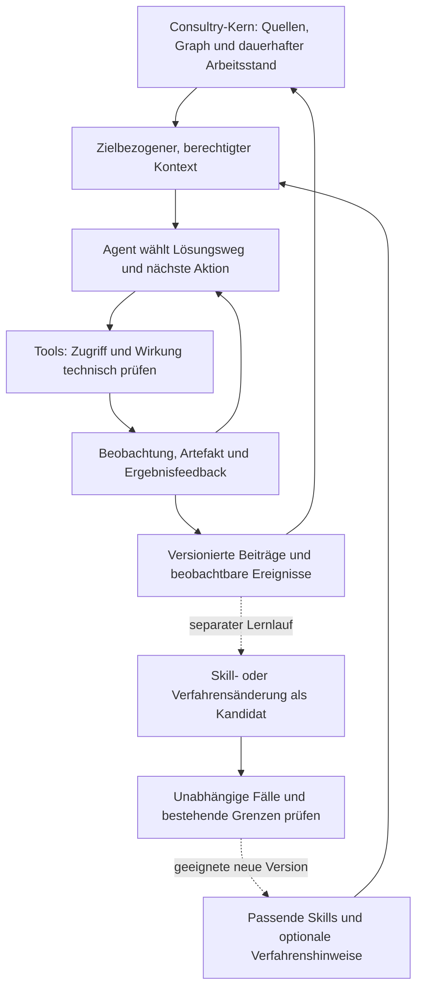

# Adaptive Harnesses, Graphwissen und lernfähige Arbeitszustände

## Einordnung

Für Consultry ist ein modellstarker, adaptiver Harness eine tragfähige Entwicklungsrichtung: Das Modell soll einen Beratungsauftrag selbstständig bearbeiten können, statt eine vorab ausformulierte Werkzeugchoreografie abzulaufen. Der Produktkern stellt dafür zugängliches Firmenwissen, Arbeitskontinuität, geeignete Fähigkeiten und tatsächliches Ergebnisfeedback bereit. Sein Wert liegt nicht darin, möglichst viele Agentenschritte zu kontrollieren.

Die Forschung unterstützt diese Richtung, aber auf unterschiedlichen Ebenen. **Procedural Graphs** betrifft die Orientierung während der Ausführung; **A*-Thought-V2** verändert modellinternes Reasoning. Über **code4AI** erschlossene Arbeiten ergänzen Wissensaufbau, kompakte Arbeitszustände und Lernen aus Erfahrung. Diese Ansätze können zusammenspielen, sind aber weder austauschbar noch gemeinsam bereits als Consultry-Architektur validiert.[^1][^2][^3]

Die daraus abgeleitete Engineering-Hypothese lautet: **Consultry gibt Agents mehr Freiheit beim Lösungsweg und bessere Voraussetzungen für ein gutes Ergebnis.** Welche Hilfen tatsächlich nötig sind, wird pro Aufgabe und Modell geprüft. Zugriff, Vertraulichkeit und verbindliche Außenwirkungen bleiben eigenständige Systemverantwortung — nicht ein Teil der veränderbaren Arbeitsmethode.

## Die beiden Ausgangspapiere

### Procedural Graphs

Lu et al., v1 vom 08.09.2026, untersuchen weiche Orientierung aus einem lokalisierten Verfahrensgraphen. Während einer Episode bleibt dessen Version fest; ein separater Verbesserungsprozess testet Änderungen und bewahrt auch abgelehnte Kandidaten. Über sechs Benchmarks und vier Modelle ergibt Tabelle 1 gegenüber der jeweils stärksten Baseline 19 Siege, zwei Gleichstände und drei Niederlagen.[^1]

Besonders aufschlussreich ist der kleine MultiChallenge-Konstruktionstest mit 56 Fällen: Ohne Graph werden 87,50 % erreicht, mit ungeeignetem Expertengraph 58,93 %, nach iterativer Korrektur 92,86 %. Das ist ein Gegenbeleg gegen die Annahme, zusätzliche Expertenstruktur helfe automatisch. Ein Vergleich gegen einfache lokale Subgraph-Textausgabe fehlt. Ebenso fehlen Nachweise für firmenweite Graphen, geschützte Zusammenarbeit und uneingeschränkte Übertragbarkeit auf neue Solver.[^1]

**Consultry-Ableitung:** Verfahrenswissen als abwählbare, situationsbezogene Unterstützung erproben. Der passende Anschluss ist eine prozedurale Sicht auf den Core Skill Graph, nicht ein weiterer obligatorischer Workflow-Dienst. Einen zusätzlichen Guidance-Agenten erst dann einsetzen, wenn er gegenüber direktem Abruf wirklich hilft.

### A*-Thought-V2

Xu et al., v1 vom 07.09.2026, komprimieren ausgewählte Reasoning-Schritte in trainierte latente Zustände. Untersucht werden Qwen3.5-9B und Qwen3.6-27B auf sechs Mathematik-/Wissenschaftsbenchmarks. Bei 27B steigt gegenüber gleichdatenbasierter SFT die mittlere Genauigkeit von 92,9 auf 93,9; die Antwortlänge sinkt um 16 %. Die häufig genannte 2,29-fache ACU vergleicht dagegen das Rohmodell. ACU ist ein Accuracy-/Tokenmaß, kein gemessener API-Kostenvorteil.[^2]

Die Methode benötigt Eingriffe in Training und Inferenz; sie ist kein nachbaubarer Prompt-Wrapper um eine Black-Box-API. Der Autoren-Code enthält V2-Bestandteile, aber die Lizenz für das Gesamtprojekt ist nicht durch eine Root-Lizenz geklärt.[^2][^4]

**Consultry-Ableitung:** Keine Produktlogik an vorgeschriebene sichtbare Denksequenzen koppeln. Das Ledger dokumentiert zugelassene Inputs, Aktionen, Ergebnisse und Entscheidungen — nicht angeblich rekonstruierte interne Modellgedanken. Latent Reasoning bleibt eine Modellforschungsreferenz, keine aktuelle Ledger-Funktion oder Startabhängigkeit.

## code4AI als Forschungszugang

Discover AI / @code4AI ist eine priorisierte Entdeckungsquelle. Die folgende Zuordnung beruht auf öffentlichen Feed-Metadaten und Beschreibungen; sie ist keine Behauptung, die Videos vollständig angesehen oder transkribiert zu haben. Die daraus abgeleiteten technischen Aussagen sind jeweils an Primärquellen angeschlossen.[^3]

| Veröffentlichung (UTC) | Video | Zugeordnetes Papier |
|---|---|---|
| 11.09.2026 | [What Happens When AI Stops Thinking in Words?](https://www.youtube.com/watch?v=It_8QWMQvaA) | A*-Thought-V2 [^2] |
| 10.09.2026 | [NEW Procedural Graphs: AI’s Missing Control Layer](https://www.youtube.com/watch?v=0NvD6qNapiU) | Procedural Graphs [^1] |
| 04.09.2026 | [Claude Code Improves Massively w/ 2nd Harness](https://www.youtube.com/watch?v=c_QzwZO0dd8) | Harness-of-Harness [^7] |
| 03.09.2026 | [Agentic Skills + Knowledge Graphs = AI’s Scientific Operating System](https://www.youtube.com/watch?v=gDPJI1cp0gw) | ASKS [^5] |
| 31.08.2026 | [AI Just Escaped the Context Window (Skill.state)](https://www.youtube.com/watch?v=PtcK1MnW8GM) | SKILL.state; hier ist die spätere Revision v3 ausgewertet [^6] |
| 30.08.2026 | [NEW Persistent Skill Compiler: WIKISKILL (Google)](https://www.youtube.com/watch?v=sHeITqLW2BY) | WikiSkill [^8] |

### ASKS: Quellen werden zu fortschreibbarem Wissen

ASKS verbindet erhaltene Quellen mit einer lesbaren Wiki-Sicht und maschinenlesbarer Semantik. Dokumentlokale GraphDeltas werden geprüft und mit Herkunft in den gemeinsamen Graphzustand integriert. Die Demonstration umfasst 56 Publikationen eines Forschungsprogramms; sie ist kein kontrollierter Nachweis allgemein besserer Beratungsergebnisse oder robuster Verarbeitung beliebiger Quellreihenfolgen.[^5]

Der Code der geprüften Veröffentlichung v0.2.0 steht unter **PolyForm Noncommercial 1.0.0**, die veröffentlichten Wiki-/Graphdaten unter **CC BY-NC 4.0**. Er wird deshalb nicht als frei kommerziell nutzbare Consultry-Abhängigkeit eingeplant.[^9]

**Consultry-Ableitung:** Quellenintegration darf automatisch brauchbare Strukturen erzeugen. Eine nachvollziehbare Änderungseinheit könnte Quellenversion, abgeleitete Aussagen, betroffene Beziehungen und Prüfresultate verbinden. Formale Gültigkeit einer Änderung, semantische Richtigkeit und zulässige Weiterverwendung müssen dabei getrennt bleiben. Ein syntaktisch valider Graph-Patch ist noch kein wahrer Befund.

### SKILL.state: Arbeitszustand ist nicht die gesamte Historie

SKILL.state gibt dem Modell eine Skill-Spezifikation, strukturierten aktuellen Zustand und die neueste Beobachtung. Das Paper beschreibt validierte Zustandsänderungen statt ständig wachsender Gesprächswiederholung. Seine Grenzen sind ausdrücklich relevant: unbekannte Zustandsschemata, später benötigte ältere Beobachtungen, Aufgaben mit Historie als Ergebnis und bislang nicht untersuchte konkurrierende Mehragenten-Schreibzugriffe.[^6]

**Consultry-Ableitung:** Ein kompakter Arbeitszustand kann die laufende Ausführung entlasten, während Quellen, Artefakte und relevante Ereignisse im Kern gezielt wieder abrufbar bleiben. Die benötigten Zustandsfelder werden am Beratungsjob gelernt; kein universelles Vollschema vorab. Verdichtung darf keine stille Löschung der fachlich benötigten Evidenz bedeuten.

### Harness-of-Harness: Bestehende Ausführung ergänzen

Harness-of-Harness setzt auf vorhandene Coding-Harnesses und verbindet begrenzte Entwicklungsziele mit Fortschreibung und unabhängiger Prüfung. Es bindet Agenten an Ergebnisse, ohne sämtliche internen Wege vorzuschreiben. Die Evaluation betrifft Softwareentwicklung; Hauptvergleiche nutzen unterschiedliche Iterationszahlen, ergänzt um durchlaufkontrollierte Vergleiche. Einzelne gültige Runs pro Task/Konfiguration begrenzen Zuverlässigkeitsaussagen.[^7]

**Consultry-Ableitung:** Eine vorhandene Runtime oder einen geeigneten externen Harness um Firmenkontext und dauerhafte Arbeitszustände ergänzen. Das ist keine Aufforderung, ein allgemeines Meta-Harness-Framework als weiteres Produkt zu bauen. Aus einem getrennten Prüf-Agenten folgt keine Pflicht zu zwei menschlichen Freigaben.

### WikiSkill: Erfahrung wird zu Skill-Kandidaten

WikiSkill trennt Ausführungserfahrung, akkumuliertes Wissen und ausführbare Skills. Aus Trajectories entstehen evaluierte Änderungen; auch verworfene Versuche bleiben informativ. Die untersuchten Skills werden direkt in Prompts eingebracht: Auswahl und Abruf geeigneter Skills sowie sehr lange Ausführungen sind damit nicht umfassend evaluiert.[^8]

**Consultry-Ableitung:** Lernkandidaten aus vorhandener Arbeit ableiten, statt Consultants zu dauernder Pattern-Pflege zu verpflichten. „Dieser Ansatz hat unter diesen Bedingungen geholfen“ ist zunächst kontextgebundenes Erfahrungswissen. Erst separate Prüfung begründet eine breiter verfügbare Skill-Version. Sensible Inhalte dürfen nicht über verallgemeinerte Lernhinweise in andere Klientenkontexte gelangen.

## Stärkere Modelle und die Lebensdauer eines Harness

Anthropics Engineering-Bericht vom März 2026 beschreibt, dass mit einem leistungsfähigeren Modell Sprint-Zerlegung entfallen konnte und Evaluatoren nur an verbleibenden Fähigkeitsgrenzen zusätzlichen Nutzen boten. Das ist relevante Praxisevidenz für das Entfernen überholter Hilfskonstruktionen, aber kein kontrollierter Beweis eines universellen Trends für alle Tätigkeiten.[^10]

Ein weiterer Engineering-Bericht trennt dauerhafte Session, austauschbaren Harness und ausführende Umgebung. Er behandelt auch die strukturelle Trennung von Zugangsdaten und agentengeneriertem Code. Für Consultry ist das ein Schnittstellenprinzip; die darin beschriebene Dienstleistung wird dadurch nicht als Anbieter oder Hosting ausgewählt.[^11]

Die Context-Engineering-Praxis empfiehlt zudem selektiven, situationsabhängigen Abruf statt maximaler Kontextmenge. Eine hybride Strategie kann Startkontext mit agentengesteuerter Exploration verbinden.[^12] Pi dokumentiert dafür konkrete Integrationspunkte: Kontexttransformation, Tool-Hooks und Ereignisse; das Hauptrepository trägt eine MIT-Lizenz. Das macht Pi zu einem prüfbaren Integrationskandidaten, nicht zu einer bereits beschlossenen Runtime.[^13]

**Schlussfolgerung:** Nicht „so wenig Harness wie möglich“, sondern **so wenig unnötige Verfahrensvorgabe wie möglich**. Dauerhafte Firmenzustände, Rechte und Anschlussfähigkeit verlieren ihren Wert nicht dadurch, dass ein Modell besser planen kann. Gerade ein stärkeres Modell soll zusätzliche Fähigkeiten nutzen können, ohne dass dafür die fachliche Datenbasis neu gebaut werden muss.

## Die Graphrollen im Consultry-Kern

Die folgende Zuordnung ist ein Consultry-Entwurf, keine unveränderte Architektur eines einzelnen Papers. Sie präzisiert vorhandene Begriffe, ohne zusätzliche Pflichtdienste oder Datenbanken einzuführen.

| Rolle | Leitfrage | Nicht damit gleichsetzen |
|---|---|---|
| Wissensgraph / Brain | Welche Aussagen, Quellen, Beziehungen und Gültigkeiten sind für die Arbeit relevant? | objektive Wahrheit oder komplette Weltbeschreibung |
| Core Skill Graph mit prozeduraler Sicht | Welche versionierten Fähigkeiten und Vorgehenshilfen passen zu Ziel und Situation? | verpflichtende Reihenfolge aller Aktionen |
| Task-Zustand und Execution Graph | Woran wird gearbeitet, was wurde getan, was ist offen oder abhängig? | unveränderlicher Prozessplan |
| Validation Graph | Welche Ergebnisanforderung ist wodurch geprüft, eingeschätzt oder noch offen? | Pflicht, jeden Modellgedanken zu bewerten |
| Ledger / Ereignishistorie | Wer verwendete welchen Stand, was änderte sich und warum wurde ein Beitrag angenommen oder verworfen? | vollständiges internes Modelldenken oder automatische Freigabe |

Temporale Graph-Memory-Forschung liefert zusätzlich einen Anschluss für sich ändernde Beziehungen und historische Gültigkeit. Zep/Graphiti modelliert beispielsweise Beobachtungs-/Systemzeit und sachliche Gültigkeit getrennt. Der Anbieterbefund ersetzt aber weder eine konkrete Berechtigungsarchitektur noch eine Consultry-Evaluation.[^14]

Ein semantischer Wissensgraph darf Zyklen enthalten. Ein Agent kann Arbeitsschleifen wiederholen. Eine versionierte Ereignishistorie kann trotzdem azyklische Vorgängerbezüge haben. „Loop auf dem Graphen“ und „DAG des Ledgers“ widersprechen sich daher nicht.

## Ein adaptiver Arbeitskreislauf

Der laufende Agent darf beispielsweise weitere Quellen abrufen, einen ungeeigneten Ansatz verlassen, neue Teilaufgaben bilden und seine Analyse überarbeiten, sofern dies im Auftrag und innerhalb seiner Rechte liegt. Er muss nicht bei jedem Methodenwechsel einen Menschen fragen. Der Kern hält Herkunft und verwendete Versionen fest; die Oberfläche kann nur die für den Menschen hilfreichen Fortschritte, Fragen und Resultate zeigen.

Die Online-Arbeit und das Lernen teilen sich Beobachtungen, aber nicht dieselbe Änderungsautorität. Quellen können sich laufend aktualisieren; aufgabenlokale Pläne können sich ändern. Eine neue allgemein verwendete Skill-Version wird dagegen nicht unbemerkt während eines Runs untergeschoben. Rückführung von Fakten und Rückführung einer Methode sind unterschiedliche Änderungsarten.

Der Lernprozess darf Kandidaten auch automatisch prüfen und innerhalb zuvor freigegebener Regeln übernehmen. Dafür ist keine universelle menschliche Freigabe jedes Patches vorgesehen. Eine Änderung an Berechtigungen, fachlicher Ergebnisanforderung oder verbindlicher Policy gehört jedoch nicht zum frei optimierbaren Suchraum des Agents.

## Welche Grenzen beweglich sein sollen

| Beweglich und empirisch zu vereinfachen | Stabil zu erfüllen, Implementierung austauschbar |
|---|---|
| vorgedachte Schrittfolgen und starre Unteraufgaben | erlaubter Auftrag, Identität und delegierte Befugnis |
| Anzahl und Rollen zusätzlicher Agents | Klienten-/Projektgrenzen und Empfängerrechte |
| Menge vorgeladener Informationen | zulässiger Daten- und Toolweg |
| Abruf-, Verdichtungs- und Wiederholungsstrategie | korrekte Zuordnung von Quellen-/Artefaktversionen |
| prozedurale Hinweise und Checkpoint-Häufigkeit | Schutz vor doppelten wirksamen Aktionen bei Retry |
| Häufigkeit modellbasierter Kritik | nachweisbare Ergebnisanforderungen und angemessene Verantwortung |

„Stabil“ bedeutet nicht, dass jedes Mal ein Mensch bestätigen muss. Ein berechtigter Entwurfsauftrag kann Lesen, Analysieren, interne Artefakterzeugung und Überarbeitung bereits umfassen. Für eine verbindliche Zusage oder das Teilen mit einem erweiterten Empfängerkreis muss dagegen die entsprechende Befugnis bestehen.

Eine Skill-Anweisung, ein Quellentext oder Agentenkonsens darf keine Berechtigung erteilen. Auch Erinnerungen, gelernte Verfahrenshinweise und Metadaten sind mögliche Träger geschützter Inhalte. Die Zugriffskontrolle muss deshalb an den tatsächlichen Abruf- und Wirkungsgrenzen greifen, nicht nur an der Formulierung des Prompts.

Das Ledger ist kein Freibrief für unbegrenzte Speicherung. Aufbewahrung, Reduktion, Löschung und erhaltene Rekonstruktionslücken gehören zum Datenkonzept. Ein kompakter Zustand darf auf geschützte Belege verweisen, ohne sie bei jedem Modellaufruf vollständig zu wiederholen.

## Was jetzt sinnvoll gebaut werden kann

Die bestehende backendgetriebene Route bleibt bestehen. Die neue Forschung macht die technische Richtung konkreter, ohne einen vollständigen Mock, eine universelle Ontologie oder einen firmenweiten Schwarm vorzuschalten.

1. **Eine durchgängige Wissens-/Arbeitsverbindung:** Eine freigegebene Quellenfamilie einbringen, Herkunft erhalten und an einem begrenzten Beratungsauftrag ein verwendbares Artefakt erzeugen. Keine manuelle Vollmodellierung des Korpus.
2. **Ein dünner Harness-Anschluss:** Auftrag, erlaubten Kontext und passende Skills an eine vorhandene Ausführung geben; Ergebnisse und beobachtbare Aktionen wieder dem Task zuordnen. Der Agent entscheidet über den Weg.
3. **Dauerhafte Fortsetzung:** Einen kompakten Arbeitsstand und gezielt abrufbare Belege erhalten. Einen zweiten berechtigten Teilnehmer beziehungsweise eine weitere Sitzung anschließen; geänderte Quellen und widersprechende Beiträge behandeln.
4. **Eine kontrollierte Verbesserungsrunde:** Aus wiederkehrendem Scheitern einen Verfahrens- oder Skill-Kandidaten erzeugen, gegen zurückgehaltene Aufgaben vergleichen und das Ergebnis als neue Version oder begründete Ablehnung sichern.

Die ersten drei Punkte bilden den Kernnachweis. Punkt vier ist eine anschließende Ausbaustufe, kein Grund, mit dem Kern auf perfekte Selbstverbesserung zu warten. Konkrete Runtime, Datenbank und erster fachlicher Auftrag bleiben Auswahlentscheidungen. Technische Schnittstellen und synthetische Prüffälle können parallel vorbereitet werden; sensible echte Daten werden dadurch nicht automatisch freigegeben.

## Vergleich und Ergebnisnachweis

Der entscheidende Vergleich ist nicht „Agent gegen keinen Agenten“, sondern der zusätzliche Nutzen der jeweiligen Harness-Komponente. Ein Agent-Eval soll tatsächliche Ergebnisse und Zustandsänderungen prüfen, nicht lediglich die Erfolgsmeldung des Agents. Unterschiedliche Code-, Modell- und menschliche Bewertungen haben verschiedene Stärken und Grenzen.[^15]

Für den ersten ausgewählten Beratungsjob empfiehlt sich ein kleiner gestufter Vergleich:

| Variante | Veränderung gegenüber vorher | Erkenntnis |
|---|---|---|
| A: schlanker Agent | identischer Auftrag, erlaubte Quellen/Tools, kompakter Arbeitsstand; keine prozedurale Zusatzhilfe | Grundfähigkeit des Modells |
| B: lokales Verfahrenswissen | passende Skill-/Graphausschnitte direkt abrufen | Nutzen lokal abgerufenen Verfahrenswissens |
| C: situative Guidance | aus demselben Ausschnitt zusätzlich Hinweise generieren | lohnt ein zusätzlicher Modellaufruf? |
| D: überarbeitete Version | erst nach A–C: Änderung aus Lernfällen, Evaluation auf anderen Fällen | übertragbare Verbesserung statt Einzelfalloptimierung |

Eine starre Workflow-Variante ist nur als zusätzlicher Vergleich sinnvoll, wenn ein realer Prozess sie rechtfertigt; kein künstlich schlechter Strohmann. A→B isoliert nicht die Wirkung von Graphbeziehungen: Dafür wäre später derselbe Inhalt einmal unverbunden und einmal mit Beziehungen zu vergleichen. Den Nutzen des faktischen Wissensgraphen ebenfalls separat von prozeduralen Hilfen untersuchen, damit Graph-Retrieval und zusätzliche Rechenzeit nicht verwechselt werden.

Gemeinsam konstant bleiben Modellversion, Quellenstand, Tools, Rechte, Auftrag und Ergebnisrubrik. Zusätzliche Guidance-/Prüfaufrufe zählen vollständig zu Zeit, Tokenverbrauch und Kosten. Mehrere Durchläufe und dokumentierte Streuung sind aussagekräftiger als der beste Einzelrun. Bei einem Modellwechsel denselben Vergleich erneut ausführen und Hilfen entfernen, wenn sie keinen belastbaren Nutzen mehr liefern.

Gemessen werden:

- verwendbares Beratungsartefakt und menschliche Nacharbeit;
- fachliche Korrektheit, Quellenpassung und relevante fehlende Perspektiven;
- Wiederaufnahmefähigkeit sowie Verhalten nach Quellenänderung;
- unnötige Wiederholungen, Rückfragen und Wartezeit;
- tatsächliche unerlaubte Abrufe, Weitergaben oder Wirkungen;
- Gesamtkosten und Laufzeit einschließlich zusätzlicher Agents.

Lern-, Auswahl- und abschließende Testfälle sind getrennt zu halten, möglichst auch nach Quellversion und Projekt. Wiederholte Optimierung am gleichen Validierungssatz kann diesen faktisch zum Trainingssignal machen. Ein besserer Mittelwert darf einen neuen schweren Zugriffsmangel oder den Ausfall einer wichtigen Fallgruppe nicht kompensieren. Fehlerfreiheit in einem endlichen Test ist trotzdem kein allgemeiner Sicherheitsbeweis.

Automatisch prüfbare Ergebnisse, fachliche Einschätzungen und später beobachtbare Klientenwirkung bleiben getrennt. Ein erfolgreicher Retrieval-Test beweist keine gute Prozessberatung; ein überzeugendes Konzept beweist noch keine erfolgreiche Umsetzung. Menschliche Bewertung bleibt dort nötig, wo die relevante Qualität nicht ausreichend maschinell prüfbar ist — nicht als ritualisierte Freigabe jeder Agentenaktion.

## Konsequenzen und verbleibende Entscheidungen

Als aktuelle Suchrichtung ist ein **ergebnisorientierter, vereinfachbarer Harness** sinnvoll. Die konkrete Umsetzung sollte diesen Kern klein halten: gezielter Kontextzugriff, vorhandene Ausführung, fortsetzbarer Arbeitsstand, beobachtbare Ergebnisse und versionierbare Hilfen.

Die folgenden Architekturideen bleiben Vorschläge: prozedurale Sicht innerhalb des Skill Graph, kleine quellenbezogene Änderungssets, kompakter Task-Zustand mit abrufbarer Historie und separate evaluierte Lernläufe. Keines der Papers verlangt für Consultry fünf Graphdatenbanken, Blockchain, globale Agentenabstimmung oder ein eigenes Foundation-Model-Training.

Die unmittelbar anschließenden Fragen lassen sich im bestehenden Wayfinder bündeln:

1. Welches erste Beratungsartefakt zeigt einen echten Gewinn durch verbundenes Firmenwissen?
2. Was soll der Agent innerhalb dieses Auftrags selbst entscheiden dürfen, und welche tatsächliche Wirkung benötigt eine gesonderte Befugnis?
3. Welche einfache Vergleichsvariante zeigt, ob eine zusätzliche Graph-/Harness-Hilfe ihren Aufwand verdient?

Diese Fragen schärfen den ersten Durchlauf. Sie eröffnen keinen neuen vollständigen Produktdefinitionszyklus.

## Quellen

Die Forschungsstände wurden am 13.09.2026 geprüft. Ergebnisse sind Autorenbefunde, keine unabhängigen Replikationen oder Consultry-Messungen. Bei den aktuellen Papers ist insbesondere zwischen neuer Vorveröffentlichung, Implementierungsbeleg und erprobter Produktfähigkeit zu unterscheiden. Der maschinenlesbare Quellen- und Ableitungsindex steht in [EVIDENCE.json](EVIDENCE.json); heutige Produktgültigkeit wird in [DECISIONS](../../DECISIONS.md) geführt.

[^1]: Yuxing Lu, Yicheng Chen, Shanchan Wu, Sercan Ö. Arık. [Procedural Graphs: Self-Evolving Execution Structures for LLM Agents](https://arxiv.org/html/2609.09153v1). 08.09.2026, v1. §§3, 5; Tabellen 1–3; Anhänge B.1/B.6/D/E. Kein offizielles Code-Repository verifiziert.
[^2]: Xiaoang Xu et al. [A*-Thought-V2: Efficient Latent Reasoning via Geometric Dynamics of LLM](https://arxiv.org/html/2609.07821v1). 07.09.2026, v1. §§3–5, Tabelle 1, Trainings-/Inferenzanhänge.
[^3]: Discover AI. [@code4AI](https://www.youtube.com/@code4AI), [öffentlicher Atom-Feed](https://www.youtube.com/feeds/videos.xml?channel_id=UCfOvNb3xj28SNqPQ_JIbumg). 15 Einträge vom 26.08.–11.09.2026 geprüft; sechs oben zugeordnet. Zugriff über Feed-Metadaten und Beschreibungen, nicht Transkripte. Kanalseitenabruf lieferte nur Fußzeilentext.
[^4]: AI9Stars. [AStar-Thought, geprüfter Commit cd18ca43f0f097c1fa2b2d18c35df14bdf06bb53](https://github.com/AI9Stars/AStar-Thought/commit/cd18ca43f0f097c1fa2b2d18c35df14bdf06bb53). 09.09.2026. V2-Code vorhanden; keine Root-Lizenz gefunden, Teilverzeichnis-Lizenz nicht pauschal auf Gesamtprojekt übertragbar. Nicht ausgeführt.
[^5]: Shi-Ju Ran, Kun Zhang, Xi Wu, Liu-Si Yang, Wen-Jun Li. [LLMs Interpret, Embeddings Organize, Graphs Emerge: Agent-Driven Compilation of Scientific Knowledge](https://arxiv.org/html/2608.29612v1). 30.08.2026, v1. §§2–3, 5.4, 6; Anhänge A–E.
[^6]: Sanket Badhe, Priyanka Tiwari, Jonghyun Chung. [SKILL.state: Scalable Long-Horizon Agent Skills](https://arxiv.org/html/2608.26263v3). Erste Einreichung 26.08.2026; geprüfte Revision v3 vom 02.09.2026. §§3, 5, 7. arXiv-Metadaten melden „accepted at EMNLP“; hier kein separater Proceedings-Nachweis geprüft.
[^7]: Haoyang Yan et al. [Harness-of-Harness: Multi-Day Autonomous Software Development with Continual Improvement](https://arxiv.org/html/2609.01481v1). 01.09.2026, v1. §§3–4, Anhang B.2. [Autorenprojekt](https://github.com/Flesymeb/HarnessOfHarness); HoH-lite dort zum Prüfzeitpunkt als kommende Veröffentlichung angekündigt, keine verfügbare Integration oder Dependency-Auswahl behauptet.
[^8]: Liyan Tang et al. [WikiSkill: Compiling Agent Experience into Persistent Knowledge for Skill Evolution](https://arxiv.org/html/2608.27454v1). 27.08.2026, v1. §§3–4 und Limitations.
[^9]: Shi-Ju Ran / Ran-ASKS. [Release v0.2.0](https://github.com/ranshiju/Ran-ASKS/releases/tag/v0.2.0). 30.08.2026, Paper-Artefakt 1.0.0; Lizenzabschnitt. Lizenzkennzeichnung erfasst, keine pauschale Rechtsfreigabe.
[^10]: Prithvi Rajasekaran / Anthropic. [Harness design for long-running application development](https://www.anthropic.com/engineering/harness-design-long-running-apps). 24.03.2026. Insbesondere „Removing the sprint construct“; Engineering-Erfahrungsbericht.
[^11]: Lance Martin, Gabe Cemaj, Michael Cohen / Anthropic. [Scaling Managed Agents: Decoupling the brain from the hands](https://www.anthropic.com/engineering/managed-agents). 08.04.2026. Session-/Harness-/Tool-Trennung und Sicherheitsgrenze; keine Übernahme des Betriebsangebots.
[^12]: Anthropic. [Effective context engineering for AI agents](https://www.anthropic.com/engineering/effective-context-engineering-for-ai-agents). 29.09.2025. Just-in-time-Kontext, progressive Disclosure und hybride Exploration.
[^13]: Pi Maintainers. [Pi Agent Harness](https://github.com/earendil-works/pi), [Agent-Core-Dokumentation](https://raw.githubusercontent.com/earendil-works/pi/main/packages/agent/README.md). Laufender Stand am 13.09.2026; `badlogic/pi-mono` leitet auf dieses Repository weiter. Vor Integration konkrete Version pinnen und Paketlizenzen prüfen.
[^14]: Preston Rasmussen, Pavlo Paliychuk, Travis Beauvais, Jack Ryan, Daniel Chalef. [Zep: A Temporal Knowledge Graph Architecture for Agent Memory](https://arxiv.org/html/2501.13956v1). 20.01.2025, v1. §2.2.3; ergänzende ältere Primärquelle, kein „neuestes Modell“-Nachweis.
[^15]: Anthropic. [Demystifying evals for AI agents](https://www.anthropic.com/engineering/demystifying-evals-for-ai-agents). 09.01.2026. Outcome-/Transcript-Unterscheidung und unterschiedliche Grader.
