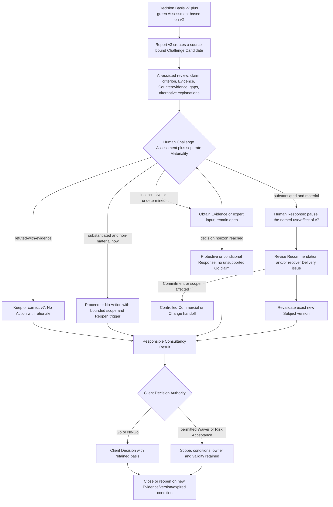

# Consultry Active Project/Delivery Blind-Spot and Rebuttal-Simulation Reference Thread v0.1

**Status:** Ratified semantic Reference Thread and potential PoC input — flow and UX detail intentionally provisional  
**Date:** 2026-08-04  
**Wayfinder owner:** [Specify the Active Project/Delivery Blind-Spot and Rebuttal-Simulation Reference Thread](./wayfinder/consultry-product-platform-baseline/tickets/specify-consultant-daily-work-and-project-delivery-journeys.md)

## 1. Purpose and boundary

This artifact frames one representative Active-Project-/Delivery thread for both first-class Target-Consultancy archetypes. Its concrete fixture is an ERP Wave-1 Readiness Recommendation challenged by newer reconciliation evidence shortly before a Client Steering decision.

The thread tests the recurring Job of finding and responsibly handling a material Blind Spot in real Project work. It connects exact work context, source-visible Challenge, human Assessment and Materiality, a responsible Response, Revision/Recovery, Revalidation and Client Decision Authority.

It is not a final UX flow, universal Project lifecycle, Project-Management replacement, Cutover engine, independent AI Assurance, standalone simulator, Product Wedge or module. ERP is only the fixture; the transferable pattern is:

`Exact work/decision subject -> material Evidence conflict or intentional challenge -> bounded AI-assisted Challenge -> human Assessment and Materiality -> Responsible Response -> Revision/Revalidation/Recovery -> responsible effect and learning`

## 2. Ratified thread summary

| Decision area | Ratified position |
|---|---|
| Scenario | `ERP Wave-1 Readiness Recommendation / Client Steering Decision Basis v7`, approximately 48 hours before Client Steering. |
| Trigger | Current `Reconciliation Report v3` conflicts with a Go claim whose green human Status Assessment still relies on `v2`; no authorized Client acceptance or Waiver covers the gap. |
| Admission | A Candidate may claim attention only when bound to the exact subject/version, concrete claim or obligation, Source/change or specific Evidence Gap, plausible consequence, decision horizon and uncertainty. Humans may intentionally request a Challenge at any time. |
| Assessment | Human-owned `substantiated`, `refuted-with-evidence` or `inconclusive`; current Materiality is determined separately as `material`, `non-material-in-current-context` or `undetermined`. |
| Response | A responsible human selects one or more owned Commitments; Waiver and Residual Risk Acceptance remain separate authority-bound Decisions and never alter the evidential Assessment. |
| Completion | One accountable human may complete the Consultancy flow with source-visible AI assistance within bounded Authority. A second human is required only by an applicable Governing Instrument or explicit rule. |
| AI boundary | AI may find, compare, challenge, draft, explain and suggest. It owns no human Responsibility, Materiality decision, Waiver, Risk Acceptance, external effect or independent Assurance. |
| Product interaction | Guided object-/work-centered App by default; optional Harness over the same sources, Authority, Assessment, Response and Revalidation semantics. |
| Review presentation | Compact source-bound Challenge Review is a feature-level Required Product Behavior, not a new module, Journey, Wedge or mandatory Domain Object. |
| Attention | Intentional human Challenge starts immediately; an automated Candidate interrupts only when admissible, plausibly material, time-relevant, non-duplicate and still actionable. Otherwise it is grouped for normal review or on demand. |
| Flow fidelity | Business semantics and boundaries are ratified; ordering, grouping, UI, notifications, Agent choreography and automation depth remain PoC hypotheses. |
| Cross-project branch | Explainable Overlap/Redundancy Candidate may lead to current-work coordination and optionally a governed ReuseCandidate handoff; never automatically to a Blueprint or ReusableAsset. |

## 3. Recurring Job and current comparator hypothesis

### 3.1 Recurring Job

Before a material Project decision, Handoff or external effect, recognize when current Evidence no longer supports an important claim; understand the contradiction and its consequences; decide responsibly what to revise, recover, continue, escalate or stop; and preserve enough Source, Authority and decision context for the next responsible action.

### 3.2 Current-work hypothesis

The likely current route spans Project files, test reports, status decks, PM/PSA tools, email/chat, meetings, personal notes and human memory. A senior Consultant often has to notice version drift, reconstruct the applicable Acceptance Criterion, find missing expertise, challenge their own Recommendation and coordinate a correction under time pressure.

This is a Discovery hypothesis, not an observed baseline. A real validation must capture the last actual occurrence, available people and tools, elapsed work, review effort, late discovery, Rework, decision consequence and applicable Authority.

## 4. Concrete scenario and evidence basis

| Element | Scenario fixture | Business meaning / limit |
|---|---|---|
| Challenge Subject | `ERP Wave-1 Readiness Recommendation / Client Steering Decision Basis v7` | Exact Consultancy Work Artifact and version under review. |
| Material claim | Migration rehearsal satisfies the agreed Data-Reconciliation Acceptance Criterion; residual issues are non-blocking; Recommendation is Go. | A human-authored assessment and Recommendation, not Project Fact or Client Decision. |
| Prior basis | `Reconciliation Report v2` plus green human `ProjectStatusAssessment`. | Explains the prior judgment but may be stale. |
| Triggering Source | Current `Reconciliation Report v3`. | Conflicts with the v7 claim; applicability and Source integrity remain reviewable. |
| Governing criterion | Applicable Data-Reconciliation Acceptance Criterion from the current Client/Project governing basis. | Defines what must be met; exact source and version remain traceable. |
| Authority fact | No authorized Client acceptance, exception or Waiver for the observed gap. | Absence cannot be inferred away by AI or Consultancy judgment. |
| Decision horizon | Approximately 48 hours before Client Steering. | Makes timing and proportional attention relevant. |
| Client effect | Go/No-Go, Client Waiver or Residual Risk Acceptance. | Remains solely with the competent Client Authority. |

Exact numerical thresholds, report values and fictional Organization names may be added as prototype fixtures. They are not new Product decisions and must not be presented as market evidence.

## 5. Shared progress spine — semantic navigation, not fixed UX flow

This is a business-navigation and PoC-test spine. It does not prescribe a technical state machine, graph topology, Agent count, fixed workflow or UI sequence.

## 6. Scenario walkthrough — provisional sequence for PoC testing

The following seven steps make the business logic inspectable. Their order, grouping, interaction form and automation level may change through practical PoC and UX testing without reopening the ratified semantic boundaries.

### 6.1 Admit and bind the Candidate

`v3` reaches responsible attention only with the exact v7 subject/version, affected claim and Acceptance Criterion, Source/change, plausible consequence, decision horizon and uncertainty. A responsible human may also start the same bounded Challenge intentionally.

### 6.2 Provide source-bound Challenge support

Consultry may compare v3 with v2 and v7, test applicability and freshness, identify the unsupported or contradictory claim, retrieve permitted context and expose missing Evidence. It may formulate limited Rebuttal Candidates, alternative explanations, consequences and Response Options through relevant lenses such as Delivery, Data/Expert, Client/Acceptance, Operations/Risk and, only if Commitment is affected, Commercial.

These lenses are modes of examination, not simulated people or Authorities. Correlated AI outputs are not independent Evidence.

### 6.3 Assess and determine Materiality

One responsible human determines whether the Challenge is `substantiated`, `refuted-with-evidence` or `inconclusive` and separately whether it is currently `material`, `non-material-in-current-context` or `undetermined`.

AI may propose both as clearly marked Candidates with Source basis and uncertainty. It does not decide them.

### 6.4 Select a Responsible Response

The responsible human selects one or more Commitments and records at least Owner, rationale and Evidence basis, affected scope/effect, required Authority, conditions, timing and Revalidation or Reopen trigger.

Possible Commitments include targeted Evidence or Expert Review, Revision/remediation, Recovery, controlled Change initiation, Handoff/escalation, unchanged or conditional continuation, pause/stop of a named work item or effect, Defer with reconsideration trigger, or reasoned No Action.

### 6.5 Revise, recover or continue responsibly

In the nominal material path, only the external use of v7 is initially paused; the Product does not infer a Project-wide Stop. The Recommendation is revised and the underlying Delivery issue is recovered where necessary. A `ChangeCase` is considered only if commitment, scope, timeline or another governed boundary is actually affected.

### 6.6 Revalidate and hand over the Consultancy Result

The exact new Decision-Basis version is checked against current Evidence and the applicable criterion. The Consultancy Result may recommend Go, No-Go, Conditional Proceed or `insufficient basis`; it may not silently convert missing Evidence into `PASS`.

A single accountable Consultancy person may complete this work with AI assistance within their Authority. Source-visible self-review is not described as independent human Assurance.

### 6.7 Preserve the Client decision and Closure boundary

Only the Client Authority decides the actual Go/No-Go, a permitted Client Waiver or Client Residual Risk Acceptance. The Challenge may then close under its responsible Decision. Linked Risk, Recovery, Change, Exception or Waiver obligations retain their own ownership and closure conditions.

New material Evidence, an affected Subject version, changed validity or an expired condition causes a history-preserving Reopen rather than overwriting the earlier Assessment.

## 7. Required negative and recovery paths

| Path | Responsible handling |
|---|---|
| False Positive | Human demonstrates that v3 is inapplicable, corrupt or tied to a different Wave/criterion: `refuted-with-evidence`, reasoned No Action, Closure. |
| Substantiated but currently non-material | The contradiction remains true but does not affect the current decision: bounded proceed or No Action with rationale and Reopen trigger; never call it refuted. |
| Inconclusive / Evidence missing | Keep open and obtain targeted Evidence or expert input. At the decision horizon, do not produce an unqualified Go statement; use a protective, conditional or insufficient-basis Result. |
| Material correction | Do not continue external use of v7; revise the Recommendation and revalidate the exact successor version. |
| Delivery recovery | Correct the underlying Project issue as a separately owned Commitment and retain its status after the Challenge closes where necessary. |
| Commitment/scope impact | Route to the applicable Commercial/Change responsibility; do not create a ChangeCase merely because an Artifact was revised. |
| Missing Authority | Handoff or escalate and remain open/waiting; participation or expertise does not manufacture Authority. |
| Client Waiver/Risk Acceptance | Retain exact scope, basis, conditions, owner and validity; the Challenge Assessment remains unchanged. |
| New Evidence | Reopen with lineage to the prior Assessment, Response and affected version. |

## 8. Responsibility and archetype variation

The thread requires responsibility contexts, not fixed job-title, permission or workspace types.

| Responsibility context | Contribution |
|---|---|
| Work/Artifact responsibility | Authors and revises the Decision Basis and explains its claims. |
| Evidence/Expert contribution | Tests Source applicability, technical interpretation and alternative explanations without automatically owning the Decision. |
| Delivery responsibility | Owns the Consultancy Response, named Delivery commitments, Recovery and responsible external Recommendation within granted Authority. |
| Commercial/Change responsibility | Joins only when current Commitment, scope, price, timeline or contractually governed effect may change. |
| Client participation | Supplies Evidence, clarification or feedback without implying Authority. |
| Client Decision Authority | Owns actual Go/No-Go, permitted Client Waiver and Client Residual Risk Acceptance. |
| Practice/Knowledge responsibility | Joins the separate cross-project branch when an Overlap may warrant governed consolidation or reuse. |

### 8.1 Partner-led Specialist Boutique

One Partner, Principal or Senior Consultant may hold Work/Artifact, Evidence, Delivery and Commercial responsibilities. The Product keeps the responsibility-context switches visible without requiring artificial Handoffs or a second employee.

`Single-Human Responsible Completion` is the normal supported pattern: the person receives the bounded Candidate, uses AI-assisted Challenge/Validation, makes the human Assessment and Materiality decision, revises or recovers, revalidates and takes responsibility for the Consultancy Result within their Authority. A human Expert or Reviewer joins only when needed or required by a Governing Instrument.

Client Authority remains separate even when the Consultancy side is compressed into one person.

### 8.2 Growing Specialist Consultancy

Workstream/Project, Expert, Quality, Delivery, Commercial and Client contributions are more likely distributed. The same semantic progression uses explicit Handoffs with Source/decision context and accepted next ownership.

Contributors and Quality reviewers supply judgment and Evidence but are not automatically Approvers. A designated Delivery responsibility integrates contributions, owns the Responsible Response and transfers the Consultancy Recommendation to Client Authority.

## 9. Source, Evidence, rights and Authority boundaries

- Project Facts, human Status Assessments, Work-Artifact claims, AI Candidates and actual Decisions remain distinguishable.
- Source/version lineage follows v2, v3, the applicable criterion, v7 and every revised Decision-Basis version.
- Applicability, freshness, integrity, confidentiality, Client/Project boundary and permitted purpose remain visible when Sources are used.
- AI summaries or multiple Agent votes cannot replace a Source, human judgment or Authority basis.
- A responsible Consultancy Recommendation is not Client Acceptance.
- No Waiver is inferred from silence, schedule pressure or an earlier green status.
- A Waiver or Risk Acceptance cannot make a false claim or missing Evidence true.
- The final native/federated record-authority and technical authorization design remain downstream contracts.

## 10. Human-AI behavior and Product surfaces

| Consultry/AI may | Humans remain responsible for |
|---|---|
| bind the exact Subject, claim, criterion, Sources and versions; | determining the actual work/decision subject and permitted purpose; |
| retrieve and compare Evidence and Counterevidence; | accepting Source applicability and resolving material ambiguity; |
| propose Rebuttals, alternative explanations and consequences; | Challenge Assessment and current Materiality; |
| suggest Response Options, missing expertise and Recovery paths; | Responsible Response, prioritization, Owner and conditions; |
| assist Revision and prepare Revalidation Evidence; | accepting the revised Consultancy Result and external use; |
| retain Provenance, uncertainty, Agent/Skill contribution and human edits; | Waiver, Risk Acceptance, escalation, Stop, Client exchange and binding effects. |

The guided App presents the responsible work in its Project/Artifact context. The optional Harness may expose deeper Sources, runs and flexible expert work. Both use the same Subject, Evidence, Authority, Assessment, Response and Revalidation semantics and neither grants additional business rights.

The compact source-bound Challenge Review is a feature-level presentation within this flow. It may be implemented as an embedded view, review frame, report or export; this document creates no mandatory new Domain Object or module.

## 11. Safeguards and attention economy

The following rules consolidate already ratified boundaries:

1. **Ground before attention:** no automatic Challenge without exact Subject/claim, Source or specific Evidence Gap, plausible consequence, decision horizon and uncertainty. Generic Devil's-Advocate content is not an admissible Finding.
2. **Consolidate without false consensus:** bundle substantially duplicate AI contributions; retain distinct Sources, alternative explanations and material disagreement. Correlated AI voices do not become independent Evidence.
3. **Bound the loop:** after a consolidated Review, a human decides, requests targeted Evidence or names the next Owner/trigger. No recursive Rebuttal or notification ping-pong; Reopen follows the ratified conditions.
4. **Preserve human control and effects:** no hidden default approval and no autonomous Revision, external issuance, Waiver, Risk Acceptance or Stop. Single-human completion remains allowed within bounded Authority.
5. **Treat review load as Product cost:** observe setup, review, correction, false-positive triage, Handoff, escalation, Recovery and displaced work rather than reporting generation time alone.
6. **Interrupt proportionally:** an intentional human Challenge starts immediately. An automated Candidate interrupts only when it is admissible, plausibly material, time-relevant, non-duplicate and still actionable; otherwise it is grouped for normal review or remains on demand.

Exact numerical thresholds, Queue/Notification behavior, presentation and escalation timing remain PoC and later tenant-variation questions rather than ratified flow detail.

## 12. Cross-project overlap and governed-reuse handoff

The connected duplicate-work branch is:

`Cross-Project Evidence -> explainable Overlap/Redundancy Candidate -> human validation and current-work coordination -> optional ReuseCandidate -> governed Blueprint/ReusableAsset -> responsible Application -> Outcome Learning`

Within this Active-Project thread, Consultry may show a permitted, explainable overlap among Project issues or Solution Paths, including shared problem/requirements, important differences, Sources, Client/Project boundaries and uncertainty. Affected Delivery owners and Consultants may reject a False Positive, intentionally keep solutions separate, coordinate current work, use an already governed Asset, escalate a conflict or propose a `ReuseCandidate`.

Management is involved only for material portfolio, ownership, investment, budget or prioritization impact. Practice/Knowledge responsibility owns later consolidation. No confirmed overlap automatically creates a Blueprint: abstraction, de-identification, fachliches review and Contract/IP/Confidentiality/Usage-Rights checks belong to the Knowledge/Reuse thread.

## 13. Thread-level Acceptance Intent — not a Consultry or PoC Proof Bar

This Reference Thread asks only:

> Can a responsible person handle a material Challenge in active Project work in time, with a reasoned and actionable outcome — including Refutation, Inconclusive, Revision, Recovery or No Action — and does this appear possible with acceptable net effort compared with the realistic current alternative?

The actual current route is the Comparator, including Self-Review, Peer Review and Generic AI only as they are really available. A later validation may use Source support, Materiality, timing, Actionability, responsible Disposition, Rework, Review Load, Revalidation, Handoff, uncertainty and Provenance to explain why the thread helped or failed. These are diagnostic observations, not a complete definition of Consultry value and not mandatory standalone successes.

This thread does not select the first Validation Slice, define its PoC gate or prove Whole-Product outcomes. Those decisions compare evidence across the Representative Threads and the wider outcome hierarchy. Guided App and optional Harness remain two surfaces of Consultry, not Comparator products against one another.

One Case cannot establish recall, ROI, causal reduction of Project failure or broad Consultry effectiveness.

## 14. Product-to-Technical slice input

This Reference Thread is not a technical specification. If it is selected or composed into a later Validation Slice, it supplies substantial Product-to-Technical input:

- contextual Job, trigger, decision horizon and expected Outcome;
- exact Business Subject/version and relevant Project/Artifact state;
- human Responsibility, Client Authority and forbidden-effect boundaries;
- required Inputs, Sources, Rights, Evidence, Counterevidence and uncertainty;
- allowed AI roles and required Challenge/Validation behavior;
- human Decision points, Response/Recovery options and Revalidation conditions;
- expected Guided-App behavior and optional-Harness parity;
- provisional interaction/flow hypotheses to test rather than fixed UX sequencing;
- negative paths, Stop/escalation/reopen behavior;
- thread-level Comparator and Acceptance Intent plus candidate diagnostic observations;
- explicit open technical freedoms and Product hypotheses.

The Technical Path translates these into Harness engineering, Workflow and Agent specifications, Skill selection/composition, Skill-/Execution-/Validation-Graph and controlled-loop realization, Model-Bridge policies and integration, Context packaging, tool/connector use, Domain/data realization, Evaluation and App/Harness surfaces.

That work is not a minor architecture appendix. Full Whole-Product and production-ready detail need not block a bounded Prototype; every Slice-critical Product Contract does. Technical mechanisms may vary, and the PoC is expected to improve flow and UX detail, but neither may silently invent, merge or erase the ratified semantics in this thread. Feasibility conflicts return to Product Definition explicitly.

## 15. Open downstream contracts and explicit non-decisions

This Reference Thread supplies concrete cases to later cross-cutting work. It does not finalize:

- the universal Case Participation, delegation, Authority and Separation-of-Duties model;
- universal Operating Grammar, Handoff, Recovery or Case lifecycles;
- native versus federated record authority;
- final Contextual Task, Skill, Execution and Validation/Assurance contracts;
- final Model Bridge product and technical contracts;
- physical graphs, Agent framework/topology, loop algorithm, runtime, storage or integration design;
- final Domain Objects, Aggregates, UML/ER or persistence;
- module packaging, pricing or independently sellable Governance/Model-Bridge/Harness offers;
- cross-thread/Whole-Product Proof Bar, first Validation-Slice selection, quantitative Acceptance thresholds, MVP Horizon or Product-effect claims;
- the Client's actual ERP decision or a universal definition of when an Acceptance Criterion is waivable.

## 16. Traceability

- [Canonical User-Journey Portfolio](./Consultry-Canonical-User-Journey-Portfolio-v0.1.md) — `JF-2` and the Reference-now boundary.
- [Whole-Consultancy Coverage Ledger](./Consultry-Whole-Consultancy-Coverage-Ledger-v0.1.md) — Delivery/Assurance and Expert Work/Artifact Scope Traces.
- [Canonical Product and Business-Domain Language](./CONTEXT.md) — Responsibility, Authority and Challenge language.
- [Opportunity-to-Project Reference Thread](./Consultry-Opportunity-to-Project-Representative-Business-Thread-v0.1.md) — upstream accepted Delivery Handoff and shared Product-contract format.
- [Priority-Problem Evidence and Assumption Register](./Consultry-Priority-Problem-Evidence-and-Assumption-Register-v0.1.md) — Comparator, Blind-Spot and Review-load validation obligations.
- [Wayfinder Deep-Audit Findings](./research/wayfinder-deep-audit-2026-08/findings-and-evidence.md) — Knowledge-to-Action, Meaningful Oversight, Review Load and Handoff evidence.
- [Evidence-gated Product-to-Prototype route](./wayfinder/consultry-product-platform-baseline/tickets/ratify-the-evidence-gated-product-to-prototype-route.md) — Definition-complete and Product-to-Technical Derivation gates.
