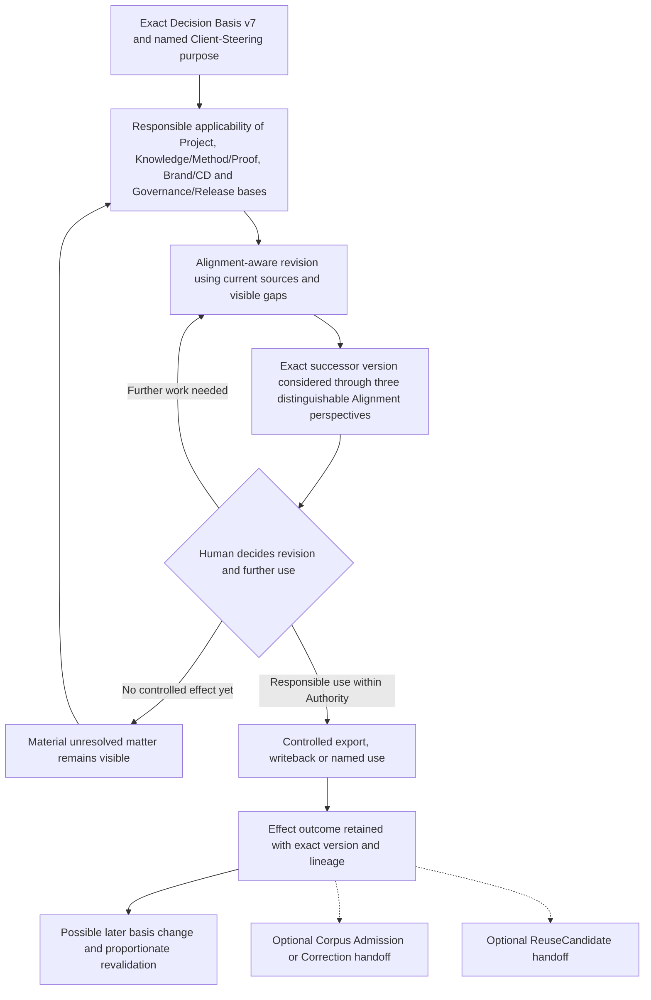

# Consultry — Knowledge/Reuse and Corporate Artifact Alignment Reference Thread v0.1

**Status:** Ratified  
**Date:** 2026-08-04  
**Wayfinder owner:** [Specify the Knowledge/Reuse and Corporate Artifact Alignment Reference Thread](./wayfinder/consultry-product-platform-baseline/tickets/specify-corporate-artifact-alignment-reference-thread.md)

## 1. Purpose and boundary

This Reference Thread tests how Consultry helps a responsible person revise and use one exact client-facing Work Artifact while preserving applicable firm knowledge, method, proof, brand, design, rights and release constraints.

It continues the already ratified Active-Project scenario: the `ERP Wave-1 Readiness Recommendation / Client Steering Decision Basis v7` contains a Go claim whose prior basis conflicts with the current `Reconciliation Report v3`. The artifact responsibility must produce and responsibly use an exact successor version for the upcoming Client Steering.

The scenario exercises an existing artifact and its responsible revision. Whether and how that artifact is synchronized remains a case and PoC parameter. The same Corporate Artifact Alignment obligation also applies to newly created Work Artifacts, but this thread does not add a second scenario merely to prescribe a separate workflow.

This is not:

- a complete Knowledge/Reuse Journey;
- a universal document lifecycle or final Corporate Artifact Alignment contract;
- a CMS, publishing, DMS or Proposal module definition;
- a technical connector, storage, graph, Agent, Skill or Model Bridge design;
- an automatic Approval, Client Acceptance, Corpus Admission or Reusable-Asset flow.

## 2. Ratified thread summary

| Decision area | Ratified position |
|---|---|
| Scenario anchor | The ratified `Decision Basis v7` and `Reconciliation Report v3` conflict continue into responsible revision of an exact successor version. `v8` is not a canonical label. |
| Responsible Job | Produce a purpose-fit successor version for Client Steering with applicable corporate context and material open issues visible, then take responsibility for its concrete use or effect within granted Authority. |
| Completion | Exact successor version, human disposition of applicable material alignment concerns, and controlled use/export/writeback outcome. This is not Client Acceptance, Corpus Admission or `ReusableAsset` release. |
| Alignment behavior | Consultry supports alignment-aware creation/revision and considers the exact intended-use version before controlled effect; it is not only a post-hoc checker. |
| Alignment basis | Every result is relative to the exact version, purpose/audience and applicable Project/Evidence, Knowledge/Method/Proof, Brand/CD and Governance/Release basis. There is no abstract absolute “aligned”. |
| Evaluation depth | The three Alignment perspectives remain distinguishable and material open issues remain visible. No universal result taxonomy, score, traffic light, threshold or disposition menu is ratified here. |
| Human-AI boundary | AI may propose context, bases, content, comparisons, Findings and corrections. A human remains responsible for applicability, material use, disposition, Authority and actual effect. |
| Effect boundary | The exact version, purpose, destination, responsible actor and effect outcome remain connected. No autonomous send or silent overwrite. |
| Drift | Later basis change creates possible impact and revalidation need, not automatic rewriting or universal invalidation. |
| Learning and reuse | Corpus Admission/Correction and `ReuseCandidate` are two separate optional follow-ups. Neither is part of artifact completion or automatic. |
| Archetypes | A Boutique may support Single-Human Responsible Completion; a Growing Specialist Consultancy may distribute contributions and reviews while keeping one explicit artifact/effect accountability. |
| Flow fidelity | Business meaning and boundaries are ratified; detailed ordering, UI, automation cadence, Agent choreography and technical effect mechanism remain PoC questions. |

## 3. Concrete scenario, Job and current comparator

### 3.1 Scenario fixture

| Element | Current fixture | Meaning and limit |
|---|---|---|
| Existing Work Artifact | `ERP Wave-1 Readiness Recommendation / Client Steering Decision Basis v7` | Exact client-facing Consultancy Work Artifact under revision. |
| Material conflict | `Reconciliation Report v3` no longer supports the existing unqualified Go claim based on `v2`. | Already ratified in the Active-Project Reference Thread. |
| Intended purpose | Support the responsible Consultancy Recommendation in the upcoming Client Steering. | The Consultancy artifact does not decide Client Go/No-Go or create a Waiver. |
| Successor | A traceable exact successor version; its identifier is a case fact, not fixed here as `v8`. | Revision does not silently overwrite `v7`. |
| Current Project basis | Current applicable Project Sources, Evidence and governing Acceptance Criterion. | Exact real sources and versions must be selected in a PoC or validation case. |
| Firm basis | Applicable approved Target-Consultancy Knowledge, Method, Terminology and Proof. | Only the material that is actually applicable to this purpose is used; firm content is not automatically true or current. |
| Brand/CD basis | Applicable approved client-facing language, structure, template and visual rules of the Target Consultancy. | Consultry's own App design system is not the consultancy's Brand/CD authority. |
| Governance/Release basis | Applicable confidentiality, IP, usage-rights, provenance/citation, source-use, approval and external-use constraints. | A positive content result cannot compensate for restricted use. |
| Effect target | Use of the exact successor as the updated Consultancy decision basis or Recommendation for the upcoming Client Steering. | This is a scenario fixture, not a separate Product decision; export/writeback destination, DMS, connector and format remain PoC parameters. |

### 3.2 Preconditions

- legitimate access to the Project and Work-Artifact context for the named purpose;
- an identifiable exact current artifact version, or an explicit inability to establish it;
- current relevant Sources or visible missing/conflicting Source conditions;
- an identifiable person responsible for the artifact's Consultancy use and effect;
- potential firm Knowledge/Method/Proof, Brand/CD and Governance/Release bases are available for applicability review, or their absence is visible;
- AI access, synchronization or generation changes neither the authority of an originating record nor Business Authority or Corpus status.

### 3.3 Recurring Job

Revise or create an important client-facing Work Artifact using the right current Project and firm context, recognize material knowledge, method, proof, brand, design, rights or release issues before use, and produce a responsible, traceable effect without recreating context manually or obscuring unresolved concerns.

### 3.4 Comparator hypothesis

The likely current route spans project files, PowerPoint or Word, DMS/shared drives, email/chat, status material, method decks, templates, brand guidance and senior memory. A Consultant or Principal may manually locate current sources, reconcile versions, copy prior material, ask an expert, correct formatting and claims, check what may be shown to the Client, export a file and coordinate the final use.

This is a Discovery hypothesis, not an observed baseline for either archetype. Real validation must capture the last comparable artifact, involved people and tools, source-search and production effort, review/rework, defects found late, effect failures and applicable Authority.

## 4. Shared semantic thread

The diagram is semantic navigation, not a mandatory screen sequence, state machine, workflow engine or Agent loop.

## 5. Purpose- and basis-bound Corporate Artifact Alignment

There is no context-free Alignment status. The exact version is considered for a named purpose and audience against the bases that a responsible person determines to be applicable.

| Perspective | Minimum business question in this scenario | Explicit boundary |
|---|---|---|
| **Knowledge Alignment** | Does the successor remain current, evidence-grounded and semantically consistent with the applicable current Project Evidence and governing criterion as well as approved firm Knowledge, Method, Terminology and Proof? | Retrieval relevance or model plausibility alone is not enough; an AI answer does not amend the corpus. |
| **Brand and Corporate Design Alignment** | Does the successor follow the applicable approved client-facing language, structure, template and visual rules of the Target Consultancy? | Visual conformity does not establish knowledge correctness or permission to release. |
| **Governance and Release Alignment** | Is the intended content and use consistent with applicable confidentiality, IP, usage-right, provenance/citation, source-use, approval and external-use constraints? | Permission does not establish knowledge correctness or Brand/CD conformity. |

Consultry may propose the relevant basis and surface conflicts, omissions or possible changes. The responsible person confirms or corrects applicability in the work context. Missing, stale, unclear or conflicting bases remain visible rather than producing an invented positive result.

The three perspectives remain independently visible. This thread intentionally does not decide common result enums, aggregate scoring, colors, detailed materiality thresholds, universal blockers, disposition menus or exact approval policy.

## 6. Alignment-aware work and exact-use-version consideration

Corporate Artifact Alignment supports two functional moments:

1. **During creation or revision:** applicable knowledge, method, proof, terminology, Brand/CD and release context informs the work and material concerns can be surfaced while the artifact evolves.
2. **For the intended-use version:** the exact proposed successor is considered against the confirmed bases before its controlled use or effect.

This distinction prevents the Product from becoming only an after-the-fact checker while avoiding a premature decision about live checking, batch checking, check frequency, interaction pattern or mandatory gates.

## 7. Responsibility and archetype variation

The thread requires responsibility contexts, not fixed Product roles, job titles or permission groups.

| Responsibility context | Contribution |
|---|---|
| Work-Artifact/Delivery responsibility | Owns the intended Consultancy use, the exact successor version, material disposition and the resulting effect within Authority. |
| Source/Evidence contribution | Supplies or tests current Project Evidence and Source applicability without automatically owning the artifact or Client decision. |
| Knowledge/Method/Proof contribution | Supplies applicable firm knowledge, method, terminology, proof or correction without automatically approving the artifact. |
| Brand/CD contribution | Supplies applicable language, template, structure and visual guidance where needed. |
| Governance/Release contribution | Clarifies applicable rights, confidentiality, approval and external-use constraints where needed. |
| Client participation and Authority | May supply Evidence, feedback or constraints; competent Client Authority alone owns actual Client Go/No-Go, Waiver or Risk Acceptance. |
| Knowledge/Practice follow-up | Owns a separate later Corpus or Reuse decision if one is proposed. |

### 7.1 Partner-led Specialist Boutique

One Partner, Principal or Senior Consultant may carry Work-Artifact, Delivery, Knowledge/Method, Brand and release responsibility contexts within their actual Authority. Consultry must make the context and sources usable enough for that one person to complete the Consultancy result responsibly with AI assistance. It must not invent a second employee or universal four-eyes rule.

A second human joins only when expertise is actually needed or an applicable governing rule requires independent review, approval or Separation of Duties.

### 7.2 Growing Specialist Consultancy

Artifact authoring, Project Evidence, Practice/Method, Quality/Brand and Governance/Release contributions may be distributed across people, teams and connected systems. Consultry preserves exact context, unresolved issues and accepted contribution/handoff without turning contributors into automatic Approvers.

One explicit Work-Artifact/Delivery responsibility remains accountable for the exact successor version and its intended Consultancy use. Local job titles remain tenant context rather than Product Canon.

## 8. Nominal path

1. The responsible person opens or brings the exact `Decision Basis v7` into the named Client-Steering work context; synchronization changes neither the authority of an originating record nor Business Authority or Corpus status.
2. Consultry connects or proposes current Project Sources and the potentially applicable Knowledge/Method/Proof, Brand/CD and Governance/Release bases.
3. The responsible person confirms or corrects applicability sufficiently for the work; unresolved basis gaps remain visible.
4. Consultry supports revision of the Go claim and related content, structure and presentation using source-visible context. The exact successor version remains traceable to `v7`, `Reconciliation Report v3`, the governing criterion and material human edits.
5. The successor is considered through the three distinguishable Alignment perspectives. AI may surface concerns and propose corrections; material open matters remain visible.
6. The responsible person determines whether further work or input is needed or whether the exact version may be used for the intended purpose within Authority. No universal disposition menu is implied.
7. A controlled effect records the exact version, named purpose and destination, responsible actor and actual success, failure or still-pending outcome. Client decision and acceptance remain separate.
8. Later changes may create a proportionate revalidation need. Corpus and Reuse follow-ups remain optional and separately owned.

## 9. Negative, off-nominal and recovery paths

| Situation | Required responsible behavior |
|---|---|
| Exact artifact version cannot be established | Do not imply reliable Alignment; identify or reconstruct the intended subject/version, or hold the effect. |
| Proposed basis is wrong or not applicable | Human corrects applicability; retain enough lineage to explain what informed the revision. |
| Current sources are missing, stale or contradictory | Keep the uncertainty visible, obtain targeted evidence or use a bounded/conditional result appropriate to the purpose; do not fabricate support. |
| Source changes while revision is underway | Reconsider the affected exact version; do not silently treat an earlier check as current. |
| Knowledge/Method/Proof concern remains material | Revise, obtain expertise, correct the basis or hold/route the intended use within actual Authority. |
| Brand/CD deviation exists | Correct it or handle it according to the applicable purpose and authority; visual deviation neither proves nor disproves content. |
| Governance/Release basis restricts use | Remove or replace restricted content, change the intended use, obtain the required authorization or hold the effect. Other positive Alignment perspectives cannot override the restriction. |
| AI Finding is false or immaterial | Responsible person corrects/refutes it with visible rationale; AI disagreement does not create an Approval requirement. |
| Writeback/export fails or target changed | Preserve the prepared exact version and failure outcome; retry, choose a permitted alternate effect or hold. Never record a false success or overwrite silently. |
| Responsible person lacks needed Authority | Route or hand off the effect decision with the exact version, basis and unresolved issue; participation or expertise does not manufacture Authority. |
| New material basis appears after use | Preserve history; assess impact on future or repeated use and reaffirm, correct/revise or withdraw the affected version as appropriate. |
| No Corpus or Reuse value exists | Complete the artifact thread without manufacturing a learning or productization case. |

## 10. Human-AI contribution and Product surfaces

| Consultry/AI may | Humans remain responsible for |
|---|---|
| identify the exact artifact context and propose applicable bases; | confirming the actual purpose, subject/version and basis applicability; |
| retrieve, compare and summarize current sources, methods, proof and rules; | accepting Source applicability and resolving material ambiguity; |
| draft and revise content, structure, terminology and presentation; | the material Consultancy claim, intended use and exact successor selected through human disposition; |
| surface possible knowledge, Brand/CD and Governance/Release concerns; | disposition for the intended use and any remaining risk within actual Authority; |
| suggest experts, corrections, alternatives and consequences; | choosing whether another human is needed and owning the next action; |
| prepare a controlled export/writeback and retain provenance; | initiating or confirming the actual effect within Authority; |
| identify later change and possible impact; | revalidation, correction or withdrawal for future use. |

The guided, object-/work-centered Consultry App is the default experience. The optional Harness may expose deeper source, run and expert-work controls over the same artifact, basis, Authority, disposition and effect semantics. It grants no additional business rights.

## 11. Controlled effect boundary

Artifact alignment, human disposition and responsibility for the intended use, and actual effect remain distinguishable. A controlled export, writeback or named use retains at least:

- the exact successor version;
- intended purpose and destination;
- responsible acting person within Authority;
- success, failure or pending effect outcome;
- lineage to the prior version and material bases;
- material open alignment concerns and their responsible human disposition for the intended use.

There is no autonomous send, silent overwrite or universal Approval requirement. Consultry does not thereby make itself authoritative for the destination record.

The concrete PoC may use a file export, a versioned writeback into a named Project location or another bounded effect. Format, connector and target-system mechanics remain technical choices.

## 12. Drift, revalidation and withdrawal

A later material Source, Method, Proof, Template, Brand or release-rule change does not rewrite the historical artifact or prior effect. It may create an impact question for a pending or newly intended use of the exact version.

The responsible person may reaffirm the version for the named purpose, produce a correction or successor, or withdraw the version from future use. No universal automatic invalidation follows from every upstream change.

Detection mechanics, affected-set calculation, thresholds, notifications, scheduling and UX remain open for PoC learning and the later Corporate Artifact Alignment contract.

## 13. Separate optional corpus and reuse follow-ups

Artifact completion is not knowledge or productization completion.

### 13.1 Corpus Admission, including an admitted correction

If the work exposes a generalizable firm-knowledge correction or accepted learning, a responsible Knowledge/Practice decision may consider an exact new or correcting knowledge version for future approved corpus use. Technical ingestion, indexing, synchronization or successful artifact use is not Corpus Admission and does not mutate prior corpus history.

### 13.2 ReuseCandidate

Two already distinguished origins may lead into the same separate Knowledge/Practice handoff: a human-confirmed Cross-Project Overlap/Redundancy/Conflict/Synergy Candidate from the Active-Project thread, or a transferable solution, method, template or blueprint element recognized while completing this artifact. A human may propose a `ReuseCandidate`; the raw client artifact and Evidence do not become a `ReusableAsset`.

Before any later release, the candidate requires abstraction, a De-Identification assessment and required de-identification, fachliches review and Contract/IP/Confidentiality/Usage-Rights assessment. Only a separate responsible decision may release an exact governed version under the already ratified `ReusableAsset` boundary. A concrete `ReuseApplication` and outcome learning remain separate decisions and belong to later Journey depth.

One artifact may lead to neither, either or both optional follow-ups. This thread does not ratify a complete Finding taxonomy, Asset Studio, service-productization process or commercial outcome claim.

## 14. Thread-level Acceptance Intent

This Reference Thread asks:

> Can a responsible person revise this exact client-facing Work Artifact with the applicable Project and firm context, keep material Knowledge, Brand/CD and Governance/Release concerns visible, and complete a controlled purpose-fit effect with acceptable net effort compared with the realistic current alternative?

Evidence collection should compare at least:

- time and effort spent finding and reconciling relevant sources and bases;
- material issues found before versus after intended use;
- human review, correction and false-positive effort;
- avoidable rework and context requests;
- version, source and effect traceability;
- whether a single responsible Boutique user can complete the work when no second person is required;
- whether distributed contributors in a Growing Specialist Consultancy can participate without losing accountability;
- whether optional Corpus or Reuse follow-ups remain responsible rather than automatic.

No quantitative threshold, Product Effect, willingness-to-pay claim or Technical Validation Slice selection is ratified here. Current Consultry effect and compounding value remain unvalidated.

Transfer of the same obligation to newly created Work Artifacts remains a Product-Scope requirement but is not empirically covered by this single Reference-Case Acceptance Intent.

## 15. Deliberately open for PoC and later contracts

- exact source system, DMS/project location, file format and writeback mechanism;
- net-new versus synchronized-artifact interaction differences beyond the shared functional obligation;
- inline/live, requested or milestone-based Alignment timing;
- result taxonomy, scores, traffic lights, thresholds and blocking rules;
- detailed finding, disposition, approval, waiver and Separation-of-Duties policies;
- UI, queues, notifications, collaborative review and correction experience;
- Agent, Skill, graph/loop, Model Bridge, validation and Harness implementation;
- full Record Authority, Corpus lifecycle, ReusableAsset lifecycle and ReuseApplication Journey;
- finalized Acceptance metrics, first prototype selection and Product Horizon.

These open points are not hidden scope. They remain downstream because their useful detail depends on practical prototype observation or broader cross-cutting contracts.
