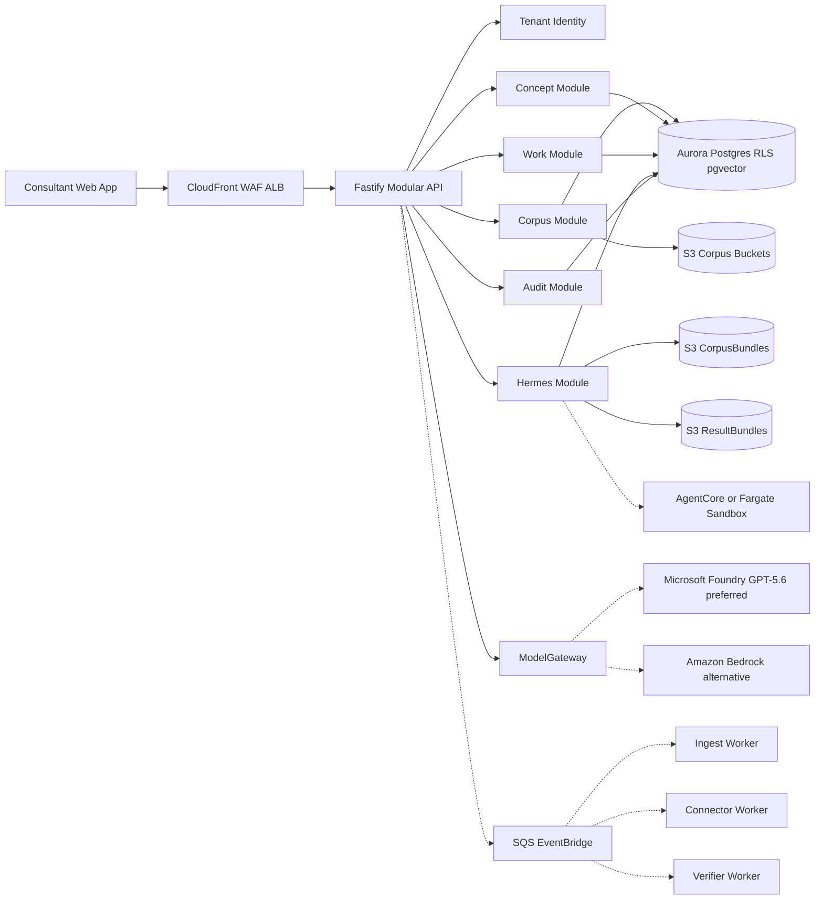
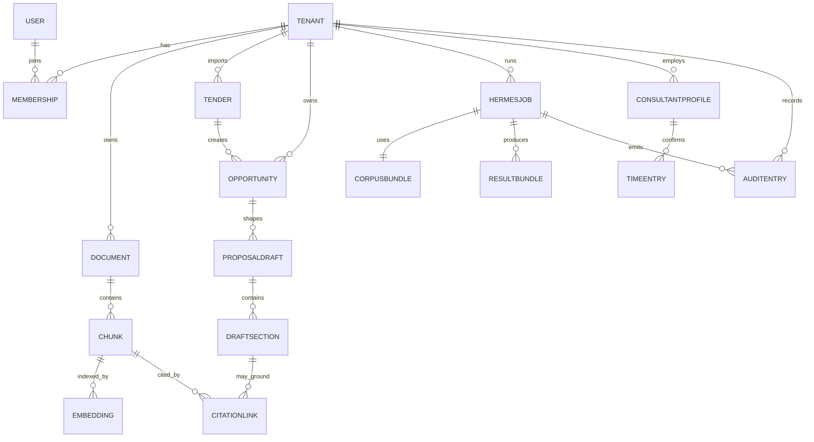
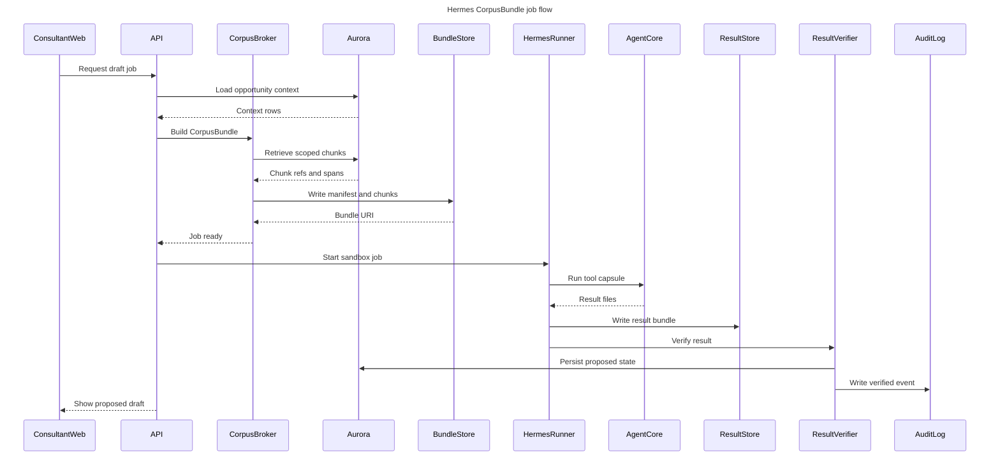
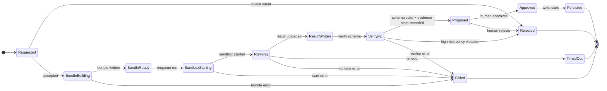

# Consultry - MVP Backend, IaC & Software Design v1.0

**Status:** Technical-Handoff-Tiefenplan. Keine aktuelle WBS- oder Implementierungsfreigabe; fachlicher Scope wird zuerst im Product Wayfinder ratifiziert.  
**Datum:** 27.06.2026  
**Rolle im Doc-Stack:** Konkretisiert Backend, Infrastruktur, IaC, Validierungsloops und WBS fuer den AWS-nativen MVP mit Hermes Harness.  
**Bezug:** [MVP-PRD](../archive/superseded-product-baseline-2026-08/Consultry-MVP-PRD-v1.0.md), [Alignment Control Plane](./Consultry-Alignment-Control-Plane-v1.0.md), [MVP Architecture ADR](./Consultry-MVP-Architecture-ADR-v1.0.md), [Business-Domain-Definition](./Consultry-Business-Domain-Definition-v1.0.md), [MVP-Technical-Foundation](./Consultry-MVP-Technical-Foundation-v1.0.md), [AWS & Hermes Architecture](./Consultry-MVP-AWS-Hermes-Architecture-v1.0.md), [Virtual Harness & Second Brain Refinement](./Consultry-MVP-Virtual-Harness-Second-Brain-Refinement-v1.0.md), [Grill-Me Backend/IaC](../archive/superseded-product-baseline-2026-08/Consultry-MVP-Backend-IaC-Grill-Me-v1.0.md).

**FigJam Board:** https://www.figma.com/board/yrvsmZHxeNo7GoypjfagrI  
Enthaelt editierbare Sichten: Backend/Hermes-Architektur, Hermes-CorpusBundle-Sequenz, Core-ERD, HermesJob-State-Machine, Virtual Harness + Second Brain.

> **Kurzfassung.** Der MVP wird als AWS-native, tenant-isolierte, testbare Work-Layer-Plattform gebaut: ein modularer TypeScript-Backend-Monolith auf ECS Fargate, Aurora PostgreSQL Serverless v2 + pgvector als deterministische Daten- und Retrieval-Basis, S3/KMS fuer Korpus- und Hermes-Bundles, bevorzugt Foundry/GPT-5.6 hinter `ModelGateway` (`gpt-5.6-sol` für komplexe PMF-kritische Jobs; Bedrock als Alternative), Terraform fuer wiederholbare Infrastruktur, und Hermes als austauschbare Sandbox-Runtime mit job-scoped CorpusBundle statt freiem Korpuszugriff.

> **Provider-Baseline 12.07.2026:** Dieses Dokument konkretisiert weiterhin die AWS-/Bedrock-Referenzimplementierung. Auf Product-/MVP-Ebene ist **Microsoft Foundry / Azure AI Foundry mit GPT-5.6 bevorzugt** (`gpt-5.6-sol` für PMF-kritische komplexe Jobs); Bedrock bleibt Alternative/Fallback. Domain-Module nutzen `model_policy_id`; ein Foundry-Adapter/-Deployment benötigt separate Azure-IaC-, Identity- und Network-Pakete. Diese Datei darf deshalb nicht als bevorzugte Providerentscheidung gelesen werden.

---

## 1. Autoritatives Vision Statement

**Consultry Work Layer v1:** Consultry ist nicht nur eine UI fuer Beratungen. Consultry ist die agentenlesbare und menschlich kontrollierte Arbeitsschicht, die Firmenwissen, Dokumente, Projektartefakte, Projekterfahrung, Consultant-Profile, Sales-Angebote, Vertraege, Marketing-/Brand-Artefakte und daraus abgeleitete Wissensobjekte ausrichtet. Rohquellen bleiben unveraendert, abgeleitete Artefakte sind versioniert, zitiert, auditierbar und durch Menschen freigegeben. Agenten duerfen strukturieren, pruefen und vorschlagen; sie machen den Firmenkorpus nutzbar, aber schreiben keinen verbindlichen Zustand ohne Approval.

**Karpathy-Check:** Das ist kompatibel mit Karpathys juengerem "LLM wiki"/work-layer Denken: nicht nur Chat/UI, sondern ein persistent gepflegter Wissens- und Operations-Layer mit Rohquellen, abgeleiteter Wiki-/Schema-Schicht, Linting, Querying und menschlicher Kontrolle. X wurde geprueft; der X-Post selbst war im Browser nicht voll extrahierbar, die oeffentlich erreichbare Karpathy-Gist-Version wurde als zitierbare Arbeitsquelle genutzt.

---

## 2. Entscheidungen

| ID | Entscheidung | Empfehlung fuer MVP |
|---|---|---|
| B1 | Plattform | AWS-native MVP in `eu-central-1` gemaess ADR-001; keine Hybrid-Mischung aus Neon + AWS fuer den Pilot. |
| B2 | Datenbank | Aurora PostgreSQL Serverless v2 + pgvector ersetzt Neon gemaess ADR-001. RLS, graph-ready relationales Schema sowie Evidence-/Review-State und optionale CitationLinks bleiben erhalten. |
| B3 | Backend-Form | Modularer TypeScript-Monolith, getrennte Worker, keine Microservice-Zerlegung vor PMF. |
| B4 | Backend-Framework | **Fastify + Kysely + Zod/OpenAPI** statt schwerer Framework-Magie. Grund: RLS/Transaktionen/SQL muessen sichtbar und testbar bleiben. |
| B5 | Auth | Amazon Cognito fuer Identity/OIDC; Tenant/RBAC/Seats bleiben in Aurora, nicht in Cognito-Gruppen. |
| B6 | Async | SQS fuer Jobs, EventBridge fuer Zeittrigger, Step Functions nur fuer laengere koordinierte Workflows mit klarer Retry-/Timeout-Logik. |
| B7 | IaC | Terraform, nicht CDK, weil der Auftrag planbare `plan`-/Policy-Validation verlangt und die Infrastruktur reviewbar bleiben soll. |
| B8 | Hermes Runtime | `HermesRunner` Interface mit AgentCore Code Interpreter als bevorzugtem Pfad und ECS Fargate Sandbox als Fallback; immer bounded nach ADR-002. |
| B9 | AI Boundary | Foundry und Bedrock ausschließlich über `ModelGateway`; Domain-Module/Hermes nutzen nur `model_policy_id`, keine direkten Provider-/Model-Calls. |
| B10 | Testhaltung | TDD fuer Domain und Gates; Integrationstests mit Postgres/Testcontainers und AWS-Mocks; Terraform-Plan-Validation als Merge-Gate. |
| B11 | Virtual Harness | Hermes wird als Virtual Harness Client mit `HarnessPack` modelliert: Corpus, Memory, Tools, Connector-Grants, Capability Tokens und Output Contracts. |
| B12 | MVP Connectors | M365, Google Drive, GitHub, GitLab, local files, SQL/NoSQL DBs, Clay und Apollo sind als read-only/snapshot Connectoren Teil des Harness-Substrats; Jira/Atlassian/Confluence und ServiceNow sind H2-nahe Project-Intelligence-Connectoren. Keine autonome Schreib-/Outreach-/Ticket-Mutation im MVP. |
| B13 | Skill Graph | Skill-, Projekt-, Zertifikats- und Referenzwissen wird als source-bound Graph/Triple/Hypergraph gespeichert und fuer TeamShape nur anonym/aggregiert projiziert. |

---

## 3. Ziel-Repository-Struktur

```text
consultry/
  apps/
    web/                         # Next/React Produkt-App, spaeter aus marketing-site getrennt
    api/                         # Fastify API, modularer Monolith
    workers/
      ingest-worker/
      connector-worker/
      hermes-worker/
      verifier-worker/
  packages/
    domain/                      # Aggregate, Commands, Policies, Domain Events
    db/                          # Kysely schema, migrations, RLS helpers
    contracts/                   # Zod schemas, OpenAPI, event payloads
    prompts/                     # prompt_id@version, eval fixtures
    hermes-contracts/            # CorpusBundle, ResultBundle, ToolCapsule schemas
    testing/                     # shared test builders, fixtures, corpus cases
  infra/
    terraform/
      modules/
        network/
        security-baseline/
        kms/
        s3-corpus/
        aurora/
        cognito/
        ecs-service/
        queues/
        bedrock-endpoints/
        hermes-runtime/
        observability/
        ci-oidc/
      environments/
        dev/
        staging/
        prod/
  product-definition/
  marketing-site/
```

**Warum diese Struktur:** Sie trennt Produktlogik, Laufzeitadapter und Infrastruktur. Der Monolith bleibt schnell zu bauen, aber jedes spaetere Herausloesen eines Workers oder Moduls hat bereits klare Grenzen.

---

## 4. Backend-Bounded-Contexts

| Kontext | Owner im Code | Tabellen / Artefakte | Hauptbefehle | Harte Tests |
|---|---|---|---|---|
| Tenant & Identity | `IdentityTenantModule` | `tenants`, `users`, `memberships`, `rbac_roles`, Cognito subject mapping | `CreateTenant`, `InviteUser`, `SetWorksCouncilMode` | RLS-Isolation, RBAC matrix, Cognito claim mapping |
| Governance & Audit | `AuditModule` | `audit_entries`, hash chain | `AppendAuditEntry`, `VerifyAuditChain` | append-only, hash chain, no raw corpus logs |
| Corpus | `CorpusModule` | `documents`, `document_versions`, `document_pages`, `chunks` | `RequestUpload`, `IngestDocument`, `ChunkDocument` | page/span stability, content hash, tenant filter |
| Retrieval | `RetrievalModule` | `chunk_embeddings`, `source_bindings`, `source_policies` | `EmbedChunk`, `RetrieveForIntent` | tenant-first filtering, source policy, citation eligibility |
| Tender & Opportunity | `OpportunityModule` | `tenders`, `award_criteria`, `contract_windows`, `opportunities` | `ImportTender`, `ExtractContractWindow`, `QualifyOpportunity` | AwardCriterion parsing, opportunity source requirement |
| Concept | `ConceptModule` | `proposal_drafts`, `draft_sections`, `citation_links`, `review_issues` | `CreateDraft`, `ProposeSection`, `ApproveSection` | risk-based evidence state, faithfulness, human approval |
| Capability & Work | `WorkModule` | `consultant_profiles`, `time_entries`, `personal_notes`, `project_statuses` | `SuggestTimeEntry`, `ConfirmTimeEntry`, `UpdateProfileClaim` | no scoring, WC-mode gate, PersonalNote isolation |
| Hermes | `HermesModule` | `hermes_jobs`, `hermes_job_bundles`, `hermes_results` | `CreateHermesJob`, `BuildCorpusBundle`, `RunHermesJob` | no DB write from sandbox, job-scoped S3/KMS, TTL |
| ModelGateway | `ModelGatewayModule` | model policy + prompt/model call audit in `audit_entries`, prompt registry in Git | `InvokePrompt`, `EmbedText`, `RunGuardrail` | Foundry preferred, `gpt-5.6-sol@2026-07-09` initial complex-work route, Bedrock fallback adapter, exact policy/model/version/quota/budget audit |
| Integrations | `ConnectorModule` | connector metadata, imported raw docs, connector grants, local snapshots | `PollTed`, `ImportM365`, `ImportGoogleDrive`, `ImportGitHub`, `ImportGitLab`, `ImportLocalSnapshot`, `ImportSqlView`, `ImportNoSqlScope`, `ImportClay`, `ImportApollo`, `ImportJira`, `ImportConfluence`, `ImportServiceNow` | read-only, source policy, no writeback, no outreach, no ticket mutation |

---

## 5. Component Model



**Code-Regel:** Module sprechen synchron nur ueber Application Services und Commands. Cross-context Datenzugriff laeuft ueber IDs, Read Models oder Domain Events, nicht ueber fremde Repository-Interna.

---

## 6. Core Data Model

Die voll editierbare ERD liegt im FigJam Board. Die MVP-Kernform:



### 6.1 RLS Contract

Every tenant-scoped table:

```sql
tenant_id uuid not null references tenants(id)
```

Every application transaction:

```sql
begin;
select set_config('app.tenant_id', $1, true);
-- queries here
commit;
```

Required test families:

- Same query with tenant A context never returns tenant B rows.
- Worker jobs set tenant context explicitly before every DB call.
- Missing tenant context fails closed.
- Admin/support flows require explicit break-glass audit entry.

### 6.2 Evidence and SourceBinding Contract

Material output persists with an explicit evidence state. When a source is used, the verifier records:

```text
claim -> evidence_state -> optional CitationLink -> SourceBinding -> Document/Chunk span
```

Rules:

- `Firm-Fact`: tenant-corpus evidence is preferred; missing/conflicting evidence becomes `review_required` for material use.
- `External-Fact`: approved `ExternalSource` plus freshness/faithfulness is required only when Risk-/Tenant-Policy demands it.
- `Model-Expertise`: allowed without citation as suggestion or judgment.
- Classifier uncertainty produces `review_required`, not an automatic fact classification or global persistence block.
- Only unresolved High-Risk externalization/actions may be rejected by Tenant Policy.

---

## 7. Critical Runtime Flows

### 7.1 Hermes CorpusBundle Flow



### 7.2 HermesJob State Machine



### 7.3 Event Vocabulary

| Event | Producer | Consumer | Persisted? | Notes |
|---|---|---|---|---|
| `document.ingest.requested` | API | Ingest Worker | yes | signed upload completed |
| `document.text.extracted` | Ingest Worker | Ingest Worker | yes | page/span extraction ready |
| `document.chunks.indexed` | Ingest Worker | Retrieval | yes | embeddings can start |
| `opportunity.qualified` | Opportunity | Concept | yes | source-bound demand object |
| `hermes.job.requested` | API | Hermes Worker | yes | operator, budget, toolset |
| `hermes.bundle.created` | CorpusBroker | Hermes Worker | yes | manifest hash and S3 prefix |
| `hermes.result.ready` | HermesRunner | Verifier | yes | result bundle exists |
| `draft.section.proposed` | Verifier | Concept | yes | not approved yet |
| `draft.section.approved` | Concept | Audit/Export | yes | human backstop passed |
| `work.timeentry.suggested` | Work Agent | Work | yes | not TimeEntry until confirmed |
| `work.timeentry.confirmed` | Consultant | Work/ProjectStatus | yes | allowed aggregation input |

---

## 8. IaC Design

### 8.1 Terraform Module Stack

| Module | Creates | Validation focus |
|---|---|---|
| `network` | VPC, private/public subnets, route tables, endpoints | no public DB path, endpoint coverage |
| `security-baseline` | CloudTrail, GuardDuty, Security Hub, Config | enabled in every account |
| `kms` | env CMKs, aliases, key policies | tenant/job encryption context allowed |
| `s3-corpus` | raw/extracted/bundle/result/export buckets | block public access, KMS, lifecycle |
| `aurora` | Aurora Serverless v2, subnet group, SG, parameter group | private only, backup, pgvector path |
| `cognito` | user pool, app clients, OIDC settings | identity only, no tenant authz coupling |
| `ecs-service` | clusters, services, task roles, execution roles | least privilege, immutable images |
| `queues` | SQS queues, DLQs, EventBridge schedules | DLQ and retry policy required |
| `bedrock-endpoints` | VPC endpoints for Bedrock/runtime | private model path |
| `hermes-runtime` | AgentCore config or Fargate sandbox | no egress, job-scoped IAM |
| `observability` | logs, metrics, alarms, traces | no raw corpus logging |
| `ci-oidc` | GitHub OIDC role, env deploy roles | no static AWS keys |

### 8.2 Environment Layout

```text
infra/terraform/environments/dev
infra/terraform/environments/staging
infra/terraform/environments/prod
```

Each environment pins provider versions, remote state bucket, lock table and module versions. Prod plans require review and approval.

### 8.3 Terraform Merge Gates

Required in CI:

```text
terraform fmt -check
terraform init -backend=false
terraform validate
terraform test
tflint
checkov or tfsec
terraform plan -detailed-exitcode
opa/conftest policies for public access and IAM breadth
```

Hard policies:

- No `0.0.0.0/0` ingress except ALB 443.
- Aurora `publicly_accessible = false`.
- S3 public access block is mandatory.
- ECS task roles cannot have `*:*`.
- Hermes runtime role cannot call `rds:*`, cannot list all S3 buckets, cannot read app secrets.
- Foundry/Bedrock calls are allowed only from the `ModelGateway` role; Domain modules and Hermes never receive provider credentials.

---

## 9. Self-Validation Loops

### 9.1 Frontend / React

Applies to the future product app and any productionized marketing flow:

- Unit/component: Vitest + Testing Library.
- E2E: Playwright on Chromium/WebKit/Firefox for critical flows.
- Visual checks: Playwright screenshots for Concept Canvas, Approval Card, Tender Board and Work Time-Capture.
- Accessibility: axe or Playwright accessibility checks for keyboard navigation and labels.
- Trace on failure: Playwright trace retained in CI artifacts.
- Contract gate: generated API client/OpenAPI schema must match backend contracts.

### 9.2 Backend

| Layer | Tooling | Gate |
|---|---|---|
| Pure domain | Vitest | command handlers, policies, invariants |
| Route tests | Fastify `inject` + Vitest | auth, validation, status codes, OpenAPI examples |
| DB integration | Testcontainers PostgreSQL with pgvector image | migrations, RLS, Kysely queries, transactions |
| AWS integration | LocalStack where useful, AWS SDK mocks otherwise | S3/SQS/KMS behavior without live account |
| Contract tests | Zod schema fixtures + OpenAPI snapshots | request/event/result compatibility |
| Security regression | custom tests | tenant breakout, missing tenant context, forbidden IAM assumptions |
| AI reliability | golden corpus fixtures | D1 provenance, D2 award parsing, D6 citation faithfulness |

TDD rule:

1. Write failing test for invariant.
2. Implement smallest domain/application code.
3. Add integration test when the invariant crosses DB/AWS boundaries.
4. Add audit assertion for every AI/Hermes path.

### 9.3 Hermes / AI

Golden corpus v0:

- 5 contracts with renewal/options clauses.
- 5 tenders with explicit AwardCriteria.
- 5 proposals/references with Firm-Facts.
- 5 external sources with freshness rules.
- 5 adversarial documents with prompt-injection instructions.

Hermes gates:

- CorpusBundle schema validation.
- SourceMap completeness.
- Result schema validation.
- Claim-to-source faithfulness check.
- Sandbox no-egress check.
- TTL expiration check.
- Result preserves `EvidenceState`; unresolved High-Risk externalization is policy-gated, while internal drafts remain persistable.

### 9.4 IaC

For every Terraform module:

- Unit-like `terraform test` for variable validation and outputs.
- Static policy checks for public exposure and IAM breadth.
- Generated plan review for dev/staging/prod.
- Optional ephemeral dev deployment before staging promotion.

### 9.5 Docs / Creative Coherence

Because Consultry itself is a corpus-alignment product, the docs must be treated like product code:

- `rg` check for source-of-truth conflicts: Neon vs Aurora, agent vs harness, source vs citation.
- Every major architecture doc links to the exact doc it revises.
- Grill-Me doc collects questions and recommended answers.
- Diagrams in FigJam are regenerated when component names or ownership changes.
- Any irreversible choice gets an ADR candidate before becoming locked.

---

## 10. Work Breakdown Structure

Rule: every package below is sized to fit a reviewable change of roughly **500-1000 LOC max**. If implementation exceeds that, split before merging.

### 10.1 Foundation and Repo

| ID | Package | Scope | Max LOC | Acceptance |
|---|---|---|---|---|
| FND-01 | Workspace scaffold | pnpm workspaces, `apps/api`, `apps/workers`, shared TS config | 500 | `pnpm build` empty scaffold passes |
| FND-02 | Backend test harness | Vitest config, test builders, CI script | 500 | sample failing/passing domain test |
| FND-03 | Contract package | Zod schemas, OpenAPI generator skeleton | 700 | schema snapshot test |
| FND-04 | Config package | env parsing, typed config, secrets placeholders | 500 | invalid env fails fast |
| FND-05 | Logging/tracing shell | pino/OpenTelemetry correlation IDs | 700 | request correlation in route test |

### 10.2 Terraform / AWS

| ID | Package | Scope | Max LOC | Acceptance |
|---|---|---|---|---|
| TF-01 | Terraform skeleton | providers, env layout, remote-state variables | 600 | `terraform validate` per env |
| TF-02 | CI OIDC | GitHub OIDC role and deploy-role split | 700 | no static AWS keys required |
| TF-03 | Network module | VPC, subnets, route tables, endpoints skeleton | 1000 | private subnet outputs and endpoint tests |
| TF-04 | Security baseline | CloudTrail, GuardDuty, Config, log archive hooks | 900 | enabled in dev/staging/prod plan |
| TF-05 | KMS module | env key, aliases, base policy | 700 | S3/Aurora roles can use key, wildcard denied |
| TF-06 | S3 corpus module | raw/extracted/bundles/results/exports buckets | 900 | public access blocked, lifecycle set |
| TF-07 | Aurora module | cluster, SG, subnet group, params | 1000 | not public, backup and scaling configured |
| TF-08 | Cognito module | user pool, app client, callback placeholders | 800 | token issuer output consumed by API |
| TF-09 | Queue module | SQS queues, DLQs, EventBridge schedule | 700 | DLQ exists for every queue |
| TF-10 | ECS service module | cluster, service, task role, log group | 1000 | least-privilege task role in plan |
| TF-11 | Bedrock endpoints | PrivateLink endpoints and SG rules | 700 | no NAT required for model path |
| TF-12 | Hermes runtime spike | AgentCore config or Fargate sandbox module | 1000 | no-egress and job role policy proven |
| TF-13 | Terraform policy CI | tflint/checkov/conftest plan gates | 700 | intentional public bucket fixture fails |

### 10.3 Database and Tenancy

| ID | Package | Scope | Max LOC | Acceptance |
|---|---|---|---|---|
| DB-01 | Migration runner | Kysely migration setup and local Postgres | 700 | migrations apply and rollback locally |
| DB-02 | Tenant schema | tenants, users, memberships, roles | 900 | RLS tests for tenant table |
| DB-03 | RLS transaction helper | `withTenantTransaction` and fail-closed guard | 700 | missing tenant context throws |
| DB-04 | Audit schema | audit_entries with hash chaining | 900 | append-only and hash tests |
| DB-05 | Corpus schema | documents, pages, chunks, source_bindings | 1000 | page/span fixture test |
| DB-06 | Vector schema | pgvector extension and embeddings table | 700 | vector query smoke test |

### 10.4 API and Domain

| ID | Package | Scope | Max LOC | Acceptance |
|---|---|---|---|---|
| API-01 | Fastify shell | health, auth hook, tenant context hook | 800 | route tests via `inject` |
| API-02 | Identity/RBAC | membership lookup, role policies | 900 | RBAC matrix tests |
| API-03 | Audit service | append audit from command handlers | 700 | every command fixture emits audit |
| API-04 | Upload API | signed S3 upload intent and document row | 900 | tenant-owned upload flow test |
| API-05 | Corpus ingest command | create ingest job and SQS event | 800 | event payload contract test |
| API-06 | Opportunity API | create/qualify opportunity from source | 900 | material rationale has source or visible review state |
| API-07 | Concept draft API | create draft and sections as proposals | 1000 | proposed state not approved state |
| API-08 | Approval API | approve/reject draft section | 800 | human actor required |
| API-09 | Work time API | suggest/confirm TimeEntry | 900 | suggestion not persisted as TimeEntry |
| API-10 | Consultant profile API | profile claim update and confirmation | 900 | no scoring fields allowed |
| AI-01 | Model policy contracts | `model_policy_id`, provider/deployment/model/version/budget/data-zone/fallback schema + resolver | 800 | Domain fixture cannot set direct model ID |
| AI-02 | Foundry provider adapter | Entra/API auth facade, Responses/Chat invocation contract, usage/audit mapping | 1000 | `gpt-5.6-sol@2026-07-09` mocked contract test |
| AI-03 | GPT-5.6 route eval | Sol baseline plus optional Terra/Luna parity/latency/cost report per operator | 900 | no alternative route without passing eval fixture |
| AI-04 | Bedrock alternative adapter | existing Bedrock invocation behind same ModelGateway contract | 900 | explicit fallback policy and full resolved-model audit |

### 10.5 Workers and Hermes

| ID | Package | Scope | Max LOC | Acceptance |
|---|---|---|---|---|
| WRK-01 | Worker runtime shell | SQS consumer, retries, DLQ behavior | 800 | poison message test |
| WRK-02 | Parser worker v0 | PDF/Office text extraction interface + stub | 900 | fixture document produces pages |
| WRK-03 | Chunker | deterministic page/span chunking | 900 | stable chunk IDs on same input |
| WRK-04 | Embedding worker | ModelGateway embedding call and persistence | 900 | mocked policy-resolved provider response stored |
| WRK-05 | TED polling worker | CPV-filtered read-only import skeleton | 900 | event fixture creates Tender |
| HERM-01 | Hermes contracts | manifest, chunk JSONL, result schemas | 700 | schema fixtures pass/fail |
| HERM-02 | CorpusBroker | scoped retrieval to S3 CorpusBundle | 1000 | no cross-tenant chunks in bundle |
| HERM-03 | HermesJob state machine | status transitions and guards | 800 | invalid transition rejected |
| HERM-04 | HermesRunner interface | AgentCore/Fargate abstraction | 700 | fake runner integration test |
| HERM-05 | AgentCore runner spike | invoke managed sandbox | 1000 | dev account smoke or mocked contract |
| HERM-06 | Fargate runner fallback | no-egress task runner contract | 1000 | IAM and SG assertions |
| HERM-07 | ResultVerifier | schema, SourceMap, evidence/review policy | 1000 | missing source creates review state; only High-Risk externalization may block |
| HERM-08 | Faithfulness eval v0 | claim-source checker with golden cases | 1000 | 20-case mini-eval report |

### 10.6 Product Critical Paths

| ID | Package | Scope | Max LOC | Acceptance |
|---|---|---|---|---|
| WIN-01 | Contract-window extraction | Hermes job from contract bundle | 1000 | clause span required for date |
| WIN-02 | Tender criteria map | AwardCriteria extraction result | 1000 | criteria fixture with weights |
| WIN-03 | Draft section proposal | Hermes result to DraftSection proposal | 1000 | material claims expose evidence or review state |
| WIN-04 | Export MD/PDF v0 | approved draft export | 900 | export excludes unapproved sections |
| WORK-01 | Work-agent summary | daily context to suggestion bundle | 1000 | no PersonalNote leaks |
| WORK-02 | ProjectStatus aggregate | aggregate confirmed TimeEntries only | 900 | no person attribution in default mode |
| WORK-03 | Profile auto-maintenance v0 | upload/M365-derived profile suggestion | 1000 | consultant approval required |

### 10.7 Validation and Release

| ID | Package | Scope | Max LOC | Acceptance |
|---|---|---|---|---|
| VAL-01 | Postgres testcontainers | reusable integration fixture | 600 | RLS tests run in CI |
| VAL-02 | AWS mocks/localstack | S3/SQS/KMS test adapters | 800 | upload and queue tests offline |
| VAL-03 | Golden corpus | seed fixtures and expected outputs | 900 | eval report generated |
| VAL-04 | Prompt injection suite | adversarial corpus chunks | 800 | Hermes ignores corpus instructions |
| VAL-05 | Playwright smoke | app shell, login, upload, draft smoke | 1000 | traces captured on failure |
| VAL-06 | IaC plan gate | plan artifact, policy checks, approvals | 800 | bad fixture fails policy |
| VAL-07 | Security regression | no public DB/S3, IAM breadth tests | 900 | Terraform plan scan passes |
| VAL-08 | Docs coherence check | rg-based source conflict script | 500 | Neon/Aurora conflicts reported |

### 10.8 Virtual Harness, Integrations and Skill Graph Addendum

The detailed WBS lives in [Virtual Harness & Second Brain Refinement §9](./Consultry-MVP-Virtual-Harness-Second-Brain-Refinement-v1.0.md#9-wbs-addendum) and keeps every item within the same 500-1000 LOC rule. It adds:

- `VH-*`: HarnessPack, ToolRegistry, MCPGateway, LocalHarnessRelay, DOCX Worker, DB connector, MemoryPack builder.
- `HG-*`: graph assertion schema, triples, hyperedges, graph pack builder, bounded traversal helpers, graph export adapter.
- `SG-*`: skill taxonomy, skill claims, skill hyperedges, anonymous TeamShape projection.
- `INT-*`: M365, Google Drive, GitHub, GitLab, local files, SQL, NoSQL, Clay, Apollo read-only/snapshot connector packages.
- `PI-*`: Jira/Confluence/ServiceNow Project Intelligence packages for ProjectWorkItems, SymbiosisLinks, RedundancyFinding and InternalPlanDraft.

Hard boundary: these connectors feed Corpus/Second Brain/Harness packs. They do not create autonomous outbound, writeback, ticket mutation, code modification, CRM mutation or Clay/Apollo sequence execution in the MVP.

---

## 11. ADR Status / Candidates

Accepted now:

1. **ADR-001 AWS-native data layer:** Aurora PostgreSQL Serverless v2 + pgvector replaces Neon for MVP. See [MVP Architecture ADR](./Consultry-MVP-Architecture-ADR-v1.0.md).
2. **ADR-002 Hermes bounded harness boundary:** Hermes is not an autonomous agent runtime. See [MVP Architecture ADR](./Consultry-MVP-Architecture-ADR-v1.0.md).

Still candidates:

3. **ADR-BE-001 Backend stack:** Fastify + Kysely + Zod for RLS-visible modular monolith.
4. **ADR-IAC-001 Terraform as IaC standard:** Terraform with plan/policy gates over CDK.
5. **ADR-HERMES-001 Hermes runtime abstraction:** AgentCore preferred, Fargate fallback mandatory.
6. **ADR-WORK-001 Work Layer source hierarchy:** raw sources, compiled assets, recommendations, approvals and audit as separate layers.

---

## 12. Non-Goals

- No autonomous external action chain.
- No direct AI write into Aurora.
- No person-specific staffing or performance scoring.
- No open web access from Hermes.
- No tenant-wide corpus search from Hermes.
- No Bedrock Knowledge Bases as source-of-truth gate in MVP.
- No Graph DB before a specific traversal feature proves the need.
- No H3 "Operating System" scope in the MVP UI narrative.

---

## 13. Source Basis

- Karpathy public X/profile check and accessible LLM-wiki gist: https://x.com/karpathy, https://gist.github.com/karpathy/442a6bf555914893e9891c11519de94f
- AWS Aurora PostgreSQL + pgvector: https://docs.aws.amazon.com/AmazonRDS/latest/AuroraUserGuide/AuroraPostgreSQL.VectorDB.html
- Amazon Bedrock VPC endpoints: https://docs.aws.amazon.com/bedrock/latest/userguide/vpc-interface-endpoints.html
- Amazon Bedrock Guardrails: https://docs.aws.amazon.com/bedrock/latest/userguide/guardrails.html
- Amazon Bedrock AgentCore Code Interpreter: https://docs.aws.amazon.com/bedrock-agentcore/latest/devguide/code-interpreter-tool.html
- Amazon ECS task roles: https://docs.aws.amazon.com/AmazonECS/latest/developerguide/task-iam-roles.html
- Terraform CLI validation/test/plan docs: https://developer.hashicorp.com/terraform/cli/commands/validate, https://developer.hashicorp.com/terraform/cli/commands/test, https://developer.hashicorp.com/terraform/cli/commands/plan
- Playwright Test docs: https://playwright.dev/docs/intro
- Vitest docs: https://vitest.dev/guide/

---

*Ende v1.0 - naechster Schritt: Backend-/IaC-Kandidaten entscheiden und dann Build-Tickets aus WBS schneiden.*
