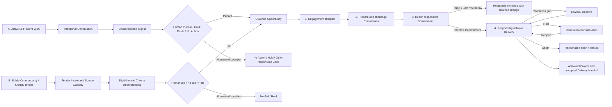

# Consultry Opportunity-to-Project Representative Business Thread v0.1

**Status:** Ratified  
**Date:** 2026-08-03  
**Wayfinder owner:** [Specify the Opportunity-to-Project Representative Business Thread](./wayfinder/consultry-product-platform-baseline/tickets/confirm-the-proposal-aggregate-lifecycle.md)

## 1. Purpose and boundary

This artifact specifies one representative `Opportunity-to-Project` Business Thread through two structurally different Entry Anchor Cases:

1. an additional ERP process/rollout need discovered during active work for an existing Client Organization and pursued as a distinct `Follow-on Project`;
2. a public Cybersecurity/KRITIS Tender from a previously unserved Client Organization and pursued as a new Project.

The thread tests real Jobs, responsible progress, Human-AI collaboration, sources, Blind Spots, negative paths and the Commercial-to-Delivery Handoff. It is not a universal sales funnel, a complete Journey Family, a final object lifecycle, a product-module map or a technical state machine.

Concept/Proposal is an important intermediate Work Artifact and possible early proof milestone. It is not the Product boundary: the nominal path ends only after effective Client Commitment, Delivery Readiness, responsible Project Activation and an accepted Delivery Handoff.

## 2. Ratified thread summary

| Decision | Ratified position |
|---|---|
| Entry contrast | Existing-client ERP Follow-on and net-new public Cybersecurity/KRITIS Tender are two full Entry Anchor Cases. |
| Earliest convergence | Both converge only at a human-accepted `Qualified Opportunity`; neither an Observation, Signal nor Tender creates one automatically. |
| Existing-client nominal outcome | A distinct `Follow-on Project`; ChangeCase, absorption into active work, Hold and No Action remain alternate paths without a universal classification rule here. |
| Shared progress | `Engagement sharpen -> prepare and challenge Commitment -> reach responsible Commitment -> responsibly activate Delivery`. |
| Ownership | Early Delivery participation, later accepted custody transfer; Pursuit/Client-Commitment responsibility remains accountable until Client Commitment. |
| Human-AI | Consultry supports the entire thread as an object-/work-centered, context-aware Co-Worker; AI has no accountable Responsibility, human Approval or binding Business Authority. |
| Product surfaces | Guided Consultry App by default; optional advanced Harness over the same Cases, sources, responsibilities and Authority boundaries. |
| Acceptance | A responsible negative disposition is valid progress; a won pursuit is incomplete until Readiness, Activation and accepted Delivery Handoff. |

## 3. Two entries, one shared progress spine

The four blocks are a navigation spine for comparing the two Cases. They neither require identical intake work nor prescribe an organizational process or software workflow.

## 4. Real Job and current comparator

### 4.1 Shared Job

Recognize or receive a material Client need, decide responsibly whether to pursue it, turn a positive pursuit into a supportable Client Commitment, and transfer the complete decision and delivery context into an activated Project without hiding evidence, assumptions, capacity gaps, responsibilities or unresolved risk.

### 4.2 Existing-client Job

Turn an intentionally captured need from active Client Work into a timely and source-visible pursuit decision and, if pursued, a feasible distinct Follow-on Project that preserves continuity with the originating relationship, Project and knowledge.

### 4.3 Tender Job

Decide whether a relevant formal Tender is worth pursuing and, if so, turn its requirements and evaluation criteria into a defensible, deliverable Commitment and a responsibly activated new Project.

### 4.4 Comparator hypothesis to validate

Current work is expected to span meetings, personal notes, email, Tender portals, Word, Excel, shared drives/DMS, CRM, PSA/PM tools and personal memory. Senior people often reconstruct Client, Project, expert, contract, evidence, capacity and commercial context manually and coordinate Handoffs through calls and documents.

This is an explicit Discovery hypothesis, not an observed baseline for either target archetype. Each real validation must first capture the last actual occurrence, people, systems, elapsed work, rework, quality consequence and authority constraints.

## 5. Entry Anchor A — existing-client ERP Follow-on

### 5.1 Concrete scenario

During an active ERP migration, a Consultant or another participant in Client Work intentionally records an additional process-/rollout need—for example process harmonization, migration readiness, rollout acceleration or a subsequent rollout wave. `Hansa Maschinenbau AG` may remain a fictional pitch/demo name; it is not Domain Canon.

The observation is connected to the active Client, Project, conversation, current commitments, Stakeholder context, delivery facts, methods and available expertise. A responsible person decides whether the matter should become a commercial pursuit, remain within active Delivery, create another responsible Case, be held, merged or receive No Action.

### 5.2 Preconditions

- legitimate active Client Work and purpose-bound access to its context;
- intentional Capture rather than hidden monitoring or person scoring;
- identifiable source, Client and active Project context;
- visible current scope/commitment basis and material known constraints;
- an identifiable Qualification responsibility and an identifiable Delivery/Activation responsibility, even when one Person holds both;
- uncertainty and incomplete evidence may remain visible and must not be silently completed.

### 5.3 Entry-specific nominal path

1. A Person deliberately captures an Observation with Client-, Project- and conversation context.
2. Consultry may connect relevant Project, Contract, Stakeholder, Knowledge, Delivery and Capacity context and expose conflicting or missing information.
3. A human responsibility disposes the matter as `Pursue`, Hold, No Action, Merge or another appropriate path.
4. Only `Pursue/Qualify` establishes a `Qualified Opportunity` and enters the shared progress spine.
5. The nominal pursued outcome is a distinct `Follow-on Project` with retained lineage to the originating Client relationship and ERP work.

### 5.4 Important alternate and recovery paths

- Hold/Defer with a reason and an explicit reconsideration condition;
- No Action/Reject with retained rationale;
- Merge with an existing Signal or Qualified Opportunity without losing either source lineage;
- responsible routing to active Delivery/Change, Knowledge/Reuse, People/Capacity or another Case;
- absorption into existing work or a ChangeCase as scenario alternatives; their universal boundary is deferred;
- revise after Client clarification, feasibility evidence or changed assumptions;
- Client reject, Lost, Withdraw or abort;
- effective Commitment but failed Readiness: resolve gaps, renegotiate/revise, hold or abort rather than activate silently;
- rejected Handoff or context request followed by renewed Readiness and Handoff review.

## 6. Entry Anchor B — net-new public Cybersecurity/KRITIS Tender

### 6.1 Concrete scenario

A public Cybersecurity-/KRITIS-related Tender from a Client Organization not previously served by the Target Consultancy becomes available. The exact contracting authority, scope, Lot, dates, criteria weighting and contract instrument remain fictional scenario details until a real Tender is selected.

The Target Consultancy must understand the authoritative Tender documents and amendments, decide Bid/No-Bid, align the proposed work with its actual evidence and delivery capability, reach an effective Client Commitment if selected, and activate a new Project only when Delivery can accept the Handoff.

### 6.2 Preconditions

- authoritative Tender source and available documents or an explicit Missing-Source state;
- identifiable deadlines, Eligibility criteria, Award criteria, Required Documents and Clarification status where applicable;
- a human Qualification/Bid responsibility;
- applicable Firm Evidence, methods, references, rights, Capability and Capacity may be incomplete but their gaps remain visible;
- no automatic Bid, submission or Opportunity creation.

### 6.3 Entry-specific nominal path

1. Tender documents and amendments are captured with provenance and current version status.
2. Consultry may structure requirements, Eligibility/Award criteria, deadlines, required evidence and uncertainties.
3. A human responsibility decides `Bid`, `No-Bid` or Hold based on Eligibility, fit, materiality, evidence, capability, capacity, timing and risk.
4. Only `Bid` establishes a `Qualified Opportunity` and enters the shared progress spine.
5. The nominal pursued outcome is an effective Award/Commitment followed by a new Project, responsible Activation and accepted Delivery Handoff.

### 6.4 Important alternate and recovery paths

- No-Bid with rationale and optional reconsideration condition;
- Hold/Clarification while authoritative information is missing;
- Merge with an already captured Tender or pursuit while retaining both source histories;
- revise after an amendment, clarification, changed requirement, review issue or negotiated condition;
- Bid withdrawal, Client reject, Lost, cancellation or responsible abort;
- reopen after a material amendment or reissued Tender through a new Qualification decision;
- effective Award/Commitment but failed Readiness: resolve, revise, renegotiate, hold or abort without automatic Activation;
- rejected Handoff or context request followed by renewed Readiness and Handoff review.

## 7. Shared four-block Business Thread

| Progress block | Responsible business progress | Required Consultry behavior | Principal work artifacts / outputs |
|---|---|---|---|
| **1. Engagement sharpen** | Clarify Client Need, desired Outcome, scope, constraints, fit, open questions, affected Client actors and the distinction from existing work where relevant. | Assemble source-visible context; find applicable knowledge or expertise; expose conflicts, uncertainty, missing facts and framing options; preserve the responsible Person's judgment. | Qualified Opportunity; Need/Engagement Frame; Requirements; assumptions; open questions; source/evidence basis. |
| **2. Prepare and challenge Commitment** | Develop and test the proposed solution, delivery approach, evidence, capability/capacity, Commercials and material risks. | Support Concept/Proposal work; map Tender criteria where relevant; retrieve and challenge Firm claims; expose unsupported claims, delivery gaps and counterpositions; support Knowledge, Brand/CD and Governance/Release Alignment as independent checks. | Concept/Proposal versions; criteria/requirement coverage; evidence and expert input; feasibility/capacity basis; Commercial basis; review issues and revisions. |
| **3. Reach responsible Commitment** | Conduct Client exchange, clarification and negotiation; arrive at Accept, Reject, Lost, Withdraw or another responsible disposition. | Maintain source/version/context continuity across revisions and Client feedback; show the effect of changed terms, open issues and responsibilities; never infer Commitment merely from a draft or export. | Client feedback/counterconditions; revised Proposal; accepted/rejected disposition; effective Commitment basis such as Award, accepted Proposal, order/SOW or `ClientContract`, as applicable. |
| **4. Responsibly activate Delivery** | Confirm that the promised work is supportable, establish Delivery Readiness, activate the Project responsibly and transfer custody through an accepted Handoff. | Assemble the Commitment, scope/outcome, assumptions, sources, decisions, risks, Client actors, team/capacity and open issues; expose gaps; support accept, reject or context-request behavior. | Readiness basis; Project identity with full lineage; accepted/rejected Handoff; Activation decision; owned residual issues and next milestone. |

There is no separate mandatory `Internal Externalization Decision` gate or Product Step in this Reference Thread. Actual external actions and binding commitments nevertheless remain attributable to a responsible human within applicable Authority.

## 8. Responsibility, participation and archetype variation

The thread requires responsibilities, not fixed Product roles or job-title entities.

| Responsibility context | Contribution to the thread |
|---|---|
| Source/Capture custody | Preserves what was observed or received, its provenance, version and permitted context. |
| Qualification/Pursuit responsibility | Decides Pursue/Bid, Hold, No Action or No-Bid and remains accountable for commercial progress through Client Commitment. |
| Client/Engagement shaping | Clarifies the Need, intended Outcome, scope, assumptions and Client decision context. |
| Expert/Evidence contribution | Supplies applicable knowledge, methods, references and challenge; contribution creates neither ownership nor Authority automatically. |
| Delivery/Feasibility contribution | Tests capability, capacity, timeline, dependencies, delivery assumptions and risk before Client Commitment. |
| Proposal/Artifact responsibility | Authors, reviews and revises the relevant Work Artifacts and resolves material content issues. |
| Client-side participation | Supplies clarification, feedback, counterconditions, evaluation and authorized acceptance/rejection without implying a generic Client Portal. |
| Delivery/Project responsibility | Establishes Readiness, accepts or rejects the Handoff, activates the Project and owns subsequent Delivery custody. |

### 8.1 Ratified handoff pattern

- Qualification/Pursuit responsibility remains accountable from `Qualified Opportunity` through Client Commitment.
- Delivery/Project responsibility participates early enough to challenge feasibility before Commitment.
- Delivery custody transfers only through Readiness, responsible Project Activation and an accepted Delivery Handoff.
- Case Participation, Responsibility Assignment and Authority Grant remain separate; none implies the others.

### 8.2 Partner-led Specialist Boutique

A Partner/Principal may carry Pursuit, Client relationship, expert, artifact and Delivery responsibilities while a Consultant contributes the original Observation or specialist work. The Product must reduce missing-function burden and context reconstruction without pretending that responsibilities, Authority and handoffs disappear. A same-person Handoff is a visible Responsibility Context switch, not an artificial requirement for another employee.

### 8.3 Growing Specialist Consultancy

Account/Sales/Practice, Bid/Proposal, expert, staffing/capacity and Delivery/Project responsibilities are more likely to be distributed across people, teams and connected systems. The Product must preserve context and accepted ownership across explicit handoffs without requiring those local job titles as technical roles.

Both archetype readings apply to both Entry Anchor Cases; the ERP Follow-on naturally stresses project-to-commercial continuity, while the Tender naturally stresses formal criteria, Evidence and Bid coordination.

## 9. Candidate business objects and source/record authority

These are semantic candidates exercised by the thread, not final Aggregate, persistence or system-of-record decisions.

| Information or object | Business meaning / authority boundary |
|---|---|
| Observation | Evidence that a Person intentionally reported something in a defined context; not Client intent, truth or an Opportunity by itself. |
| Signal | A contextualized indication relevant to a responsible decision; not a decision or automatic Opportunity. |
| Tender and amendments | Authoritative external source for published requirements, criteria, deadlines, Lots and required documents; must retain version/provenance. |
| Project/Client/Contract facts | Remain governed by their applicable native or federated record sources; AI summaries and proposals do not overwrite them. |
| Qualified Opportunity | Human-accepted pursuit with responsible owner, sources/context, sufficient fit/materiality basis and an explicit next decision. |
| Engagement Frame / Requirements | Responsible working interpretation of Need, Outcome, scope, constraints and assumptions; not yet Client Commitment. |
| Concept/Proposal | Versioned Work Artifact supporting a Commitment; a draft or export is not external acceptance. |
| Evidence/Feasibility basis | Source-visible support and open gaps for claims, capability, capacity, delivery and risk; machine judgment is not human acceptance. |
| Client feedback / counterconditions | External input that may change the proposed Commitment and require revision or responsible disposition. |
| Effective Commitment basis | The applicable accepted Proposal, Award, order/SOW, `ClientContract` or authorized change that establishes what is committed; instruments vary by Case. |
| Readiness basis | Visible evidence that scope/outcomes, Delivery responsibility, team/capacity, constraints, assumptions, sources and open issues can support Activation. |
| Project | Distinct accountable Delivery context created with lineage to the Opportunity, sources and effective Commitment; creation alone does not equal Activation. |
| Delivery Handoff | Transfer of responsible Delivery custody that the receiver may accept, reject or return with a context request. |

Consultry must preserve source lineage and distinguish source facts, responsible assessments, proposals, AI contributions and actual decisions. The final native/federated record-authority contract remains a downstream Product decision.

## 10. Human-AI collaboration and Product interaction

| Consultry/AI may | Humans remain responsible for |
|---|---|
| connect Client, Project, Contract, Tender, Knowledge, expert, capability and capacity context; | intentional Capture and permitted sharing of context; |
| extract, structure, compare, summarize and map requirements or criteria; | Qualification, Pursue/Bid, Hold, No Action and No-Bid; |
| propose Need/Engagement framing, Concept/Proposal content and Handoff material; | intended Outcome, scope, material claims and Commercial Commitment; |
| retrieve sources and experts, identify conflicts, uncertainty, stale evidence and rights gaps; | source acceptance, expert judgment, risk acceptance and unresolved material issues; |
| challenge assumptions, criteria coverage, differentiators, capability/capacity and Delivery feasibility; | Client exchange, negotiation and binding business effects; |
| support Knowledge, Brand/CD and Governance/Release Alignment; | responsible use of aligned artifacts and any actual external action; |
| prepare Readiness and Handoff context and expose missing information; | Project Readiness, Activation and Handoff acceptance/rejection; |
| suggest next responsible work and bounded recovery options. | accountable stop, waiver, escalation, recovery and closure decisions. |

The default experience is a guided, object-/work-centered Consultry App. A Codex-like Harness may expose the same work more flexibly to technical users, but it creates no second Case, source, responsibility or Authority world. This Reference Thread does not choose models, agents, prompts, graphs, tools, routing or runtime architecture.

## 11. Blind Spots and Corporate Artifact Alignment exercised here

The thread must make at least the following potential Blind Spots visible without treating AI findings as truth or Approval:

- unclear or contradictory Client Need, requirements or desired Outcome;
- missing, stale or conflicting sources and unsupported material claims;
- Tender Eligibility, Award-criteria or Required-Document gaps;
- misalignment between proposed scope, capacity, capability, timeline and delivery assumptions;
- dependency or risk accepted commercially but not understood by Delivery;
- missing Client actor, decision basis or Commitment condition;
- source/version drift across Concept/Proposal revisions;
- hidden open issues at Project Activation or Delivery Handoff;
- duplicate Signal, Tender or pursuit;
- missing rights, confidentiality or use constraints.

Every synchronized or generated Work Artifact is checked through three independent lenses where applicable:

1. **Knowledge Alignment** — current, evidence-grounded and consistent with approved methods, terminology, offers and proof;
2. **Brand and Corporate Design Alignment** — consistent with approved voice, language, template, structure and visual rules;
3. **Governance and Release Alignment** — consistent with confidentiality, IP, usage-right, source, approval and external-use constraints.

Passing one lens does not imply either of the others, and aligned output never silently changes an authoritative source or enters the knowledge corpus.

## 12. Acceptance Intent and validation evidence

### 12.1 Valid terminal outcomes

For either Entry Anchor, responsible negative progress is valid:

- No-Bid, No Action, Hold, Reject, Lost, Withdraw or Abort with human rationale, retained source lineage, owned open items and an explicit reopen/reconsideration condition where relevant; or
- effective Client Commitment followed by visible Readiness, responsible Project Activation and an accepted Delivery Handoff.

A won Proposal or Tender is not sufficient if Delivery cannot responsibly accept and activate the Project.

### 12.2 What validation must observe

Against the captured current-work baseline, observe at least:

- source and context coverage;
- unresolved material questions, Evidence gaps and Blind Spots;
- accepted, edited and rejected AI contributions;
- manual search, reconstruction and coordination effort;
- elapsed human work and net additional review effort;
- avoidable revisions and restart behavior;
- Handoff context requests, rejection and eventual acceptance;
- responsible Business-state progress and owned residual issues;
- whether role-compressed and distributed users can act without hidden Authority collapse.

Quantitative thresholds belong to later Acceptance and Horizon decisions. One won or activated Case cannot prove increased Win Rate, revenue, retention or Product causality.

## 13. Open cross-cutting Product contracts

This Reference Thread supplies concrete evidence and edge cases to later decisions; it does not resolve them here:

- detailed Case Participation, delegation, Authority, actual-person separation-of-duties and governed exceptions;
- universal Handoff, Commitment, recovery, merge/split/reopen and outcome semantics;
- the general boundary among absorbed work, ChangeCase and Follow-on Project;
- detailed Tender-to-Concept and Existing-Client Sensing branch Journeys;
- native and federated record-authority principles;
- the complete Human-AI meaningful-oversight contract;
- Contextual Task/Skill, Execution Case and Validation/Assurance contracts;
- the Product-facing Model Bridge and Governance contracts;
- Product invariants versus Target-Consultancy variation;
- final Business Object identities, lifecycles, UML/ER and domain canon;
- Product Approach, capability, feature and requirement derivation;
- quantitative Acceptance, validation/MVP Slice and Product Horizons;
- technical graph, agent-loop, Harness, persistence, integration and runtime design.

## 14. Explicit non-decisions

This artifact does not decide:

- a universal CRM pipeline, sales methodology or funnel;
- fixed organizational roles, departments, permissions or workspaces;
- a separate mandatory `Internal Externalization Decision` gate;
- mandatory Client Portal behavior;
- which exact Commitment instrument every Case must use;
- final Project/Change classification rules;
- any technical state machine, data model, Aggregate, event, storage or graph topology;
- the first Technical Validation Slice or Product MVP boundary;
- market evidence, willingness to pay, quantitative productivity, Win-Rate or revenue claims.

## 15. Traceability to existing Product canon

- [Canonical User-Journey Portfolio](./Consultry-Canonical-User-Journey-Portfolio-v0.1.md) — JF-1 and the Opportunity-to-Project Reference Thread boundary.
- [Whole-Consultancy Coverage Ledger](./Consultry-Whole-Consultancy-Coverage-Ledger-v0.1.md) — `GC-1` and `GC-2` Scope Traces and provisional Acceptance Intent.
- [Canonical Product and Business-Domain Language](./CONTEXT.md) — Target Consultancy, Client Organization, Responsibility/Participation/Authority, Qualified Opportunity and Follow-on Project.
- [Priority-Problem Evidence and Assumption Register](./Consultry-Priority-Problem-Evidence-and-Assumption-Register-v0.1.md) — current-workaround hypotheses, experiment obligations and claim limits.
- [UX Operating Model](./Consultry-UX-Operating-Model-v0.1.md) — existing ERP Capture scenario candidate.
- [GTM Decisions](./Consultry-GTM-Decisions-v1.0.md) — existing-client-led default, public Cybersecurity Tender showcase and Dogfood limitation.
- [Deep-Grill Question Bank](./research/wayfinder-deep-audit-2026-08/deep-grill-question-bank.md) — downstream Commercial, Project, Handoff, Human-AI and Acceptance questions.
