# Consultry – Platform Kernel & Product Blueprint Data Model Concept v0.1

**Status:** Technical-Handoff-Candidate zur späteren Modell-Ratifizierung; noch kein Product-Canon-, DDL-, ORM- oder MVP-Scope-Vertrag
**Datum:** 01.08.2026
**Rolle im Doc-Stack:** Konsolidiertes konzeptionelles Datenmodell für den horizontalen Platform Kernel, den ersten `ConsultryProductBlueprint` und tenant-spezifische Implementierungen.
**Bezug:** [Context & Memory](./_CONTEXT-AND-MEMORY.md), [Product Vision](./Consultry-Product-Vision-v1.0.md), [Business Domain Definition](./Consultry-Business-Domain-Definition-v1.0.md), [Technical Foundation](./Consultry-MVP-Technical-Foundation-v1.0.md), [UX Operating Model](./Consultry-UX-Operating-Model-v0.1.md), [Virtual/Local Harness](./Consultry-MVP-Virtual-Harness-Second-Brain-Refinement-v1.0.md), [Project Intelligence & Symbiosis](./Consultry-Project-Intelligence-Symbiosis-Graph-v1.0.md), [Validation-Bounded Skill Agency](../../papers/KnowledgeSources.md).

> **Kernentscheidung.** Der unqualifizierte Begriff **Skill Graph** bezeichnet ab jetzt die first-class Platform-Kernel-Fähigkeit, die kontextuelle Aufgaben mit den passenden versionierten Skill-Definitionen, Abhängigkeiten, Contracts, Tools, Modellen, Autoritäten und Validatoren verbindet. Die evidenzbasierte menschliche/organisatorische Skill-Sicht bleibt als **Capability Evidence View** erhalten.

---

## 0. Visual Gesamtlandkarte und Kernel-Katalog

Die vier ER-Sichten zeigen vorab die wichtigsten Cross-Kernel- und Consultry-Beziehungen; die normalisierte Herleitung und die übrigen ER-Sichten folgen in Abschnitt 13.

### 0.1 Validation, Authority und Effect Admission


```mermaid
erDiagram
    VALIDATION_GRAPH_DEFINITION ||--|{ VALIDATION_GRAPH_VERSION : versions
    VALIDATION_GRAPH_VERSION ||--|{ VALIDATION_GRAPH_NODE : contains
    VALIDATION_GRAPH_VERSION ||--|{ VALIDATION_GRAPH_EDGE : connects
    VALIDATION_GRAPH_NODE ||--o{ VALIDATION_GRAPH_EDGE : source
    VALIDATION_GRAPH_NODE ||--o{ VALIDATION_GRAPH_EDGE : target

    VALIDATION_GRAPH_VERSION ||--o{ VALIDATION_CASE : instantiates
    VALIDATION_CASE ||--|| VALIDATION_CASE_COMPILATION : compiled_from
    VALIDATION_CASE ||--|{ VALIDATION_OBLIGATION : tracks
    VALIDATION_OBLIGATION ||--|{ VALIDATION_CLAIM : contains
    VALIDATION_CLAIM ||--o{ EVIDENCE_REF : supported_or_challenged_by
    ARTIFACT_VERSION ||--o{ EVIDENCE_REF : supplies
    VALIDATION_OBLIGATION ||--o{ VALIDATOR_RUN : invokes
    VALIDATOR_VERSION ||--o{ VALIDATOR_RUN : executes
    VALIDATOR_RUN ||--|| VALIDATION_RESULT : produces
    VALIDATION_RESULT ||--o{ FINDING : reports
    VALIDATION_CASE ||--o{ VALIDATION_DECISION : decided_by
    VALIDATION_CASE ||--o{ VALIDATION_ATTESTATION : attests
    VALIDATION_ATTESTATION ||--o{ INVALIDATION_EVENT : invalidated_by

    PRINCIPAL ||--o{ MEMBERSHIP : holds
    ROLE ||--o{ MEMBERSHIP : assigned_as
    PRINCIPAL o|--o{ AUTHORITY_GRANT : direct_subject
    ROLE o|--o{ AUTHORITY_GRANT : role_subject
    PRINCIPAL ||--o{ DELEGATION : delegates
    AUTHORITY_CONTEXT }o--|| PRINCIPAL : represents
    AUTHORITY_CONTEXT ||--o{ AUTHORIZATION_DECISION : evaluates
    POLICY_SET_VERSION ||--o{ POLICY_DECISION : evaluates

    APPROVAL_MANDATE ||--o{ APPROVAL_REQUEST : governs
    APPROVAL_REQUEST ||--o{ APPROVAL_DECISION : receives
    PRINCIPAL ||--o{ APPROVAL_DECISION : human_decides

    EFFECT_REQUEST ||--o| EFFECT_ADMISSION_DECISION : subject_of
    EFFECT_ADMISSION_DECISION ||--|{ ADMISSION_AUTHORIZATION : requires
    AUTHORIZATION_DECISION ||--o{ ADMISSION_AUTHORIZATION : supports
    EFFECT_ADMISSION_DECISION ||--o{ ADMISSION_POLICY : requires
    POLICY_DECISION ||--o{ ADMISSION_POLICY : supports
    EFFECT_ADMISSION_DECISION ||--o{ ADMISSION_ATTESTATION : requires
    VALIDATION_ATTESTATION ||--o{ ADMISSION_ATTESTATION : supports
    EFFECT_ADMISSION_DECISION ||--o{ ADMISSION_APPROVAL : requires
    APPROVAL_DECISION ||--o{ ADMISSION_APPROVAL : supports

    VALIDATION_CASE {
      uuid validation_case_id PK
      uuid tenant_id FK
      uuid graph_version_id FK
      string subject_ref
      string subject_digest
      string case_state
    }
    VALIDATION_OBLIGATION {
      uuid obligation_id PK
      uuid validation_case_id FK
      uuid definition_id FK
      string obligation_state
      string required_level
    }
    VALIDATION_ATTESTATION {
      uuid attestation_id PK
      uuid validation_case_id FK
      string attestation_digest
      datetime valid_until
    }
    AUTHORITY_GRANT {
      uuid authority_grant_id PK
      uuid principal_id FK
      uuid role_id FK
      string action_set
      datetime expires_at
    }
    AUTHORIZATION_DECISION {
      uuid authorization_decision_id PK
      uuid authority_context_id FK
      string request_hash
      string verdict
    }
    APPROVAL_DECISION {
      uuid approval_decision_id PK
      uuid approval_request_id FK
      uuid human_principal_id FK
      string approved_hash
      string outcome
    }
```

DB-Constraint: Bei `AUTHORITY_GRANT` ist genau eines von `principal_id` oder `role_id` gesetzt. Analog pinnen die vier `ADMISSION_*`-Tabellen die tatsächlichen Decisions/Attestations; ein Boolean `approved=true` am Effect Request wäre nicht hinreichend.

### 0.2 Artifact, Context, Evidence und Provenance

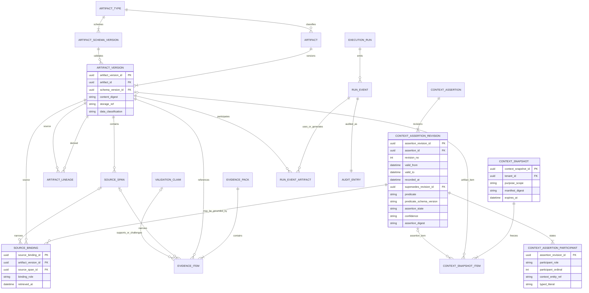
```mermaid
erDiagram
    ARTIFACT_TYPE ||--|{ ARTIFACT_SCHEMA_VERSION : schemas
    ARTIFACT_TYPE ||--o{ ARTIFACT : classifies
    ARTIFACT ||--|{ ARTIFACT_VERSION : versions
    ARTIFACT_SCHEMA_VERSION ||--o{ ARTIFACT_VERSION : validates
    ARTIFACT_VERSION ||--o{ SOURCE_SPAN : contains
    ARTIFACT_VERSION ||--o{ ARTIFACT_LINEAGE : derived
    ARTIFACT_VERSION ||--o{ ARTIFACT_LINEAGE : source

    CONTEXT_ASSERTION ||--|{ CONTEXT_ASSERTION_REVISION : revisions
    CONTEXT_ASSERTION_REVISION ||--|{ CONTEXT_ASSERTION_PARTICIPANT : states
    CONTEXT_ASSERTION_REVISION ||--o{ SOURCE_BINDING : may_be_grounded_by
    ARTIFACT_VERSION ||--o{ SOURCE_BINDING : source
    SOURCE_SPAN o|--o{ SOURCE_BINDING : narrows

    CONTEXT_SNAPSHOT ||--|{ CONTEXT_SNAPSHOT_ITEM : freezes
    ARTIFACT_VERSION o|--o{ CONTEXT_SNAPSHOT_ITEM : artifact_item
    CONTEXT_ASSERTION_REVISION o|--o{ CONTEXT_SNAPSHOT_ITEM : assertion_item

    EVIDENCE_PACK ||--|{ EVIDENCE_ITEM : contains
    ARTIFACT_VERSION ||--o{ EVIDENCE_ITEM : references
    SOURCE_SPAN o|--o{ EVIDENCE_ITEM : narrows
    VALIDATION_CLAIM o|--o{ EVIDENCE_ITEM : supports_or_challenges

    EXECUTION_RUN ||--o{ RUN_EVENT : emits
    RUN_EVENT ||--o{ RUN_EVENT_ARTIFACT : uses_or_generates
    ARTIFACT_VERSION ||--o{ RUN_EVENT_ARTIFACT : participates
    RUN_EVENT ||--|| AUDIT_ENTRY : audited_as

    ARTIFACT_VERSION {
      uuid artifact_version_id PK
      uuid artifact_id FK
      uuid schema_version_id FK
      string content_digest
      string storage_ref
      string data_classification
    }
    CONTEXT_ASSERTION_REVISION {
      uuid assertion_revision_id PK
      uuid assertion_id FK
      int revision_no
      datetime valid_from
      datetime valid_to
      datetime recorded_at
      uuid supersedes_revision_id FK
      string predicate
      string predicate_schema_version
      string assertion_state
      string confidence
      string assertion_digest
    }
    CONTEXT_ASSERTION_PARTICIPANT {
      uuid assertion_revision_id FK
      string participant_role
      int participant_ordinal
      string context_entity_ref
      string typed_literal
    }
    SOURCE_BINDING {
      uuid source_binding_id PK
      uuid artifact_version_id FK
      uuid source_span_id FK
      string binding_role
      datetime retrieved_at
    }
    CONTEXT_SNAPSHOT {
      uuid context_snapshot_id PK
      uuid tenant_id FK
      string purpose_scope
      string manifest_digest
      datetime expires_at
    }
```

### 0.3 Consultry Operating Spine und Win-to-Work

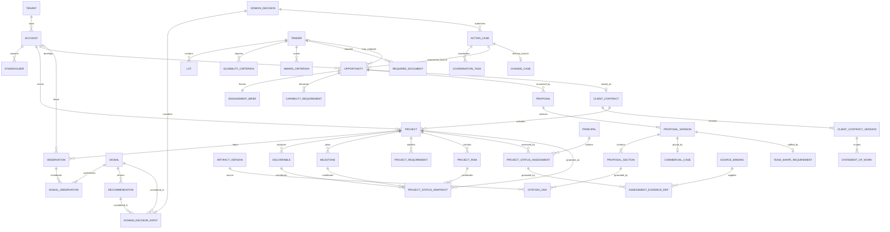
```mermaid
erDiagram
    TENANT ||--o{ ACCOUNT : owns
    ACCOUNT ||--o{ STAKEHOLDER : contains
    ACCOUNT ||--o{ PROJECT : serves
    ACCOUNT ||--o{ OPPORTUNITY : develops

    ACCOUNT o|--o{ OBSERVATION : about
    PROJECT o|--o{ OBSERVATION : about
    OBSERVATION ||--o{ SIGNAL_OBSERVATION : contributes
    SIGNAL ||--|{ SIGNAL_OBSERVATION : synthesizes
    SIGNAL ||--o{ RECOMMENDATION : informs
    SIGNAL ||--o{ DOMAIN_DECISION_INPUT : considered_in
    RECOMMENDATION ||--o{ DOMAIN_DECISION_INPUT : considered_in
    DOMAIN_DECISION ||--|{ DOMAIN_DECISION_INPUT : considers
    DOMAIN_DECISION ||--o{ ACTION_CASE : authorizes
    ACTION_CASE ||--o{ COORDINATION_TASK : coordinates
    ACTION_CASE ||--o| OPPORTUNITY : commercial_branch
    ACTION_CASE ||--o| CHANGE_CASE : delivery_branch

    TENDER ||--o{ LOT : contains
    TENDER ||--o{ ELIGIBILITY_CRITERION : requires
    TENDER ||--o{ AWARD_CRITERION : scores
    TENDER ||--o{ REQUIRED_DOCUMENT : requests
    TENDER o|--o{ OPPORTUNITY : may_originate
    OPPORTUNITY ||--|| ENGAGEMENT_BRIEF : frames
    OPPORTUNITY ||--o{ CAPABILITY_REQUIREMENT : demands
    OPPORTUNITY ||--o{ PROPOSAL : answered_by
    PROPOSAL ||--|{ PROPOSAL_VERSION : versions
    PROPOSAL_VERSION ||--|{ PROPOSAL_SECTION : contains
    PROPOSAL_SECTION ||--o{ CITATION_LINK : grounded_by
    ARTIFACT_VERSION ||--o{ CITATION_LINK : source
    PROPOSAL_VERSION ||--o| COMMERCIAL_CASE : priced_by
    PROPOSAL_VERSION ||--o| TEAM_SHAPE_REQUIREMENT : staffed_by

    OPPORTUNITY ||--o| CLIENT_CONTRACT : closed_as
    CLIENT_CONTRACT ||--|{ CLIENT_CONTRACT_VERSION : versions
    CLIENT_CONTRACT_VERSION ||--|{ STATEMENT_OF_WORK : scopes
    CLIENT_CONTRACT ||--o{ PROJECT : activates
    PROJECT ||--o{ DELIVERABLE : produces
    PROJECT ||--o{ MILESTONE : plans
    PROJECT ||--o{ PROJECT_REQUIREMENT : satisfies
    PROJECT ||--o{ PROJECT_RISK : controls
    PROJECT ||--o{ PROJECT_STATUS_ASSESSMENT : assessed_by
    PRINCIPAL ||--o{ PROJECT_STATUS_ASSESSMENT : authors
    PROJECT_STATUS_ASSESSMENT ||--o{ ASSESSMENT_EVIDENCE_REF : grounded_by
    SOURCE_BINDING ||--o{ ASSESSMENT_EVIDENCE_REF : supplies
    PROJECT ||--o{ PROJECT_STATUS_SNAPSHOT : projected_as
    DELIVERABLE ||--o{ PROJECT_STATUS_SNAPSHOT : contributes
    MILESTONE ||--o{ PROJECT_STATUS_SNAPSHOT : contributes
    PROJECT_RISK ||--o{ PROJECT_STATUS_SNAPSHOT : contributes
```

### 0.4 Consultry Capability Evidence, Staffing und Reuse

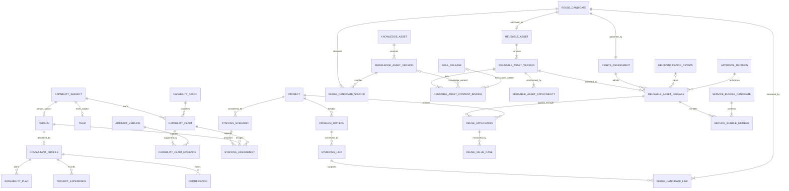
```mermaid
erDiagram
    PERSON ||--o| CONSULTANT_PROFILE : described_by
    CAPABILITY_SUBJECT ||--o| PERSON : person_subject
    CAPABILITY_SUBJECT ||--o| TEAM : team_subject
    CAPABILITY_SUBJECT ||--o{ CAPABILITY_CLAIM : owns
    CAPABILITY_TAXON ||--o{ CAPABILITY_CLAIM : classifies
    CAPABILITY_CLAIM ||--|{ CAPABILITY_CLAIM_EVIDENCE : supported_by
    ARTIFACT_VERSION ||--o{ CAPABILITY_CLAIM_EVIDENCE : supplies
    CONSULTANT_PROFILE ||--o{ CERTIFICATION : holds
    CONSULTANT_PROFILE ||--o{ PROJECT_EXPERIENCE : records
    CONSULTANT_PROFILE ||--o{ AVAILABILITY_PLAN : plans

    PROJECT ||--o{ STAFFING_SCENARIO : considered_for
    STAFFING_SCENARIO ||--|{ STAFFING_ASSIGNMENT : proposes
    PERSON ||--o{ STAFFING_ASSIGNMENT : assigns
    CAPABILITY_CLAIM ||--o{ STAFFING_ASSIGNMENT : supports

    KNOWLEDGE_ASSET ||--|{ KNOWLEDGE_ASSET_VERSION : versions
    PROJECT ||--o{ PROBLEM_PATTERN : exhibits
    PROBLEM_PATTERN ||--o{ SYMBIOSIS_LINK : connected_by
    SYMBIOSIS_LINK ||--o{ REUSE_CANDIDATE_LINK : supports
    REUSE_CANDIDATE ||--|{ REUSE_CANDIDATE_LINK : motivated_by
    REUSE_CANDIDATE ||--|{ REUSE_CANDIDATE_SOURCE : abstracts
    KNOWLEDGE_ASSET_VERSION ||--o{ REUSE_CANDIDATE_SOURCE : supplies
    REUSE_CANDIDATE ||--|| RIGHTS_ASSESSMENT : governed_by
    REUSE_CANDIDATE ||--o| REUSABLE_ASSET : approved_as
    REUSABLE_ASSET ||--|{ REUSABLE_ASSET_VERSION : versions
    REUSABLE_ASSET_VERSION ||--|{ REUSABLE_ASSET_CONTENT_BINDING : pins
    KNOWLEDGE_ASSET_VERSION o|--o{ REUSABLE_ASSET_CONTENT_BINDING : knowledge_content
    SKILL_RELEASE o|--o{ REUSABLE_ASSET_CONTENT_BINDING : executable_content
    REUSABLE_ASSET_VERSION ||--|{ REUSABLE_ASSET_APPLICABILITY : constrained_by
    REUSABLE_ASSET_VERSION ||--o{ REUSABLE_ASSET_RELEASE : released_as
    RIGHTS_ASSESSMENT ||--o{ REUSABLE_ASSET_RELEASE : admits
    DEIDENTIFICATION_REVIEW o|--o{ REUSABLE_ASSET_RELEASE : clears
    APPROVAL_DECISION ||--o{ REUSABLE_ASSET_RELEASE : authorizes
    REUSABLE_ASSET_RELEASE ||--o{ REUSE_APPLICATION : applied_through
    PROJECT ||--o{ REUSE_APPLICATION : receives
    REUSE_APPLICATION ||--o{ REUSE_VALUE_CASE : measured_by
    REUSABLE_ASSET_RELEASE ||--o{ SERVICE_BUNDLE_MEMBER : bundles
    SERVICE_BUNDLE_CANDIDATE ||--|{ SERVICE_BUNDLE_MEMBER : contains
```

---

### 0.5 Kernel-Entity-Landkarte

Der Katalog ist die Vollständigkeitskarte, nicht die Aufforderung, alle Objekte sofort physisch anzulegen. `AR` = Aggregate Root, `E` = Entity, `VO` = Value Object, `V` = immutable Version, `R` = Release, `RT` = Runtime, `EV` = Event, `D` = Decision, `P` = Projection.

#### 0.5.1 Platform Registry, Tenant, Identity und Product Configuration

| Bounded Context | Entity | Typ | Verantwortung | Horizont |
|---|---|---:|---|---|
| Catalog | `CatalogScope` | E | Persistierte Besitzgrenze `PLATFORM`, `BLUEPRINT` oder `TENANT` für wiederverwendbare Definitionen | MVP/Platform |
| Catalog | `ProductBlueprint` / `ProductBlueprintVersion` | AR/V | Stabile Produktidentität und immutable Komposition eines vertikalen Produkts | Full/Platform |
| Catalog | `ProductModuleDefinition` / `ProductModuleVersion` | AR/V | Versionierbares, installierbares Modul innerhalb eines Blueprints | Full/Platform |
| Catalog | `OntologyDefinition` / `OntologyVersion` | AR/V | Fachvokabular, Schemas und erlaubte Relationssemantik | Full/Platform |
| Catalog | `BlueprintReleaseClosure` | R | Exakt gepinnte Module, Ontologie, Task-, Skill-, Policy-, Validator- und UI-Versionen | Full/Platform |
| Tenant | `Tenant` | AR | Rechtliche/technische Mandantengrenze | MVP |
| Tenant | `TenantProductInstallation` | AR | Installierte Blueprint Closure und Lifecycle | Full/Platform |
| Tenant | `TenantModuleConfiguration` / `TenantModuleConfigurationVersion` | AR/V | Versionierte Modulkonfiguration ohne Fork des Basismoduls | Full |
| Tenant | `TenantSkillOverlay` / `TenantSkillOverlayVersion` | AR/V | Erlaubte tenant-spezifische Skill-Bindings/Forks | Full |
| Tenant | `TenantPolicyProfile` / `TenantPolicyProfileVersion` | AR/V | Strengere Tenant Defaults und lokale Policy Sets | MVP/Full |
| Tenant | `EffectiveConfigurationRelease` | R | Immutable Closure aus Blueprint und Tenant-Konfigurationsversionen | Full/Platform |
| Identity | `UserIdentity` | AR | Login-/SSO-Identität; bewusst getrennt von der fachlichen `Person` | MVP |
| Identity | `TenantMembership` | E | Zuordnung von Identity zu Tenant, Status und Gültigkeit | MVP |
| Authority | `Principal` | AR | Autorisierbares Subjekt: Human, Service oder Harness Runtime | MVP/Platform |
| Authority | `Role` / `RoleAssignment` | AR/E | Stabile Rollen und zeitgebundene Zuweisung | MVP |
| Authority | `AuthorityGrant`, `Delegation`, `ApprovalMandate` | AR | Lesbare/exekutierbare Scopes, Delegation und Approval-Befugnis | MVP/Full |
| Governance | `WorksCouncilConfiguration` | AR | WC-Mode, Transparenz- und Personenbezug-Gates | MVP/Full |

#### 0.5.2 Artifact-, Corpus-, Context- und Integration-Spine

| Bounded Context | Entity | Typ | Verantwortung | Horizont |
|---|---|---:|---|---|
| Artifact | `ArtifactType` / `ArtifactSchemaVersion` | AR/V | Stabile Medien-/Fachart und immutable Datenvertragsversion | MVP/Platform |
| Artifact | `Artifact` / `ArtifactVersion` | AR/V | Logische Identität und unveränderlicher Content/Blob/Digest | MVP/Platform |
| Corpus | `DocumentIngest`, `DocumentPage`, `Chunk` | AR/E | Reproduzierbare Ingestion, Seiten-/Chunk-Struktur und Retrieval-Metadaten | MVP |
| Provenance | `SourceSpan`, `SourceBinding` | E/VO | Exakte Seite, Zelle, Zeile oder Passage und deren Quellenadresse | MVP/Platform |
| Provenance | `ArtifactLineage`, `ProvenanceActivity` | E/EV | `used`, `generated`, `derived_from`, `supersedes` mit Aktivität/Agent/Run | Full/Platform |
| Evidence | `EvidenceItem`, `EvidencePack` | E/AR | Zweck-/Claim-bezogene Evidenzrolle und immutable kuratierter Pack | MVP/Platform |
| Context | `ContextEntity` | P | Graph-adressierbare Projektion eines typisierten Domainobjekts | MVP/Platform |
| Context | `ContextAssertion` / `ContextAssertionRevision` | AR/V | Schlanker bitemporaler, source-bound Assertion-Kern; breitere Semantik später | MVP/Platform |
| Context | `ContextAssertionParticipant` | E | MVP: minimale typisierte Subject-/Object-/Context-Rollen; Full: breitere mehrstellige Aussagen/Hyperedges | MVP/Full/Platform |
| Context | `ContextSnapshot` / `ContextSnapshotItem` | RT/E | Immutable, purpose- und job-scoped Auswahl des langfristigen Kontextes | MVP/Platform |
| Context | `ContextPack`, `MemoryPack`, `SymbiosisContextPack` | P | Spezialisierte Pack-Projektionen für Harness/Jobs | MVP/Full |
| Connector | `ConnectorDefinition` / `ConnectorVersion` | AR/V | Versionierter Adapter-/Importvertrag | MVP/Platform |
| Connector | `ConnectorInstallation` | AR | Tenant-gebundene Installation ohne Credential im Domainmodell | MVP |
| Connector | `ConnectorGrant`, `SourceScope` | AR/VO | Erlaubte Quellen, Aktionen, Zweck und Gültigkeit | MVP |
| Connector | `SourceSnapshot`, `SyncCursor`, `ImportRecord` | AR/E/EV | Exakter externer Stand, inkrementeller Cursor und Import-Lineage | MVP/Full |
| Tools | `ToolDefinition` / `ToolVersion` | AR/V | Tool-Capability und immutable API-/Executable-Contract-Version | MVP/Platform |
| Tools | `ToolInvocationRecord` | EV | Exakte Tool-Version, Capability Lease, Input-/Output-Hash und Ergebnis | MVP/Platform |

#### 0.5.3 Tasks, Core Skill Graph, Execution und Harness

| Bounded Context | Entity | Typ | Verantwortung | Horizont |
|---|---|---:|---|---|
| Task Catalog | `BoundedContextDefinition` | AR | Ordnet versionierte Context Tasks einem fachlichen Kontext zu | MVP/Platform |
| Task Catalog | `ContextTaskDefinition` / `ContextTaskVersion` | AR/V | Stabile Aufgabenklasse und immutable Input-/Output-/Risk-Contract | MVP/Platform |
| Task Runtime | `TaskRequirement`, `RequirementClause` | AR/E | Konkrete Aufgabe und immutable typisierte Capability/Input/Output/Knowledge/Tool/Model/Data/Authority/Validation/Interaction/Budget-Constraints | MVP/Platform |
| Task Runtime | `TaskContextBinding` | E | Verbindet Task mit Domainobjekten und Context Snapshot | MVP |
| Capability | `CapabilityTaxon`, `CapabilityTaxonRelation` | AR/E | Gemeinsames Fachvokabular für Task Demand, AI Skill und Human Evidence | MVP/Platform |
| Skills | `SkillDefinition` / `SkillVersion` | AR/V | Stabile ausführbare Fähigkeit und immutable Manifest-/Contract-Version | MVP/Platform |
| Skills | `SkillProgram`, `SkillPort` | VO/E | Implementierungsart und typisierte Input-/Output-Ports | MVP/Platform |
| Skills | `SkillObligation`, `SkillFailureMode` | E | Pflichtnachweise, bekannte Fehlerbilder und Recovery-Erwartung | MVP/Full |
| Skills | `SkillDependencyRequirement` | E | Abhängigkeitsabsicht auf stabile Skill-Identität plus Version Constraint | Full/Platform |
| Skills | `SkillModelRequirement`, `ModelRequirementProfile`, `ToolRequirement`, `PolicyRequirement`, `ValidatorRequirement`, `AuthorityRequirement` | E/VO | Ressourcen- und Governance-Requirements ohne direkte Runtime-Auswahl | MVP/Platform |
| Skills | `SkillRelease`, `SkillReleaseEvent` | R/EV | Veröffentlichung einer exakten Version in Candidate/Pilot/Stable und Historie | MVP/Full |
| Skills | `TaskSkillBinding` | E | Task-Version zu Skill Release mit Rolle, Priorität und Condition | MVP |
| Skills | `CoreSkillGraphRelease`, `CoreSkillGraphNode`, `CoreSkillGraphEdge` | P | Digestierte, reproduzierbare Graphsicht des gültigen Katalogstandes | MVP/Platform |
| Skills | `SkillResolution`, `SkillResolutionCandidate`, `ClauseSatisfaction` | AR/E | Erklärbare Kandidatenauswahl und Clause-Abdeckung | MVP/Platform |
| Skills | `ExecutionConfiguration`, `SkillReleaseClosure` | AR/VO | Evaluierte exakte Closure aus Skills, Tools, Policies, Validatoren, Model Policies und Harness | MVP/Platform |
| Execution | `ExecutionGraphDefinition` / `ExecutionGraphVersion` | AR/V | Stabile Orchestrierung und immutable Topologie | MVP/Platform |
| Execution | `ExecutionNodeDefinition`, `ExecutionEdge`, `LoopPolicy` | E/VO | Typisierte Schritte, Guards und explizit begrenzte Rücksprünge | MVP/Full |
| Execution | `ExecutionJob`, `RunPlan`, `RunPlanBinding` | AR | Idempotenter Auftrag und eingefrorener, admitierter Plan | MVP/Platform |
| Execution | `ExecutionRun`, `NodeActivation`, `LoopInstance`, `Checkpoint` | AR/E | Ein Versuch, zeitaufgelöster Trace, Loop-Budget und Resume State | MVP/Full |
| Effects | `EffectRequest`, `EffectAdmissionDecision`, `DomainCommand`, `CommitReceipt` | AR/D/E | Vorschlag, separater Admission-Entscheid, reautorisierter Owner-Command und Commit-Nachweis | MVP/Platform |
| Harness | `HarnessProfileDefinition` / `HarnessProfileVersion` | AR/V | Runtime- und Resource-/Network-Contract | MVP/Platform |
| Harness | `HarnessPack`, `HarnessPackItem` | AR/E | Immutable Corpus/Memory/Tools/Policy/Output-Contract-Paket | MVP/Platform |
| Harness | `HarnessSession`, `CapabilityLease`, `ResultCandidate`, `ResultBundle` | AR/E | Kurzlebige isolierte Ausführung, scoped Befugnis und unverifizierte Output-Kandidaten | MVP/Platform |

#### 0.5.4 Assurance, Governance, Model Bridge, Evaluation und Learning

| Bounded Context | Entity | Typ | Verantwortung | Horizont |
|---|---|---:|---|---|
| Validation | `ValidationGraphDefinition` / `ValidationGraphVersion` | AR/V | Versionierte Assurance-Struktur und Support-Topologie | MVP/Platform |
| Validation | `ValidationObligationDefinition`, `ClaimDefinition`, `EvidenceRequirement`, `AcceptanceCriterion`, `ArgumentStrategy` | E/VO | Wiederverwendbare Nachweissemantik | MVP/Full |
| Validation | `ValidatorDefinition` / `ValidatorVersion` | AR/V | Deterministic, Policy, Simulation, Model, Human oder Composite Check | MVP/Platform |
| Validation | `ValidatorCalibration` | E | Human Agreement, False-Pass/-Fail und zulässiger Einsatzbereich | Full/Platform |
| Validation | `ValidationCase`, `ValidationObligation`, `Claim`, `EvidenceRef` | AR/E | Job-spezifische Assurance Instanz und offener Validation Frontier | MVP/Platform |
| Validation | `ValidatorRun`, `ValidationResult`, `Finding`, `Defeater`, `Remediation` | RT/E | Check-Ausführung, Verdict, Problem, Gegenbeleg und Nacharbeit | MVP/Full |
| Validation | `ValidationAttestation`, `ValidationDecision`, `InvalidationEvent` | E/D/EV | Zeit-/Scope-gebundene Reliance, Entscheidung und spätere Entkräftung | MVP/Full |
| Validation | `AdjudicationRequest`, `HumanAdjudication`, `WaiverDecision` | AR/D | Explizite menschliche Frontier-Entscheidung bzw. begrenzte Ausnahme | Full |
| Governance | `PolicyDefinition` / `PolicyVersion` / `PolicySetVersion` | AR/V | Versionierte Regeln und gepinnte Policy Closure | MVP/Platform |
| Governance | `PolicyDecision` | D | Allow, Block oder Review für exakten Request Hash | MVP/Platform |
| Approval | `ApprovalRequest`, `ApprovalDecision` | AR/D | Exakter Subject-/Effect-Hash und menschliche Bindungsentscheidung | MVP |
| Audit | `DomainEvent`, `RunEvent`, `AuditEntry` | EV | Append-only, korrelierbare Fach-/Runtime-/Compliance-Historie | MVP/Platform |
| Model Bridge | `ModelProvider`, `ModelDeployment`, `ModelDeploymentVersion` | AR/V | Providerkatalog und exakte Deployment-/Modellversion | MVP/Platform |
| Model Bridge | `ProviderComplianceProfile` | V | Data Zone, Retention, Training Use und Vertrags-/Region-Posture | MVP |
| Model Bridge | `ModelPolicy` / `ModelPolicyVersion`, `RouteCandidate` | AR/V/E | Zweckbezogene Routing-Policy und zulässige Kandidaten | MVP/Platform |
| Skill/Instruction Catalog | `PromptDefinition` / `PromptVersion` | AR/V | Versionierter Prompt-/Template-Contract; Model Bridge erhält nur gerenderten Input | MVP/Platform |
| Model Bridge | `ModelRequest`, `ModelRouteDecision`, `ModelInvocationRecord` | E/D/EV | Request, konkrete Auswahl und auditierter Aufruf | MVP/Platform |
| Evaluation | `EvalSuiteDefinition` / `EvalSuiteVersion`, `EvalCaseDefinition` / `EvalCaseVersion` | AR/V | Versionierte Teststrategie, Cases, Fixtures und Thresholds | MVP/Platform |
| Evaluation | `EvalRun`, `AssessmentTrial`, `AssertionResult`, `AssessmentFinding` | RT/E | Wiederholte Trials für deterministische/nichtdeterministische Closures | MVP/Full |
| Evaluation | `PromotionDecision` | D | Candidate/Pilot/Stable Promotion, Block oder Rollback | MVP/Full |
| Outcomes | `OutcomeDefinition` / `OutcomeDefinitionVersion`, `MetricDefinition` | AR/V | Business-/Operational-Outcome und Messsemantik | MVP/Full |
| Outcomes | `OutcomeObservation`, `MetricMeasurement`, `AttributionClaim` | AR/E | Beobachteter Effekt, Messwert und vorsichtige Contribution-Zuschreibung | MVP/Full |

---

## 1. Zweck, Reichweite und Nicht-Ziele

Dieses Dokument beantwortet vier Fragen:

1. Welche fachlichen und plattformweiten Objekte braucht das vollständige Produktbild?
2. Welche Objekte sind Aggregate Roots, Entities, Value Objects, Definitions, Releases, Runtime-Instanzen, Events oder Projektionen?
3. Wie hängen Context Graph, Skill Graph, Execution, Validation, Authority, Model Bridge, Harness und Consultry-Domänenobjekte zusammen?
4. Wie lässt sich dieses OOP-Modell in ein relationales, graph-ready ER-Modell überführen, ohne für jeden benannten Graphen eine eigene Datenbank zu bauen?

Das Dokument ist bewusst **größer als das MVP**. Der Horizont eines Objekts wird markiert als:

- **MVP** – für den ersten Opportunity-to-Concept-/Win+Work-Proof erforderlich oder als minimale Architekturgrenze anzulegen.
- **Full** – Bestandteil des vollständigen Consultry-Produkts.
- **Platform** – horizontal wiederverwendbarer Kernel für weitere Product Blueprints.
- **Projection** – abgeleitete Sicht, kein eigener schreibender System-of-Record-Kontext.

Nicht-Ziele:

- kein vollständiges SQL-DDL;
- keine Festlegung auf einen dedizierten Graph Store;
- kein Anspruch, dass jedes dargestellte Full-/Platform-Objekt im MVP implementiert wird;
- keine autonome Skill-, Policy-, Validator- oder Graph-Selbstmutation;
- keine Gleichsetzung von Graphdarstellung, Evidenz, Wahrheit, Autorität oder Kausalität.

---

## 2. Systemhierarchie

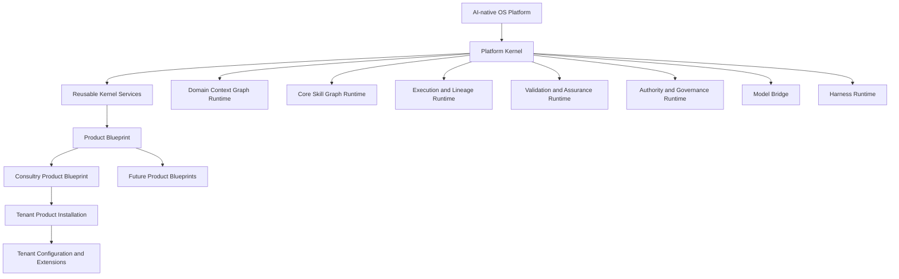
```mermaid
flowchart TB
    P["AI-native OS Platform"] --> K["Platform Kernel"]
    K --> S["Reusable Kernel Services"]
    S --> PB["Product Blueprint"]
    PB --> CB["Consultry Product Blueprint"]
    PB --> FB["Future Product Blueprints"]
    CB --> TI["Tenant Product Installation"]
    TI --> TC["Tenant Configuration and Extensions"]

    K --> CG["Domain Context Graph Runtime"]
    K --> SG["Core Skill Graph Runtime"]
    K --> EG["Execution and Lineage Runtime"]
    K --> VG["Validation and Assurance Runtime"]
    K --> AG["Authority and Governance Runtime"]
    K --> MB["Model Bridge"]
    K --> HR["Harness Runtime"]
```

### 2.1 Fünf kanonische Graph-Familien

| Graph-Familie | Autoritative Semantik | Typische Instanzen | Kein Ersatz für |
|---|---|---|---|
| **Domain Context Graph** | Langfristiger, source-bound Geschäfts- und Wissenskontext | `ContextAssertion`, Account-/Project-/Knowledge-Beziehungen, Capability Evidence | Dokumente, operative Quellsysteme, Policy Engine |
| **Core Skill Graph** | Zuordnung von Task/Intent zu versionierten ausführbaren Fähigkeiten und deren Closure | `ContextTaskVersion`, `SkillDefinition`, `SkillRelease`, typed Dependencies | Execution Run, menschliche Capability Claims |
| **Execution & Lineage Graph** | Geplante Arbeit, gefrorener RunPlan und beobachtete Aktivitäten/Artefakt-Lineage | `ExecutionGraphVersion`, `RunPlan`, `NodeActivation`, Trace Projection | Audit Ledger, Assurance Argument |
| **Validation & Assurance Graph** | Was nachgewiesen werden muss und warum etwas akzeptiert, blockiert oder erneut geprüft wird | `ValidationGraphVersion`, `ValidationCase`, `Claim`, `Finding`, `ValidationDecision` | Authorization, Human Approval, Business Outcome |
| **Authority Relationship Graph** | Wer in welchem Scope lesen, ausführen, delegieren, genehmigen oder binden darf | `Principal`, `Role`, `AuthorityGrant`, `Delegation`, `ApprovalMandate` | ausführbare Policy Evaluation, fachliche Wahrheit |

Unterstützende Record Systems bleiben bewusst keine weiteren Universalgraphen:

- Artifact/Object Store und Source-Span-Index;
- versionierter Policy Registry/Evaluator;
- append-only Run-/Audit-Event-Ledger;
- Metrics-/Outcome-Fact-Store;
- Model-Bridge-Registry und Route-Decision-Log.

---

## 3. OOP-Modellierungsregeln

### 3.1 Objektkategorien

| Kategorie | Bedeutung | Beispiele |
|---|---|---|
| `AggregateRoot` | Konsistenz- und Transaktionsgrenze mit eigenem Lifecycle | `SkillDefinition`, `RunPlan`, `ValidationCase`, `Opportunity` |
| `Entity` | Identität innerhalb oder außerhalb eines Aggregats | `SkillVersion`, `NodeActivation`, `DraftSection` |
| `ValueObject` | Unveränderlicher Wert ohne eigene fachliche Identität | `EntityRef`, `Digest`, `TimeRange`, `Money`, `EffectHash` |
| `Definition` | Änderbarer Entwurfsanker; Änderungen erzeugen neue Versionen | `ExecutionGraphDefinition`, `ValidatorDefinition` |
| `Version` | Unveränderlicher Inhalt mit Digest | `SkillVersion`, `PolicyVersion`, `ArtifactVersion` |
| `Release` | Governed, für Verwendung freigegebene Version plus Closure | `SkillRelease`, `ProductBlueprintRelease` |
| `RuntimeInstance` | Job-/Tenant-spezifische Ausprägung | `TaskRequirement`, `ExecutionRun`, `ValidationCase` |
| `Event` | Unveränderliches historisches Geschehen | `RunEvent`, `DomainEvent`, `InvalidationEvent` |
| `Decision` | Provenance-bearing normative oder technische Entscheidung | `ApprovalDecision`, `ValidationDecision`, `PolicyDecision` |
| `Projection` | Abgeleitete Lesesicht ohne eigene Autorität | `CapabilityEvidenceView`, `TraceGraph`, `OutcomeLearningView` |

### 3.2 Shared Kernel Value Objects

```text
TenantId               EntityId                DefinitionId
VersionId              ReleaseId               RunId
EntityRef(type,id,ver) Digest(algorithm,value) VersionNumber
CorrelationId          CausationId             IdempotencyKey
TimeRange              BitemporalValidity      ObservationWindow
DataClassification     VisibilityScope         PurposeScope
Confidence             AssuranceLevel          RiskTier
Money                  Quantity                MetricValue
ContentHash            EffectHash              PolicyRef
ModelPolicyRef         ValidatorRef             SourceRef
```

### 3.3 Nicht verhandelbare Objektregeln

1. **Definition, Version, Release und Run sind nie dasselbe Objekt.**
2. Ein laufender Job referenziert niemals `latest`, sondern eine immutable Release Closure.
3. Jede tenant-spezifische Entity besitzt genau einen `tenant_id`; globale Kernel-Definitionen besitzen einen expliziten Scope.
4. AI erzeugt `Proposal`, `Candidate`, `Observation` oder `EffectRequest`, nie direkt bindenden Domain State.
5. Approval, Validation und Authorization sind drei getrennte Entscheidungen.
6. Evidenz ist eine Rolle eines Artefakts/einer Beobachtung relativ zu einem Claim, kein intrinsischer Wahrheitsstatus.
7. Historische Events und Commit Receipts werden nicht überschrieben; Korrektur erfolgt durch neue Events oder Compensation.
8. Core-Aggregate bleiben typisiert. Flexible Graph Assertions ergänzen sie, ersetzen aber keine transaktionalen Invarianten durch EAV/JSON.
9. Bitemporale Context Assertions unterscheiden fachliche Gültigkeit von Systemaufzeichnung.
10. Outcome-Korrelation wird nie automatisch als Kausalität gespeichert.

---

## 4. Package- und Bounded-Context-Map

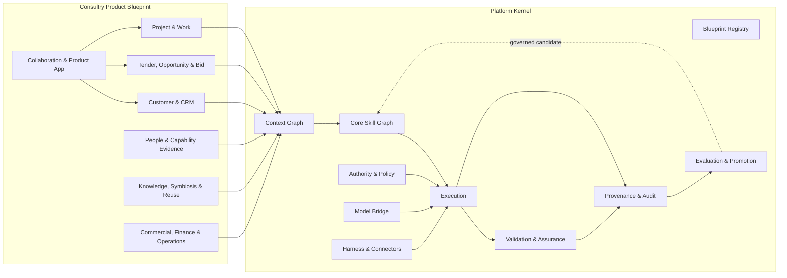
```mermaid
flowchart LR
    subgraph PlatformKernel["Platform Kernel"]
        BP["Blueprint Registry"]
        CTX["Context Graph"]
        SK["Core Skill Graph"]
        EX["Execution"]
        VA["Validation & Assurance"]
        AU["Authority & Policy"]
        MO["Model Bridge"]
        HA["Harness & Connectors"]
        PR["Provenance & Audit"]
        EV["Evaluation & Promotion"]
    end

    subgraph ConsultryBlueprint["Consultry Product Blueprint"]
        CRM["Customer & CRM"]
        BID["Tender, Opportunity & Bid"]
        PROJ["Project & Work"]
        CAP["People & Capability Evidence"]
        KNOW["Knowledge, Symbiosis & Reuse"]
        COM["Commercial, Finance & Operations"]
        COL["Collaboration & Product App"]
    end

    CRM --> CTX
    BID --> CTX
    PROJ --> CTX
    CAP --> CTX
    KNOW --> CTX
    COM --> CTX

    CTX --> SK
    SK --> EX
    EX --> VA
    AU --> EX
    MO --> EX
    HA --> EX
    EX --> PR
    VA --> PR
    PR --> EV
    EV -. "governed candidate" .-> SK
    COL --> CRM
    COL --> BID
    COL --> PROJ
```

---

## 5. UML – Platform, Blueprint und Tenant Configuration

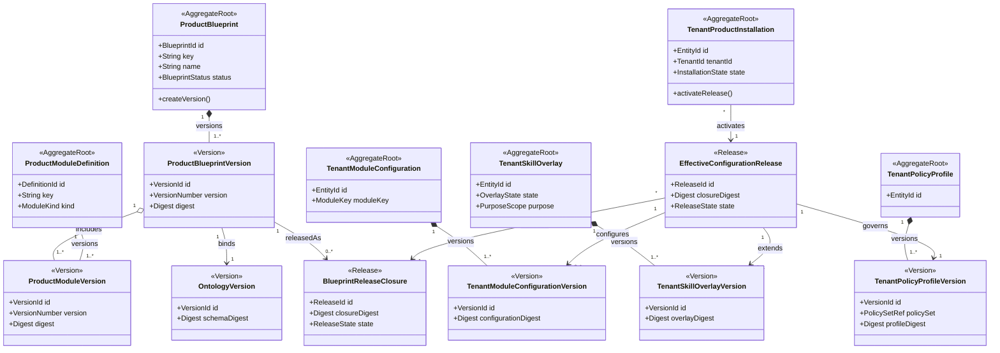
```mermaid
classDiagram
    class ProductBlueprint {
      <<AggregateRoot>>
      +BlueprintId id
      +String key
      +String name
      +BlueprintStatus status
      +createVersion()
    }
    class ProductBlueprintVersion {
      <<Version>>
      +VersionId id
      +VersionNumber version
      +Digest digest
    }
    class ProductModuleDefinition {
      <<AggregateRoot>>
      +DefinitionId id
      +String key
      +ModuleKind kind
    }
    class ProductModuleVersion {
      <<Version>>
      +VersionId id
      +VersionNumber version
      +Digest digest
    }
    class OntologyVersion {
      <<Version>>
      +VersionId id
      +Digest schemaDigest
    }
    class BlueprintReleaseClosure {
      <<Release>>
      +ReleaseId id
      +Digest closureDigest
      +ReleaseState state
    }
    class TenantProductInstallation {
      <<AggregateRoot>>
      +EntityId id
      +TenantId tenantId
      +InstallationState state
      +activateRelease()
    }
    class TenantModuleConfiguration {
      <<AggregateRoot>>
      +EntityId id
      +ModuleKey moduleKey
    }
    class TenantModuleConfigurationVersion {
      <<Version>>
      +VersionId id
      +Digest configurationDigest
    }
    class TenantSkillOverlay {
      <<AggregateRoot>>
      +EntityId id
      +OverlayState state
      +PurposeScope purpose
    }
    class TenantSkillOverlayVersion {
      <<Version>>
      +VersionId id
      +Digest overlayDigest
    }
    class TenantPolicyProfile {
      <<AggregateRoot>>
      +EntityId id
    }
    class TenantPolicyProfileVersion {
      <<Version>>
      +VersionId id
      +PolicySetRef policySet
      +Digest profileDigest
    }
    class EffectiveConfigurationRelease {
      <<Release>>
      +ReleaseId id
      +Digest closureDigest
      +ReleaseState state
    }

    ProductBlueprint "1" *-- "1..*" ProductBlueprintVersion : versions
    ProductBlueprintVersion "1" o-- "1..*" ProductModuleVersion : includes
    ProductModuleDefinition "1" *-- "1..*" ProductModuleVersion : versions
    ProductBlueprintVersion "1" --> "1" OntologyVersion : binds
    ProductBlueprintVersion "1" --> "0..*" BlueprintReleaseClosure : releasedAs
    TenantProductInstallation "*" --> "1" EffectiveConfigurationRelease : activates
    TenantModuleConfiguration "1" *-- "1..*" TenantModuleConfigurationVersion : versions
    TenantSkillOverlay "1" *-- "1..*" TenantSkillOverlayVersion : versions
    TenantPolicyProfile "1" *-- "1..*" TenantPolicyProfileVersion : versions
    EffectiveConfigurationRelease "*" --> "1" BlueprintReleaseClosure : basesOn
    EffectiveConfigurationRelease "1" --> "0..*" TenantModuleConfigurationVersion : configures
    EffectiveConfigurationRelease "1" --> "0..1" TenantSkillOverlayVersion : extends
    EffectiveConfigurationRelease "1" --> "1" TenantPolicyProfileVersion : governs
```

### 5.1 Verantwortungsgrenze

- Der Kernel definiert Schemas, Lifecycle und Resolver.
- Ein Product Blueprint liefert Ontologie, Module, Task Types, Skills, Validation Definitions, Policy Defaults, Evals und UI-Projektionen.
- Eine Tenant Installation pinnt eine `EffectiveConfigurationRelease`, die Blueprint Closure und exakte Tenant-Konfigurationsversionen zusammenführt.
- Tenant Overlays dürfen erlaubte Erweiterungen und strengere Policies ergänzen, aber keine Kernel-Invarianten oder Pflichtvalidatoren still abschwächen.

---

## 6. UML – Context Graph und Core Skill Graph

Der Context Graph ist die langfristige, source-bound Informationssicht. Eine konkrete Aufgabe besitzt diesen Kontext nicht, sondern bindet einen unveränderlichen, zweckbegrenzten `ContextSnapshot`. Der Core Skill Graph ist wiederum **kein zweiter generischer Node-/Edge-System-of-Record**: seine autoritativen Objekte liegen normalisiert in Definition-, Version-, Release-, Binding-, Requirement- und Obligation-Aggregaten; `CoreSkillGraphRelease` ist deren versionierte Graphprojektion.

### 6.1 Context, Task Contract und Requirement Clauses

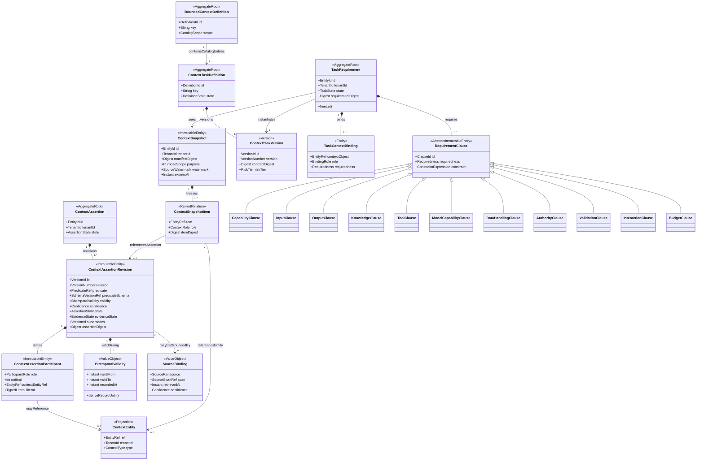
```mermaid
classDiagram
    class ContextEntity {
      <<Projection>>
      +EntityRef ref
      +TenantId tenantId
      +ContextType type
    }
    class ContextAssertion {
      <<AggregateRoot>>
      +EntityId id
      +TenantId tenantId
      +AssertionState state
    }
    class ContextAssertionRevision {
      <<ImmutableEntity>>
      +VersionId id
      +VersionNumber revision
      +PredicateRef predicate
      +SchemaVersionRef predicateSchema
      +BitemporalValidity validity
      +Confidence confidence
      +AssertionState state
      +EvidenceState evidenceState
      +VersionId supersedes
      +Digest assertionDigest
    }
    class ContextAssertionParticipant {
      <<ImmutableEntity>>
      +ParticipantRole role
      +int ordinal
      +EntityRef contextEntityRef
      +TypedLiteral literal
    }
    class BitemporalValidity {
      <<ValueObject>>
      +Instant validFrom
      +Instant validTo
      +Instant recordedAt
      +deriveRecordUntil()
    }
    class SourceBinding {
      <<ValueObject>>
      +SourceRef source
      +SourceSpanRef span
      +Instant retrievedAt
      +Confidence confidence
    }
    class ContextSnapshot {
      <<ImmutableEntity>>
      +EntityId id
      +TenantId tenantId
      +Digest manifestDigest
      +PurposeScope purpose
      +SourceWatermark watermark
      +Instant expiresAt
    }
    class ContextSnapshotItem {
      <<ReifiedRelation>>
      +EntityRef item
      +ContextRole role
      +Digest itemDigest
    }
    class BoundedContextDefinition {
      <<AggregateRoot>>
      +DefinitionId id
      +String key
      +CatalogScope scope
    }
    class ContextTaskDefinition {
      <<AggregateRoot>>
      +DefinitionId id
      +String key
      +DefinitionState state
    }
    class ContextTaskVersion {
      <<Version>>
      +VersionId id
      +VersionNumber version
      +Digest contractDigest
      +RiskTier riskTier
    }
    class TaskRequirement {
      <<AggregateRoot>>
      +EntityId id
      +TenantId tenantId
      +TaskState state
      +Digest requirementDigest
      +freeze()
    }
    class TaskContextBinding {
      <<Entity>>
      +EntityRef contextObject
      +BindingRole role
      +Requiredness requiredness
    }
    class RequirementClause {
      <<AbstractImmutableEntity>>
      +ClauseId id
      +Requiredness requiredness
      +ConstraintExpression constraint
    }
    class CapabilityClause
    class InputClause
    class OutputClause
    class KnowledgeClause
    class ToolClause
    class ModelCapabilityClause
    class DataHandlingClause
    class AuthorityClause
    class ValidationClause
    class InteractionClause
    class BudgetClause

    ContextAssertion "1" *-- "1..*" ContextAssertionRevision : revisions
    ContextAssertionRevision "1" *-- "1..*" ContextAssertionParticipant : states
    ContextAssertionRevision "1" *-- "1" BitemporalValidity : validDuring
    ContextAssertionRevision "1" --> "0..*" SourceBinding : mayBeGroundedBy
    ContextAssertionParticipant "*" --> "0..1" ContextEntity : mayReference
    ContextSnapshot "1" *-- "1..*" ContextSnapshotItem : freezes
    ContextSnapshotItem "*" --> "0..1" ContextEntity : referencesEntity
    ContextSnapshotItem "*" --> "0..1" ContextAssertionRevision : referencesAssertion
    BoundedContextDefinition "1" --> "1..*" ContextTaskDefinition : containsCatalogEntries
    ContextTaskDefinition "1" *-- "1..*" ContextTaskVersion : versions
    TaskRequirement "*" --> "1" ContextTaskVersion : instantiates
    TaskRequirement "1" *-- "1..*" TaskContextBinding : binds
    TaskRequirement "1" *-- "1..*" RequirementClause : requires
    TaskRequirement "*" --> "1" ContextSnapshot : sees
    RequirementClause <|-- CapabilityClause
    RequirementClause <|-- InputClause
    RequirementClause <|-- OutputClause
    RequirementClause <|-- KnowledgeClause
    RequirementClause <|-- ToolClause
    RequirementClause <|-- ModelCapabilityClause
    RequirementClause <|-- DataHandlingClause
    RequirementClause <|-- AuthorityClause
    RequirementClause <|-- ValidationClause
    RequirementClause <|-- InteractionClause
    RequirementClause <|-- BudgetClause
```

**MVP-Minimalvertrag:** `recordedAt` und ein expliziter `EvidenceState` (`notRequired | linked | sourceUnavailable | reviewRequired`) sind verpflichtend; Valid Time darf unbekannt oder offen sein. Exakte Source Bindings sind optional und werden von Risk-/Tenant-Policy für materielle Externalization oder Actions verlangt. Fehlende Evidenz invalidiert eine interne Assertion nicht pauschal, kann aber Review oder externe Freigabe gaten. Jede Revision besitzt mindestens zwei semantisch ausreichende Participants. Pro Participant ist exakt eines von `contextEntityRef` und `literal` gesetzt. Pro `ContextSnapshotItem` ist exakt ein Entity- oder Assertion-Revision-Target gesetzt. Der Snapshot pinnt jeweils ID und Digest.

Typed Domain Aggregates werden nicht als Assertions dupliziert. `ContextAssertion` wird im MVP nur verwendet, wenn eine source-übergreifende semantische Aussage, eine mehrstellige Relation oder die zeitliche Kenntnislage selbst fachlich relevant ist. Eine allgemeine Ontologie-Autorierungsoberfläche, unbeschränkte Hyperedge-Typen und ein universeller temporaler Query-/Reasoning-Layer bleiben Full Product/Platform.

### 6.2 Skill Definition, Program, Release und Graphprojektion

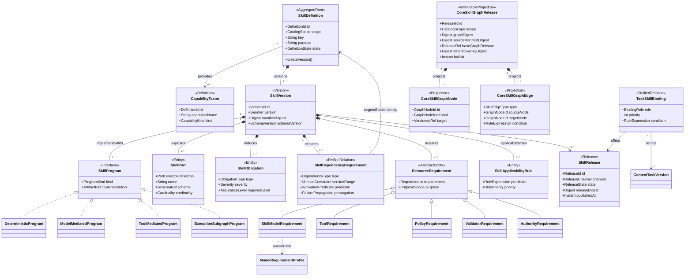
```mermaid
classDiagram
    class CapabilityTaxon {
      <<Definition>>
      +DefinitionId id
      +String canonicalName
      +CapabilityKind kind
    }
    class SkillDefinition {
      <<AggregateRoot>>
      +DefinitionId id
      +CatalogScope scope
      +String key
      +String purpose
      +DefinitionState state
      +createVersion()
    }
    class SkillVersion {
      <<Version>>
      +VersionId id
      +SemVer version
      +Digest manifestDigest
      +SchemaVersion schemaVersion
    }
    class SkillProgram {
      <<Interface>>
      +ProgramKind kind
      +ArtifactRef implementation
    }
    class DeterministicProgram
    class ModelMediatedProgram
    class ToolMediatedProgram
    class ExecutionSubgraphProgram
    class SkillPort {
      <<Entity>>
      +PortDirection direction
      +String name
      +SchemaRef schema
      +Cardinality cardinality
    }
    class SkillObligation {
      <<Entity>>
      +ObligationType type
      +Severity severity
      +AssuranceLevel requiredLevel
    }
    class SkillDependencyRequirement {
      <<ReifiedRelation>>
      +DependencyType type
      +VersionConstraint versionRange
      +ActivationPredicate predicate
      +FailurePropagation propagation
    }
    class ResourceRequirement {
      <<AbstractEntity>>
      +Requiredness requiredness
      +PurposeScope purpose
    }
    class SkillModelRequirement
    class ToolRequirement
    class PolicyRequirement
    class ValidatorRequirement
    class AuthorityRequirement
    class SkillApplicabilityRule {
      <<Entity>>
      +RuleExpression predicate
      +RulePriority priority
    }
    class SkillRelease {
      <<Release>>
      +ReleaseId id
      +ReleaseChannel channel
      +ReleaseState state
      +Digest releaseDigest
      +Instant publishedAt
    }
    class TaskSkillBinding {
      <<ReifiedRelation>>
      +BindingRole role
      +int priority
      +RuleExpression condition
    }
    class CoreSkillGraphRelease {
      <<ImmutableProjection>>
      +ReleaseId id
      +CatalogScope scope
      +Digest graphDigest
      +Digest sourceManifestDigest
      +ReleaseRef baseGraphRelease
      +Digest tenantOverlayDigest
      +Instant builtAt
    }
    class CoreSkillGraphNode {
      <<Projection>>
      +GraphNodeId id
      +GraphNodeKind kind
      +VersionedRef target
    }
    class CoreSkillGraphEdge {
      <<Projection>>
      +SkillEdgeType type
      +GraphNodeId sourceNode
      +GraphNodeId targetNode
      +RuleExpression condition
    }

    SkillDefinition "*" --> "0..*" CapabilityTaxon : provides
    SkillDefinition "1" *-- "1..*" SkillVersion : versions
    SkillVersion "1" *-- "1" SkillProgram : implementsWith
    SkillProgram <|.. DeterministicProgram
    SkillProgram <|.. ModelMediatedProgram
    SkillProgram <|.. ToolMediatedProgram
    SkillProgram <|.. ExecutionSubgraphProgram
    SkillVersion "1" *-- "1..*" SkillPort : exposes
    SkillVersion "1" *-- "0..*" SkillObligation : induces
    SkillVersion "1" *-- "0..*" SkillDependencyRequirement : declares
    SkillDependencyRequirement "*" --> "1" SkillDefinition : targetsStableIdentity
    SkillVersion "1" *-- "0..*" ResourceRequirement : requires
    ResourceRequirement <|-- SkillModelRequirement
    ResourceRequirement <|-- ToolRequirement
    ResourceRequirement <|-- PolicyRequirement
    ResourceRequirement <|-- ValidatorRequirement
    ResourceRequirement <|-- AuthorityRequirement
    SkillModelRequirement "*" --> "1" ModelRequirementProfile : usesProfile
    SkillVersion "1" *-- "0..*" SkillApplicabilityRule : applicableWhen
    SkillVersion "1" --> "0..*" SkillRelease : publishedAs
    TaskSkillBinding "*" --> "1" ContextTaskVersion : serves
    TaskSkillBinding "*" --> "1" SkillRelease : offers
    CoreSkillGraphRelease "1" *-- "1..*" CoreSkillGraphNode : projects
    CoreSkillGraphRelease "1" *-- "1..*" CoreSkillGraphEdge : projects
```

`SkillRelease` publiziert genau eine immutable `SkillVersion` in einen Channel; es ist keine zweite Version. Eine Tenant-Anpassung erzeugt einen tenant-scoped Fork mit Herkunftsreferenz, niemals eine Mutation der Platform-Version. Der Build Manifest eines `CoreSkillGraphRelease` pinnt mindestens Blueprint Release, Base Graph Release, Tenant Overlay Release, Task-/Skill-Binding-Revisions, Compiler-/Schema-Version und Source Digest. Der Resolver akzeptiert nur verifizierte, veröffentlichte Graph Snapshots; jeder Edge-Endpunkt muss als Node desselben Releases existieren.

### 6.3 Resolution und ausgewertete Skill-Release-Closure

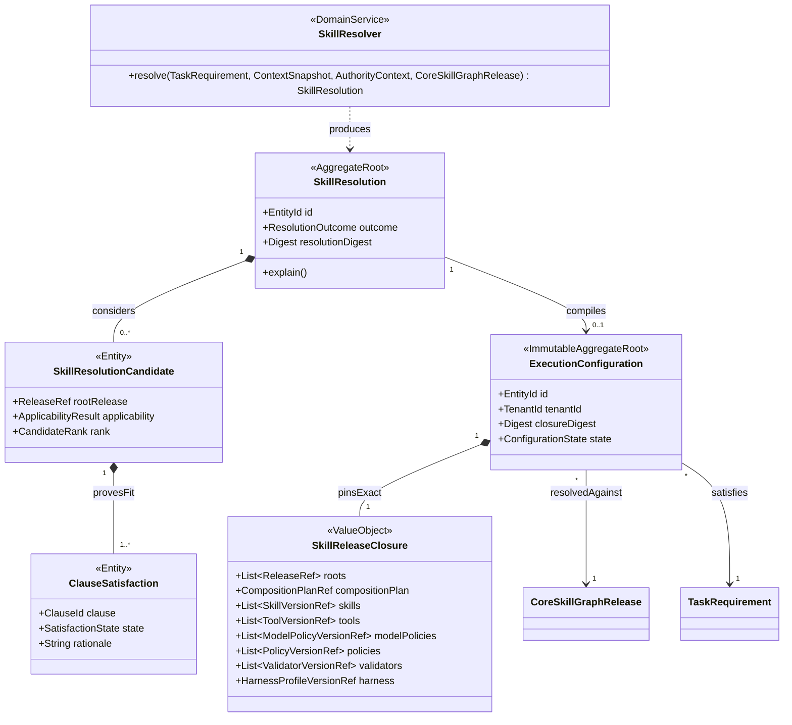
```mermaid
classDiagram
    class SkillResolver {
      <<DomainService>>
      +resolve(TaskRequirement, ContextSnapshot, AuthorityContext, CoreSkillGraphRelease) SkillResolution
    }
    class SkillResolution {
      <<AggregateRoot>>
      +EntityId id
      +ResolutionOutcome outcome
      +Digest resolutionDigest
      +explain()
    }
    class SkillResolutionCandidate {
      <<Entity>>
      +ReleaseRef rootRelease
      +ApplicabilityResult applicability
      +CandidateRank rank
    }
    class ClauseSatisfaction {
      <<Entity>>
      +ClauseId clause
      +SatisfactionState state
      +String rationale
    }
    class ExecutionConfiguration {
      <<ImmutableAggregateRoot>>
      +EntityId id
      +TenantId tenantId
      +Digest closureDigest
      +ConfigurationState state
    }
    class SkillReleaseClosure {
      <<ValueObject>>
      +List~ReleaseRef~ roots
      +CompositionPlanRef compositionPlan
      +List~SkillVersionRef~ skills
      +List~ToolVersionRef~ tools
      +List~ModelPolicyVersionRef~ modelPolicies
      +List~PolicyVersionRef~ policies
      +List~ValidatorVersionRef~ validators
      +HarnessProfileVersionRef harness
    }

    SkillResolver ..> SkillResolution : produces
    SkillResolution "1" *-- "0..*" SkillResolutionCandidate : considers
    SkillResolutionCandidate "1" *-- "1..*" ClauseSatisfaction : provesFit
    SkillResolution "1" --> "0..1" ExecutionConfiguration : compiles
    ExecutionConfiguration "1" *-- "1" SkillReleaseClosure : pinsExact
    ExecutionConfiguration "*" --> "1" CoreSkillGraphRelease : resolvedAgainst
    ExecutionConfiguration "*" --> "1" TaskRequirement : satisfies
```

Zulässige Resolution Outcomes sind `DIRECT`, `COMPOSED`, `ADJUDICATION_REQUIRED` und `UNRESOLVED`. Nur eine vollständig evaluierte, policy-admitted `ExecutionConfiguration` darf in einen `RunPlan` eingehen. Ein `TaskRequirement` referenziert daher **nie direkt** Prompt, Modell, Provider, Tool oder lose Skill-ID.

### 6.4 Skill-Graph-Kernrelationen

| Relation | Semantik |
|---|---|
| `CAN_SATISFY` | Eine veröffentlichte Skill-Version kann Clauses eines versionierten Task Contracts erfüllen |
| `PROVIDES_CAPABILITY` / `REQUIRES_CAPABILITY` | Verbindet ausführbare Skills und Aufgaben mit dem gemeinsamen `CapabilityTaxon` |
| `REQUIRES_SKILL` | Deklarierte Abhängigkeit auf stabile Skill-Identität plus Version Constraint; Closure pinnt exakte Version |
| `SPECIALIZES` | Engere Skill-Semantik mit zusätzlichen Preconditions/Obligations |
| `ALTERNATIVE_TO` / `FALLBACK_TO` | Zulässige Alternative bzw. expliziter Degradationspfad |
| `CONFLICTS_WITH` | Nicht gemeinsam zulässige Komponenten |
| `CONSUMES` / `PRODUCES` | Artifact-/Schema-Ports und Kardinalitäten |
| `REQUIRES_RESOURCE` | Tool-, Model-Bridge-, Knowledge-, Policy- oder Harness-Requirement |
| `INDUCES_OBLIGATION` | Durch Skill/Risiko entstehender Pflichtnachweis |
| `REQUIRES_AUTHORITY` / `MAY_PRODUCE_EFFECT` | Benötigter Scope und mögliche externe oder fachlich bindende Wirkung |
| `DISCHARGED_BY` | Validator bzw. Assurance-Pfad, der eine Obligation entladen kann |

Die Graph-Relationen werden aus typisierten Tabellen als `v_core_skill_nodes`/`v_core_skill_edges` oder materialisierte Projektion angeboten. Kein Product Module schreibt freie Edge-Typen direkt in den Graph.

---

## 7. UML – Execution Graph, RunPlan und Harness


```mermaid
classDiagram
    class ExecutionGraphDefinition {
      <<AggregateRoot>>
      +DefinitionId id
      +String key
      +DefinitionState state
    }
    class ExecutionGraphVersion {
      <<Version>>
      +VersionId id
      +VersionNumber version
      +Digest graphDigest
      +validateTopology()
    }
    class ExecutionNodeDefinition {
      <<AbstractEntity>>
      +NodeDefinitionId id
      +NodeKind kind
      +SchemaRef inputSchema
      +SchemaRef outputSchema
    }
    class DeterministicNode
    class SkillInvocationNode
    class SubgraphInvocationNode
    class ValidationGateNode
    class HumanApprovalNode
    class WaitEventNode
    class EffectProposalNode
    class CommitEffectNode
    class ExecutionEdge {
      <<Entity>>
      +EdgeType type
      +GuardExpression guard
      +NodeDefinitionId source
      +NodeDefinitionId target
    }
    class LoopPolicy {
      <<ValueObject>>
      +int maxIterations
      +int maxActivations
      +Duration wallTimeBudget
      +Money costBudget
      +ProgressRule progressRule
      +ExitPredicate exitPredicate
    }
    class LoopRegionDefinition {
      <<ImmutableVersionPart>>
      +EntityId id
      +NodeDefinitionId entry
      +NodeDefinitionId exit
    }
    class RunPlan {
      <<AggregateRoot>>
      +EntityId id
      +TenantId tenantId
      +Digest planDigest
      +RunPlanState state
      +admit()
    }
    class RunPlanBinding {
      <<Entity>>
      +BindingKind kind
      +VersionedRef target
      +Digest witnessDigest
    }
    class ExecutionJob {
      <<AggregateRoot>>
      +EntityId id
      +TenantId tenantId
      +JobState state
      +IdempotencyKey requestKey
    }
    class ExecutionRun {
      <<AggregateRoot>>
      +RunId id
      +int runAttempt
      +RunState state
      +Instant startedAt
      +Instant completedAt
    }
    class NodeActivation {
      <<Entity>>
      +EntityId id
      +NodeDefinitionId node
      +int iteration
      +int attempt
      +ActivationState state
    }
    class LoopInstance {
      <<Entity>>
      +EntityId id
      +EntityRef loopRegion
      +EntityId parentLoop
      +int iterationCount
      +int activationCount
      +BudgetConsumption consumed
      +LoopState state
      +LoopExitReason exitReason
    }
    class ProgressWitness {
      <<ImmutableEntity>>
      +EntityId id
      +int iteration
      +Digest witnessDigest
      +ProgressAssessment assessment
    }
    class Checkpoint {
      <<Entity>>
      +EntityId id
      +Digest stateDigest
      +CheckpointKind kind
    }
    class EffectRequest {
      <<AggregateRoot>>
      +EntityId id
      +EffectKind kind
      +EntityRef target
      +EffectHash effectHash
      +Reversibility reversibility
      +EffectState state
    }
    class DomainCommand {
      <<Entity>>
      +EntityId id
      +CommandType type
      +IdempotencyKey idempotencyKey
    }
    class EffectAdmissionDecision {
      <<Decision>>
      +EntityId id
      +EffectHash effectHash
      +AdmissionVerdict verdict
      +Digest authoritySnapshotDigest
      +Digest witnessSetDigest
      +Instant expiresAt
    }
    class CommitReceipt {
      <<ImmutableEntity>>
      +EntityId id
      +EffectHash effectHash
      +CommitStatus status
      +Instant committedAt
    }
    class HarnessProfileDefinition {
      <<AggregateRoot>>
      +DefinitionId id
      +String key
      +HarnessKind kind
    }
    class HarnessProfileVersion {
      <<Version>>
      +VersionId id
      +Digest profileDigest
      +ResourceLimits limits
      +NetworkMode networkMode
    }
    class HarnessSession {
      <<AggregateRoot>>
      +EntityId id
      +HarnessKind kind
      +SessionState state
      +Instant expiresAt
    }
    class HarnessPack {
      <<ImmutableAggregateRoot>>
      +EntityId id
      +Digest packDigest
      +Duration ttl
    }
    class HarnessPackItem {
      <<Entity>>
      +PackItemKind kind
      +ArtifactRef itemRef
      +PackItemRole role
      +Digest digest
    }
    class CapabilityLease {
      <<ImmutableEntity>>
      +EntityId id
      +Audience audience
      +ActionSet actions
      +ResourceScope scope
      +EntityRef sourceAuthority
      +RunPlanRef runPlan
      +PurposeScope purpose
      +Instant expiresAt
    }
    class ResultBundle {
      <<ImmutableEntity>>
      +EntityId id
      +Digest resultDigest
      +SchemaRef outputSchema
    }
    class ResultCandidate {
      <<ImmutableEntity>>
      +EntityId id
      +int sequence
      +CandidateState state
    }

    ExecutionGraphDefinition "1" *-- "1..*" ExecutionGraphVersion : versions
    ExecutionGraphVersion "1" *-- "1..*" ExecutionNodeDefinition : nodes
    ExecutionGraphVersion "1" *-- "1..*" ExecutionEdge : edges
    ExecutionGraphVersion "1" *-- "0..*" LoopRegionDefinition : loopRegions
    LoopRegionDefinition "1" *-- "1" LoopPolicy : boundedBy
    ExecutionEdge "1" --> "0..1" LoopRegionDefinition : crossesBoundaryOf
    ExecutionNodeDefinition <|-- DeterministicNode
    ExecutionNodeDefinition <|-- SkillInvocationNode
    ExecutionNodeDefinition <|-- SubgraphInvocationNode
    ExecutionNodeDefinition <|-- ValidationGateNode
    ExecutionNodeDefinition <|-- HumanApprovalNode
    ExecutionNodeDefinition <|-- WaitEventNode
    ExecutionNodeDefinition <|-- EffectProposalNode
    ExecutionNodeDefinition <|-- CommitEffectNode
    RunPlan "1" --> "1" ExecutionGraphVersion : freezes
    RunPlan "1" *-- "1..*" RunPlanBinding : pins
    RunPlan "1" --> "1" SkillResolution : realizes
    RunPlan "1" --> "1" ExecutionConfiguration : configures
    ExecutionJob "*" --> "1" TaskRequirement : requestedAs
    ExecutionJob "1" --> "0..1" RunPlan : admits
    ExecutionJob "1" --> "0..*" ExecutionRun : attemptedBy
    ExecutionRun "*" --> "1" RunPlan : executes
    ExecutionRun "1" *-- "0..*" NodeActivation : unrolls
    ExecutionRun "1" *-- "0..*" LoopInstance : bounds
    LoopInstance "1" *-- "0..*" ProgressWitness : records
    ExecutionRun "1" *-- "0..*" Checkpoint : checkpoints
    NodeActivation "1" --> "0..1" HarnessSession : uses
    HarnessProfileDefinition "1" *-- "1..*" HarnessProfileVersion : versions
    HarnessSession "*" --> "1" HarnessProfileVersion : instantiates
    HarnessSession "1" *-- "1" HarnessPack : constrainedBy
    HarnessPack "1" *-- "1..*" HarnessPackItem : contains
    HarnessSession "1" --> "0..*" CapabilityLease : mayUse
    HarnessSession "1" --> "0..*" ResultCandidate : submits
    ResultCandidate "1" --> "1" ResultBundle : packages
    ResultCandidate "1" --> "1" ValidationCase : verifiedBy
    NodeActivation "1" --> "0..*" EffectRequest : proposes
    EffectRequest "1" --> "0..1" EffectAdmissionDecision : evaluatedBy
    EffectAdmissionDecision "1" --> "0..1" DomainCommand : admits
    EffectAdmissionDecision "*" --> "1" AuthorizationDecision : requires
    EffectAdmissionDecision "*" --> "0..*" ValidationAttestation : requires
    EffectAdmissionDecision "*" --> "0..*" ApprovalDecision : requires
    DomainCommand "1" --> "0..1" CommitReceipt : produces
```

### 7.1 Execution-Subtypen

| Node-Typ | Darf | Darf nicht |
|---|---|---|
| `DeterministicNode` | typisierte Transformation, Schema-/Rule-Check | Modell- oder Tool-Freiheit implizieren |
| `SkillInvocationNode` | eine gepinnte Skill Release Closure ausführen | zur Laufzeit `latest` wählen |
| `SubgraphInvocationNode` | eine gepinnte, wiederverwendbare Execution-Subgraph-Version aufrufen | dynamisch freie Agenten erzeugen |
| `ValidationGateNode` | `ValidationCase`/Obligations auslösen | selbst fachliche Approval erteilen |
| `HumanApprovalNode` | exakten Proposal-/Effect-Hash zur Entscheidung stellen | Approval mit Validation verwechseln |
| `WaitEventNode` | durable pausieren und auf Signal warten | unbounded pollen |
| `EffectProposalNode` | geplante fachliche/externe Wirkung als `EffectRequest` materialisieren | diese Wirkung selbst committen |
| `CommitEffectNode` | reautorisierten Domain Command über Owner-Service committen | Domain State direkt mutieren |

Model- und Tool-Aufrufe sind **keine von einer contextual task direkt wählbaren Node-Typen**. Sie sind Implementierungsaktivitäten eines gepinnten `SkillProgram`, laufen über Model Bridge bzw. Tool Gateway und erzeugen `ModelInvocationRecord`/`ToolInvocationRecord`. Dadurch bleibt die Skill-Closure die fachliche Ausführungseinheit, während Provider, Modell und Credential außerhalb des Graphen kontrolliert werden.

### 7.2 Job, Retry, Loop und Trace

- Ein admitierter `RunPlan` pinnt Blueprint-/Effective-Configuration-Release, Context Snapshot, Core Skill Graph Release, Skill Resolution, Execution Configuration, Execution-/Validation-Graph-Version, kompilierte Obligations, Policy Set, Authority Context, Model Policies, Tool-/Connector-/Harness-Versionen sowie Input- und State-Witness-Digests. Kein Binding darf `latest` referenzieren.
- `ExecutionJob` ist der idempotente Arbeitsauftrag; `ExecutionRun` ist ein Versuch. Ein Retry erzeugt einen neuen Run unter demselben Job.
- Eine Schleife ist ein expliziter, versionierter Rücksprung mit `LoopPolicy`. `LoopInstance` zählt Iterationen, Aktivierungen, Kosten, Zeit und Progress Witnesses.
- Die Definition darf kontrollierte Zyklen enthalten; der beobachtete Trace wird über `NodeActivation` zeitlich ausgerollt und bleibt azyklisch auswertbar.
- Jede Schleife endet mit `SUCCESS`, `EXIT_CONDITION`, `BUDGET_EXHAUSTED`, `NO_PROGRESS`, `VALIDATION_BLOCKED`, `CANCELLED` oder `FAILED`.
- Kein Run darf Definitionen, Skill-Versionen, Validatoren oder Policies in Produktion selbst verändern. Verbesserungen werden als versionierte Kandidaten in den Eval-/Promotion-Pfad gegeben.

### 7.3 Harness-Grenze

`HarnessProfileVersion` beschreibt den Runtime-Typ; `HarnessPack` ist das job-scoped, immutable Paket; `HarnessSession` ist die kurzlebige Ausführung. Das optionale Harness App – etwa eine Codex-artige Oberfläche für technische Nutzer – ist ein Client dieser Aggregate, nicht deren Besitzer. Nicht-technische Nutzer können dieselben Skills über geführte Product-App-Flows ausführen.

Der Harness erhält weder freie Datenbankzugriffe noch langlebige Credentials. Kurzlebige `CapabilityLease`s werden out-of-band an Quellgrant/Delegation, RunPlan, HarnessSession, exakt gepinnte Tool-/Connector-Operation, Resource Scope, Purpose und Expiry gebunden. Ein `ResultBundle` ist zunächst Output zur Verifikation; mehrere `ResultCandidate`s können iterativ geprüft werden. Bindender Domain State entsteht ausschließlich über `EffectRequest → Policy/Validation/Approval/Authorization → EffectAdmissionDecision → DomainCommand → CommitReceipt`.

### 7.4 Tool Gateway Contract

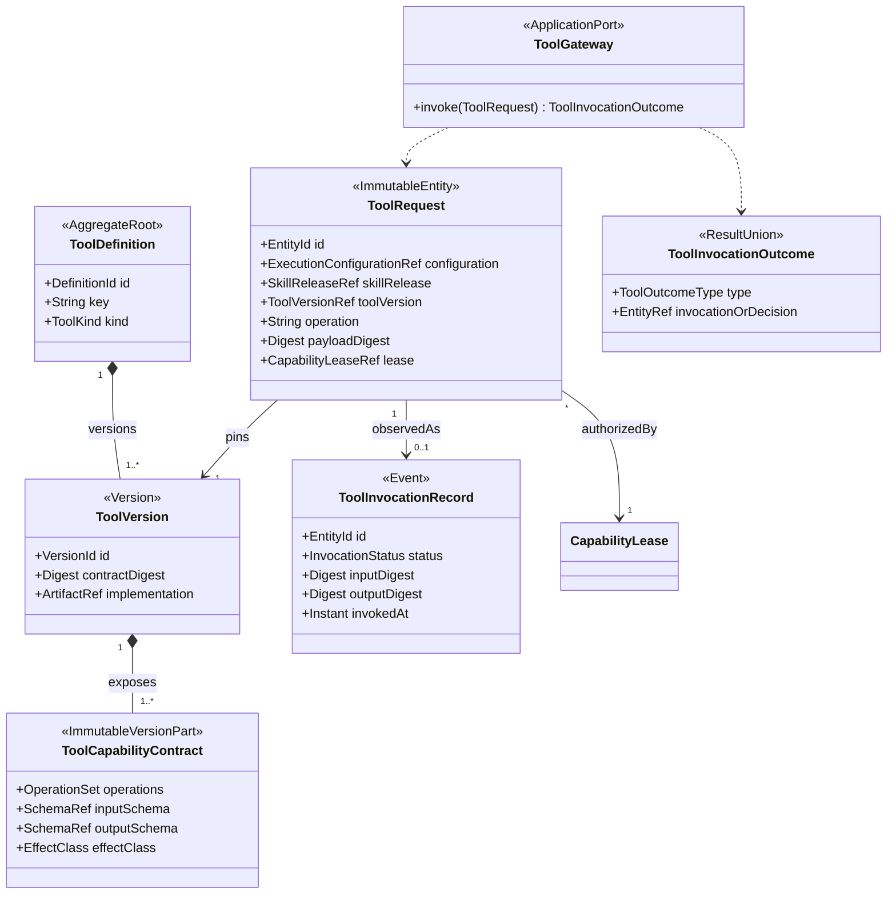
```mermaid
classDiagram
    class ToolDefinition {
      <<AggregateRoot>>
      +DefinitionId id
      +String key
      +ToolKind kind
    }
    class ToolVersion {
      <<Version>>
      +VersionId id
      +Digest contractDigest
      +ArtifactRef implementation
    }
    class ToolCapabilityContract {
      <<ImmutableVersionPart>>
      +OperationSet operations
      +SchemaRef inputSchema
      +SchemaRef outputSchema
      +EffectClass effectClass
    }
    class ToolRequest {
      <<ImmutableEntity>>
      +EntityId id
      +ExecutionConfigurationRef configuration
      +SkillReleaseRef skillRelease
      +ToolVersionRef toolVersion
      +String operation
      +Digest payloadDigest
      +CapabilityLeaseRef lease
    }
    class ToolInvocationRecord {
      <<Event>>
      +EntityId id
      +InvocationStatus status
      +Digest inputDigest
      +Digest outputDigest
      +Instant invokedAt
    }
    class ToolInvocationOutcome {
      <<ResultUnion>>
      +ToolOutcomeType type
      +EntityRef invocationOrDecision
    }
    class ToolGateway {
      <<ApplicationPort>>
      +invoke(ToolRequest) ToolInvocationOutcome
    }

    ToolDefinition "1" *-- "1..*" ToolVersion : versions
    ToolVersion "1" *-- "1..*" ToolCapabilityContract : exposes
    ToolRequest "*" --> "1" ToolVersion : pins
    ToolRequest "*" --> "1" CapabilityLease : authorizedBy
    ToolRequest "1" --> "0..1" ToolInvocationRecord : observedAs
    ToolGateway ..> ToolRequest
    ToolGateway ..> ToolInvocationOutcome
```

Connector Reads/Snapshots verwenden denselben Capability-/Audit-Vertrag, behalten aber zusätzlich `ConnectorInstallation`, `SourceScope`, `SyncCursor` und `SourceSnapshot`. Write-/Outbound-Operationen müssen als Effects klassifiziert werden und durch den Effect-Admission-Pfad gehen.

---

## 8. UML – Validation & Assurance


```mermaid
classDiagram
    class ValidationGraphDefinition {
      <<AggregateRoot>>
      +DefinitionId id
      +String key
      +DefinitionState state
    }
    class ValidationGraphVersion {
      <<Version>>
      +VersionId id
      +VersionNumber version
      +Digest graphDigest
      +validateAcyclicSupport()
    }
    class ValidationGraphEdge {
      <<ImmutableVersionPart>>
      +EntityId id
      +ValidationEdgeType type
      +EntityId sourceNode
      +EntityId targetNode
    }
    class ValidationGraphNode {
      <<ImmutableVersionPart>>
      +EntityId id
      +ValidationNodeKind kind
      +EntityRef definitionRef
    }
    class ValidationObligationDefinition {
      <<Entity>>
      +EntityId id
      +ObligationType type
      +Severity severity
      +AssuranceLevel requiredLevel
    }
    class AcceptanceCriterion {
      <<ValueObject>>
      +CriterionType type
      +RuleExpression acceptanceRule
      +RuleExpression inconclusiveRule
    }
    class ClaimDefinition {
      <<Entity>>
      +EntityId id
      +String statementTemplate
      +ClaimType type
    }
    class ArgumentStrategy {
      <<Entity>>
      +EntityId id
      +StrategyType type
      +String rationale
    }
    class EvidenceRequirement {
      <<Entity>>
      +EntityId id
      +EvidenceKind kind
      +FreshnessRule freshness
      +AdmissibilityRule admissibility
    }
    class ValidatorDefinition {
      <<AggregateRoot>>
      +DefinitionId id
      +String key
      +ValidatorKind kind
      +DefinitionState state
    }
    class ValidatorVersion {
      <<Version>>
      +VersionId id
      +Digest validatorDigest
      +CalibrationProfileRef calibration
    }
    class ValidationCase {
      <<AggregateRoot>>
      +EntityId id
      +TenantId tenantId
      +ValidationCaseState state
      +EntityRef subjectRef
      +Digest subjectDigest
      +evaluateFrontier()
    }
    class ValidationCaseCompilation {
      <<ImmutableEntity>>
      +EntityId id
      +Digest sourceManifestDigest
      +Digest obligationSetDigest
      +RiskTier riskTier
    }
    class ValidationObligation {
      <<Entity>>
      +EntityId id
      +EntityRef definitionRef
      +ObligationState state
      +Severity severity
      +AssuranceLevel achievedLevel
    }
    class Claim {
      <<Entity>>
      +EntityId id
      +EntityRef definitionRef
      +String statement
      +ClaimState state
    }
    class EvidenceRef {
      <<ReifiedRelation>>
      +EntityId id
      +EvidenceRole role
      +AdmissibilityState admissibility
      +ArtifactVersionRef artifact
      +SourceSpanRef sourceSpan
    }
    class ValidatorRun {
      <<RuntimeInstance>>
      +EntityId id
      +ValidatorRunState state
      +Digest inputDigest
    }
    class ValidationResult {
      <<ImmutableEntity>>
      +EntityId id
      +Verdict verdict
      +String rationale
      +Confidence confidence
    }
    class Finding {
      <<Entity>>
      +EntityId id
      +FindingSeverity severity
      +FindingState state
    }
    class Defeater {
      <<Entity>>
      +EntityId id
      +DefeaterType type
      +DefeaterState state
    }
    class ValidationAttestation {
      <<ImmutableEntity>>
      +EntityId id
      +Digest attestationDigest
      +EntityRef subjectRef
      +Digest evidenceClosureDigest
      +ValidationGraphVersionRef graphVersion
      +PolicySetVersionRef policySet
      +Instant validUntil
    }
    class ValidationDecision {
      <<Decision>>
      +EntityId id
      +ValidationVerdict verdict
      +String rationale
      +Instant decidedAt
    }
    class AdjudicationRequest {
      <<AggregateRoot>>
      +EntityId id
      +AdjudicationState state
      +RoleRef requiredRole
    }
    class HumanAdjudication {
      <<Decision>>
      +EntityId id
      +DecisionOutcome outcome
      +PrincipalId decisionMaker
      +ApprovalMandateRef mandate
      +String rationale
      +Instant expiresAt
    }
    class WaiverDecision {
      <<Decision>>
      +EntityId id
      +WaiverScope scope
      +PrincipalId decisionMaker
      +ApprovalMandateRef mandate
      +String justification
      +Instant expiresAt
    }
    class Remediation {
      <<Entity>>
      +EntityId id
      +RemediationState state
      +TaskRequirementRef task
    }
    class InvalidationEvent {
      <<Event>>
      +EntityId id
      +InvalidationReason reason
      +VersionedRef changedDependency
    }
    class ResultVerifier {
      <<DomainService>>
      +openCase(ResultCandidate, ValidationCaseCompilation) ValidationCase
      +report(ValidationCase) ResultVerificationReport
    }
    class ResultVerificationReport {
      <<Projection>>
      +EntityId id
      +ValidationCaseRef validationCase
      +ValidationVerdict verdict
      +Digest reportDigest
    }

    ValidationGraphDefinition "1" *-- "1..*" ValidationGraphVersion : versions
    ValidationGraphVersion "1" *-- "1..*" ValidationGraphNode : nodes
    ValidationGraphVersion "1" *-- "1..*" ValidationObligationDefinition : obligations
    ValidationGraphVersion "1" *-- "1..*" ValidationGraphEdge : topology
    ValidationGraphNode "1" --> "0..*" ValidationGraphEdge : sourceOrTarget
    ValidationObligationDefinition "1" *-- "1..*" AcceptanceCriterion : criteria
    ValidationObligationDefinition "1" --> "1..*" ClaimDefinition : requiresClaims
    ClaimDefinition "*" --> "0..*" ArgumentStrategy : decomposedBy
    ClaimDefinition "*" --> "0..*" EvidenceRequirement : requiresEvidence
    ValidationObligationDefinition "*" --> "1..*" ValidatorVersion : checkedBy
    ValidatorDefinition "1" *-- "1..*" ValidatorVersion : versions
    ValidationCase "*" --> "1" ValidationGraphVersion : instantiates
    ValidationCase "1" *-- "1" ValidationCaseCompilation : compiledFrom
    ValidationCase "1" *-- "1..*" ValidationObligation : tracks
    ValidationObligation "1" *-- "1..*" Claim : contains
    Claim "1" --> "0..*" EvidenceRef : supportedOrChallengedBy
    ValidationObligation "1" --> "0..*" ValidatorRun : invokes
    ValidatorRun "1" --> "1" ValidatorVersion : executes
    ValidatorRun "1" --> "1" ValidationResult : produces
    ValidationResult "1" --> "0..*" Finding : reports
    Claim "1" --> "0..*" Defeater : challengedBy
    ValidationCase "1" --> "0..*" ValidationAttestation : attests
    ValidationCase "1" --> "0..*" ValidationDecision : decidedBy
    ValidationCase "1" --> "0..*" AdjudicationRequest : escalates
    AdjudicationRequest "1" --> "0..1" HumanAdjudication : resolvedBy
    ValidationObligation "1" --> "0..1" WaiverDecision : exceptedBy
    Finding "1" --> "0..*" Remediation : addressedBy
    ValidationAttestation "1" --> "0..*" InvalidationEvent : invalidatedBy
    ResultVerifier ..> ResultCandidate
    ResultVerifier ..> ValidationCase
    ResultVerifier ..> ResultVerificationReport
```

### 8.1 Validator-Klassen

`ValidationGraphEdge.type` ist geschlossen auf `REQUIRES`, `DECOMPOSES`, `SUPPORTS`, `CHALLENGES` und `DEFEATS`. Der positive Support-/Requires-Teil bleibt azyklisch; Challenge-/Defeater-Relationen dürfen frühere Reliance entkräften, erzeugen aber keine zirkuläre Selbstbegründung. `ValidationCaseCompilation` pinnt Task Clauses, Skill Obligations, Risk Policy, Effect Type, Graph-/Validator-Versionen und deren Source Manifest.

| Klasse | Typische Nutzung | Autorität |
|---|---|---|
| `DeterministicValidator` | Schema, Signatur, RLS/Tenant, SourceBinding, Hash, Idempotenz | kann klar beobachtbare harte Obligations entladen |
| `PolicyValidator` | Datenfluss, Tool-/Effect-Scope, Retention, Egress | harte Gate-Entscheidung über versionierte Policy |
| `SimulationValidator` | Dry Run, Sandbox, DOCX Render/Diff, Environment State | evidenzbasierter Hard-/Risk-Gate |
| `ModelValidator` | Faithfulness, Coverage, Relevanz, offene Qualitätsdimensionen | kalibrierte Evidenz; allein nie Commit-Autorität bei hohem Risiko |
| `HumanValidator` | semantische, normative, strategische oder fachlich offene Entscheidung | kontextuelle Adjudication, nicht universelle Wahrheit |
| `CompositeValidator` | kombinierte Boolean Gates und Soft Scores | Contract definiert, welche Teilergebnisse zwingend sind |

Ein fehlender oder unklarer Nachweis ergibt `INCONCLUSIVE`, nicht `PASS`. Jede offene mandatory Obligation mit `FAIL` oder `INCONCLUSIVE` blockiert den governed Transition. Eine Waiver akzeptiert ausschließlich ein explizit waivable Risk; sie verwandelt weder einen falschen Claim noch fehlende Evidenz in `PASS`. Für `ValidationAttestation` wird effektive Gültigkeit aus Issuance, Scope, Expiry und append-only `InvalidationEvent`s berechnet, nicht durch Mutation der Attestation.

---

## 9. UML – Authority, Approval und Policy

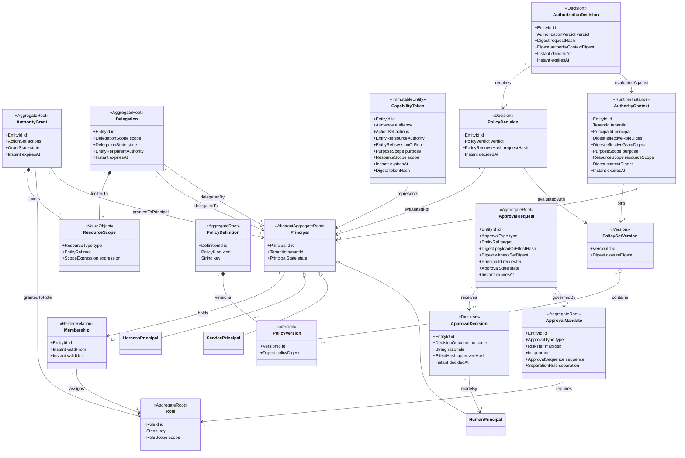
```mermaid
classDiagram
    class Principal {
      <<AbstractAggregateRoot>>
      +PrincipalId id
      +TenantId tenantId
      +PrincipalState state
    }
    class HumanPrincipal
    class ServicePrincipal
    class HarnessPrincipal
    class Role {
      <<AggregateRoot>>
      +RoleId id
      +String key
      +RoleScope scope
    }
    class Membership {
      <<ReifiedRelation>>
      +EntityId id
      +Instant validFrom
      +Instant validUntil
    }
    class ResourceScope {
      <<ValueObject>>
      +ResourceType type
      +EntityRef root
      +ScopeExpression expression
    }
    class AuthorityGrant {
      <<AggregateRoot>>
      +EntityId id
      +ActionSet actions
      +GrantState state
      +Instant expiresAt
    }
    class Delegation {
      <<AggregateRoot>>
      +EntityId id
      +DelegationScope scope
      +DelegationState state
      +EntityRef parentAuthority
      +Instant expiresAt
    }
    class ApprovalMandate {
      <<AggregateRoot>>
      +EntityId id
      +ApprovalType type
      +RiskTier maxRisk
      +int quorum
      +ApprovalSequence sequence
      +SeparationRule separation
    }
    class CapabilityToken {
      <<ImmutableEntity>>
      +EntityId id
      +Audience audience
      +ActionSet actions
      +EntityRef sourceAuthority
      +EntityRef sessionOrRun
      +PurposeScope purpose
      +ResourceScope scope
      +Instant expiresAt
      +Digest tokenHash
    }
    class PolicyDefinition {
      <<AggregateRoot>>
      +DefinitionId id
      +PolicyKind kind
      +String key
    }
    class PolicyVersion {
      <<Version>>
      +VersionId id
      +Digest policyDigest
    }
    class PolicySetVersion {
      <<Version>>
      +VersionId id
      +Digest closureDigest
    }
    class PolicyDecision {
      <<Decision>>
      +EntityId id
      +PolicyVerdict verdict
      +PolicyRequestHash requestHash
      +Instant decidedAt
    }
    class ApprovalRequest {
      <<AggregateRoot>>
      +EntityId id
      +ApprovalType type
      +EntityRef target
      +Digest payloadOrEffectHash
      +Digest witnessSetDigest
      +PrincipalId requester
      +ApprovalState state
      +Instant expiresAt
    }
    class ApprovalDecision {
      <<Decision>>
      +EntityId id
      +DecisionOutcome outcome
      +String rationale
      +EffectHash approvedHash
      +Instant decidedAt
    }
    class AuthorityContext {
      <<RuntimeInstance>>
      +EntityId id
      +TenantId tenantId
      +PrincipalId principal
      +Digest effectiveRoleDigest
      +Digest effectiveGrantDigest
      +PurposeScope purpose
      +ResourceScope resourceScope
      +Digest contextDigest
      +Instant expiresAt
    }
    class AuthorizationDecision {
      <<Decision>>
      +EntityId id
      +AuthorizationVerdict verdict
      +Digest requestHash
      +Digest authorityContextDigest
      +Instant decidedAt
      +Instant expiresAt
    }

    Principal <|-- HumanPrincipal
    Principal <|-- ServicePrincipal
    Principal <|-- HarnessPrincipal
    Principal "1" --> "0..*" Membership : holds
    Membership "*" --> "1" Role : assigns
    AuthorityGrant "*" --> "0..1" Principal : grantedToPrincipal
    AuthorityGrant "*" --> "0..1" Role : grantedToRole
    AuthorityGrant "1" *-- "1" ResourceScope : covers
    Delegation "*" --> "1" Principal : delegatedBy
    Delegation "*" --> "1" Principal : delegatedTo
    Delegation "1" *-- "1" ResourceScope : limitedTo
    ApprovalMandate "*" --> "1..*" Role : requires
    CapabilityToken "*" --> "1" Principal : represents
    PolicyDefinition "1" *-- "1..*" PolicyVersion : versions
    PolicySetVersion "1" o-- "1..*" PolicyVersion : contains
    PolicyDecision "*" --> "1" PolicySetVersion : evaluatedWith
    PolicyDecision "*" --> "1" Principal : evaluatedFor
    ApprovalRequest "*" --> "1" ApprovalMandate : governedBy
    ApprovalRequest "1" --> "0..*" ApprovalDecision : receives
    ApprovalDecision "*" --> "1" HumanPrincipal : madeBy
    AuthorityContext "1" --> "1" Principal : represents
    AuthorityContext "1" --> "1" PolicySetVersion : pins
    AuthorizationDecision "*" --> "1" AuthorityContext : evaluatedAgainst
    AuthorizationDecision "*" --> "1" PolicyDecision : requires
```

**Commit-Regel:** Ein `ApprovalDecision` bindet den exakten Target-/Payload-/Effect-Hash, Approver, Mandate, Policy-Version, relevante State Witnesses und Expiry. Vor dem Commit werden Authority, Eligibility und Witness-Freshness erneut geprüft.

Ein Modell ist niemals `Principal` und kann keine Autorität besitzen. `HarnessPrincipal` bezeichnet ausschließlich eine authentisierte Runtime-/Session-Identität, deren Rechte aus kurzlebigen Grants/Leases stammen. Modelloutput kann eine Entscheidung begründen oder anfechten, aber weder menschliche Verantwortlichkeit noch Commit-Autorität übernehmen.

Genau eines der beiden Grant-Ziele – `Principal` oder `Role` – muss gesetzt sein. Eine Delegation darf Actions, Resource/Purpose Scope, Risiko und Laufzeit ihrer Parent Authority nur einschränken. `AuthorizationDecision` ist die technische Entscheidung, ob ein konkreter Request im eingefrorenen `AuthorityContext` zulässig ist; `ApprovalDecision` ist davon getrennte menschliche Zustimmung.

---

## 10. UML – Model Bridge

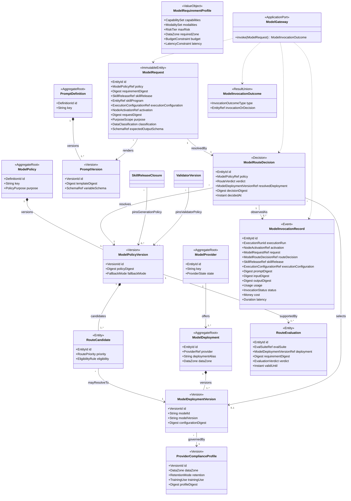
```mermaid
classDiagram
    class ModelRequirementProfile {
      <<ValueObject>>
      +CapabilitySet capabilities
      +ModalitySet modalities
      +RiskTier maxRisk
      +DataZone requiredZone
      +BudgetConstraint budget
      +LatencyConstraint latency
    }
    class ModelPolicy {
      <<AggregateRoot>>
      +DefinitionId id
      +String key
      +PolicyPurpose purpose
    }
    class ModelPolicyVersion {
      <<Version>>
      +VersionId id
      +Digest policyDigest
      +FallbackMode fallbackMode
    }
    class RouteCandidate {
      <<Entity>>
      +EntityId id
      +RoutePriority priority
      +EligibilityRule eligibility
    }
    class ModelProvider {
      <<AggregateRoot>>
      +EntityId id
      +String key
      +ProviderState state
    }
    class ModelDeployment {
      <<AggregateRoot>>
      +EntityId id
      +ProviderRef provider
      +String deploymentAlias
      +DataZone dataZone
    }
    class PromptDefinition {
      <<AggregateRoot>>
      +DefinitionId id
      +String key
    }
    class PromptVersion {
      <<Version>>
      +VersionId id
      +Digest templateDigest
      +SchemaRef variableSchema
    }
    class ModelDeploymentVersion {
      <<Version>>
      +VersionId id
      +String modelId
      +String modelVersion
      +Digest configurationDigest
    }
    class ProviderComplianceProfile {
      <<Version>>
      +VersionId id
      +DataZone dataZone
      +RetentionMode retention
      +TrainingUse trainingUse
      +Digest profileDigest
    }
    class RouteEvaluation {
      <<Entity>>
      +EntityId id
      +EvalSuiteRef evalSuite
      +ModelDeploymentVersionRef deployment
      +Digest requirementDigest
      +EvaluationVerdict verdict
      +Instant validUntil
    }
    class ModelRouteDecision {
      <<Decision>>
      +EntityId id
      +ModelPolicyRef policy
      +RouteVerdict verdict
      +ModelDeploymentVersionRef resolvedDeployment
      +Digest decisionDigest
      +Instant decidedAt
    }
    class ModelRequest {
      <<ImmutableEntity>>
      +EntityId id
      +ModelPolicyRef policy
      +Digest requirementDigest
      +SkillReleaseRef skillRelease
      +EntityRef skillProgram
      +ExecutionConfigurationRef executionConfiguration
      +NodeActivationRef activation
      +Digest requestDigest
      +PurposeScope purpose
      +DataClassification classification
      +SchemaRef expectedOutputSchema
    }
    class ModelInvocationRecord {
      <<Event>>
      +EntityId id
      +ExecutionRunId executionRun
      +NodeActivationRef activation
      +ModelRequestRef request
      +ModelRouteDecisionRef routeDecision
      +SkillReleaseRef skillRelease
      +ExecutionConfigurationRef executionConfiguration
      +Digest promptDigest
      +Digest inputDigest
      +Digest outputDigest
      +Usage usage
      +InvocationStatus status
      +Money cost
      +Duration latency
    }
    class ModelInvocationOutcome {
      <<ResultUnion>>
      +InvocationOutcomeType type
      +EntityRef invocationOrDecision
    }
    class ModelGateway {
      <<ApplicationPort>>
      +invoke(ModelRequest) ModelInvocationOutcome
    }

    ModelPolicy "1" *-- "1..*" ModelPolicyVersion : versions
    ModelPolicyVersion "1" *-- "1..*" RouteCandidate : candidates
    RouteCandidate "*" --> "1" ModelDeploymentVersion : mayResolveTo
    ModelProvider "1" --> "1..*" ModelDeployment : offers
    ModelDeployment "1" *-- "1..*" ModelDeploymentVersion : versions
    ModelDeploymentVersion "*" --> "1" ProviderComplianceProfile : governedBy
    ModelPolicyVersion "1" --> "1..*" RouteEvaluation : supportedBy
    ModelRouteDecision "*" --> "1" ModelPolicyVersion : resolves
    ModelRouteDecision "*" --> "0..1" ModelDeploymentVersion : selects
    PromptDefinition "1" *-- "1..*" PromptVersion : versions
    ModelRequest "*" --> "1" PromptVersion : renders
    ModelRequest "1" --> "1" ModelRouteDecision : resolvedBy
    ModelRouteDecision "1" --> "0..*" ModelInvocationRecord : observedAs
    ModelGateway ..> ModelRequest
    ModelGateway ..> ModelRouteDecision
    ModelGateway ..> ModelInvocationRecord
    ModelGateway ..> ModelInvocationOutcome
    SkillReleaseClosure "*" --> "0..*" ModelPolicyVersion : pinsGenerationPolicy
    ValidatorVersion "*" --> "0..1" ModelPolicyVersion : pinsValidatorPolicy
```

Model Bridge ist eine Registry, ein Resolver und ein auditierter Application Service, kein eigener Universalgraph und nicht der Governance Control Plane. Skills deklarieren ein `ModelRequirementProfile`; eine `ExecutionConfiguration` pinnt passende `ModelPolicyVersion`s; erst `ModelGateway` löst diese zu einem zulässigen `ModelDeploymentVersion` auf. `BLOCKED`, `NO_ELIGIBLE_ROUTE`, `POLICY_REVIEW_REQUIRED` und Provider Failure sind explizite Outcomes ohne selektiertes Deployment. Ein unzulässiger Fallback blockiert, statt still auf ein schwächeres Modell, eine andere Data Zone oder abweichende Retention zu degradieren. Generator und modellbasierter Validator verwenden getrennte Policy-IDs und Route Decisions. `PromptDefinition/Version` gehört fachlich zum Skill-/Instruction-Asset-Katalog; Model Bridge erhält gerenderten Input plus Provenance und wählt keinen Prompt.

---

## 11. UML – Artifacts, Evidence, Provenance und Outcomes

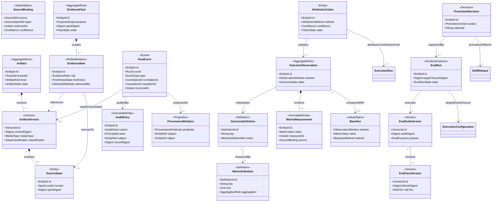
```mermaid
classDiagram
    class Artifact {
      <<AggregateRoot>>
      +EntityId id
      +TenantId tenantId
      +ArtifactKind kind
      +ArtifactState state
    }
    class ArtifactVersion {
      <<Version>>
      +VersionId id
      +Digest contentDigest
      +MediaType mediaType
      +DataClassification classification
    }
    class SourceSpan {
      <<Entity>>
      +EntityId id
      +SpanLocator locator
      +Digest spanDigest
    }
    class SourceBinding {
      <<ValueObject>>
      +SourceRef source
      +SourceSpanRef span
      +Instant retrievedAt
      +Confidence confidence
    }
    class EvidenceItem {
      <<ReifiedRelation>>
      +EntityId id
      +EvidenceRole role
      +FreshnessState freshness
      +AdmissibilityState admissibility
    }
    class EvidencePack {
      <<AggregateRoot>>
      +EntityId id
      +PurposeScope purpose
      +Digest packDigest
      +PackState state
    }
    class RunEvent {
      <<Event>>
      +EntityId id
      +RunId runId
      +EventType type
      +CorrelationId correlationId
      +CausationId causationId
      +Instant occurredAt
    }
    class AuditEntry {
      <<ImmutableEntity>>
      +EntityId id
      +AuditAction action
      +PrincipalId actor
      +EntityRef subject
      +Digest recordDigest
    }
    class ProvenanceRelation {
      <<Projection>>
      +ProvenancePredicate predicate
      +EntityRef subject
      +EntityRef object
    }
    class OutcomeDefinition {
      <<Definition>>
      +DefinitionId id
      +String key
      +MetricDefinitionRef metric
    }
    class OutcomeObservation {
      <<AggregateRoot>>
      +EntityId id
      +ObservationWindow window
      +OutcomeState state
    }
    class MetricDefinition {
      <<Definition>>
      +DefinitionId id
      +String key
      +Unit unit
      +AggregationRule aggregation
    }
    class MetricMeasurement {
      <<ImmutableEntity>>
      +EntityId id
      +MetricValue value
      +Instant measuredAt
      +SourceBinding source
    }
    class Baseline {
      <<ValueObject>>
      +ObservationWindow window
      +MetricValue value
      +BaselineMethod method
    }
    class AttributionClaim {
      <<Entity>>
      +EntityId id
      +AttributionMethod method
      +Confidence confidence
      +ClaimState state
    }
    class EvalSuiteVersion {
      <<Version>>
      +VersionId id
      +Digest suiteDigest
      +EvalPurpose purpose
    }
    class EvalCaseVersion {
      <<Version>>
      +VersionId id
      +Digest fixtureDigest
      +RiskTier riskTier
    }
    class EvalRun {
      <<RuntimeInstance>>
      +EntityId id
      +Digest targetClosureDigest
      +EvalRunState state
    }
    class PromotionDecision {
      <<Decision>>
      +EntityId id
      +PromotionVerdict verdict
      +String rationale
    }

    Artifact "1" *-- "1..*" ArtifactVersion : versions
    ArtifactVersion "1" *-- "0..*" SourceSpan : contains
    EvidencePack "1" *-- "1..*" EvidenceItem : curates
    EvidenceItem "*" --> "1" ArtifactVersion : references
    EvidenceItem "*" --> "0..1" SourceSpan : narrowsTo
    RunEvent "*" --> "0..*" ArtifactVersion : usedOrGenerated
    RunEvent "1" --> "1" AuditEntry : auditedBy
    RunEvent "*" --> "0..*" ProvenanceRelation : projectedAs
    OutcomeDefinition "1" --> "1" MetricDefinition : measuredBy
    OutcomeObservation "*" --> "1" OutcomeDefinition : instantiates
    OutcomeObservation "1" *-- "1..*" MetricMeasurement : contains
    OutcomeObservation "1" --> "0..1" Baseline : comparedWith
    AttributionClaim "*" --> "1..*" OutcomeObservation : explains
    AttributionClaim "*" --> "1..*" ExecutionRun : attributesContributionFrom
    EvalSuiteVersion "1" o-- "1..*" EvalCaseVersion : contains
    EvalRun "*" --> "1" EvalSuiteVersion : executes
    EvalRun "*" --> "1" ExecutionConfiguration : targetsExactClosure
    PromotionDecision "*" --> "1..*" EvalRun : supportedBy
    PromotionDecision "*" --> "1" SkillRelease : promotesOrBlocks
```

### 11.1 Semantische Trennung

- `SourceBinding` beantwortet: **Woher stammt diese Aussage oder dieser Inhalt?**
- `EvidenceItem` beantwortet: **Welche Rolle spielt der Inhalt für diesen Zweck/Claim?**
- `ValidationResult` beantwortet: **Was ergab ein konkreter Check?**
- `ValidationDecision` beantwortet: **Sind definierte Obligations ausreichend entladen?**
- `ApprovalDecision` beantwortet: **Darf der konkrete Vorschlag verbindlich werden?**
- `OutcomeObservation` beantwortet: **Was wurde später in der Domäne beobachtet?**
- `AttributionClaim` beantwortet: **Welche begründete, aber separat zu prüfende Wirkungszuschreibung wird behauptet?**

---

## 12. Consultry Product Blueprint – OOP-Modell und Entity-Katalog

Die folgenden Objekte gehören **nicht** in den generischen Kernel. Sie sind die erste vertikale Ontologie und Modulkomposition auf dem Kernel. Andere Product Blueprints können dieselben Kernel-Aggregate nutzen, ohne Accounts, Tender, Consultants oder Projekte übernehmen zu müssen.

### 12.1 Kanonischer Operating Loop

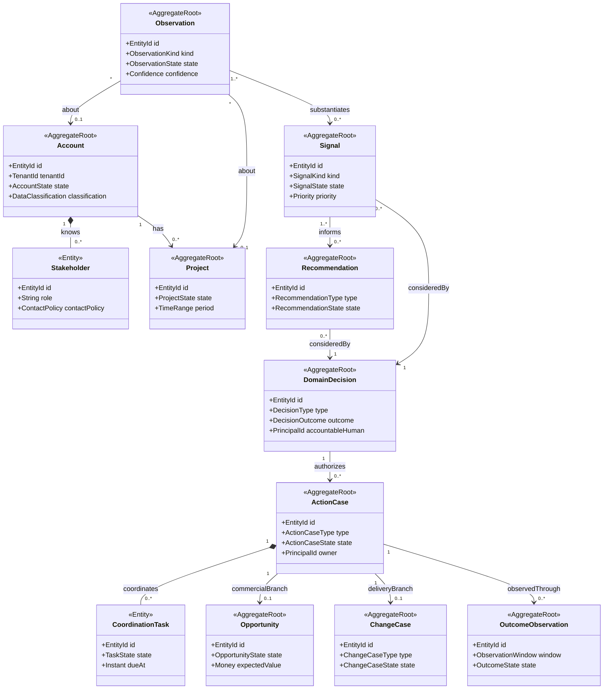
```mermaid
classDiagram
    class Account {
      <<AggregateRoot>>
      +EntityId id
      +TenantId tenantId
      +AccountState state
      +DataClassification classification
    }
    class Stakeholder {
      <<Entity>>
      +EntityId id
      +String role
      +ContactPolicy contactPolicy
    }
    class Project {
      <<AggregateRoot>>
      +EntityId id
      +ProjectState state
      +TimeRange period
    }
    class Observation {
      <<AggregateRoot>>
      +EntityId id
      +ObservationKind kind
      +ObservationState state
      +Confidence confidence
    }
    class Signal {
      <<AggregateRoot>>
      +EntityId id
      +SignalKind kind
      +SignalState state
      +Priority priority
    }
    class Recommendation {
      <<AggregateRoot>>
      +EntityId id
      +RecommendationType type
      +RecommendationState state
    }
    class DomainDecision {
      <<AggregateRoot>>
      +EntityId id
      +DecisionType type
      +DecisionOutcome outcome
      +PrincipalId accountableHuman
    }
    class ActionCase {
      <<AggregateRoot>>
      +EntityId id
      +ActionCaseType type
      +ActionCaseState state
      +PrincipalId owner
    }
    class CoordinationTask {
      <<Entity>>
      +EntityId id
      +TaskState state
      +Instant dueAt
    }
    class Opportunity {
      <<AggregateRoot>>
      +EntityId id
      +OpportunityState state
      +Money expectedValue
    }
    class ChangeCase {
      <<AggregateRoot>>
      +EntityId id
      +ChangeCaseType type
      +ChangeCaseState state
    }
    class OutcomeObservation {
      <<AggregateRoot>>
      +EntityId id
      +ObservationWindow window
      +OutcomeState state
    }

    Account "1" *-- "0..*" Stakeholder : knows
    Account "1" --> "0..*" Project : has
    Observation "*" --> "0..1" Account : about
    Observation "*" --> "0..1" Project : about
    Observation "1..*" --> "0..*" Signal : substantiates
    Signal "1..*" --> "0..*" Recommendation : informs
    Recommendation "0..*" --> "1" DomainDecision : consideredBy
    Signal "0..*" --> "1" DomainDecision : consideredBy
    DomainDecision "1" --> "0..*" ActionCase : authorizes
    ActionCase "1" *-- "0..*" CoordinationTask : coordinates
    ActionCase "1" --> "0..1" Opportunity : commercialBranch
    ActionCase "1" --> "0..1" ChangeCase : deliveryBranch
    ActionCase "1" --> "0..*" OutcomeObservation : observedThrough
```

Die Folge `Observation → Signal → DomainDecision → ActionCase → OutcomeObservation` ist die gemeinsame fachliche Spine. `Recommendation` ist ein optionaler, häufig AI-erzeugter Vorschlag; `Opportunity` entsteht nur auf dem kommerziellen Ast. Dadurch wird Consultant Capture nicht zu CRM-Dateneingabe umgedeutet.

### 12.2 Win-to-Work Aggregate

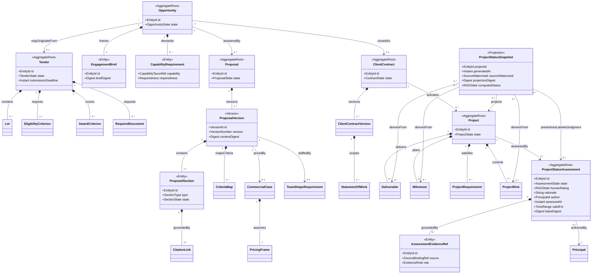
```mermaid
classDiagram
    class Tender {
      <<AggregateRoot>>
      +EntityId id
      +TenderState state
      +Instant submissionDeadline
    }
    class Lot
    class EligibilityCriterion
    class AwardCriterion
    class RequiredDocument
    class Opportunity {
      <<AggregateRoot>>
      +EntityId id
      +OpportunityState state
    }
    class EngagementBrief {
      <<Entity>>
      +EntityId id
      +Digest briefDigest
    }
    class CapabilityRequirement {
      <<Entity>>
      +CapabilityTaxonRef capability
      +Requiredness requiredness
    }
    class Proposal {
      <<AggregateRoot>>
      +EntityId id
      +ProposalState state
    }
    class ProposalVersion {
      <<Version>>
      +VersionId id
      +VersionNumber version
      +Digest contentDigest
    }
    class ProposalSection {
      <<Entity>>
      +EntityId id
      +SectionType type
      +SectionState state
    }
    class CriteriaMap
    class CitationLink
    class CommercialCase
    class PricingFrame
    class TeamShapeRequirement
    class ClientContract {
      <<AggregateRoot>>
      +EntityId id
      +ContractState state
    }
    class ClientContractVersion
    class StatementOfWork
    class Project {
      <<AggregateRoot>>
      +EntityId id
      +ProjectState state
    }
    class Deliverable
    class Milestone
    class ProjectRequirement
    class ProjectRisk
    class ProjectStatusAssessment {
      <<AggregateRoot>>
      +EntityId id
      +AssessmentState state
      +RAGState humanRating
      +String rationale
      +PrincipalId author
      +Instant assessedAt
      +TimeRange validFor
      +Digest basisDigest
    }
    class AssessmentEvidenceRef {
      <<Entity>>
      +EntityId id
      +SourceBindingRef source
      +EvidenceRole role
    }
    class ProjectStatusSnapshot {
      <<Projection>>
      +EntityId projectId
      +Instant generatedAt
      +SourceWatermark sourceWatermark
      +Digest projectionDigest
      +RAGState computedStatus
    }
    class Principal

    Tender "1" *-- "0..*" Lot : contains
    Tender "1" *-- "0..*" EligibilityCriterion : requires
    Tender "1" *-- "0..*" AwardCriterion : scores
    Tender "1" *-- "0..*" RequiredDocument : requests
    Opportunity "*" --> "0..1" Tender : mayOriginateFrom
    Opportunity "1" *-- "1" EngagementBrief : frames
    Opportunity "1" *-- "0..*" CapabilityRequirement : demands
    Opportunity "1" --> "0..*" Proposal : answeredBy
    Proposal "1" *-- "1..*" ProposalVersion : versions
    ProposalVersion "1" *-- "1..*" ProposalSection : contains
    ProposalVersion "1" *-- "0..*" CriteriaMap : mapsCriteria
    ProposalSection "1" *-- "0..*" CitationLink : groundedBy
    ProposalVersion "1" --> "0..1" CommercialCase : pricedBy
    CommercialCase "1" *-- "1" PricingFrame : assumes
    ProposalVersion "1" --> "0..1" TeamShapeRequirement : staffedBy
    Opportunity "1" --> "0..1" ClientContract : closedAs
    ClientContract "1" *-- "1..*" ClientContractVersion : versions
    ClientContractVersion "1" *-- "1..*" StatementOfWork : scopes
    ClientContract "1" --> "0..*" Project : activates
    Project "1" *-- "0..*" Deliverable : delivers
    Project "1" *-- "0..*" Milestone : plans
    Project "1" *-- "0..*" ProjectRequirement : satisfies
    Project "1" *-- "0..*" ProjectRisk : controls
    Project "1" --> "0..*" ProjectStatusAssessment : assessedBy
    ProjectStatusAssessment "1" *-- "0..*" AssessmentEvidenceRef : groundedBy
    ProjectStatusAssessment "0..*" --> "1" Principal : authoredBy
    ProjectStatusSnapshot "0..*" --> "1" Project : projects
    ProjectStatusSnapshot "0..*" --> "0..*" Deliverable : derivesFrom
    ProjectStatusSnapshot "0..*" --> "0..*" Milestone : derivesFrom
    ProjectStatusSnapshot "0..*" --> "0..*" ProjectRisk : derivesFrom
    ProjectStatusSnapshot "0..*" --> "0..*" ProjectStatusAssessment : presentsAsLabeledJudgment
```

`ProposalDraft / Konzept` wird aufgelöst: `Proposal` ist die stabile Identität, `ProposalVersion` der immutable Stand und `ProposalSection` das versionierte Inhaltssegment; „Concept Section“ ist ein `SectionType`, kein paralleles Aggregat. Ein gewonnenes Angebot erzeugt nicht automatisch ein Projekt: `ClientContract`/SOW und verantwortete Aktivierung liegen dazwischen.

`ProjectStatusSnapshot` ist eine jederzeit rebuildbare Faktenprojektion ohne eigene Schreibautorität. `ProjectStatusAssessment` ist dagegen eine absichtlich abgegebene, autor-/zeit-/basisgebundene menschliche Bewertung. Ein Snapshot darf sie nur als klar gekennzeichnetes Judgment neben berechneten Fakten präsentieren; die Bewertung mutiert weder Project Facts noch den berechneten Status. Nach Abgabe erfolgen Korrektur, Supersession oder Withdrawal append-only über einen Nachfolgerecord.

### 12.3 Capability Evidence, Staffing, Symbiosis und Reuse

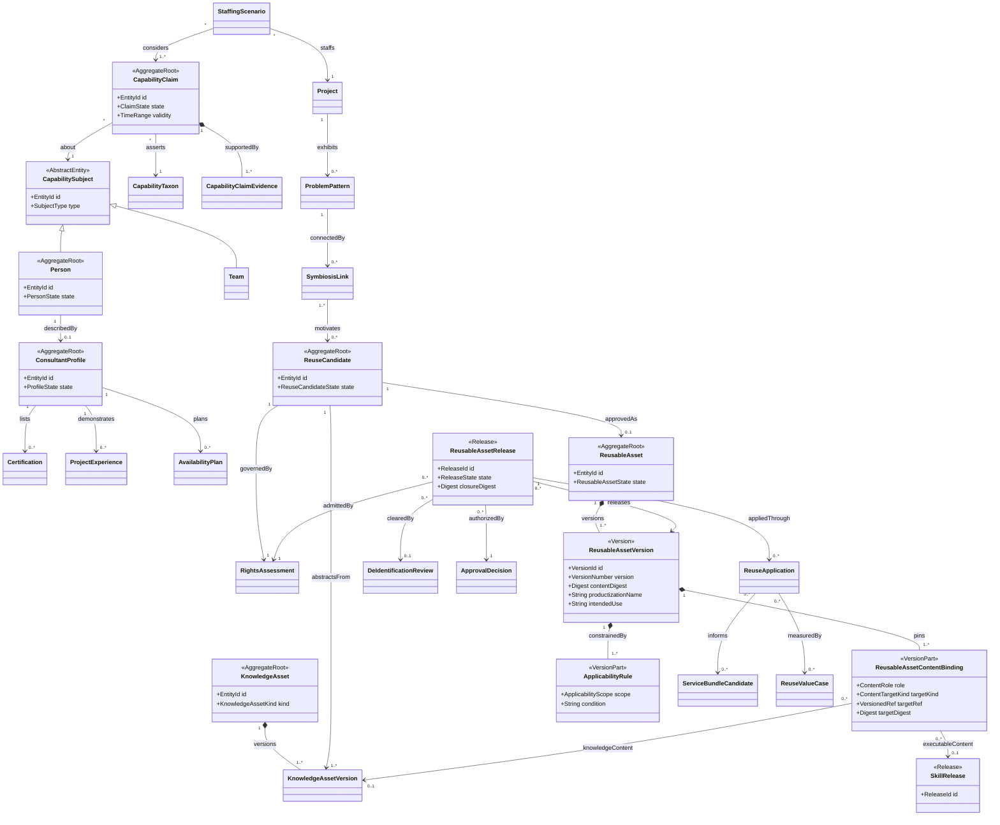
```mermaid
classDiagram
    class Person {
      <<AggregateRoot>>
      +EntityId id
      +PersonState state
    }
    class ConsultantProfile {
      <<AggregateRoot>>
      +EntityId id
      +ProfileState state
    }
    class CapabilitySubject {
      <<AbstractEntity>>
      +EntityId id
      +SubjectType type
    }
    class CapabilityTaxon
    class CapabilityClaim {
      <<AggregateRoot>>
      +EntityId id
      +ClaimState state
      +TimeRange validity
    }
    class CapabilityClaimEvidence
    class Certification
    class ProjectExperience
    class Team
    class AvailabilityPlan
    class StaffingScenario
    class Project
    class KnowledgeAsset {
      <<AggregateRoot>>
      +EntityId id
      +KnowledgeAssetKind kind
    }
    class KnowledgeAssetVersion
    class ProblemPattern
    class SymbiosisLink
    class ReuseCandidate {
      <<AggregateRoot>>
      +EntityId id
      +ReuseCandidateState state
    }
    class RightsAssessment
    class ReusableAsset {
      <<AggregateRoot>>
      +EntityId id
      +ReusableAssetState state
    }
    class ReusableAssetVersion {
      <<Version>>
      +VersionId id
      +VersionNumber version
      +Digest contentDigest
      +String productizationName
      +String intendedUse
    }
    class ReusableAssetContentBinding {
      <<VersionPart>>
      +ContentRole role
      +ContentTargetKind targetKind
      +VersionedRef targetRef
      +Digest targetDigest
    }
    class ApplicabilityRule {
      <<VersionPart>>
      +ApplicabilityScope scope
      +String condition
    }
    class ReusableAssetRelease {
      <<Release>>
      +ReleaseId id
      +ReleaseState state
      +Digest closureDigest
    }
    class SkillRelease {
      <<Release>>
      +ReleaseId id
    }
    class DeIdentificationReview
    class ApprovalDecision
    class ReuseApplication
    class ServiceBundleCandidate
    class ReuseValueCase

    Person "1" --> "0..1" ConsultantProfile : describedBy
    CapabilitySubject <|-- Person
    CapabilitySubject <|-- Team
    CapabilityClaim "*" --> "1" CapabilitySubject : about
    CapabilityClaim "*" --> "1" CapabilityTaxon : asserts
    CapabilityClaim "1" *-- "1..*" CapabilityClaimEvidence : supportedBy
    ConsultantProfile "1" --> "0..*" Certification : lists
    ConsultantProfile "1" --> "0..*" ProjectExperience : demonstrates
    ConsultantProfile "1" --> "0..*" AvailabilityPlan : plans
    StaffingScenario "*" --> "1..*" CapabilityClaim : considers
    StaffingScenario "*" --> "1" Project : staffs
    KnowledgeAsset "1" *-- "1..*" KnowledgeAssetVersion : versions
    Project "1" --> "0..*" ProblemPattern : exhibits
    ProblemPattern "1" --> "0..*" SymbiosisLink : connectedBy
    SymbiosisLink "1..*" --> "0..*" ReuseCandidate : motivates
    ReuseCandidate "1" --> "1..*" KnowledgeAssetVersion : abstractsFrom
    ReuseCandidate "1" --> "1" RightsAssessment : governedBy
    ReuseCandidate "1" --> "0..1" ReusableAsset : approvedAs
    ReusableAsset "1" *-- "1..*" ReusableAssetVersion : versions
    ReusableAssetVersion "1" *-- "1..*" ReusableAssetContentBinding : pins
    ReusableAssetContentBinding "0..*" --> "0..1" KnowledgeAssetVersion : knowledgeContent
    ReusableAssetContentBinding "0..*" --> "0..1" SkillRelease : executableContent
    ReusableAssetVersion "1" *-- "1..*" ApplicabilityRule : constrainedBy
    ReusableAssetRelease "0..*" --> "1" ReusableAssetVersion : releases
    ReusableAssetRelease "0..*" --> "1" RightsAssessment : admittedBy
    ReusableAssetRelease "0..*" --> "0..1" DeIdentificationReview : clearedBy
    ReusableAssetRelease "0..*" --> "1" ApprovalDecision : authorizedBy
    ReusableAssetRelease "1" --> "0..*" ReuseApplication : appliedThrough
    ReuseApplication "0..*" --> "0..*" ServiceBundleCandidate : informs
    ReuseApplication "0..*" --> "0..*" ReuseValueCase : measuredBy
```

Der `CapabilityTaxon` ist gemeinsam, die Graphen sind es nicht: `CapabilityClaim` beschreibt evidenzbasiert Menschen, Teams oder die Firma; `SkillVersion` beschreibt ausführbare AI-/Systemfähigkeit. `ReusableAsset` ist ein eigenes Productization-Aggregat und keine zweite Content-Hierarchie. Seine immutable Version pinnt über jedes `ReusableAssetContentBinding` **genau einen** Target-Typ – `KnowledgeAssetVersion` XOR `SkillRelease` – samt Digest. Der Release bindet diese Version an Rights, erforderliche De-Identification und Approval; `ReuseApplication` pinnt den Release. Neue oder abgeleitete Inhalte entstehen weiterhin ausschließlich als neue Knowledge-/Skill-Version mit Lineage.

**Release-Gate:** Ein Release ist nur zulässig, wenn alle Content Targets existieren und digestgleich sind, die Applicability explizit ist, das Rights Assessment die geplante Nutzung trägt, bei kunden-/tenantbezogenem Material ein bestandener De-Identification Review vorliegt und eine gültige Approval Decision exakt diesen Release-Hash autorisiert. Widerrufene Rechte erzeugen eine Release-Invalidation; sie verändern weder Source Content noch historische Anwendungen rückwirkend.

### 12.4 Consultry Entity-Katalog nach Bounded Context

| Bounded Context | Aggregate Roots | Wichtige Children / Relations | Projections |
|---|---|---|---|
| Customer & Relationships | `Account`, `Relationship` | `Stakeholder`, `WarmPathEdge`, `AccountHistoryEntry`, `ConsentRecord`, `ExternalAccountRef` | `Account360View`, `RelationshipMap` |
| Sensing & Coordination | `Observation`, `Signal`, `Recommendation`, `DomainDecision`, `ActionCase`, `ChangeCase` | `ObservationSubject`, `SignalEvidence`, `DecisionAlternative`, `CoordinationTask`, `Assignment`, `TaskDependency` | `MyWorkView`, `ReviewQueue`, `ActionTimeline` |
| Tender & Opportunity | `Tender`, `Opportunity` | `Lot`, `EligibilityCriterion`, `AwardCriterion`, `RequiredDocument`, `EngagementBrief`, `CapabilityRequirement`, `OpportunityStageHistory` | `OpportunityBoard`, `CriteriaCoverageView` |
| Proposal, Offer & Contract | `Proposal`, `CommercialCase`, `ClientContract`, `ChangeRequest`, `ServiceBundle` | `ProposalVersion`, `ProposalSection`, `CriteriaMap`, `CitationLink`, `PricingFrame`, `ClientContractVersion`, `StatementOfWork`, `CommercialTerm` | `ConceptWorkspace`, `ApprovalReadinessView` |
| Project & Delivery | `Project`, `Deliverable`, `ProjectWorkSource`, `ProjectStatusAssessment` | `Milestone`, `ProjectRequirement`, `ProjectRisk`, `ProjectDecision`, `ProjectRole`, `ProjectWorkSnapshot`, `ExternalWorkItemSnapshot`, `WorkLog`, `AssessmentEvidenceRef` | `ProjectStatusSnapshot`, `DeliveryHealthView` |
| People & Staffing | `Person`, `ConsultantProfile`, `Team`, `AvailabilityPlan`, `StaffingScenario`, `DevelopmentPlan` | `Certification`, `ProjectExperience`, `TeamMembership`, `TeamShapeRequirement`, `StaffingAssignment`, `MentoringRecommendation` | `CapabilityEvidenceView`, `CapacityForecast`, `AnonymousTeamShape` |
| Capability Vocabulary | `CapabilityTaxon`, `CapabilityClaim` | `CapabilityTaxonRelation`, `CapabilityClaimEvidence`, `CapabilityDemonstration`, `DemandIndicator` | `CapabilityGapView`, `CapabilityDemandView` |
| Knowledge & Reuse | `KnowledgeAsset`, `ProblemPattern`, `ReuseCandidate`, `ReusableAsset`, `ServiceBundleCandidate` | `KnowledgeAssetVersion`, `KnowledgeLink`, `SymbiosisLink`, `RedundancyFinding`, `ConflictFinding`, `RightsAssessment`, `DeIdentificationReview`, `ReusableAssetVersion`, `ReusableAssetContentBinding`, `ApplicabilityRule`, `ReusableAssetRelease`, `ReuseApplication` | `KnowledgeMap`, `SymbiosisGraph`, `ReusePortfolioView` |
| Personal Work | `PersonalNote`, `TimeEntry` | `TimeEntryEvidence`, `WorkConfirmation`, `PrivateVisibilityPolicy` | `MyWeekView`; keine personenscharfe Default-Teamprojektion |
| Business Operations | `Expense`, `InvoicePreparation`, `Vendor`, `Subscription`, `LicensePool` | `Receipt`, `ExpenseLine`, `BillingLine`, `InvoiceEvidence`, `RenewalTerm`, `LicenseAssignment`, `CostRecord` | `BillingRiskView`, `RenewalView`, `MarginView` |
| Outcomes & Value | `DesiredOutcome`, `OutcomeObservation`, `ValueCase`, `Portfolio` | `MetricMeasurement`, `OutcomeEvidence`, `OutcomeClaim`, `AttributionClaim`, `ReuseValueCase`, `Risk`, `InvestmentScenario` | `OutcomeDashboard`, `PortfolioScenarioView` |
| Collaboration & Product App | `Workspace`, `CommentThread`, `ReviewRequest`, `Notification` | `SavedView`, `Comment`, `Mention`, `ReviewAssignment`, `InboxItem`, `UserPreference`, `ContextBookmark` | Rollenbezogene Workspaces und Frames |

### 12.5 Wichtige Product-App-Entitäten

Die geführte App und das optionale Harness App teilen Backend-Aggregate, aber nicht zwingend dieselben UI-Objekte:

| Entity | Zweck | Schreibautorität |
|---|---|---|
| `Workspace` | Rollen-/objektbezogene Arbeitsoberfläche wie My Work, Opportunity, Project oder Control Room | speichert Layout-/Scope-Referenzen, nicht Domain State |
| `ReviewRequest` | Bündelt konkreten Subject Hash, benötigte Rolle, Frist und Review-Kontext | erzeugt keine Approval Decision |
| `ReviewAssignment` | Zeitgebundene Zuweisung eines Reviews | Authority Service |
| `CommentThread` / `Comment` | Kollaboration auf exakter Entity-/Version-/Span-Referenz | Collaboration Context |
| `InboxItem` / `Notification` | Zustell-/Lesestatus für Signal, Gate, Approval oder Task | Projection/Delivery Service |
| `SavedView`, `ContextBookmark`, `UserPreference` | Persönliche Navigation und Darstellung | User-scoped, keine fachliche Semantik |
| `HarnessWorkspaceSession` | UI-Session des optionalen technischen Clients auf `HarnessSession`/`ExecutionJob` | Harness UI; keine zusätzlichen Tools oder Rechte |

---

## 13. Konzeptionelles ER-Modell

Die ER-Sichten zeigen normalisierte Record-of-Truth-Strukturen. Sie sind bewusst in kohärente Teilmodelle zerlegt; eine einzige „God ERD“ würde Beziehungen verdecken statt erklären. Physische Tabellen können andere Namen tragen, müssen aber dieselben Identitäten, FKs und Invarianten erhalten.

### 13.1 Platform Blueprint und Tenant Configuration

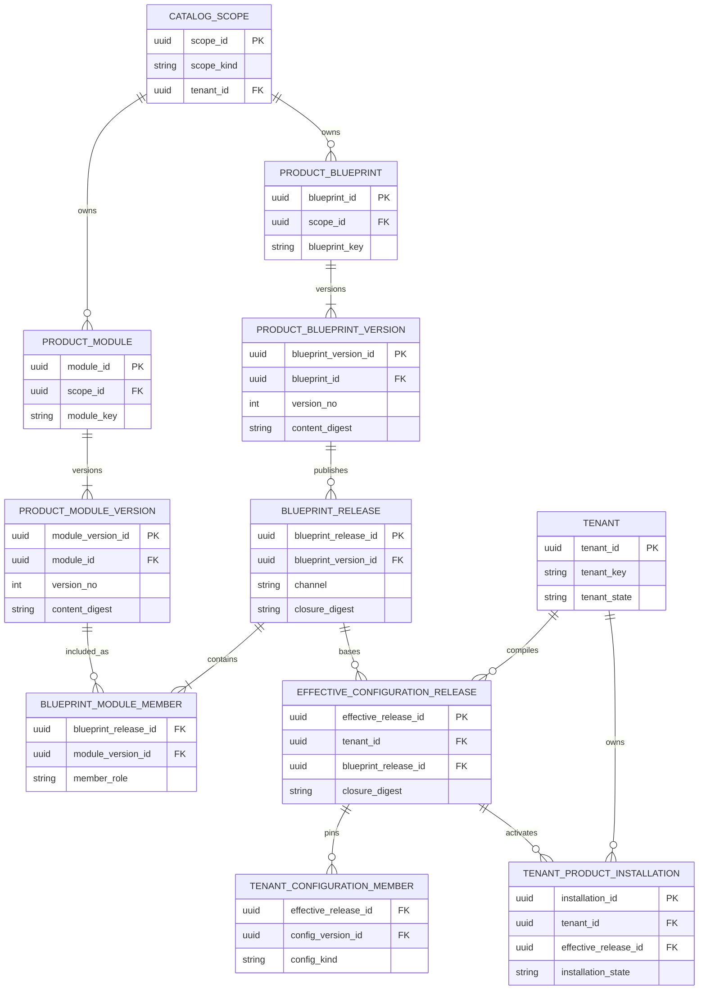
```mermaid
erDiagram
    CATALOG_SCOPE {
      uuid scope_id PK
      string scope_kind
      uuid tenant_id FK
    }
    PRODUCT_BLUEPRINT {
      uuid blueprint_id PK
      uuid scope_id FK
      string blueprint_key
    }
    PRODUCT_BLUEPRINT_VERSION {
      uuid blueprint_version_id PK
      uuid blueprint_id FK
      int version_no
      string content_digest
    }
    BLUEPRINT_RELEASE {
      uuid blueprint_release_id PK
      uuid blueprint_version_id FK
      string channel
      string closure_digest
    }
    PRODUCT_MODULE {
      uuid module_id PK
      uuid scope_id FK
      string module_key
    }
    PRODUCT_MODULE_VERSION {
      uuid module_version_id PK
      uuid module_id FK
      int version_no
      string content_digest
    }
    BLUEPRINT_MODULE_MEMBER {
      uuid blueprint_release_id FK
      uuid module_version_id FK
      string member_role
    }
    TENANT {
      uuid tenant_id PK
      string tenant_key
      string tenant_state
    }
    EFFECTIVE_CONFIGURATION_RELEASE {
      uuid effective_release_id PK
      uuid tenant_id FK
      uuid blueprint_release_id FK
      string closure_digest
    }
    TENANT_CONFIGURATION_MEMBER {
      uuid effective_release_id FK
      uuid config_version_id FK
      string config_kind
    }
    TENANT_PRODUCT_INSTALLATION {
      uuid installation_id PK
      uuid tenant_id FK
      uuid effective_release_id FK
      string installation_state
    }

    CATALOG_SCOPE ||--o{ PRODUCT_BLUEPRINT : owns
    PRODUCT_BLUEPRINT ||--|{ PRODUCT_BLUEPRINT_VERSION : versions
    PRODUCT_BLUEPRINT_VERSION ||--o{ BLUEPRINT_RELEASE : publishes
    CATALOG_SCOPE ||--o{ PRODUCT_MODULE : owns
    PRODUCT_MODULE ||--|{ PRODUCT_MODULE_VERSION : versions
    BLUEPRINT_RELEASE ||--|{ BLUEPRINT_MODULE_MEMBER : contains
    PRODUCT_MODULE_VERSION ||--o{ BLUEPRINT_MODULE_MEMBER : included_as
    TENANT ||--o{ EFFECTIVE_CONFIGURATION_RELEASE : compiles
    BLUEPRINT_RELEASE ||--o{ EFFECTIVE_CONFIGURATION_RELEASE : bases
    EFFECTIVE_CONFIGURATION_RELEASE ||--o{ TENANT_CONFIGURATION_MEMBER : pins
    TENANT ||--o{ TENANT_PRODUCT_INSTALLATION : owns
    EFFECTIVE_CONFIGURATION_RELEASE ||--o{ TENANT_PRODUCT_INSTALLATION : activates
```

### 13.2 Context Task, Core Skill Graph und Execution Configuration

```mermaid
erDiagram
    BOUNDED_CONTEXT_DEFINITION ||--o{ CONTEXT_TASK_DEFINITION : contains
    CONTEXT_TASK_DEFINITION ||--|{ CONTEXT_TASK_VERSION : versions
    CONTEXT_TASK_VERSION ||--o{ TASK_REQUIREMENT : instantiated_as
    TASK_REQUIREMENT ||--|{ REQUIREMENT_CLAUSE : contains
    TASK_REQUIREMENT }o--|| CONTEXT_SNAPSHOT : sees

    SKILL_DEFINITION ||--|{ SKILL_VERSION : versions
    SKILL_VERSION ||--o{ SKILL_RELEASE : publishes
    SKILL_VERSION ||--|{ SKILL_PORT : exposes
    SKILL_VERSION ||--o{ SKILL_OBLIGATION : induces
    SKILL_VERSION ||--o{ SKILL_DEPENDENCY_REQUIREMENT : declares
    SKILL_DEFINITION ||--o{ SKILL_DEPENDENCY_REQUIREMENT : targeted_by
    SKILL_VERSION ||--o{ SKILL_RESOURCE_REQUIREMENT : requires

    CONTEXT_TASK_VERSION ||--o{ TASK_SKILL_BINDING : served_by
    SKILL_RELEASE ||--o{ TASK_SKILL_BINDING : offered_as

    CORE_SKILL_GRAPH_RELEASE ||--|{ CORE_SKILL_GRAPH_NODE : contains
    CORE_SKILL_GRAPH_RELEASE ||--|{ CORE_SKILL_GRAPH_EDGE : contains
    CORE_SKILL_GRAPH_NODE ||--o{ CORE_SKILL_GRAPH_EDGE : source
    CORE_SKILL_GRAPH_NODE ||--o{ CORE_SKILL_GRAPH_EDGE : target

    TASK_REQUIREMENT ||--o{ SKILL_RESOLUTION : resolved_by
    CORE_SKILL_GRAPH_RELEASE ||--o{ SKILL_RESOLUTION : used_by
    SKILL_RESOLUTION ||--o{ SKILL_RESOLUTION_CANDIDATE : considers
    SKILL_RESOLUTION_CANDIDATE ||--|{ CLAUSE_SATISFACTION : explains
    REQUIREMENT_CLAUSE ||--o{ CLAUSE_SATISFACTION : assessed_by
    SKILL_RESOLUTION ||--o| EXECUTION_CONFIGURATION : compiles
    EXECUTION_CONFIGURATION ||--|{ EXEC_CONFIG_SKILL_MEMBER : pins
    EXECUTION_CONFIGURATION ||--o{ EXEC_CONFIG_TOOL_MEMBER : pins
    EXECUTION_CONFIGURATION ||--o{ EXEC_CONFIG_MODEL_POLICY_MEMBER : pins
    EXECUTION_CONFIGURATION ||--|{ EXEC_CONFIG_POLICY_MEMBER : pins
    EXECUTION_CONFIGURATION ||--|{ EXEC_CONFIG_VALIDATOR_MEMBER : pins

    CONTEXT_TASK_DEFINITION {
      uuid task_id PK
      uuid context_id FK
      string task_key
    }
    CONTEXT_TASK_VERSION {
      uuid task_version_id PK
      uuid task_id FK
      int version_no
      string contract_digest
    }
    TASK_REQUIREMENT {
      uuid task_requirement_id PK
      uuid tenant_id FK
      uuid task_version_id FK
      string requirement_digest
    }
    REQUIREMENT_CLAUSE {
      uuid clause_id PK
      uuid task_requirement_id FK
      string clause_kind
      string requiredness
    }
    SKILL_DEFINITION {
      uuid skill_id PK
      uuid scope_id FK
      string skill_key
    }
    SKILL_VERSION {
      uuid skill_version_id PK
      uuid skill_id FK
      string semver
      string manifest_digest
    }
    SKILL_RELEASE {
      uuid skill_release_id PK
      uuid skill_version_id FK
      string release_channel
      string release_state
    }
    CORE_SKILL_GRAPH_RELEASE {
      uuid graph_release_id PK
      uuid scope_id FK
      string source_manifest_digest
      string graph_digest
    }
    SKILL_RESOLUTION {
      uuid resolution_id PK
      uuid task_requirement_id FK
      uuid graph_release_id FK
      string outcome
    }
    EXECUTION_CONFIGURATION {
      uuid execution_config_id PK
      uuid tenant_id FK
      uuid resolution_id FK
      string closure_digest
    }
```

Die fünf `EXEC_CONFIG_*_MEMBER`-Tabellen sind typisierte Junction Tables mit echten FKs. Ein einzelnes JSON-Array `closure_members` genügt nicht als autoritative Closure.

### 13.3 Execution, Harness und Model Bridge

```mermaid
erDiagram
    TASK_REQUIREMENT ||--o{ EXECUTION_JOB : requests
    EXECUTION_JOB ||--o| RUN_PLAN : admits
    EXECUTION_CONFIGURATION ||--o{ RUN_PLAN : configures
    RUN_PLAN ||--o{ RUN_PLAN_BINDING : pins
    EXECUTION_JOB ||--o{ EXECUTION_RUN : attempts
    RUN_PLAN ||--o{ EXECUTION_RUN : executed_by
    EXECUTION_RUN ||--o{ NODE_ACTIVATION : unrolls
    EXECUTION_RUN ||--o{ LOOP_INSTANCE : bounds
    LOOP_INSTANCE ||--o{ PROGRESS_WITNESS : observes
    EXECUTION_RUN ||--o{ CHECKPOINT : checkpoints

    NODE_ACTIVATION ||--o| HARNESS_SESSION : may_use
    HARNESS_PROFILE_VERSION ||--o{ HARNESS_SESSION : instantiates
    HARNESS_SESSION }o--|| HARNESS_PACK : constrained_by
    HARNESS_PACK ||--|{ HARNESS_PACK_ITEM : contains
    HARNESS_SESSION ||--o{ CAPABILITY_LEASE : receives
    HARNESS_SESSION ||--o{ RESULT_CANDIDATE : submits
    RESULT_CANDIDATE }o--|| RESULT_BUNDLE : packages
    RESULT_CANDIDATE }o--|| VALIDATION_CASE : verified_by

    NODE_ACTIVATION ||--o{ MODEL_REQUEST : originates
    MODEL_POLICY_VERSION ||--o{ MODEL_REQUEST : governs
    MODEL_REQUEST ||--|| MODEL_ROUTE_DECISION : resolved_by
    MODEL_DEPLOYMENT_VERSION o|--o{ MODEL_ROUTE_DECISION : optionally_selected
    MODEL_ROUTE_DECISION ||--o| MODEL_INVOCATION_RECORD : may_invoke
    NODE_ACTIVATION ||--o{ TOOL_INVOCATION_RECORD : records

    NODE_ACTIVATION ||--o{ EFFECT_REQUEST : proposes
    EFFECT_REQUEST ||--o| EFFECT_ADMISSION_DECISION : evaluated_by
    EFFECT_ADMISSION_DECISION ||--o| DOMAIN_COMMAND : admits
    DOMAIN_COMMAND ||--o| COMMIT_RECEIPT : produces

    EXECUTION_JOB {
      uuid execution_job_id PK
      uuid tenant_id FK
      uuid task_requirement_id FK
      string idempotency_key
    }
    RUN_PLAN {
      uuid run_plan_id PK
      uuid execution_job_id FK
      uuid execution_config_id FK
      string plan_digest
      string plan_state
    }
    EXECUTION_RUN {
      uuid execution_run_id PK
      uuid execution_job_id FK
      uuid run_plan_id FK
      int run_attempt
      string run_state
    }
    NODE_ACTIVATION {
      uuid activation_id PK
      uuid execution_run_id FK
      uuid node_definition_id FK
      int activation_ordinal
      int attempt_no
    }
    HARNESS_SESSION {
      uuid harness_session_id PK
      uuid activation_id FK
      uuid profile_version_id FK
      string session_state
    }
    MODEL_ROUTE_DECISION {
      uuid route_decision_id PK
      uuid model_request_id FK
      uuid deployment_version_id FK
      string route_verdict
      string decision_digest
    }
    EFFECT_ADMISSION_DECISION {
      uuid admission_id PK
      uuid effect_request_id FK
      string effect_hash
      string verdict
      datetime expires_at
    }
```

---

## 14. Lifecycle- und Interaktionsmodelle

### 14.1 Skill Definition → Version → Release → Runtime Closure

```mermaid
stateDiagram-v2
    [*] --> DefinitionDraft
    DefinitionDraft --> VersionBuilt: manifest + program + contracts
    VersionBuilt --> EvaluationRunning: exact candidate closure
    EvaluationRunning --> CandidateRejected: thresholds not met
    EvaluationRunning --> ValidationPassed: obligations discharged
    ValidationPassed --> ReleaseApproval: publication request
    ReleaseApproval --> CandidateReleased: approved
    ReleaseApproval --> CandidateRejected: rejected
    CandidateReleased --> PilotReleased: promotion decision
    PilotReleased --> StableReleased: promotion decision
    CandidateReleased --> Revoked: security or policy defeater
    PilotReleased --> Deprecated: superseded
    StableReleased --> Deprecated: superseded
    Deprecated --> Revoked: no further use
    CandidateRejected --> VersionBuilt: new immutable version
    Revoked --> [*]
```

Die Zustände betreffen Release-/Promotion-Records; der Inhalt einer `SkillVersion` bleibt unverändert. Ein Fix oder geändertes Requirement erzeugt eine neue Version und eine neue evaluierte Closure.

### 14.2 Kontextuelle Aufgabe ohne Chat-only- oder Direct-Model-Pfad

```mermaid
sequenceDiagram
    actor Human as Verantwortlicher Mensch
    participant App as Product App / optional Harness App
    participant Task as Task Compiler
    participant Context as Context Service
    participant Skills as Core Skill Graph Resolver
    participant Gov as Policy & Authority
    participant Exec as Execution Runtime
    participant Harness as Bounded Harness
    participant Bridge as Model Bridge
    participant Valid as Validation Runtime
    participant Owner as Domain Owner Service

    Human->>App: Intent + Objekt + gewünschte Wirkung
    App->>Task: ContextTaskVersion instanziieren
    Task->>Context: purpose-bound ContextSnapshot anfordern
    Context-->>Task: Snapshot + Source/State Digests
    Task->>Skills: TaskRequirement + Clauses + Graph Release
    Skills-->>Task: SkillResolution + ExecutionConfiguration
    Task->>Gov: RunPlan admission anfragen
    Gov-->>Task: Policy/Authority Decision
    Task->>Exec: admitierter RunPlan
    Exec->>Harness: Skill Program mit HarnessPack ausführen
    opt Model-mediated program
        Harness->>Bridge: ModelRequest(model_policy_id, requirement_digest)
        Bridge-->>Harness: Invocation Outcome + Route Decision
    end
    Harness-->>Exec: ResultCandidate + ResultBundle
    Exec->>Valid: ValidationCase kompilieren/ausführen
    Valid-->>Exec: Decision/Attestation oder Remediation
    Exec-->>App: reviewbarer Vorschlag + Evidenz + Findings
    Human->>App: verfeinern, ablehnen oder exakten Effect genehmigen
    App->>Gov: Effect Admission für Hash/Witnesses
    Gov-->>Owner: autorisierter idempotenter DomainCommand
    Owner-->>App: CommitReceipt + Domain/Audit Events
```

Chat kann eine Capture- oder Refinement-Interaktion sein, ist aber weder das Datenmodell noch der einzige Produktpfad. Dieselbe Task-/Skill-/Validation-Pipeline wird auch von Formularen, Workspaces, Review Queues, Automations und dem optionalen Harness App verwendet.

### 14.3 Execution Run und Effect Lifecycle

```mermaid
stateDiagram-v2
    [*] --> JobRequested
    JobRequested --> PlanCompiling
    PlanCompiling --> AdmissionBlocked
    PlanCompiling --> PlanAdmitted
    PlanAdmitted --> RunRunning
    RunRunning --> RunWaiting: durable event / human gate
    RunWaiting --> RunRunning: valid signal
    RunRunning --> ValidationBlocked: mandatory obligation open
    ValidationBlocked --> RunRunning: bounded remediation
    RunRunning --> ResultReady
    ResultReady --> EffectProposed: external/domain effect requested
    ResultReady --> Completed: no binding effect
    EffectProposed --> EffectRejected
    EffectProposed --> EffectAdmitted: policy + validation + approval + authority
    EffectAdmitted --> Committed: owner command + receipt
    RunRunning --> Failed
    RunRunning --> Cancelled
    AdmissionBlocked --> [*]
    EffectRejected --> [*]
    Committed --> [*]
    Completed --> [*]
    Failed --> [*]
    Cancelled --> [*]
```

### 14.4 Validation Case und Invalidation

```mermaid
stateDiagram-v2
    [*] --> Compiled
    Compiled --> Evaluating
    Evaluating --> Inconclusive
    Evaluating --> Failed
    Evaluating --> Passed
    Inconclusive --> AdjudicationRequired
    Failed --> RemediationRequired
    RemediationRequired --> Evaluating: new result candidate
    AdjudicationRequired --> Passed: provenance-bearing adjudication
    AdjudicationRequired --> Failed
    Passed --> Attested
    Attested --> Expired: valid_until
    Attested --> Invalidated: defeater or dependency change
    Expired --> [*]
    Invalidated --> [*]
    Failed --> [*]
```

---

## 15. Relationale und physische Abbildung

### 15.1 Persistenzautorität

Die akzeptierte Baseline bleibt **Aurora PostgreSQL Serverless v2 + pgvector** als transaktionales System of Record und **S3/KMS** für unveränderliche Binärinhalte, große Artefakte und Harness Packs. Ein Graph bezeichnet zunächst eine fachliche Struktur, nicht automatisch eine eigene Datenbank.

| Persistenzrolle | Autoritative Speicherung | Abgeleitete Speicherung |
|---|---|---|
| Fachaggregate | typisierte Tabellen pro Bounded Context | Workspaces, Read Models, Dashboards, Search |
| Definitionen und Versionen | `*_definitions`, immutable `*_versions` | aktuelle Katalogsicht |
| Releases und Closures | `*_releases`, typisierte `*_release_members` | Closure-/Adjacency-Caches |
| Graphstruktur | explizite, typisierte Member-/Edge-/Participant-Tabellen | vereinheitlichte Traversal-, RDF- oder Property-Graph-Projektionen |
| Runtime | `execution_jobs`, `run_plans`, `execution_runs`, `node_activations`, `loop_instances`, `validation_cases` | Trace Graph, Timeline, Assurance View |
| Historie | append-only Event-/Audit-Ledger plus transaktionale Outbox | rekonstruierte Compliance-/Activity-Sichten |
| Artefakte | Identität, Lifecycle, Digest, Lineage in Aurora; Bytes in S3/KMS | Text-, Chunk-, Embedding- und Preview-Projektionen |

Eine semantisch relevante Kante darf selbst autoritativ sein, etwa `SkillDependencyRequirement`, `ExecutionEdge`, `ValidationGraphEdge` oder `ContextAssertionParticipant`. Nur die graphübergreifend vereinheitlichte Traversal-Sicht ist eine Projection. Ein späterer Graph Store erhält reproduzierbare Exporte und darf nie in die Record-of-Truth-Tabellen zurückschreiben.

| Graph-Familie | Autoritative relationale Struktur | Rebuildbare Projection |
|---|---|---|
| Domain Context Graph | Domain-Tabellen plus `context_assertions`, immutable Revisions/Participants und `source_bindings` | Context Nodes/Edges, Search-/Vector-Sicht |
| Core Skill Graph | Task-/Clause-, Skill-/Version-/Release-, Binding-, Requirement- und Obligation-Tabellen | `v_core_skill_nodes`, `v_core_skill_edges`, Resolver Adjacency |
| Execution & Lineage | Graph Definitions/Versions, Nodes, Edges, RunPlans, Runs, Activations und Events | zeitaufgelöster Trace Graph |
| Validation & Assurance | Validation Definitions/Versions, Obligations, Claims, Support-/Defeat-Kanten und Cases | Assurance Argument View |
| Authority Relationship | Principals, Memberships, Grants, Delegations und Mandates | Effective Authority View |

Es gibt keine universelle `entities + edges + JSON`-Datenbank als Ersatz für typisierte Aggregate. Mehrstellige Aussagen werden über Participant-Tabellen mit expliziten Rollen modelliert; prüf-, such- oder auditrelevante Semantik bleibt nicht in undurchsichtigen JSON-Blobs verborgen.

### 15.2 Definition, Version, Release, Closure und RunPlan

```text
stable Definition
  → immutable Version
  → governed Release
  → immutable Release Closure
  → tenant Effective Configuration Release
  → evaluated Execution Configuration
  → frozen RunPlan
```

- Eine `Definition` trägt stabile Identität, Owner und Lifecycle.
- Jede Inhaltsänderung erzeugt eine neue immutable `Version` mit kanonischem Content Digest.
- Eine `Release` publiziert eine Root-Version in Scope/Channel und referenziert Validation-/Approval-Entscheidungen.
- Eine Closure enthält exakte Version-IDs und Digests aller transitiven Komponenten; Members liegen in typisierten Junction Tables mit echten FKs.
- Der `closure_digest` entsteht aus kanonisch sortierten Members, Edges und relevanter Konfiguration.
- Ein admitierter `RunPlan` pinnt alle Inputs, Context-/Graph-/Closure-/Policy-/Authority-/Tool-/Model-/Harness- und State-Witness-Digests. `latest` ist unzulässig.
- Eine Dependency-Änderung überschreibt alte Releases/Attestations nicht. Sie erzeugt eine neue Closure und kann einen append-only Defeater/Invalidation Event gegen weitere Reliance setzen.

### 15.3 Tenant-, Scope- und Record-Authority-Grenzen

- Globale Kernel-/Blueprint-Katalogobjekte besitzen `GLOBAL` oder `BLUEPRINT` Scope und sind für Tenants read-only.
- Jede tenant-eigene operative Zeile besitzt `tenant_id NOT NULL`; tenant-interne FKs werden, wo möglich, mit `(tenant_id, entity_id)` physisch abgesichert.
- RLS ist fail-closed: ohne verifizierten Tenant Context werden keine Tenant-Daten geliefert.
- Tenant Overlays referenzieren eine Basis-Release und werden in eine neue `EffectiveConfigurationRelease` mit eigenem Digest kompiliert.
- Cross-Tenant-Reuse entsteht nur durch explizite Abstraktion, De-Identifikation, Rights-/Policy-/Approval-Prüfung und Neuveröffentlichung – nie durch FK auf fremde Tenant-Daten.
- S3 Object Key, Encryption Context und presigned Access binden Tenant, exakte Artifact Version und Job/Harness Pack.

Für die vielen beratungs- und CRM-spezifischen Implementierungen erhält jedes integrierbare Consultry Root den Value Object `RecordAuthority(mode, systemRef, externalObjectRef)` mit `mode ∈ {NATIVE, MIRRORED, FEDERATED}`. Tenant-Spezialisierung erfolgt durch Field-/Lifecycle-Mappings, Policies, Views, Task-/Skill-Bindings und Extensions – nicht durch eine neue `Account`-Unterklasse je Boutique oder Beratung.

### 15.4 Bitemporale Context Assertions

Bereits der MVP-Kern trennt bei entscheidungsrelevanten langfristigen Kontextaussagen **Valid Time** – wann sie fachlich galten – und **Record Time** – seit wann Consultry diese Revision kannte:

```text
context_assertions
context_assertion_revisions(
  assertion_id, revision_no,
  valid_from, valid_to,
  recorded_at,
  supersedes_revision_id,
  predicate, predicate_schema_version,
  confidence, assertion_state, evidence_state, assertion_digest
)
context_assertion_participants(
  assertion_revision_id, role_name, ordinal,
  context_entity_ref | literal_value
)
```

Revisionen sind immutable. Berichtigung, Retraction oder neue Erkenntnis erzeugt eine Nachfolgerevision; deren `recorded_at` beendet die abgeleitete Record Time der Vorgängerrevision. `valid_to IS NULL` bedeutet „offen“, nicht automatisch „wahr“. Jede relevante Assertion besitzt einen expliziten Evidence State; exakte Source Bindings und Admissibility-/Approval-State werden nur dort erzwungen, wo Risk-/Tenant-Policy sie für materielle Externalization oder Actions verlangt. Ein Participant setzt exakt `context_entity_ref` XOR `literal_value`; tenant-interne Entity References dürfen die Tenant-Grenze nicht überschreiten.

Der MVP implementiert damit **Zeitsemantik, Revision, minimale Participant Roles, Source Binding und Snapshot-Pinning**, aber noch keinen universellen Temporal-/Hypergraphen. Typisierte Domain-Aggregate bleiben Write Authority und werden nicht pauschal als Assertions gespiegelt. Breite Ontologie-Autorierung, beliebige N-ary Schemas, temporale Query-DSL/Reasoning sowie ein dedizierter Graph Store bleiben Full Product/Platform.

### 15.5 Artifact-, Source- und Evidence-Spine

```text
Artifact
  → ArtifactVersion
      → BlobRef + content_digest
      → SourceSpan
          ← SourceBinding
              ← Assertion / Claim / ProposalStatement / MetricMeasurement
      ← EvidenceItem
          ← EvidencePack
```

- Aurora ist autoritativ für Identität, Tenant, Lifecycle, Digests, Classification, Lineage und Zugriffsstatus; S3/KMS für immutable Bytes.
- Eine externe URL wird für reproduzierbare Evidenz als Snapshot versioniert; die URL allein genügt nicht.
- `EvidenceItem` ist eine reifizierte Rolle eines exakten `ArtifactVersion`/`SourceSpan` relativ zu Claim, Obligation oder Entscheidung – kein freier Evidence Blob.
- Chunks/Embeddings referenzieren Artifact Version, Extractor-/Chunker-Version und Embedding Model. pgvector ist Retrieval Index, nicht Wahrheitsautorität.
- `CitationLink` ist die Consultry-Domänensicht auf dieselbe Source-/Evidence-Spine.

### 15.6 Append-only Event- und Audit-Ledger

`DomainEvent`, `RunEvent`, `AuditEntry` und `CommitReceipt` verwenden einen gemeinsamen unveränderlichen Envelope:

```text
event_id, tenant_id, stream_type, stream_id, sequence_no,
event_type, schema_version, occurred_at, recorded_at,
principal_id, correlation_id, causation_id,
subject_ref, execution_run_id, closure_digest, payload_digest,
previous_record_digest, retention_until
```

Das Ledger ist append-only und pro Stream geordnet; Korrektur, Widerruf und Compensation erzeugen neue Events. Aktueller Domain State bleibt in den Owner-Aggregaten – das Produkt muss nicht vollständig event-sourced sein. Eine transaktionale Outbox koppelt State Change und Publication. `CommitReceipt` bindet mindestens Effect Hash, Idempotency Key, Owner Service, State Witness und Result Digest.

### 15.7 Empfohlene PostgreSQL Schemas

| Schema | Eigentum |
|---|---|
| `platform_catalog` | Blueprint, Module, Ontology, Task/Skill/Validator/Policy Definitions, Versions, Releases |
| `tenant_config` | Installations, Config Versions, Effective Releases, WC/Privacy Settings |
| `context` | Assertions/Revisions/Participants, Snapshots, Semantic Projections |
| `artifact` | Artifact/Version/Schema, Source Span/Binding, Corpus und Lineage |
| `execution` | Jobs, RunPlans, Runs, Activations, Loops, Checkpoints, Effects |
| `assurance` | Validation Graphs/Cases, Results, Findings, Attestations, Evals |
| `governance` | Principals, Roles, Grants, Policies, Approvals, Authorization, Audit |
| `model_bridge` | Providers, Deployments, Policies, Routes, Invocations |
| `integration` | Connectors, Tools, Installations, Grants, Snapshots, Cursors |
| `consultry` | vertikale Account-, Bid-, Project-, People-, Knowledge-, Reuse- und Operations-Aggregate |
| `projection` | rebuildbare Graph-, Workspace-, Search-, Analytics- und Outcome-Sichten |

---

## 16. Cross-Model-Invarianten

### 16.1 Daten-, Tenant- und Versionsinvarianten

1. Keine tenant-eigene Zeile ohne `tenant_id`; keine Tenant-FK ohne Tenant-Konsistenzprüfung.
2. Keine direkte Cross-Tenant-Referenz oder rohe Cross-Customer-Wiederverwendung.
3. Keine Mutation einer veröffentlichten Version, Release Closure, Artifact Version, Evidence Pack, Attestation oder eines admitierten RunPlan.
4. Kein Runtime-Ref auf `latest`.
5. Kein Graph-, Search-, Vector- oder Workspace-Read-Model ist Write Authority.
6. Keine invariante oder semantisch relevante N-ary Relation ausschließlich als JSON.
7. Jede Projection trägt Source-Record-/Version-Refs und ist vollständig rebuildbar.
8. Ein externer Record behält `RecordAuthority`; Import macht Consultry nicht still zum Source of Truth.

### 16.2 Graphinvarianten

1. Jede Edge verbindet existierende Nodes desselben Graph Releases.
2. Die gepinnte harte `REQUIRES_SKILL`-Closure ist azyklisch; zyklische fachliche Zusammenarbeit wird im Execution Graph, nicht als Skill-Dependency, modelliert.
3. Symmetrische Relationen wie `ALTERNATIVE_TO` werden kanonisch sortiert oder als symmetrische Projection erzeugt, nicht doppelt widersprüchlich gespeichert.
4. Jeder Execution-Zyklus liegt in einer expliziten `LoopRegionDefinition` mit Budget, Exit Condition und Progress Rule.
5. Jeder Strongly Connected Component eines Execution Graph muss eine kontrollierte Loop Boundary kreuzen.
6. Der Validation-Support-/Requires-Subgraph ist azyklisch; Defeater/Challenge-Kanten dürfen Reliance entkräften, aber keine Selbstbegründung erzeugen.
7. Runtime Traces werden zeitlich ausgerollt und sind als Kausalgraph azyklisch.
8. Kein produktiver Graph verändert sich aus einem eigenen Run heraus; Änderungen laufen über Candidate → Eval → Validation → Approval → Release.
9. Jede `ContextAssertionRevision` ist immutable, besitzt Record Time und expliziten Evidence State und pinnt null oder mehr exakte Source Bindings; Korrektur oder spätere Kenntnis erzeugt eine Nachfolgerevision.
10. Ein Assertion Participant referenziert exakt eine tenant-konsistente Context Entity oder einen typisierten Literalwert; operative Domainobjekte werden nicht allein für Graphkomfort dupliziert.

### 16.3 AI-, Validation- und Effect-Invarianten

1. Contextual Tasks wählen nie direkt Prompt, Modell, Provider oder Tool; sie lösen eine evaluierte Skill Release Closure auf.
2. Deterministische Skills benötigen keine Model Policy; model-mediated Skills pinnen Requirement und Policy, niemals den Provider im Domainobjekt.
3. Kein stiller Model-Wechsel: Route Decision bindet Policy, Provider, Deployment, Modell/Version oder einen expliziten Blocked Verdict.
4. Evidence, Validation Result, Validation Decision, Human Approval, Authorization Decision, Effect Admission und Outcome bleiben getrennte Records.
5. AI erzeugt Candidate/Proposal/Observation/EffectRequest, nie direkt bindenden Domain State.
6. Keine Harness-Ausgabe wird ohne `ValidationCase` und erforderliche Human-/Policy-Gates zu Domain State.
7. Kein Domain Commit ohne passenden Effect Hash, frische State Witnesses, Policy-/Authority-Recheck, erforderliche Validation/Approval und idempotenten Commit Receipt.
8. `INCONCLUSIVE` ist kein `PASS`; fehlende Evidenz wird nicht durch Confidence kaschiert.
9. Modelle und Tools sind keine Principals. Nur authentisierte Human-/Service-/Harness-Identitäten können scoped Authority besitzen.
10. Ein Outcome ist eine spätere Beobachtung; Contribution/Attribution wird als Claim mit Methode und Confidence gespeichert, nicht als automatische Kausalität.

### 16.4 Consultry- und People-Invarianten

1. `Observation` ist roh und absichtlich erfasst; `Signal` ist abgeleitet und geroutet; `Opportunity` ist ausschließlich kommerziell.
2. Ein Consultant erfasst keinen Sales Funnel, um Projektwissen beizutragen.
3. `PersonalNote` ist privat und kein Management-, ProjectStatus-, Scoring- oder Analytics-Input.
4. Capability Claims benötigen Source, Gültigkeit, Purpose, Visibility und Confirmation State; ein nackter numerischer „Skill Score“ ist unzulässig.
5. `ProjectStatusSnapshot` ist rebuildbar und ausschließlich aus autoritativen, freigegebenen Fakten abgeleitet; `ProjectStatusAssessment` hält menschliches Judgment separat und darf Fakten nicht überschreiben.
6. Default-Projektionen für Project Status und Team Shape sind anonym/aggregiert; Personenbezug erfordert Transparenz, WC-/Policy-/Role-Gates.
7. Ein gewonnenes Proposal erzeugt nicht automatisch ein Project; Client Contract/SOW und menschlich verantwortete Aktivierung liegen dazwischen.
8. Reuse benötigt Abstraktion, De-Identifikation sowie Contract-/IP-/Confidentiality-/Usage-Rights-Review.
9. T&M misst Ist-Aufwand; wiederverwendete Assets dürfen reale Time Entries nicht rückwirkend „optimieren“.

---

## 17. MVP-, Full-Product- und Platform-Slices

| Bereich | MVP / erster Product Slice | Full Consultry Product | Platform Expansion |
|---|---|---|---|
| Product | Opportunity-to-Concept plus notwendige Win/Work-Spine | gesamtes Consulting OS inkl. Project Intelligence, Capability, Reuse, Commercials, Operations | weitere vertikale und allgemeine Product Blueprints |
| Context Assertions | schlanker bitemporaler Kern: immutable Revision, Valid/Record Time, minimale Participants, Source Bindings, Snapshot-Pins | breitere Ontologie-/N-ary-Semantik und temporale Query-/Reasoning-Sichten | wiederverwendbarer Domain-Context-Graph-Kernel für weitere Blueprints |
| Core Skill Graph | Task Version, Requirement Clauses, Skill Definition/Version/Release, einfache Binding-/Closure-Auflösung | transitive Composition, Alternatives, Defeaters, Tenant Overlays, Impact Analysis | Blueprint-übergreifende Skill-Kataloge und kontrollierter Austausch |
| Execution | deterministische/Skill Nodes, frozen RunPlan, Runs, Activations, harte Budgets | explizite Subgraphs, bounded Agent Loops, durable Waits, Multi-Agent-Traces | allgemeiner Workflow-/Agent Runtime Kernel |
| Validation | Citation/Schema/Faithfulness/Risk Gates, Case/Result/Finding/Decision | vollständiger Validation Graph, Calibration, Attestations, Defeaters, Adjudication Frontier | wiederverwendbares Assurance Module |
| Authority | Tenant/RLS, Roles, Approval Request/Decision, Effect Hash | Delegation, Mandates, Separation/Quorum, Effect Admission | Governance Control Plane als separates Modul |
| Model Bridge | `model_policy_id`, Route Decision, exakte Invocation Records, kein Silent Downgrade | mehrere Provider/Zonen, eval-gated Routing, Kosten-/Quality Optimization | separat verkaufbares Model-Bridge-Modul |
| Harness | bounded Cloud Harness, job-scoped Pack, Result Verification | optionale lokale/virtualisierte Harnesses und Codex-artiges Harness App | allgemeines Runtime-/Developer-/Operator-Modul |
| Graph Storage | Aurora, typisierte Tabellen, bounded recursive CTEs/materialisierte Views | Reachability-/Impact-Caches und Exporte | dedizierter Graph Store nur nach gemessenem Traversal-Bedarf |
| Consultry Variants | konfigurierbarer Pilot für erste Design Partner | hunderte beratungs-/CRM-spezifische Implementierungen | dieselben Kernel-Primitiven für andere Branchen und kleine/mittlere Firmen |

Für das MVP ist nicht jede Full-Product-Capability Pflicht. Die **Grenzen** – Definition/Version/Release, Skill Resolution, Validation/Approval/Authority, Model Bridge und bounded Harness – müssen jedoch bereits so angelegt sein, dass der Full Product nicht durch eine Chat- oder Prompt-Monolith-Architektur blockiert wird.

Boutiquen sowie kleine und mittlere Beratungen bleiben ausdrücklich Zielkunden des `ConsultryProductBlueprint`; sie erhalten schlankere Modul-/Policy-/Workflow-Konfigurationen, kein separates „SMB-Lite“-Datenmodell. Davon getrennt ist der spätere horizontale Pfad zu allgemeinen Modulen für kleine und mittlere Unternehmen außerhalb der Consulting-Vertikale.

### 17.1 Minimal physisch anzulegender MVP-Slice

- Tenant/RLS, Account, Tender, Opportunity, Proposal/Version/Section;
- Artifact/Version/Span/SourceBinding, CitationLink und Evidence Pack;
- schlanker `ContextAssertion`-/immutable-Revision-/Participant-Kern mit Valid/Record Time sowie gepinnten Assertion-Revisions im `ContextSnapshot`;
- Context Task/Version, Requirement Clauses, Skill Definition/Version/Release, Task Binding und eine immutable Execution Configuration;
- Execution Job, RunPlan, Run, Activation, Harness Pack/Session und Result Candidate;
- Model Policy/Version, Route Decision und Invocation Record;
- Validation Case/Obligation/Result/Finding/Decision;
- Approval Request/Decision, Authorization/Effect Admission, Domain Command und Commit Receipt;
- append-only Run/Audit Events, Outbox und S3/KMS Artifact Storage;
- SQL-Graph-Projektionen – kein Graph-DB-Projekt als MVP-Voraussetzung.

---

## 18. Terminologie-Migration aus bestehenden Artefakten

| Bisher/überladen | Kanonische Auflösung | Migrationsregel |
|---|---|---|
| unqualifiziertes `Skill Graph` für Menschen/Firma | `CapabilityEvidenceView` bzw. `Capability Evidence Graph` | **Skill Graph** exklusiv für die Platform-Kernel-Fähigkeit |
| Consultant-`Skill` | `CapabilityTaxon` + `CapabilityClaim` + Evidence | keinen nackten `skills[]`-Record als Source of Truth |
| `SkillTaxonomyEntry` / `CapabilityConcept` | `CapabilityTaxon` | gemeinsames kontrolliertes Vokabular |
| Opportunity-`SkillRequirement` | `CapabilityRequirement` | menschliche/organisatorische Demand-Semantik |
| `AISkill`, `AISkillBlueprint`, `AISkill / Blueprint` | `SkillDefinition → SkillVersion → SkillRelease` | `Blueprint` nicht mehr als Skill-Synonym |
| generisches Product `Blueprint` | `ProductBlueprint` | Delivery-/Page-/Workflow-Blueprint immer qualifizieren |
| `TaskType` | `ContextTaskDefinition → ContextTaskVersion` | Runtime-Instanz ist `TaskRequirement` |
| `ContextSlice` | `ContextSnapshot` | immutable, purpose-/job-scoped und digestiert |
| `ResultVerifier` als einzelner Boolean-Check | Domain Service/Fassade über `ValidationCase` und `ResultVerificationReport` | kein paralleles Validation-System |
| `ModelGateway` als Architekturgesamtbegriff | Application Port innerhalb `ModelBridge` | Registry, Policies, Routing, Decisions und Invocations gehören zum Modul |
| `ProposalDraft / Konzept`, `DraftSection` | `Proposal → ProposalVersion → ProposalSection` | `DRAFT/APPROVED/EXPORTED` sind Lifecycle/Version State; `CONCEPT` ist Section Type |
| Business-`Contract` | `ClientContract` / `ClientContractVersion` | verhindert Kollision mit Skill-/Schema-Contract |
| generisches `Run` | `ExecutionJob`, `ExecutionRun`, `HarnessSession`, `ModelInvocationRecord`, `EvalRun` | Retry erzeugt neuen Execution Run unter demselben Job |
| `AuditRecord` | `AuditEntry` | ein kanonisches append-only Schema |
| `ApprovalEvent` als Aggregate | `ApprovalRequest` + immutable `ApprovalDecision`; Event daraus abgeleitet | UI `ApprovalCard` ist Projection |
| `ProjectStatus` als überladener schreibender Root | `ProjectStatusSnapshot` Projection + `ProjectStatusAssessment` Aggregate Root | berechnete Fakten und verantwortete menschliche Bewertung nie in einem Record vermischen |
| `WorkItem` | Consultry-eigen `CoordinationTask`; extern `ExternalWorkItemSnapshot` | External PM/PSA bleibt Source of Record |
| `Trigger` / `ProjectSignal` | `Observation` bzw. `Signal` mit Subject/Origin | keine parallele Funnel-Tabelle |
| freies `Outcome[]` / `FinancialImpact` | `DesiredOutcome`, `OutcomeObservation`, `MetricMeasurement`, `AttributionClaim` | Financial Impact ist berechnete Sicht/Value Case |
| `OperationalRecord` | UX-/Reporting-Union | keine polymorphe Root-Tabelle |
| `ReusableAsset` als zweite Content-Hierarchie | Productization-Aggregat, das exakte `KnowledgeAssetVersion` oder `SkillRelease` designiert | Rechte/Applicability/Lifecycle separat, Content nicht duplizieren |
| `Consultant` neben `Person` | `Person` + `ConsultantProfile`; Consultant ist Rolle | Login `UserIdentity` nochmals separat |

Diese Migration revidiert insbesondere die bisherige Formulierung „Second Brain Graph inklusive evidence-backed Skill Graph“: Der evidence-backed Menschen-/Firmenanteil bleibt erhalten, wird aber eindeutig als `CapabilityEvidenceView` benannt. Der neue Core Skill Graph verbindet contextual tasks mit ausführbaren, versionierten Skills und ihren Obligations.

---

## 19. Research Alignment und bewusste Abgrenzungen

Das Modell operationalisiert die bereits konsolidierten Research-Linien aus [Validation-Bounded Skill Agency / Knowledge Sources](../../papers/KnowledgeSources.md):

| Research-Idee | Datenmodell-Konsequenz |
|---|---|
| Skill als boundedly validatable transformation von Intent zu Effects | `ContextTaskVersion`, `SkillProgram`, `SkillObligation`, `EffectRequest`, `ValidationCase` |
| HTN/temporale Skill-Abstraktion | Skill Composition und Execution Subgraphs, aber exakte Initiation/Ports/Exit Conditions |
| Agent Skills als versionierbare Runtime-Artefakte | Definition/Version/Release/Closure statt Prompt-Sammlung |
| Graph-/Text-Synergie | Context Assertions und typed graph projections bleiben durch Artifact/Span/SourceBinding grounded |
| Agenten/Loops auf Graphen | deklarative Loop Regions, zeitaufgelöste Traces, Budgets und Progress Witnesses statt unbounded Autonomy |
| Validation Boundary / Adjudication Frontier | offene Obligations, `INCONCLUSIVE`, Defeaters und explizite Human Adjudication |
| Assurance Argument | separater Validation Graph mit Claims, Support, Challenge, Evidence Requirements und Attestations |
| Proactivity | Signal-/Frontier-gesteuerte Review-/Interruption Requests statt allgemeinem Chat-Push |

Bewusste Abgrenzungen:

- Ein GNN/LLM darf Relevanz schätzen, planen, generieren oder routen, entlädt aber keine Obligation allein durch Confidence.
- Mehr Kontext ist nicht automatisch mehr Verständnis; Context Snapshots bleiben purpose-bound.
- Ein Graph enthält explizite Aussagen über Bedeutung, nicht „Bedeutung selbst“.
- Human Adjudication ist provenance-bearing normative Entscheidung, nicht universelle Ground Truth.
- Graph-of-Thought-/Agent-Loop-Patterns rechtfertigen keine autonome Produktions-Selbstmutation.

---

## 20. Noch zu ratifizierende Modellentscheidungen und nächster Schritt

Die vom Nutzer bestätigte Kernregel – **Core Skill Graph first-class im Platform Kernel; contextual tasks lösen immer über eine versionierte, evaluierte Skill Release Closure auf; Capability Evidence bleibt separat** – ist in diesem Modell gesetzt.

Als vorläufige interne und AI-lesbare Wording Convention ist außerdem gesetzt: `ClientContract` bezeichnet die stabile Identität eines Kundenvertrags, `ClientContractVersion` seine unveränderlichen Fassungen. Das trennt den Business-Begriff von `SkillContract`, Schema Contracts und technischen Contracts, legt aber keine endgültige UI-, Sales- oder juristische Bezeichnung fest.

Ebenfalls ratifiziert ist `ReusableAsset` als eigene Productization Aggregate Root: immutable Versionen pinnen Knowledge-/Skill-Content statt ihn zu kopieren; governed Releases binden Applicability, Rights, De-Identification und Approval und werden von Anwendungen exakt referenziert.

Für Project Status gilt: `ProjectStatusSnapshot` ist eine rebuildbare Faktenprojektion; `ProjectStatusAssessment` hält eine absichtliche menschliche Bewertung als separate, nachvollziehbare Aggregate Root. Beide dürfen gemeinsam dargestellt, aber nicht semantisch verschmolzen werden.

Für Context Assertions ist ein schlanker bitemporaler MVP-Kern ratifiziert: immutable Revisionen tragen Valid/Record Time, minimale typisierte Participants, expliziten Evidence State, optionale Source Bindings und Digest; Context Snapshots pinnen exakte Revisionen. Universelle Temporal-/Hypergraph-Infrastruktur bleibt später.

Für den nächsten gemeinsamen Review bleibt eine konkrete Modellentscheidung:

1. `Proposal` als ein Aggregate mit immutable Versionen und Lifecycle States bestätigen – statt `ProposalDraft` und externem `Proposal` als parallele Roots.

Danach ist nicht „Code für alle Entities“ der nächste Schritt. Zuerst folgen:

1. Terminologie- und Aggregate-Ratifikation gegen die in der Wayfinder-Map benannten Product-, Architecture-, UX-, Pitch- und Market-Quellen;
2. ein fokussierter Architecture/Data-ADR-Delta-Satz für die noch nicht akzeptierten Kernel-Grenzen;
3. Ableitung eines **kleinen Epic-Sets** für den MVP-Slice;
4. erst darunter wenige, vertikal geschnittene Issues für einen durchgängigen Opportunity-to-Concept-Proof.

So bleibt das Modell groß genug für Full Product, Model Bridge, Governance und den AI-native-OS-Pfad, ohne den ersten Consultry Product Slice in hunderte Vorab-Issues zu zerlegen.

---
