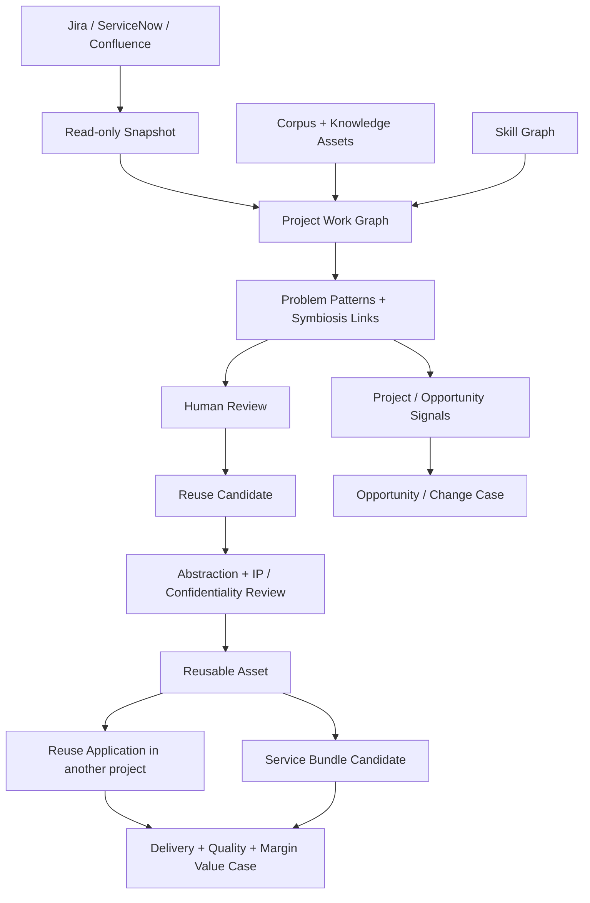

# Consultry - Project Intelligence, Symbiosis & Assetization v1.1

**Status:** Product-Vision-Core direction; fachliche Contracts, Outcome-Evidenz, Realisierungstiefe und Rollout bleiben aktive Reconciliation-/Wayfinder-Arbeit  
**Datum:** 28.06.2026 · **Vision-Core-/Assetization-Update:** 12.07.2026  
**Rolle im Doc-Stack:** Erweitert Work, Knowledge & Reuse und Opportunity-to-Concept um eine projektübergreifende Analyse-, Assetization- und Productization-Schicht über bestehende Projektmanagement-, ITSM- und Knowledge-Tools.  
**Bezug:** [Product Vision](./Consultry-Product-Vision-v1.0.md), [MVP-Technical-Foundation](./Consultry-MVP-Technical-Foundation-v1.0.md), [Virtual Harness & Second Brain Refinement](./Consultry-MVP-Virtual-Harness-Second-Brain-Refinement-v1.0.md), [Alignment Control Plane](./Consultry-Alignment-Control-Plane-v1.0.md).

> **Kurzfassung.** Consultry soll kein eigenes Jira, ServiceNow oder Projektmanagement-System nachbauen. Der starke Hebel ist ein **Project Intelligence Layer**: Jira/Atlassian, Confluence, ServiceNow, GitHub/GitLab, M365 und lokale Projektartefakte werden read-only/snapshot in den Second Brain gezogen. Daraus entsteht ein **Symbiosis Graph**, der zeigt, woran Teams arbeiten, welche Requirements/Pain Points/Ziele dahinter stehen, wo Arbeit redundant ist und welche freigegebenen Projekterfahrungen in kundenneutrale, versionierte Assets und productisierte Consulting-Angebote überführt werden können.

---

## 1. Strategische These

Opportunity-to-Concept ist nicht nur ein Akquise-Workflow. Die besten Akquise-Signale entstehen oft aus laufender Arbeit:

- Ein Kunde baut Workarounds, weil ein Pain noch nicht geloest ist.
- Zwei Teams loesen aehnliche Probleme unabgestimmt.
- Ein Projekt erzeugt eine Methode, ein Runbook, eine Referenz oder ein Skill-Profil, das direkt fuer den naechsten Pitch relevant ist.
- Jira/ServiceNow/Confluence enthalten Requirements, Incidents, Epics, Change Requests und Decision Trails, die besseres Angebot, bessere Delivery und bessere Folgegeschaefts-Signale liefern.

Der Moat ist nicht Project Management. Der Moat ist **Work Knowledge → Symbiosis Links → Assetization → Reuse Application → Service Productization → Delivery-/Margen-Compounding**.

---

## 2. Was Das Modul Ist

**Kanonischer Capability-Name:** Project Intelligence, Symbiosis & Assetization  
**Interner Kurzname:** Symbiosis & Reuse  
**Kategorie:** Project/Knowledge/Offer/Commercial compounding bridge

| Aufgabe | Beschreibung |
|---|---|
| Project Work Memory | laufende und abgeschlossene Arbeit als source-bound Graph: Projekte, Epics, Tickets, Incidents, Decisions, Requirements, Deliverables |
| Symbiosis Links | Verbindung zwischen Projekten, Teams, Skills, Assets, Pain Points, Angeboten und Referenzen |
| Redundancy Detection | doppelte oder sehr aehnliche Work Items, parallele Loesungen, wiederholte Fragestellungen |
| Conflict Detection | Teams arbeiten auf widerspruechliche Ziele, doppelte Ownership, unklare Dependencies |
| Opportunity Signals | ungelöste Requirements, neue Pains, Anschlussphasen, Support-/Incident-Cluster, Change-Requests |
| Internal Plan Generation | aus Opportunity + Project Knowledge + Skill Graph + Proof Assets entsteht ein interner Vorgehensplan |
| Assetization | validierte Projektarbeit wird abstrahiert, de-identifiziert, rechtlich geprüft, versioniert und als Blueprint, Template, Methodik, Runbook, Quality Gate, Automation oder AI Skill publiziert |
| Reuse Recommendation | passende Assets werden in parallelen und neuen Projekten kontextbezogen vorgeschlagen; Fit, Anpassungsbedarf, Provenance und Einschränkungen bleiben sichtbar |
| Service Productization | wiederholbare Assets werden mit Offer-/Service-/Product-Portfolio, Delivery-Modell, Pricing und Proof zu Consulting-Bundles verbunden |
| Value & Margin Learning | Zeit-, Qualitäts-, Preis-, Kosten- und Margenwirkung jeder Reuse Application fließt in Portfolio und Context Graph zurück |

---

## 3. Was Es Nicht Ist

- Kein Jira-/ServiceNow-Ersatz.
- Kein autonomes Ticket-Mutation-System.
- Kein Personen-Performance-Scoring.
- Kein Activity-Monitoring einzelner Consultants.
- Kein LinkedIn-Scraping.
- Kein autonomer Outreach ueber Clay/Apollo/LinkedIn.
- Kein impliziter Build-Scope-Freeze durch diese Vision-Spezifikation; Realisierungstiefe und Reihenfolge werden nach Abschluss der Product Vision separat re-baselined.

**Früh sichere Ausführungsform:** read-only/snapshot Import und Analyse im Hintergrund, wenn ein Kunde die Daten sauber freigibt. Outputs bleiben Vorschläge, keine automatisch geänderten Tickets oder publizierten Assets.

---

## 4. Integrationsfamilie

| Quelle | Adapter-Idee | Relevante Objekte | Grenze |
|---|---|---|---|
| Jira / Atlassian | Jira Cloud REST API, JQL search, webhooks where approved | Projects, Epics, Issues, Sprints, Status, Links, Comments, Attachments metadata | read-only/snapshot; no issue mutation in H1 |
| Confluence | Confluence REST API / CQL search | Pages, Spaces, Decisions, Runbooks, Meeting Notes, Requirements | read-only, space allowlist, source spans |
| ServiceNow | Table API / approved ITSM tables | Incidents, Problems, Changes, Requests, CMDB refs | read-only tables/views, role-scoped service account |
| GitHub/GitLab | repo/issues/PR/MR snapshots | delivery evidence, code/runbook links, architecture decisions | read-only app permissions |
| M365 / Google Drive | docs/files/export/delta | project docs, proposals, meeting notes, plans | folder allowlist, hashes |
| Clay/Apollo | enrichment snapshots | company/account/person/company context for approved GTM use cases | import only, no sequences/outbound |
| LinkedIn / X / web signals | approved/public or user-provided URLs/exports only | public role/org/change signals where lawful | no scraping, no private profile ingestion without legal basis |

Official source basis for the API surface: Atlassian documents Jira Cloud REST issue search and webhooks; Confluence documents REST/CQL search and content APIs; ServiceNow documents REST APIs and the Table API for table records.

---

## 5. Core Objects

```text
ProjectWorkSource
  source_type {Jira, Confluence, ServiceNow, GitHub, GitLab, M365, GoogleDrive, LocalFiles}
  tenant_id, connector_grant_id, source_scope, sync_cursor, last_snapshot_hash

ProjectWorkItem
  source_ref, project_ref, work_type {Epic, Story, Task, Bug, Incident, Change, Request, Decision, Requirement}
  title, status, priority, dates, labels, source_bindings[], owner_team_ref?

ProjectRequirement
  work_item_ref, need_statement, pain_point, target_outcome, acceptance_hint, evidence_spans[]

ProjectSignal
  kind {UnmetRequirement, RepeatedIncident, ExpansionHint, DuplicateWork, DeliveryRisk, ReuseOpportunity}
  source_refs[], confidence, review_state, suggested_next_action

ProblemPattern
  normalized_problem, domain, technology, lifecycle_stage, requirement_refs[], evidence_refs[]

SymbiosisLink
  subject_ref, predicate, object_ref, evidence_refs[], link_type
  examples: work_item_reuses_asset, team_solves_same_requirement, project_generates_reference

RedundancyFinding
  work_item_refs[], similarity_basis, overlap_summary, suggested_resolution, reviewer

ConflictFinding
  work_item_refs[], conflict_type {DuplicateOwnership, OpposingRequirement, DependencyMismatch, ScopeOverlap}
  explanation, source_refs[], reviewer

ReuseCandidate
  problem_pattern_ref, project_refs[], candidate_asset_type, overlap_summary
  customer_specificity, ip_confidentiality_state, suggested_owner, review_state

ReusableAsset
  asset_type {Blueprint, Template, Method, Runbook, QualityGate, Automation, AISkill, ProofAsset}
  title, abstracted_content_ref, applicability, exclusions, version, owner
  source_lineage[], rights_state, approval_state

ReuseApplication
  reusable_asset_ref, target_project_ref, fit, adaptation_plan, reviewer
  baseline_effort, actual_effort, quality_outcome, delivery_time_effect

ServiceBundleCandidate
  reusable_asset_refs[], target_problem_pattern, delivery_model
  pricing_model {TandM, FixedPrice, Outcome, AcceleratedDelivery}
  proof_refs[], commercial_owner, review_state

ReuseValueCase
  reuse_application_refs[], pricing_model, billed_effort, internal_effort
  delivery_time_effect, quality_effect, revenue_effect, margin_effect, assumptions[]

InternalPlanDraft
  opportunity_ref, requirements[], relevant_assets[], skill_shape, delivery_steps[], risks[], source_bindings[]
```

### 5.1 Assetization- und Productization-Flow

```text
ähnliche Projektarbeit erkennen
  → ProblemPattern und SymbiosisLink erklären
  → ReuseCandidate menschlich bestätigen
  → kundenspezifische Details abstrahieren/de-identifizieren
  → Contract/IP/Confidentiality/Usage Rights prüfen
  → ReusableAsset erstellen und versionieren
  → in parallelem/neuem Projekt als ReuseApplication vorschlagen
  → bei ausreichender Wiederholbarkeit ServiceBundleCandidate erzeugen
  → Delivery-, Quality-, Pricing- und Margin-Wirkung im ReuseValueCase messen
```

Ein einzelnes Kundenartefakt wird nicht automatisch tenant-weit wiederverwendbar. Der freigegebene Asset-Layer ist ein neues, abstrahiertes Objekt mit eigener Lineage, Rechten, Version, Owner und Approval.

---

## 6. Symbiosis Patterns

| Pattern | Example | Added Value |
|---|---|---|
| Duplicate Work | Zwei Teams bauen aehnliche Migration-Runbooks in verschiedenen Jira-Projekten | Konsolidierung, weniger Doppelarbeit, reusable asset |
| Hidden Reuse | Ein Incident-Cluster passt zu einer existierenden Methodik oder einem frueheren Projekt | schnellerer Plan, bessere Evidence |
| Delivery-to-Sales Signal | Viele Change Requests zeigen naechste Projektphase | Bestandskunden-Opportunity |
| Requirement-to-Skill | Requirements matchen Skill Graph und Project Experience | glaubwuerdige TeamShape und interner Plan |
| Conflict Link | Zwei Teams verfolgen widerspruechliche Zielbilder oder Dependencies | Management-Hinweis ohne Personen-Scoring |
| Tender-to-Project Memory | Ausschreibungsanforderung matcht fruehere Epics/Deliverables | belegbarer Proposal-Abschnitt |
| Parallel ERP Migration | Zwei SAP-S/4HANA-Projekte lösen ähnliche Datenmapping-, Cutover- oder Prozessharmonisierungsfragen | gemeinsame Problem Patterns, schnellere Delivery und weniger interne Doppelarbeit |
| Asset-to-Offer | Mehrfach bewährter Migrations-Blueprint wird Bestandteil eines Accelerated-Delivery-Bundles | höherer Kundennutzen, transparentes Pricing und wiederholbare Marge |

---

## 7. Flow: Project Work Zu Opportunity



1. Connector importiert freigegebene Projekt-/ITSM-/Knowledge-Daten als Snapshot.
2. Project Work Graph extrahiert Requirements, Pain Points, Ziele, Decisions, Deliverables und Evidence.
3. Symbiosis Engine findet Redundanzen, Konflikte, Problem Patterns, Reuse-Möglichkeiten und Opportunity-Signale.
4. Mensch bestätigt oder verwirft Findings und Reuse Candidates.
5. Freigegebene Kandidaten durchlaufen Abstraktion, De-Identifikation sowie Contract-/IP-/Confidentiality-/Usage-Rights-Review.
6. Consultry erzeugt ein versioniertes `ReusableAsset` mit Source Lineage, Owner, Anwendungsbereich und Ausschlüssen.
7. Das Asset wird in parallelen oder neuen Projekten als `ReuseApplication` vorgeschlagen oder in einen `ServiceBundleCandidate` überführt.
8. Delivery-, Quality-, Pricing- und Margenwirkung wird als `ReuseValueCase` gemessen und in Portfolio, Knowledge und Context Graph zurückgespielt.

---

## 8. Safety / Governance

| Risiko | Guardrail |
|---|---|
| Mitarbeiterueberwachung | team-/artefaktzentrierte Analyse; keine individuelle Produktivitaetsbewertung |
| Ticket-Mutation | read-only/snapshot im H1/H2-start; writeback nur spaeter per ADR und Approval |
| Falsche Redundanz-Erkennung | Finding bleibt Vorschlag mit SourceBindings und ReviewState |
| Tool-Sprawl | Jira/ServiceNow/Confluence bleiben operative Systeme; Consultry ist Analyse-/Planungsschicht |
| Verdecktes Prospecting | Clay/Apollo/LinkedIn nur als approved enrichment/signal input, keine Outreach-Automation |
| Betriebsrat/AI Act | aggregiert/anonym by default; personenscharf nur mit WC-Mode und dokumentierter Rechtsgrundlage |
| Kunden-IP / Vertraulichkeit | kein Cross-Customer-Reuse von Rohartefakten; Abstraktion, De-Identifikation, Rights State und Approval vor Publikation als ReusableAsset |
| Unzulässige Margenlogik | T&M erfasst tatsächliche Arbeit; eingesparte Stunden werden nicht fiktiv berechnet. Fixed-Price-, Outcome- und Accelerated-Delivery-Modelle benötigen transparente Vertrags-/Pricing-Basis |
| Qualitätsverlust durch unpassenden Reuse | Fit, Exclusions, Adaptation Plan, Version und menschlicher Reviewer pro ReuseApplication |

---

## 9. Cross-Module Dependencies & Ownership

| Abhängiger Kontext | Liefert | Konsumiert | Ownership-Grenze |
|---|---|---|---|
| **Customer / CRM** | `Account`, Stakeholder, Customer Boundary, Relationship Owner | validierte Account-/Opportunity-Signale | entscheidet nicht über fachliche Asset-Qualität |
| **Contract / Commercial Terms** | SOW, IP-Klauseln, Confidentiality, Usage Rights, Pricing Model | `ServiceBundleCandidate`, `ReuseValueCase` | autorisiert Wiederverwendungs- und Preislogik; verändert keine Projektartefakte |
| **Project & Delivery Intelligence** | Projects, Requirements, WorkItems, Decisions, Deliverables, Outcomes | `ReusableAsset`, Reuse Recommendation, Adaptation Plan | erkennt Patterns; publiziert kein Asset autonom |
| **Knowledge, Methods & Reuse** | bestehende Assets, Taxonomie, Versions-/Owner-Modell | `ReuseCandidate`, Source Lineage, Project Evidence | besitzt `ReusableAsset` und Asset-Versionen |
| **People / Skill Graph** | Capability, SkillEvidence, Roles, Team Capacity | Asset-bezogene Skill-/Learning-Evidence | keine Personen- oder Performance-Rankings aus Reuse-Daten |
| **Offer / Service / Product Portfolio** | Angebotsbausteine, Delivery-/Pricing-Modelle, Zielprobleme | `ReusableAsset`, Proof, `ReuseValueCase` | besitzt freigegebene `ServiceBundle`s, nicht die Quell-Projektarbeit |
| **Finance / Backoffice** | Ist-Aufwand, Kosten, Billing, Revenue, Margin, Contract Type | `ReuseApplication`, `ServiceBundleCandidate` | berechnet Value Cases; darf gesparte Stunden nicht als gearbeitet deklarieren |
| **Governance / Audit** | Policies, Approvals, Audit, Data Classification | jede verbindliche Statusänderung | blockiert Publikation/Reuse bei fehlender Rights-/Source-Basis |
| **Consultry Engine / Harness** | bounded ContextPack, Tools, RAG/MCP, Result Verification | freigegebene Source Snapshots und Policies | führt Analyse aus; erhält keine implizite Cross-Customer-Berechtigung |

### 9.1 System-of-Record-Regel

- Jira, ServiceNow, Confluence, Git, M365 und DMS bleiben Source of Record für operative Roharbeit.
- Contract-/CRM-/Finance-Systeme bleiben Source of Record für Kunden-, Vertrags- und Ist-Economic-Daten.
- Consultry ist Source of Truth für `ProblemPattern`, `SymbiosisLink`, `ReuseCandidate`, `ReusableAsset`, `ReuseApplication`, `ServiceBundleCandidate`, `ReuseValueCase`, deren Explanation sowie Approval-/Audit-Status.
- Writeback in Quellsysteme erfolgt nur als expliziter, policy- und approval-gated Operator.

---

## 10. Information Classification & Reuse Policy

### 10.1 Pflichtklassifikationen

```text
ConfidentialityClass {Public, TenantInternal, CustomerConfidential, Restricted}
ReuseScope {ProjectOnly, AccountOnly, TenantInternalAbstracted, SalesProofApproved, ExternalPublicationApproved}
RightsState {Unknown, ReviewRequired, AllowedWithAbstraction, AllowedInternal, Restricted, Rejected}
ReviewState {Suggested, InReview, Validated, Rejected, Superseded}
AssetState {Draft, RightsReview, Fachreview, Approved, Published, Deprecated, Revoked}
```

### 10.2 Dateninvarianten

1. Jedes extrahierte WorkItem, Requirement, Finding und Asset trägt `tenant_id`, SourceBinding, SourceScope, Snapshot-/Freshness-Zeitpunkt und Data Classification.
2. `ReuseCandidate` darf ohne nachvollziehbare Source Lineage nicht `Validated` werden.
3. Ein Kandidat mit `RightsState = Unknown|ReviewRequired|Restricted` darf nicht als tenant-weites `ReusableAsset` publiziert werden.
4. Cross-Account-Reuse verwendet nur `TenantInternalAbstracted` oder weiter freigegebene Assets; CustomerConfidential-Rohinhalte bleiben Account-/Project-isoliert.
5. Personenbezug wird aus ProblemPattern, Asset und ValueCase minimiert; Leistung, Geschwindigkeit oder Qualität werden nicht einzelnen Consultants als Score zugerechnet.
6. Jede Reuse Recommendation zeigt Fit, Unterschiede, Exclusions, Version, Source Lineage und benötigte Anpassung.
7. Jede Margen-/Value-Aussage zeigt Pricing-/Contract-Modell, Baseline, tatsächliche interne Arbeit, Annahmen und Datenzeitraum.
8. Asset-Revocation propagiert an offene Reuse Recommendations und markiert betroffene Applications/Service Bundles zur Prüfung.

---

## 11. Rollen, Rechte & Verantwortungen

| Rolle | Darf sehen | Darf vorschlagen | Darf entscheiden |
|---|---|---|---|
| **Consultant** | eigene/freigegebene Projektkontexte, passende Reuse Assets | Observation, Symbiosis-Hinweis, Asset-Kandidat, Adaptation Feedback | Anwendung eines freigegebenen Assets im eigenen Arbeitskontext |
| **Project Lead** | projektbezogene Findings, Reuse Fit, Delivery Impact | Reuse Candidate, Adaptation Plan, Outcome | Reuse im eigenen Projekt; kein tenant-weites Publishing allein |
| **Practice / Knowledge Owner** | fachlich freigegebene Cross-Project Patterns und Lineage | Asset-Typ, Applicability, Exclusions, Version | Fachreview und Asset Ownership |
| **Contract / Governance Reviewer** | notwendige Source-/Contract-/Classification-Details | Einschränkungen, Abstraktionsauflagen | Rights-/Confidentiality-Freigabe oder Blockierung |
| **Sales / Account Owner** | kundenbezogene Reuse-/Proof-Evidenz und Bundle-Fit | ServiceBundleCandidate, Kunden-Value-Hypothese | kommerzielle Weiterbearbeitung, nicht die fachliche Asset-Freigabe |
| **Finance / Operations** | Contract Type, Ist-Aufwand, Kosten, Revenue, Value Assumptions | ReuseValueCase, Pricing-/Margin-Szenario | Economic Review im eigenen Verantwortungsbereich |
| **Management** | aggregierte Portfolio-, Reuse-, Capability- und Economics-Projektionen | Investitions-/Portfolio-Szenario | Portfolio-/Service-Bundle-Priorität unter bestehenden Gates |

---

## 12. Lifecycle & Domain Events

### 12.1 ReuseCandidate

```text
Suggested → InReview → Validated → AssetizationRequested
                   └→ Rejected
Validated → Superseded
```

### 12.2 ReusableAsset

```text
Draft → RightsReview → Fachreview → Approved → Published
                                      ├→ Deprecated
                                      └→ Revoked
```

### 12.3 Domain Events

| Event | Producer | Primäre Consumer |
|---|---|---|
| `ProjectWorkSnapshotUpdated` | Connector/Project Intelligence | Pattern Detection, Audit |
| `ProblemPatternDetected` | Symbiosis Engine | Practice Queue, Project Leads |
| `SymbiosisLinkSuggested` | Symbiosis Engine | Reuse Candidate Review |
| `ReuseCandidateValidated` | menschlicher Reviewer | Assetization, Governance |
| `RightsReviewCompleted` | Contract/Governance | Knowledge Asset Workflow |
| `ReusableAssetPublished` | Knowledge Owner + Approval | Project Workspaces, Offer Portfolio, Capability Graph |
| `ReuseRecommended` | Consultry Engine | Consultant/Project Lead My Work |
| `ReuseApplicationAccepted` | Consultant/Project Lead | Delivery, Outcome Tracking |
| `ReuseOutcomeRecorded` | Project/Finance | Knowledge Versioning, Value Case, Portfolio |
| `ServiceBundleCandidateCreated` | Offer/Portfolio Logic | Sales, Practice, Finance |
| `ReuseValueCaseUpdated` | Finance/Outcome Engine | Management, Offer Portfolio, Capability Planning |
| `ReusableAssetRevoked` | Knowledge/Governance | all open Recommendations, Applications, Bundles |

Alle Events tragen `tenant_id`, actor/system identity, timestamp, correlation/causation IDs, target object/version und AuditRecord.

---

## 13. Functional Requirements

| ID | Requirement |
|---|---|
| **SYM-FR-001** | Freigegebene Projektquellen müssen scope- und snapshot-basiert ingestiert werden können, ohne unbeschränkten Connector-Zugriff. |
| **SYM-FR-002** | Consultry muss Requirements, WorkItems, Decisions, Deliverables, Problems und Outcomes mit Source Spans extrahieren und auf Project/Account/Technology/Lifecycle abbilden. |
| **SYM-FR-003** | Das System muss ähnliche, komplementäre und widersprüchliche Arbeit als erklärbare `SymbiosisLink`s vorschlagen können. |
| **SYM-FR-004** | Jede Ähnlichkeits-/Redundanzhypothese muss gemeinsame und unterschiedliche Merkmale sowie die stützenden Sources zeigen. |
| **SYM-FR-005** | Menschen müssen Findings bestätigen, zusammenführen, korrigieren, ablehnen und als irrelevant markieren können. |
| **SYM-FR-006** | Aus validierten Patterns müssen `ReuseCandidate`s mit vorgeschlagenem Asset-Typ, Owner, Applicability und Rights-/Confidentiality-Status entstehen können. |
| **SYM-FR-007** | Assetization muss Abstraktion, De-Identifikation, fachliches Review, Rights Review, Versionierung, Approval und Publikation als getrennte Schritte unterstützen. |
| **SYM-FR-008** | `ReusableAsset`s müssen Applicability, Exclusions, Source Lineage, Version, Owner, Rights State und Approval State tragen. |
| **SYM-FR-009** | Consultry muss passende Assets in Projekt-, Opportunity- und Work-Kontexten mit Fit, Adaptation Plan und Einschränkungen empfehlen können. |
| **SYM-FR-010** | Nutzer müssen Reuse annehmen, anpassen, ablehnen oder später bewerten können, ohne das Quellprojekt zu öffnen. |
| **SYM-FR-011** | Wiederholt erfolgreiche Assets müssen als `ServiceBundleCandidate` mit Zielproblem, Proof, Delivery- und Pricing-Modell vorgeschlagen werden können. |
| **SYM-FR-012** | `ReuseValueCase` muss Baseline und Ist für interne Zeit, Delivery-Zeit, Qualität, Revenue, Kosten und Marge getrennt ausweisen. |
| **SYM-FR-013** | T&M-, Fixed-Price-, Outcome- und Accelerated-Delivery-Fälle müssen getrennte Economic-Logik und Copy besitzen. |
| **SYM-FR-014** | Asset-Updates, Deprecation und Revocation müssen offene Recommendations, Applications und Bundles versioniert beeinflussen. |
| **SYM-FR-015** | Reuse Findings und Reviews müssen in `My Work`, Project 360, Practice/Team Lead Control Room und Knowledge/Offer Workspaces als Projektionen derselben Objekte erscheinen. |
| **SYM-FR-016** | Jede verbindliche Publikation, Cross-Account-Anwendung, Service-Bundle-Freigabe oder externe Wirkung benötigt Policy, Approval und Audit. |

---

## 14. Data & Information Requirements

| Bereich | Pflichtinformationen |
|---|---|
| **Source Identity** | connector, source object/version, source span, snapshot hash, captured at, freshness, tenant/account/project scope |
| **Pattern Evidence** | normalized problem, domain, technology, lifecycle stage, shared/different traits, evidence refs, confidence, model/version |
| **Customer Boundary** | account/project IDs, confidentiality class, reuse scope, purpose, lawful/contractual basis where required |
| **Rights & Lineage** | source lineage, contract/SOW refs, IP owner, permitted use, abstraction obligations, reviewer, decision/version |
| **Asset Metadata** | type, title, version, owner, applicability, exclusions, dependencies, quality criteria, deprecated/revoked state |
| **Application Context** | target project/problem, fit, required adaptations, reviewer, accepted version, execution/outcome timestamps |
| **Commercial Context** | pricing model, contract type, baseline and actual effort, internal cost, billed amount, revenue/margin assumptions |
| **Outcome Evidence** | delivery time, quality/defect/rework indicators, customer outcome, reuse feedback, knowledge/capability updates |

### 14.1 Retrieval/ContextPack-Regel

Ein Harness erhält nicht den vollständigen Cross-Project-Graphen. Die Engine kompiliert ein job-scoped `SymbiosisContextPack` mit genau den freigegebenen Pattern-, Asset-, Rights- und Target-Project-Informationen, die für Review, Assetization oder Reuse erforderlich sind.

---

## 15. UX Surfaces & Interaction Requirements

| Surface/Frame | Primärrolle | Kernobjekt | Eine Hauptentscheidung |
|---|---|---|---|
| **My Work · Symbiosis Card** | Project/Practice Lead | `ReuseCandidate` | prüfen |
| **Symbiosis Review** | beteiligte Fachrollen | `ProblemPattern` + `SymbiosisLink` | validieren/mergen/ablehnen |
| **Assetization Studio** | Knowledge/Practice Owner | `ReusableAsset Draft` | in Rights-/Fachreview geben |
| **Rights & Trust Drawer** | Governance/Contract Reviewer | Rights/Lineage/Classification | freigeben/einschränken/blockieren |
| **Project Reuse Suggestion** | Consultant/Project Lead | `ReuseApplication` | anwenden/anpassen/ablehnen |
| **Service Bundle Composer** | Sales/Practice/Finance | `ServiceBundleCandidate` | als Offer-Baustein übernehmen |
| **Value & Portfolio View** | Finance/Management | `ReuseValueCase` | Annahmen bestätigen / Investment priorisieren |

Kein Surface ist ein isoliertes Pflichtmodul. Jede Darstellung öffnet aus Queue, Projekt, Knowledge, Offer oder Management-Kontext und kehrt in diesen Kontext zurück.

---

## 16. Non-Functional & Trust Requirements

- **Tenant- und Customer-Isolation:** harte technische Enforcement-Grenze, nicht nur UI-Filter.
- **Explainability:** keine Symbiosis-/Reuse-Empfehlung ohne Evidence, gemeinsame/unterschiedliche Merkmale und Modell-/Regelversion.
- **Data Minimization:** Cross-Project-Analyse verwendet nur allowlisted Source Scopes und minimiert Personen-/Kundendetails.
- **Version Integrity:** Asset-, Rights- und Application-Versionen bleiben reproduzierbar und auditierbar.
- **Revocation Propagation:** kritische Revocation-/Restriction-Events werden zuverlässig an abhängige Objekte propagiert.
- **Human Control:** keine autonome Asset-Publikation, Cross-Account-Anwendung, Service-Bundle-Freigabe oder externe Kommunikation.
- **Accessibility:** alle Findings und States funktionieren ohne reine Farbcodierung; Keyboard, Fokus, semantische Labels und 10-pt-Minimum gelten im App-UI.
- **Low-Friction Work:** Consultants dürfen Reuse aus ihrem Projekt-/Work-Kontext annehmen oder ablehnen; kein separater Wissenspflegezwang.

---

## 17. Acceptance Scenario — Parallel SAP S/4HANA Migrations

1. Hansa und ein zweites freigegebenes Mandat enthalten ähnliche Datenmapping-, Cutover- und Prozessharmonisierungs-Requirements.
2. Consultry erzeugt ein `ProblemPattern` und zwei source-bound `SymbiosisLink`s mit gemeinsamen und unterschiedlichen Merkmalen.
3. Ein Practice Lead bestätigt den fachlichen Overlap; kein Asset wird automatisch erstellt.
4. Das Assetization Studio markiert Kundennamen, Datenfelder und kundenspezifische Decisions zur Entfernung beziehungsweise Abstraktion.
5. Contract/Governance Review setzt `RightsState = AllowedWithAbstraction` und `ReuseScope = TenantInternalAbstracted`.
6. Ein versionierter „S/4HANA Migration Readiness & Cutover Blueprint“ wird mit Applicability, Exclusions und Quality Gates publiziert.
7. Im parallelen Projekt erscheint eine Reuse Recommendation mit Fit, Anpassungsplan und Quellen; der Project Lead übernimmt sie.
8. Outcome Tracking erfasst tatsächliche interne Arbeit und Delivery-/Quality-Effekt.
9. Für einen wiederholbaren Anwendungsfall entsteht ein Accelerated-Delivery-/Fixed-Price-`ServiceBundleCandidate`; T&M bleibt als tatsächlicher Aufwand getrennt.
10. Finance/Management sehen einen nachvollziehbaren `ReuseValueCase`, der auf Project-, Asset-, Contract- und Outcome-Daten zurückführbar ist.

---

## 18. Horizon Placement

| Horizont | Rolle |
|---|---|
| Product Vision | Project Intelligence, Symbiosis, Assetization, Reuse Application, Service Productization und Value/Margin Learning sind Teil des Whole Product. |
| Frühes Substrat | ProjectStatus, Knowledge/Reuse und freigegebene Projektartefakte schaffen die Datenbasis; genaue Tiefe wird nach Vision-Abschluss re-baselined. |
| Tiefere Realisierung | Jira/Confluence/ServiceNow und weitere read-only Connectoren, Redundancy-/Pattern-/Reuse-Erkennung, Assetization Studio und Reuse Value Cases. |
| Spätere Tiefe | Breitere Portfolio Intelligence und optional bidirektionale PM-Integrationen mit Approval und Governance, falls Kunden das wirklich wollen. |

---

## 19. WBS-Skizze Fuer Spaeter

| ID | Paket | Inhalt | Max LOC | Akzeptanz |
|---|---|---|---:|---|
| PI-01 | Project Work schema | work sources, work items, requirements, signals | 1000 | fixture graph roundtrip |
| PI-02 | Jira connector | read-only project/issue snapshot via JQL allowlist | 1000 | project allowlist enforced |
| PI-03 | Confluence connector | page/search snapshot with source spans | 900 | page evidence spans preserved |
| PI-04 | ServiceNow connector | read-only approved tables/views | 1000 | unapproved table rejected |
| PI-05 | SymbiosisLink engine v0 | similar work/reuse/opportunity links | 1000 | fixture finds expected links |
| PI-06 | Redundancy/Conflict findings | duplicate and conflict candidates with review state | 900 | no finding persists without evidence |
| PI-07 | InternalPlanDraft builder | opportunity + project memory + skill graph plan | 1000 | plan includes source-bound assets and risks |
| PI-08 | Review UI slice | approve/dismiss signal, create Opportunity | 900 | no auto-opportunity without human review |
| PI-09 | Assetization domain | ReuseCandidate, ReusableAsset, state machines, lineage | 1000 | publish gate enforces source/rights/approval |
| PI-10 | Rights/classification policy | confidentiality, reuse scope, rights state, revocation | 900 | restricted source cannot cross account |
| PI-11 | Reuse recommendation | target fit, exclusions, adaptation plan | 1000 | recommendation explains match and differences |
| PI-12 | Reuse application/outcome | accept/adapt/reject, version pin, outcome | 900 | accepted application references exact asset version |
| PI-13 | Service bundle candidate | asset-to-offer mapping, proof, delivery/pricing model | 900 | candidate cannot bypass commercial review |
| PI-14 | Reuse value case | baseline/actual delivery, quality, revenue, cost, margin | 1000 | T&M and fixed-price logic remain distinct |
| PI-15 | UX frame set | queue card, review, assetization, project suggestion, value view | 1000 | end-to-end acceptance scenario passes |

---

## 20. Source Basis

- Atlassian Jira Cloud REST API issue search / JQL: https://developer.atlassian.com/cloud/jira/platform/rest/v3/api-group-issue-search/
- Atlassian Jira Cloud REST API webhooks: https://developer.atlassian.com/cloud/jira/platform/rest/v3/api-group-webhooks/
- Atlassian Confluence Cloud REST API / search: https://developer.atlassian.com/cloud/confluence/rest/v1/api-group-search/
- Atlassian Confluence Cloud REST API v2 reference: https://developer.atlassian.com/cloud/confluence/rest/
- ServiceNow REST API / Table API: https://www.servicenow.com/docs/r/api-reference/rest-apis/c_TableAPI.html

---

*Ende v1.1 — Project Work Intelligence über bestehende PM-/ITSM-Systeme, nicht als eigenes PM-System; projektübergreifende Symbiose, Assetization, Reuse Application und Service-/Margin-Compounding sind Product-Vision-Core.*
