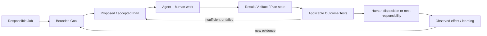

# Consultry — Systemic Platform Click Dummy Experience Contract v0.1

**Status:** Ratified prototype-direction correction; detailed IA, screens and interaction choreography remain validation hypotheses  
**Date:** 2026-08-06  
**Wayfinder owner:** [Prototype the Systemic Consultry Platform Click Dummy](./wayfinder/consultry-product-platform-baseline/tickets/prototype-the-role-aware-human-ai-interaction-and-responsibility-contract.md)

## 1. Decision

The next Consultry Mock is not a sequence of three semi-independent Slice demos. It is a navigable, frontend-only **Systemic Platform Click Dummy** that lets a target-consultancy user experience Consultry as one AI-native Consulting Operating System.

The three ratified Reference Threads remain essential, but their role changes:

- they are **deep anchor journeys and validation corridors** inside one Product Experience;
- they do not define the global information architecture, application boundary or user mental model;
- they reuse one Consultancy world, shared Business Objects, persistent work state and a common Human-AI collaboration grammar;
- users may enter, leave, inspect adjacent context and return without following a mandatory Scene rail.

The prototype follows **thin platform breadth plus deep continuity**: enough of the Whole Product is present to make the system and its relationships understandable, while a small number of connected journeys are deep enough for realistic work and trust testing. This does not authorize a full-product build or backend implementation.

## 2. Why the previous contract was insufficient

The existing Product Definition already contains the right ingredients:

- object- and work-centered interaction instead of a module maze;
- `My Work / Why now`, direct Business-Object contexts, Search/Ask and Quick Capture;
- role- and moment-specific Projections;
- progressive disclosure from attention to source and audit detail;
- shared Case, Source, Responsibility, Authority, Effect and Outcome semantics;
- a guided App as default and an optional Harness over the same Case;
- connected ERP, Tender, Delivery-Challenge and Artifact-/Reuse fixtures.

The current build contract nevertheless organizes implementation and Definition of Done around ten Scenes and three Slice streams. That can produce technically connected screens while still feeling like a guided presentation. The optional model-composed Surface and Harness cameo also do not yet prove that Consultry is an **agent-native co-worker embedded in real work**.

The corrected contract therefore makes system comprehension, freely navigable continuity, progressively disclosed co-work and cross-view state propagation first-class prototype outcomes.

## 3. Prototype outcome

After a short unmoderated orientation, a Partner, Principal, Project Lead or Senior Consultant from a target Boutique or Growing Specialist Consultancy should be able to explain and demonstrate:

1. where current work, Clients, Projects, Work Results and firm knowledge live;
2. how Consultry brings relevant context and AI-supported work into the current responsibility rather than requiring a blank-chat prompt;
3. how a user moves from attention through actual work to a responsible result and observable next effect;
4. how the same decision, Artifact and state remain continuous across My Work, Client/Project context, Co-Work and Knowledge views;
5. what the model proposed, what sources support it, what remains uncertain, what the human owns and what actually changed;
6. how Consultry assists one role-compressed Boutique user without inventing staff, while also preserving explicit contribution and handoff in a Growing Consultancy;
7. why this is a Consulting OS rather than an isolated feature, generic chat assistant, document generator or CRM skin.

The Click Dummy may simulate all data, model results, integrations and effects. It must label simulation honestly and must not imply technical feasibility, model quality, productive authorization or Product-market fit.

## 4. One persistent Consultancy world

The prototype uses one deterministic fictional Consultancy environment rather than unrelated examples.

| Context | Role in the Product world |
|---|---|
| `Hansa Maschinenbau AG` and its ERP work | Deep continuity across Client context, active Project work, Artifact output, responsible effects and later learning/reuse. |
| `KRITIS Security Transformation Tender` | Net-new contrast entry with a different source, criteria and commitment basis. |
| `Project Nord` | Bounded cross-project overlap/reuse context; no expectation that consultants manually create patterns. |
| Boutique projection | One authorized person may carry compressed responsibilities and complete work with AI-/Agent-support. |
| Growing projection | Contributions, custody and decisions may be distributed while accountability remains explicit. |

Actions in this world update a shared deterministic in-memory state. A decision or draft may therefore change My Work, a Project/Client view, an Artifact status, an Outcome/Test view or a subsequent Knowledge signal. Reset and seeded state selection remain facilitator controls, not Product navigation.

## 5. Experience architecture

### 5.1 Persistent Product shell

The Click Dummy starts in the Product, not in a demo-scene selector. It exposes a restrained version of the durable Consultry work areas:

- **My Work** — attention, active work, drafts, requested contributions, decisions and follow-through;
- **Customers** — Client context, relationships, commitments and connected Projects;
- **Projects** — active work, plans, decisions, Work Results, risks and outcomes;
- **Knowledge & Assets** — source-visible retrieval, expert access, applicable firm knowledge and governed reuse;
- **People & Teams** — responsibility, contribution, capability and capacity context;
- **Commercials** — opportunity, proposal, commitment and change context;
- **Operations** — relevant operational consequences and exceptions.

Only areas necessary for the mental model and anchor journeys need meaningful depth. Peripheral areas may be shallow but must be semantically credible and visibly connected. Capability modules remain backend/domain boundaries and are not copied one-to-one into navigation.

Quick Capture, Search/Ask, current Client/Project context, notifications/requests and the Consultry co-worker entry remain globally available where appropriate. A clearly separated facilitator control can jump to seeded states, switch organization projection and reset the world.

### 5.2 Core Product surfaces

The prototype composes a small set of work surfaces rather than designing a page for every state:

| Surface | Primary user question |
|---|---|
| **System Home / My Work** | What needs my attention or continued work, and why now? |
| **Business Object 360** | What is the current Client, Project, Artifact or commitment context? |
| **Co-Work Case / Task Workspace** | What are we trying to achieve, what is Consultry doing, and what must I contribute or decide? |
| **Artifact / Plan Canvas** | What Work Result or plan are we producing, testing or refining? |
| **Outcome / Test child surface** | Within the current Task, Artifact, Plan or Handoff: what can be verified now, what remains provisional, and what can responsibly be claimed? |
| **Effect / Handoff child surface** | Within the current responsible flow: what changes, who acts or receives responsibility, and what remains open? |
| **Knowledge / Reuse View** | Which source, expert input or reusable capability applies, and under which boundaries? |

These are composable surface families, not fixed layouts, mandatory steps or separate apps.

### 5.3 Contextual child-surface rule

Source/Evidence inspection, Outcome Tests, confirmation/approval, Trust/Assurance and Effect/Handoff review are **not global destinations and not independent product areas**. They are child surfaces of the Case, Task, Artifact/Plan, Decision or Handoff whose responsibility they qualify.

A child may expand inline, open as the existing contextual sidepanel/drawer, or temporarily take the dominant canvas when the work needs space. In every form it retains the parent object's goal, version, owner, current work state and return path. `My Work`, a notification or Search may deep-link directly to an open child state, but the Product must still show which parent flow the user is inside. Closing or completing the child returns to that flow with the same selection and draft state.

## 6. Progressive-disclosure contract

Progressive disclosure is a behavioral contract, not only a visual principle. Each work item can deepen through four contextual levels without forcing the user to traverse all of them:

| Level | Default content | User intent | Must not become |
|---|---|---|---|
| **L0 — Attention** | why now, affected context, responsible person, horizon and one useful next action | decide whether to open, defer, route or dismiss | dense evidence dashboard |
| **L1 — Work Brief** | bounded goal, current state, key source/evidence, expected work result and next step | understand and take over the work | generic AI summary |
| **L2 — Co-Work Detail** | editable plan, alternatives, draft/artifact, open questions, applicable Outcome Tests and agent progress | direct, refine, test or complete work | opaque autonomous run or chat transcript |
| **L3 — Assurance** | exact source/version lineage, uncertainty, Testability/Evidence State, Claim Ceiling, policy, Skill/run provenance and audit | investigate trust, responsibility or failure | permanently dominant control panel |

Rules:

1. The default depth follows the current Job, risk and decision horizon; it is not a universal wizard sequence.
2. Important uncertainty, missing basis or blocked responsibility may be promoted upward and never hidden behind disclosure.
3. Deeper detail opens in context and preserves the active Work Result, selection and responsibility.
4. Returning to a shallower level retains decisions, drafts and open obligations.
5. Source, AI Candidate, human Assessment/Decision and actual Effect remain distinguishable at every level where they matter.
6. Assurance and validation depth never creates a parallel navigation hierarchy: it remains a child of the work being assured or validated.

## 7. Agent-native co-work contract

Consultry must feel like a capable co-worker inside consulting work, not like a chatbot attached to enterprise records.

### 7.1 Co-work starts from work

Every substantive AI-/Agent interaction is bound to a real combination of:

`responsible Job + Business Subject + Goal + intended Work Result/Plan + permitted Context + current Sources + Authority boundary`.

The user may begin from My Work, a Client/Project/Artifact, Search/Ask, Quick Capture or an intentional Challenge. A blank conversation may exist as a secondary entry, but it must resolve into an explicit work context before producing a governed result or effect.

### 7.2 Persistent co-work loop

The Product keeps a legible, editable working loop:



The visible experience may compress this loop. It must still make the current goal, state, proposed next move, produced result and relevant outcome evidence recoverable on demand.

### 7.3 Agent behavior

Within the Mock, Consultry may visibly simulate that an Agent:

- retrieves and connects authorized context;
- proposes or adapts a bounded plan;
- prepares questions, analysis, options, drafts, plans or structured Work Results;
- applies relevant Skill definitions or requests missing expert/context input;
- evaluates verifiable parts against Outcome Tests;
- marks untestable or not-yet-verifiable claims and respects the Claim Ceiling;
- replans, pauses, escalates or returns responsibility when basis, capability or Authority is insufficient.

The human can direct, edit, accept, reject, retry or stop the work. Agent progress is not business progress until the relevant human disposition, accepted Work Result or permitted Effect occurs. Multiple Agent outputs do not constitute independent evidence or a vote.

### 7.4 Dynamic visual context, explanation and elicitation

The Co-Work Surface is not limited to generated prose. Consultry may dynamically compose the most useful approved representation for the current Case, Goal and uncertainty. This is a core Click-Dummy hypothesis, not a decorative dashboard layer.

The first allowlisted interaction families are:

| Dynamic block | Use when | Human value |
|---|---|---|
| **Context / Relationship Visual** | relevant Clients, Projects, Artifacts, Sources, stakeholders, dependencies or reuse links must be understood together | makes the connected context and affected objects graspable |
| **Process / Decision Diagram or Timeline** | sequence, branch, dependency, handoff or change over time matters | explains where the work is, what changed and which paths remain |
| **Comparison / Evidence Matrix** | alternatives, source versions, criteria, claims or options must be compared | supports review without hiding differences in prose |
| **Quantitative Chart** | the source data is genuinely quantitative and a distribution, trend, variance or composition changes the decision | compresses numeric evidence without inventing precision |
| **Adaptive Question Set** | missing human context, intent, judgment or prioritization materially blocks the Goal or next Agent step | turns clarification into bounded co-work rather than a long prompt exchange |
| **Few-shot Suggestions** | examples help the user understand the expected answer, Artifact shape or plausible next move | lowers blank-page effort while preserving human choice |

Question Sets may use single choice, multi-choice, ranking or structured fields, but they remain non-exhaustive whenever the domain is open. In those cases they must offer a free-answer path such as `Eigene Antwort`, plus an honest `nicht ausreichend beurteilbar / mehr Kontext nötig` path where relevant. Responses update the working Context, Plan or Artifact; they are not automatically a Decision, Approval or Effect.

Few-shot Suggestions are editable starting points, not preselected answers. The Surface identifies whether they come from permitted firm examples, a generic pattern or current model generation and—where useful—why an example may fit. Examples must not manufacture Evidence, imply consensus or silently anchor a consequential decision.

Every dynamic explanatory Surface follows a small Human-Agent explanation grammar:

```text
What did Consultry understand or notice?
Which exact context and sources support that view?
Where is it uncertain or incomplete?
Why is this diagram, chart, question or example useful now?
What input or decision is needed from the human?
What will that input change—and what will it not change?
```

Rendering rules:

1. The semantic need selects the representation; the Product does not add diagrams or charts for decoration.
2. Charts expose metric definition, units, time range, source and uncertainty. Unsupported inference is never visualized as measured fact.
3. Diagrams expose relevant relationships or flow without pretending that the visual is the complete Domain Graph or Agent Graph.
4. Users can inspect an accessible text/table equivalent and, where useful, switch representation.
5. L1 may show the compact explanation; interactive questions and visuals normally expand at L2; exact data/provenance remains available at L3.
6. Generated labels, options and examples remain editable, dismissible and source-/AI-legible.
7. The `SurfaceSpec` can compose only allowlisted blocks and typed actions; it cannot emit arbitrary UI code or gain Business Authority.

The Click Dummy must include at least one context-appropriate relationship/process visual and one adaptive Question Set with a free-answer path and Few-shot Suggestions. A quantitative chart is included only where the fixture contains real numeric evidence for a meaningful user decision.

These blocks are a prototype extension candidate to the frozen Consultry App Design System v1.1. The Click Dummy must use its existing tokens, hierarchy, accessibility and action rules, but it does not silently ratify new canonical components. Observed use and comprehension determine a later Design-System revision.

Their moment-level placement and minimum fixture coverage are defined in [Dynamic Co-Work Surface Moment Map v0.1](./Consultry-Dynamic-CoWork-Surface-Moment-Map-v0.1.md).

### 7.5 App and optional Harness

The guided App is the default for less technical users. It renders structured, sometimes model-composed work surfaces using approved Consultry components. Conversation is one way to steer or refine a Surface, not the only Product form.

The optional Codex-like Harness opens the **same** Case, Goal, Context, Sources, Artifact/Plan, Outcome Tests and Authority boundary for users who want a denser workbench. It must return to the same Product state and cannot gain additional business rights. The Mock validates this continuity; it does not specify a general Harness framework or runtime.

### 7.6 Current reference check

The contract deliberately adopts current agent-work interaction lessons without copying their product boundaries:

- [Claude Cowork](https://www.anthropic.com/product/claude-cowork) is outcome- and deliverable-centered, accepts a broader goal, works across files/tools and keeps consequential decisions with the user. Consultry should inherit the move from prompt-by-prompt assistance to delegated, reviewable work—but bind it more tightly to consulting Business Objects, source context, responsibility, Outcome Tests and Claim Ceiling.
- The [Codex app](https://openai.com/index/introducing-the-codex-app/) emphasizes durable project/task context, visible agent work, review, parallelism and reusable Skills. Consultry should inherit supervisable work continuity and reusable capability definitions—but translate them from repositories/diffs into Clients, Projects, Cases, Artifacts/Plans, Decisions and Effects.
- [ChatGPT Work](https://help.openai.com/en/articles/20001275-chatgpt-work-and-codex) explicitly separates quick chat from longer, multi-step work that returns finished deliverables and supports progress review, redirection and approval. This supports Consultry's separation of contextual conversation from the persistent Co-Work object.

These references validate the interaction direction, not Consultry's domain correctness or market value. The prototype must still test whether target-consultancy users understand and prefer the resulting system.

## 8. Anchor journeys inside the system

The three existing Slices are retained as deep, selectable corridors:

1. **Opportunity-to-Project** — existing-client ERP signal or net-new KRITIS Tender through responsible qualification, commitment readiness and accepted Project handoff.
2. **Active Client Work** — realistic consulting work produces and tests an Artifact, plan or decision basis; a relevant Challenge can be admitted, handled or rejected without reducing all Delivery to Blind-Spot management.
3. **Knowledge/Artifact Alignment and Reuse** — the exact Work Result is created or revised against current Client/Project and corporate context; applicable knowledge is retrieved, and a system-detected overlap may become a separately governed reuse candidate.

The old Scene inventory remains source material for seeded moments and recovery states. It no longer defines the app's navigation or completion contract. The detailed content of the corridors stays deliberately adjustable until the Click Dummy enables practical user testing.

## 9. Cross-view continuity that the Mock must make visible

At least the following state ripples must be demonstrable:

- a qualified/held/rejected entry updates the relevant My Work and Client/Commercial context;
- accepted Commitment readiness creates or updates the Project context and next responsibility;
- Project co-work changes the exact Plan/Artifact state rather than only producing a chat answer;
- an Outcome Test or human disposition changes what may be claimed, used, handed off or externalized;
- a controlled Effect produces a visible next state or recoverable failure;
- detected cross-project overlap is retrieved from connected work and sources, not manually authored as routine consultant overhead;
- confirmed learning/reuse remains linked to source work and separate from publication or productization.

## 10. Prototype validation contract

Moderated sessions test the system, not only individual screens.

### 10.1 Core validation questions

- Can the participant explain what Consultry is and where they would begin a normal workday?
- Can they move from My Work into a Client/Project/Artifact and back without losing the work thread?
- Does deeper information appear when needed while the default view stays actionable?
- Can they distinguish goal, Agent plan/activity, proposed result, human responsibility and actual effect?
- Do they experience the Agent as a co-worker in their work rather than a chatbot or one-shot generator?
- Do dynamic diagrams, matrices, charts or explanations make the relevant context clearer, and can the participant find their source and uncertainty?
- Do adaptive questions reduce effort without constraining the participant to model-generated options, and do Few-shot Suggestions help without unduly anchoring the answer?
- Is the concrete improvement of Work Results, artifacts, tasks and plans visible?
- Can they identify what is verifiable now, what is not, and what may responsibly be claimed?
- Does the same Product remain coherent under Boutique role compression and Growing contribution/handoff?
- Do adjacent Product areas make the OS promise credible without looking complete or pretending backend depth?
- Where does the Product create confusion, unnecessary ceremony or a missing Consulting-work capability?

### 10.2 Required validation routes

- one deep ERP route spanning at least entry/project context, active work, Work Result/Outcome Test and responsible continuation;
- one KRITIS Tender contrast route through qualification and commitment/readiness;
- one recovery/failure route with retained work and visible next responsibility;
- one cross-view state ripple chosen freely by the participant;
- one optional Harness transition for participants who see a reason to use it.

## 11. Definition of Done for the Click Dummy

The prototype is ready for facilitated testing only when:

1. it opens in a believable Consultry workspace rather than a Scene list;
2. the participant can navigate the core shell and inspect connected Client, Project, work and knowledge context;
3. the ERP and KRITIS routes are selectable inside the same Product world;
4. shared deterministic state survives route changes and can be reset reproducibly;
5. at least one decision, Artifact/Plan change, Outcome Test and Effect/Handoff visibly ripple into another relevant view;
6. progressive-disclosure levels are implemented and important blockers cannot be hidden;
7. a bounded Agent co-work loop is legible without relying on a permanent chat transcript;
8. at least one meaningful relationship/process visual and one adaptive Question Set with free answer and Few-shot Suggestions are available through the allowlisted dynamic-Surface contract;
9. every dynamic visual, option set and example is source-/AI-legible, accessible and does not imply unsupported certainty or Authority;
10. source, AI/Agent contribution, human disposition and simulated Effect remain distinguishable;
11. Boutique Single-Human Responsible Completion and Growing contribution/handoff are both testable;
12. the optional Harness reuses the same work state and is unnecessary for completing the default App route;
13. recovery, empty, insufficient-basis and simulated-effect-failure states preserve responsibility and work continuity;
14. accessibility, responsive behavior, deterministic test fixtures and the agreed engineering quality gates pass;
15. the facilitator can capture findings against system comprehension, co-work, disclosure, continuity, value and trust.

## 12. Deliberately not ratified by this contract

- final global navigation labels, route structure or screen count;
- a full implementation of all `6 + 1` Journey Families or Capability modules;
- exact Agent/Skill/Execution-/Validation-/Skill-Graph design;
- final Goal Contract, evaluator policy or Testability Profile taxonomy;
- productive AI, integrations, persistence, authentication, authorization or effects;
- a general-purpose Harness framework;
- final visual layout or production UI architecture;
- a Technical PoC or Full-Backend-MVP boundary.

Those are derived only after the systemic Click Dummy exposes which problems, flows and interaction contracts survive real testing.
