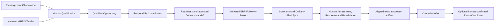

# Consultry Three-Slice Mock UI Demo Flow v0.1

**Status:** Ratified anchor-journey source; superseded as whole Click-Dummy boundary  
**Date:** 2026-08-05  
**Wayfinder owner:** [Prototype the Systemic Consultry Platform Click Dummy](./wayfinder/consultry-product-platform-baseline/tickets/prototype-the-role-aware-human-ai-interaction-and-responsibility-contract.md)

> **Scope revision — 2026-08-06:** The Scenes and Slice contracts in this document remain valuable fixture, recovery and deep-journey inputs. They no longer define the app navigation, implementation streams or Definition of Done. The Mock is now one navigable, stateful Consultry Product Experience under the [Systemic Platform Click Dummy Experience Contract v0.1](./Consultry-Systemic-Platform-Click-Dummy-Experience-Contract-v0.1.md). The three Slices are deep anchor journeys inside that system.

## 1. Ratified anchor-journey direction

The Mock UI Demo tells one connected Consultry story rather than presenting three separate mini-products:

1. a material need is recognized or received and responsibly turned into a Project;
2. the resulting active Project encounters a material Blind Spot before a Client decision;
3. the responsible Consultancy result is revised with current Project and corporate context, used through a controlled effect and optionally connected to governed reuse.

The existing-client ERP case carries this continuity across all three Slices. The net-new Cybersecurity/KRITIS Tender remains a full contrast case for the first Slice. It exercises the same responsible progress spine through a different entry, evidence and criteria basis; it is not reduced to a decorative intake card and does not create a second Product.

This connected-case structure, the two-entry treatment, four-surface grammar and provisional ten-scene inventory were confirmed through the Wayfinder HITL decision on 2026-08-05. This document remains a storyboard and validation hypothesis: scene boundaries, layout, interaction order, labels and automation depth remain open to practical testing.

## 2. What the Mock must prove or disprove

The Prototype asks whether a target-consultancy user can understand and experience that Consultry:

- supports connected consulting work from a commercial or project entry into accountable Delivery and learning;
- binds AI assistance to the exact Client, Project, Work Artifact, sources, purpose and decision context instead of offering an unbound chat;
- exposes the next responsible work, its reason and consequence without making every Business state a Product module;
- helps one role-compressed Boutique user complete responsible work without inventing another employee;
- also preserves accepted contribution and handoff when responsibilities are distributed in a Growing Specialist Consultancy;
- distinguishes AI proposals and Findings from human Assessments, Decisions, Authority and external effects;
- reduces context reconstruction, late Blind Spots and avoidable duplicate work without claiming autonomous correctness or Assurance.

The Prototype does not prove Product-market fit, technical feasibility, model quality, integration reliability, quantitative efficiency or a Full-Backend-MVP boundary.

## 3. One demo world, two organization readings

### 3.1 Shared fictional business context

| Fixture | Mock meaning |
|---|---|
| `Hansa Maschinenbau AG` | Existing Client Organization. |
| `ERP Core Migration` | Active Project in which an additional rollout/process need is intentionally captured. |
| `ERP Rollout Acceleration` | Distinct Follow-on Project created only after responsible Commitment, Readiness, Activation and accepted Handoff. It becomes the active-project context for Slices 2 and 3. |
| `ERP Rollout Acceleration · Wave-1 Readiness Recommendation / Client Steering Decision Basis v7` | Exact client-facing Work Artifact whose Go claim is challenged before Client Steering. |
| `Reconciliation Report v2/v3` | Prior and current Evidence; `v3` conflicts with the basis of the green human assessment. |
| `KRITIS Security Transformation Tender` | Net-new public Tender from a previously unserved Client Organization; the second Entry Anchor for Slice 1. |
| `Project Nord` | A second permitted Project context that may contain an overlapping solution pattern. It appears only in the optional reuse close. |

Names, dates, thresholds, values, sources and destinations are realistic Mock fixtures, not Domain Canon or market evidence.

### 3.2 Archetype projection, not separate UX

| Partner-led Specialist Boutique | Growing Specialist Consultancy |
|---|---|
| One Partner/Principal may carry Pursuit, Delivery, artifact and release responsibilities. Consultry shows responsibility-context changes but does not manufacture handoffs or a four-eyes rule. | Pursuit, expert, Delivery, artifact and release contributions may be distributed. Consultry shows requested and accepted contribution or custody transfer while one explicit responsibility owns the next effect. |
| The default demo proves `Single-Human Responsible Completion` where Authority permits it. | The alternate demo state proves that participation, responsibility and Authority do not collapse into one another. |

The same scene contracts and Product language serve both readings. Only assignments, contributions and handoff shape change.

## 4. Shared experience grammar

The existing Consultry App Design System v1.1 is authoritative. The Mock uses its dark shell, warm-light workspace, restrained coral action hierarchy and object-/work-centered patterns.

Four reusable surface hypotheses are sufficient for the first Prototype:

| Surface hypothesis | Product job | Existing pattern basis |
|---|---|---|
| **My Work / Context Shell** | Shows what needs attention, why now, active Client/Project/Case, responsible owner and the one next action. Quick Capture remains globally available. | Application Shell, Focus Canvas, My Work Queue. |
| **Case / Decision Frame** | Binds the relevant Business Subject, sources, AI-supported interpretation, open questions, alternatives and human disposition. | Co-Work Workspace, Evidence & Decision. |
| **Work / Artifact Canvas** | Lets the responsible person inspect, revise and validate an exact Work Artifact with sources and applicable corporate bases. | Concept Canvas, Artifact Review. |
| **Effect / Handoff Confirmation** | Makes the selected effect, acting person, exact version, destination, outcome and next responsible context visible. | Approval Card, sticky action bar, Outcome & Learning. |

These are functional surface hypotheses, not fixed layouts, page templates or required panel arrangements. The explored frames may inform hierarchy and interaction, but the clickable Mock may recombine, collapse or reshape them wherever practical testing suggests a clearer experience.

The contextual Assistant/Trust panel is collapsed by default and opened on demand. It may show Source lineage, exact versions, uncertainty, AI/Skill contribution, policy and audit context. It is not a permanent chat rail and never becomes an alternative authority world.

Each primary scene must answer, progressively rather than all at once:

```text
What needs attention, and why now?
Which exact Client / Project / Case / Artifact is affected?
What sources support or contradict the current view?
What did Consultry propose, find or prepare?
Which human responsibility owns the next work or decision?
What will the chosen action actually change or not change?
Who or what receives the next responsible context?
```

## 5. Connected demo spine



This is the demo narrative, not a state machine, navigation rail, Agent graph or required screen sequence.

## 6. Scene set A — Opportunity-to-Project / External Commitment

The first Slice is tested with two fixture variants over the same three provisional scene hypotheses, which together cover the ratified four-block progress spine. A prototype session can run one variant deeply and switch to the other at the same checkpoints. The UI must not force both entries into identical intake fields before responsible Qualification.

### A1 — Entry and responsible Qualification

| Existing-client ERP variant | Net-new Tender variant |
|---|---|
| Tobias intentionally captures: “The Client wants to accelerate the next rollout wave.” Client and active Project context are proposed; the human confirms what may be shared. This creates an `Observation`, not an Opportunity. | Authoritative Tender documents and amendments are brought into a bounded Tender context. Consultry structures deadlines, Eligibility, Award criteria, required documents and visible gaps. This does not automatically create an Opportunity or Bid. |
| Consultry connects current scope, Stakeholders, similar Observations, Contract context and potential duplication, then proposes responsible routes. | Consultry connects applicable firm Evidence, capability/capacity and criteria coverage, with missing or stale proof visible. |
| A responsible human chooses Pursue, Hold, No Action, Merge or another appropriate route. | A responsible human chooses Bid, No-Bid or Hold/Clarification. |

**Primary Product test:** Does the user understand why AI-supported interpretation is useful while Qualification remains a human decision?

**Recovery state:** Hold because a material source or clarification is missing. The item retains its rationale, owner and reconsideration trigger instead of pretending that progress failed.

### A2 — Engagement and Commitment Work

After a human-accepted `Qualified Opportunity`, the Case/Decision Frame and Work Canvas help sharpen Need, Outcome, scope and constraints; assemble source-visible Evidence and expertise; prepare and challenge the Concept/Proposal; and expose unsupported claims, capacity or Delivery gaps.

- In the ERP variant, the open distinction from active scope is prominent.
- In the Tender variant, Eligibility/Award-criteria coverage and required Evidence are prominent.
- Knowledge, Brand/CD and Governance/Release concerns remain distinguishable when relevant.
- Draft or export never implies Client Commitment.

**Human responsibility:** Accept, edit or reject material framing and claims; own Client exchange, Commercial Commitment and any actual external action.

### A3 — Commitment, Readiness and Delivery Handoff

The Mock fast-forwards to an effective accepted Commitment and then makes the still-open Delivery work visible. The responsible person reviews scope/outcomes, sources, assumptions, risks, team/capacity, Client actors and residual issues.

**Primary action:** activate the Project and accept Delivery custody only when the responsible basis is supportable.

**Negative path:** Delivery requests missing context or Readiness exposes a gap. The Case returns to resolution, revision, hold or abort; a won pursuit is not displayed as an activated Project.

**Visible transition:** `ERP Rollout Acceleration` becomes an active Project with lineage to the original Observation, Opportunity, exact Commitment basis and accepted Handoff. Its first Delivery wave supplies the already ratified Wave-1 Readiness fixture for the next Slice. The next scene opens in that Project context rather than on a disconnected success dashboard.

## 7. Scene set B — Active Project/Delivery Blind Spot and Rebuttal Simulation

### B1 — Admissible Challenge in current work

Approximately 48 hours before Client Steering, `Reconciliation Report v3` conflicts with the unqualified Go claim in `Decision Basis v7`, whose green human assessment still relies on `v2`.

My Work shows a bounded Challenge Candidate only because it identifies the exact subject/version, affected claim and criterion, changed Source, plausible consequence, decision horizon and uncertainty. A user may also start the same Challenge intentionally.

**Primary Product test:** Is this understood as a relevant interruption in Project work rather than generic AI criticism or an AI verdict?

### B2 — Source-bound Challenge Review

The Case/Decision Frame compares `v2`, `v3`, the applicable criterion and the claim in `v7`. Consultry may propose alternative explanations, Evidence gaps, possible consequences and response options through bounded Delivery, expert, Client/acceptance, risk and—only when needed—Commercial lenses.

The responsible person separately determines:

- Challenge Assessment: `substantiated`, `refuted-with-evidence` or `inconclusive`;
- current Materiality: `material`, `non-material-in-current-context` or `undetermined`.

AI output is visibly a Candidate. Multiple AI/Agent views are not presented as independent Evidence or a vote.

**Recovery state:** If the Candidate is false, the person refutes it with visible Evidence and closes it without creating an Approval ceremony. If Evidence is insufficient, the Result remains conditional or `insufficient basis`; the Product does not invent a PASS.

### B3 — Responsible Response and Revalidation

For the nominal material path, the human pauses only the named external use of `v7`, owns a response, revises or recovers the underlying work and names the revalidation trigger. The Product does not infer a Project-wide Stop or a Commercial ChangeCase unless a governed commitment boundary is actually affected.

One accountable Boutique person may complete this sequence with AI assistance within Authority. The Growing-consultancy state can request expert input and show accepted contribution without transferring the final Delivery responsibility automatically.

The exact successor version is revalidated against current Evidence. The Consultancy may issue a responsible Recommendation; only competent Client Authority decides Go/No-Go, Waiver or Residual Risk Acceptance.

**Handoff into Slice 3:** The exact successor now needs purpose-bound corporate alignment and a controlled use for the Client Steering.

## 8. Scene set C — Knowledge/Reuse and Corporate Artifact Alignment

### C1 — Alignment-aware revision in the Work Canvas

The Work/Artifact Canvas opens the exact successor with lineage to `v7`, `v3`, the applicable criterion and material human edits. Consultry proposes potentially applicable bases; the responsible person confirms or corrects them.

Three perspectives stay distinguishable:

1. **Knowledge Alignment:** current Project Evidence plus applicable approved firm Knowledge, Method, Terminology and Proof;
2. **Brand and Corporate Design Alignment:** applicable client-facing language, structure, template and visual rules of the Target Consultancy;
3. **Governance and Release Alignment:** confidentiality, IP, usage rights, provenance/citation, source use, approval and intended external-use constraints.

There is no context-free “aligned” score. Positive Brand conformity cannot compensate for incorrect Knowledge or restricted use.

### C2 — Human disposition and controlled effect

The responsible person sees material open concerns in the context of the intended purpose and decides whether to revise, obtain input, hold, or use the exact version within Authority.

The effect confirmation shows:

- exact successor version;
- named Client-Steering purpose and destination;
- responsible acting person;
- material open concerns and human disposition;
- actual success, failure or pending outcome;
- next responsible context.

**Recovery state:** A failed export/writeback preserves the prepared exact version and failure outcome. The user may retry, select a permitted alternate destination or hold; the Mock never records false success or silently overwrites the destination.

### C3 — Optional overlap and governed-reuse close

After the artifact work is complete, Consultry may show an explainable overlap with permitted work in `Project Nord`: affected Problem Pattern, shared and differing requirements, source lineage and confidentiality/IP boundaries.

Affected Consultants and the responsible Practice/Management context receive a Signal. They may discuss, merge, reject or confirm a `ReuseCandidate`. Confirmation starts separate abstraction, de-identification and rights/review work; it does not publish raw cross-client content or create a Blueprint/`ReusableAsset` automatically.

This closing scene demonstrates compounding value and double-work prevention as a feature of the shared Consultry backbone. It is not a fourth main Slice, and completion of the artifact flow never requires it.

## 9. Optional Harness cameo

An advanced user may open the current Challenge or Artifact Case in a Codex-like Harness view to inspect deeper Source context, request a bounded expert run or work with the exact artifact. The cameo is optional and is not needed to complete the default App flow.

The Harness receives the same Case identity, exact subject/version, permitted Context Pack, responsibility, Authority constraints and effect boundary. It may return proposed changes, Findings, Evidence and run provenance. It cannot write directly to Domain records, manufacture Approval or gain additional business rights.

The Mock validates whether this seam feels useful and continuous. It does not select Hermes, Pi, a model, Agent topology, graph, Skill runtime or technical adapter.

### 9.1 Optional Model-composed Surface hypothesis

A further interaction hypothesis is that the current model result need not stop at prose. Consultry may render a task-bound `SurfaceSpec` through approved App components—for example a Tender QA set in `A2`, an evidence-bound Challenge/Rebuttal matrix in `B2`, or an Artifact Alignment checklist and section preview in `C1`.

This is inspired by Claude-/Codex-like artifact and workbench interactions, but remains Consultry-specific: the generated surface receives the exact Case, subject/version, Sources, responsibility and Authority/effect boundary. It can collect answers, compare variants and propose Artifact changes; it cannot create Approval, execute arbitrary code, introduce an unapproved component/action or publish/send an output by itself.

For the first clickable Mock, such a surface may be represented by a deterministic fixture and an allowlisted renderer. It is an optional experiment after the core scenes are understandable, not an eleventh required scene, a new main Slice or a prerequisite for prototype validation.

## 10. Provisional scene inventory

These are test scenes, not a ratified page architecture. Closely related scenes may collapse into one interactive view; a complex scene may split after observation.

| ID | Scene purpose | Deep case | Contrast/recovery state |
|---|---|---|---|
| `M0` | My Work and active context | ERP active Client | Boutique/Growing responsibility projection |
| `A1` | Entry and Qualification | Intentional ERP Observation | KRITIS Tender intake; Hold/No-Bid |
| `A2` | Engagement/Commitment work | ERP Follow-on | Tender criteria/evidence mode |
| `A3` | Readiness and accepted Handoff | ERP Follow-on activation | Context request / failed Readiness |
| `B1` | Admissible Project Challenge | `v7` versus `v3` | Intentional Challenge |
| `B2` | Human Assessment and Materiality | substantiated + material | refuted / inconclusive |
| `B3` | Response and Revalidation | revise and revalidate | expert contribution / conditional Result |
| `C1` | Alignment-aware Artifact work | exact successor | wrong/missing basis |
| `C2` | Controlled effect | Client-Steering use | export/writeback failure |
| `C3` | Optional compounding close | explainable overlap | reject/merge/confirm ReuseCandidate |

This is ten test scenes over four shared surface families, not ten separate Product pages.

## 11. What should stay visually continuous

Across transitions, the Mock retains only the context required to explain continuity:

- Client, Project/Case and exact Work Artifact where applicable;
- current responsibility and next required human work;
- source/version lineage and material uncertainty;
- prior responsible Decision and its effect;
- next handoff or responsibility-context change.

The Demo must avoid:

- a progress rail that presents Business states as modules or a rigid wizard;
- generic dashboards without an actionable exception;
- a permanent general-chat panel;
- full-screen success states that lose the Client, Project, object and next owner;
- identical role-specific apps or fake organizational complexity;
- traffic-light certainty, autonomous language or invisible external effects;
- exhaustive Domain fields, Agent activity, graph nodes or technical telemetry in default views.

## 12. Mock validation guide

### 12.1 Observe without explaining first

For each Slice ask the participant to narrate:

1. What happened and why does it matter now?
2. Which Client, Project, Case or Artifact is affected?
3. What came from sources, what came from AI and what has a human actually decided?
4. What work or decision is yours now?
5. What will the primary action change—and what will it not change?
6. Who or what receives the result next?

### 12.2 Cross-slice and archetype probes

- Does this feel like one Consulting OS backbone or three tools joined for a demo?
- Where did prior context prevent reconstruction or duplicate entry?
- Can the Boutique user responsibly finish without a fictitious second employee?
- Can the Growing-consultancy user request contribution and hand off custody without losing accountability?
- Is the Tender contrast recognizable without making the Product look like Tender software?
- Is the Blind-Spot Challenge helpful enough to justify its interruption and review cost?
- Does Corporate Artifact Alignment help during the work rather than only grade the result afterward?
- Is the overlap Signal credible, explainable and safe enough to start a human discussion?
- At which point, if any, would an advanced user prefer the optional Harness?

### 12.3 Capture as Prototype evidence

Record observed comprehension failures, wrong inferences, missing information, unnecessary detail, trust concerns, rejected AI assistance, desired alternate actions, handoff friction, role-compression friction and perceived value. Separate:

- **Prototype correction:** wording, grouping, hierarchy, interaction or scene change;
- **Product gap:** missing business behavior, invariant, outcome or cross-cutting contract;
- **Technical question:** implementation freedom to carry into the later Three-Slice Technical PoC Handoff;
- **Commercial evidence need:** unvalidated pain, value, buyer, willingness-to-pay or adoption assumption.

## 13. Deliberately deferred

- final information architecture, page routes, responsive behavior and production copy;
- final object lifecycle, universal status taxonomy or workflow/state machine;
- detailed permissions, role matrices, notifications, SLAs and approval policy;
- integrations, synchronization, record authority, storage and effect mechanics;
- Agent, Skill, execution graph, validation graph, loop and Model Bridge realization;
- Harness runtime and adapter selection;
- quantitative acceptance thresholds and Full-Backend-MVP scope.

The ratified structure now opens visual low-fidelity prototyping. The Wayfinder Prototype ticket remains open until the connected Mock is inspectable and its first comprehension, value, trust, continuity and scope learnings are captured.
