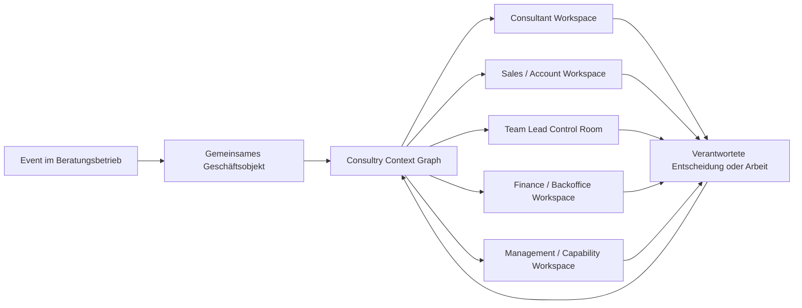
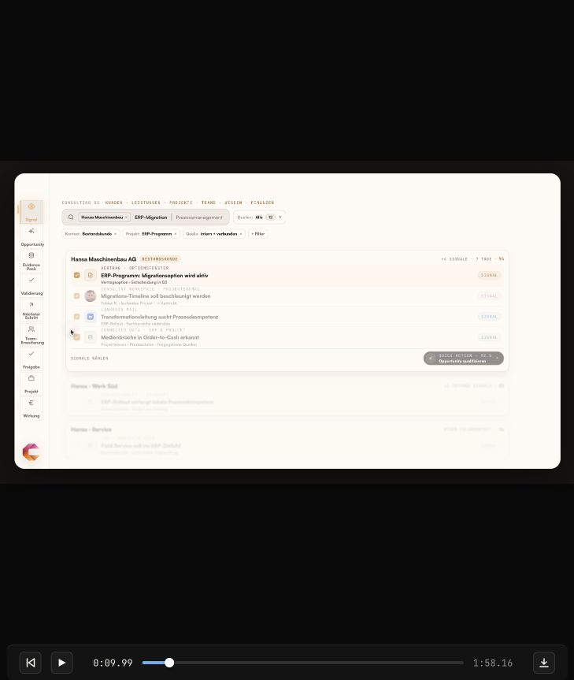
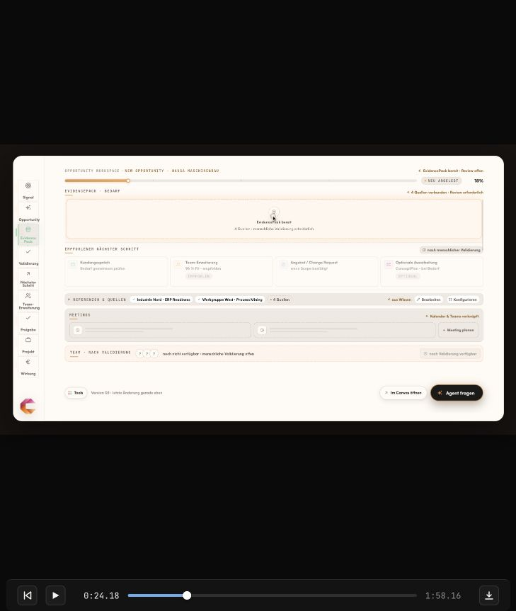
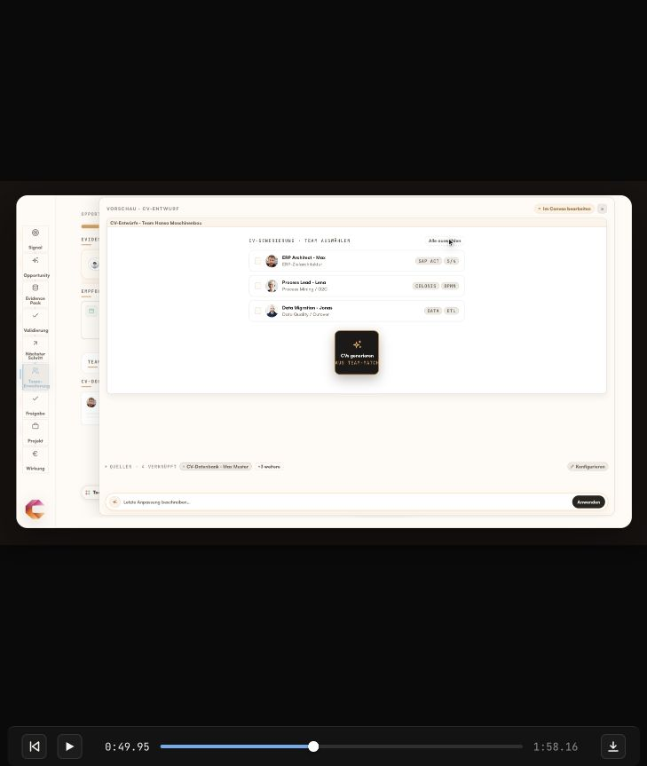
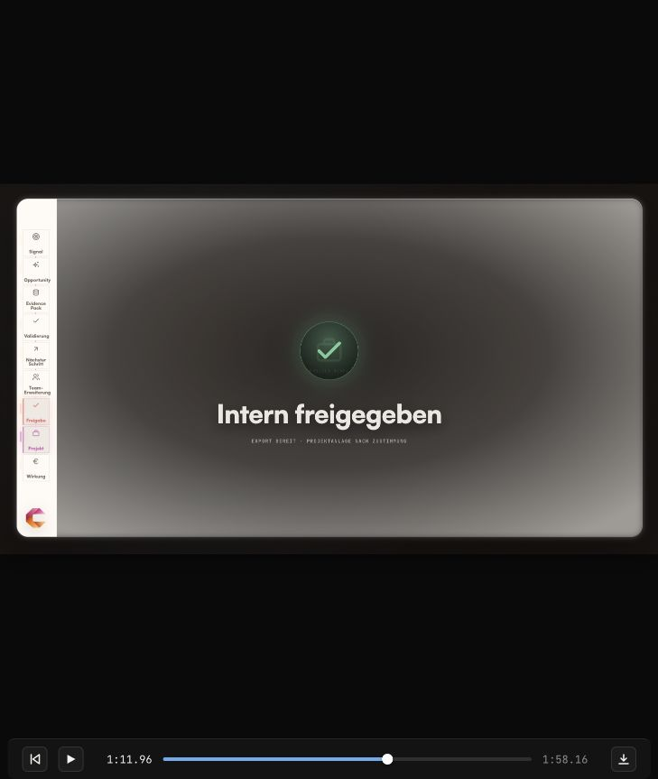
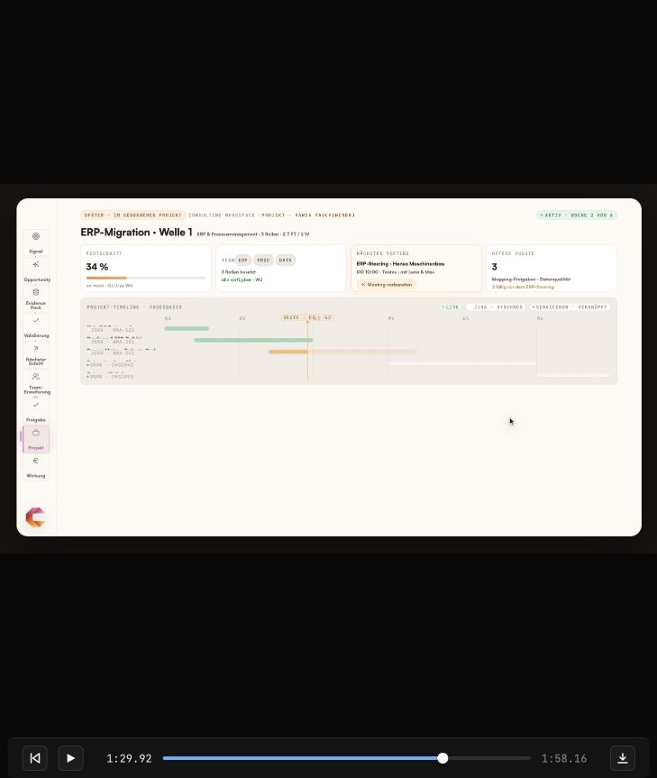
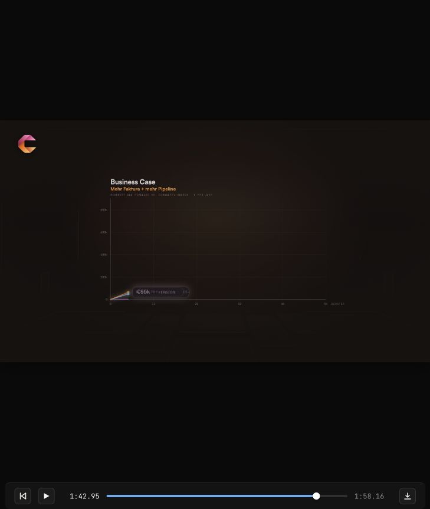
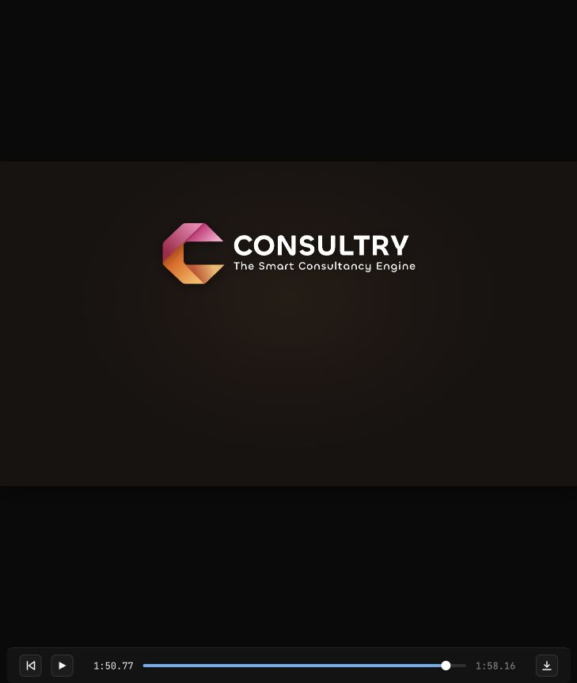

# Consultry — UX Operating Model v0.1

**Status:** Product-Vision- und Demo-Strukturierung, kein Scope-Freeze  
**Datum:** 12.07.2026  
**Zweck:** Module, rollenbezogene Workspaces, wiederverwendbare Interaction Frames, Demo-Szenen und ihre Datenverträge so trennen, dass Consultry wie eine gemeinsame Arbeitsebene wirkt — nicht wie ein weiteres kompliziertes Tool mit vielen voneinander isolierten Modulen.

---

## 1. Leitentscheidung

Consultry wird **objekt- und arbeitszentriert**, nicht modulzentriert bedient.

- **Module** strukturieren Capabilities, Datenverantwortung, Policies und Integrationen im Hintergrund.
- **Workspaces** stellen für eine Rolle genau die aktuell relevante Arbeit zusammen.
- **Frames** sind wiederverwendbare Interaktionsmuster wie Capture, Review, Decision oder Control Room.
- **Scenes** sind der Kamerapfad der Demo durch mehrere Frames.
- **Datenobjekte** bleiben über Rollen, Frames und Module hinweg dieselben; jede Rolle sieht nur eine passende Projektion.

Die Konsequenz: Ein `Signal` ist kein Hauptnavigationsbereich, ein `EvidencePack` kein eigenes Modul und eine `Validierung` keine neue App. Es sind Objekte beziehungsweise Zustände, die im Kontext von Kunde, Projekt und verantwortlicher Arbeit erscheinen.

Dasselbe gilt für Quellenprüfung, Outcome Tests, Bestätigung/Freigabe, Trust/Assurance und Effect/Handoff Review: Sie sind Child-Surfaces des jeweils betroffenen Case, Task, Artifact/Plan, Decision oder Handoff. Sie dürfen inline, im Contextual Sidepanel/Drawer oder als fokussierter Sub-Canvas aufgehen, behalten aber Parent-Kontext, Goal, Version, Owner, Work State und Rückweg. Ein Deep Link aus `My Work` öffnet den Child-State **im** Parent Flow und erzeugt keinen neuen Produktbereich.



---

## 2. Verbindliche Begriffstrennung

| Ebene | Frage | Beispiel | UX-Auswirkung |
|---|---|---|---|
| **Capability-Modul** | Welche fachliche Fähigkeit besitzt Consultry? | Project Intelligence, Commercial Control, Capability Planning | Nicht automatisch ein Menüpunkt. |
| **Workspace** | Welche Arbeit muss diese Rolle jetzt erledigen? | Account Owner Workspace, Consultant Workspace | Persönlicher Einstieg und Queue. |
| **Frame** | Welches Interaktionsmuster löst die aktuelle Aufgabe? | Quick Capture, Evidence Review, Decision Frame | Wiederverwendbar über Module hinweg. |
| **Scene** | Was sieht der Betrachter als nächsten Demo-Moment? | Tobias notiert eine Timeline-Änderung | Narrative, nicht Informationsarchitektur. |
| **Object** | Welcher Datensatz überlebt den einzelnen Screen? | Observation, Signal, Opportunity, Project | Eine Wahrheit, mehrere Projektionen. |
| **Projection** | Welche Felder braucht diese Rolle in diesem Moment? | Sales sieht kommerzielle Relevanz; Team Lead sieht Kapazität | Progressive Disclosure statt Vollformular. |
| **State/Event** | Was ist passiert oder hat sich verändert? | `SignalValidated`, `ChangeRequestPrepared` | Treibt Queue, Routing und Audit. |

---

## 3. Capability-Module des Whole Product

Diese Module bilden das fachliche Betriebssystem. Sie sind **keine Empfehlung für neun gleichrangige Navigationseinträge**.

| Capability-Modul | Kernjob | Primäre Objekte | Typische Ereignisse | Hauptnutzer |
|---|---|---|---|---|
| **Customer & Relationship Intelligence** | Kunden-, Stakeholder-, Relationship- und Vertragskontext zusammenhalten | `Account`, `Stakeholder`, `Relationship`, `Contract`, `SOW` | Stakeholder-Wechsel, Optionsfenster, dokumentierter Bedarf | Sales, Account Management, Consultant |
| **Project & Delivery Intelligence** | Laufende Arbeit, Entscheidungen, Deliverables, Risiken und Veränderungen verstehen | `Project`, `Deliverable`, `Milestone`, `ProjectDecision`, `Observation`, `ProjectStatusSnapshot`, `ProjectStatusAssessment` | Timeline-Änderung, Blocker, Scope Shift, Delivery-Risiko, menschliche Bewertung abgegeben | Consultant, Project Lead, Team Lead |
| **Growth, Opportunity & Commercial Lifecycle** | Validierte Bedarfe in verantwortete Kunden- und Commercial-Aktionen überführen | `Signal`, `Opportunity`, `ChangeCase`, `Proposal`, `ChangeRequest`, `CommercialCase` | Signal validiert, Kundengespräch geplant, CR vorbereitet | Account Owner, Sales, Practice Lead |
| **People, Team, Staffing & Capability** | Skills, Rollen, Kapazität, Staffing und zukünftige Nachfrage verbinden | `Person`, `ConsultantProfile`, `SkillEvidence`, `Capability`, `Team`, `StaffingScenario`, `DevelopmentPlan` | Skill-Lücke, Kapazitätskonflikt, Trainingsbedarf | Consultant, Team Lead, Staffing, People Development |
| **Project Symbiosis, Knowledge & Reuse Productization** | gleiche Problem-/Work-Patterns über Projekte erkennen, Doppelarbeit reduzieren und freigegebene Erfahrung in wiederverwendbare Assets und Consulting-Bundles überführen | `ProblemPattern`, `SymbiosisLink`, `ReuseCandidate`, `ReusableAsset`, `ReuseApplication`, `ServiceBundleCandidate`, `ReuseValueCase` | Parallelproblem erkannt, Asset publiziert, Reuse vorgeschlagen, Bundle validiert | Consultant, Project/Practice Lead, Knowledge Owner, Sales, Finance |
| **Finance, Backoffice & Business Operations** | Zeit, Kosten, Belege, Billing, Lizenzen und Operations effizient koordinieren | `TimeEntry`, `Expense`, `Receipt`, `InvoicePack`, `License`, `Vendor`, `FinancialImpact` | Beleg fehlt, Billing blockiert, Renewal, Kostenabweichung | Consultant, Backoffice, Finance, Team Lead |
| **Portfolio, Management & Firm Steering** | Projekte, Kunden, Teams, Capabilities und Economics auf Portfolioebene steuern | `Portfolio`, `Forecast`, `Risk`, `InvestmentScenario`, `Outcome` | Fakturarisiko, Margin Shift, Capability Gap | Management, Operations, Team Lead |
| **Engine, Governance & Integration Backbone** | Kontext kompilieren, Tools ausführen, Ergebnisse prüfen, Freigaben und Audit sichern | `Recommendation`, `EvidencePack`, `Approval`, `PolicyDecision`, `AuditRecord`, `HarnessRun` | Empfehlung erstellt, Freigabe erteilt, Toolcall geprüft | querschnittlich |

### 3.1 Wichtige Grenze

Ein operativer Hinweis darf nicht vorschnell in eine Sales-Semantik gezwungen werden:

```text
Observation
  → Signal
      ├─ Delivery Action
      ├─ Customer Conversation
      ├─ Staffing / Capability Action
      ├─ Commercial Change Case
      └─ Hold / Reject / Merge
```

Nur der kommerzielle Ast wird zu `Opportunity`, `Proposal` oder `ChangeRequest`. Dadurch bleibt Consultry ein Consulting OS und wird nicht zu einem Lead-Tool.

---

## 4. Empfohlene globale Navigation

Die globale Navigation zeigt langlebige Arbeitsräume, nicht jeden Prozessschritt.

1. **My Work** — persönliche Queue, Entwürfe, Approvals, Follow-ups, Agent-Vorschläge.
2. **Customers** — Account 360, Stakeholder, Verträge, Signals, Opportunities und laufende Projekte.
3. **Projects** — aktive Mandate, Delivery, Wissen, Entscheidungen, Status und Projektsignale.
4. **People & Teams** — Profile, Skills, Staffing, Teamstruktur, Capacity und Entwicklung.
5. **Knowledge** — Suche, Methoden, Referenzen, Lessons und wiederverwendbare Assets.
6. **Commercials** — Opportunities, Proposals, Contracts, Change Requests, Forecast und Wirkung.
7. **Operations** — Time, Expenses, Billing-Prep, Invoices, Licenses, Vendors und Backoffice-Flows.

**Immer verfügbar, aber nicht als eigener Modulweg:**

- globale Suche / „Ask Consultry“;
- Quick Capture;
- Kunden-/Projekt-Kontextwechsel;
- Notifications und Approvals;
- Quellen-, Policy- und Audit-Drawer.

Diese kontextuellen Drawer sind keine zusätzlichen Navigationsziele. Insbesondere existieren keine globalen Bereiche `Sources`, `Validation`, `Approvals` oder `Outcome Tests`.

Die Reihenfolge darf sich nach Rolle ändern; die Begriffe und Objektlogik bleiben stabil. Inhalte werden über Berechtigungen und Relevanz projiziert, nicht durch vollständig verschiedene Apps pro Rolle.

### 4.1 Rolle des Rails in der Demo

Der Rail sollte **journey-spezifischen Narrative Progress**, nicht die Produktnavigation oder einen universellen Wizard darstellen. Er wird aus den ratifizierten UX-Modi komponiert und darf sie auslassen, wiederholen oder erneut aufgreifen:

`Attend & Orient → Explore & Frame → Analyze & Develop → Produce & Refine → Review & Commit → Coordinate & Deliver → Observe & Adapt`

Dieser volle Bogen ist ein Orientierungsbeispiel, kein verpflichtender Sieben-Schritt-Flow. Ein Tender, eine aktive Project Challenge und ein Artifact-Alignment-Fall verwenden unterschiedliche Ausschnitte und Loops. Search/Ask, Expert Access, Collaboration, Challenge und AI-Unterstützung bleiben im aktuellen Arbeitskontext erreichbar, statt eigene Navigationsstufen zu werden.

Die Trennung von Assignment-Lifecycle, Work Primitives, UX-Modi und Cross-Cutting Contracts ist in [Consulting Work Primitives and Composable UX Grammar](research/consulting-work-primitives-and-ux-grammar-2026-08.md) hergeleitet und im Wayfinder ratifiziert.

Die aktuelle Folge `Signal → Opportunity → EvidencePack → Validierung → Nächster Schritt → Team → Freigabe → Projekt → Wirkung` vermischt Objekte, Zustände, Rollen und Outcomes. Sie erzeugt den Eindruck eines starren neunstufigen Wizards und sollte nicht zum Navigationsmodell des Clickdummys werden.

---

## 5. Rollenbezogene Workspaces

### 5.1 Gemeinsamer Aufbau

Jeder Workspace beantwortet in dieser Reihenfolge:

1. **Was braucht meine Aufmerksamkeit?**
2. **Warum jetzt?**
3. **Welcher Kunden-/Projektkontext ist betroffen?**
4. **Was empfiehlt Consultry und worauf basiert das?**
5. **Welche eine Entscheidung oder Aktion ist jetzt nötig?**
6. **Wer übernimmt danach und was wird aktualisiert?**

### 5.2 Workspace-Projektionen

| Workspace | Default-Einstieg | Primäre Queue-Items | Detailkontext | Typische Hauptaktion |
|---|---|---|---|---|
| **Consultant** | Heute im Projekt | Aufgaben, Meetings, Agent-Vorschläge, Quick Captures, eigene Approvals | Projekt, Deliverable, persönlicher Arbeitskontext | Arbeit dokumentieren, Signal erfassen, Wissen nutzen |
| **Sales / Account Owner** | Kundenaufmerksamkeit | validierungsbedürftige Signals, Follow-ups, Commercial Cases, Proposals | Account 360, Stakeholder, Verträge, Projekte, Evidenz | validieren, Gespräch planen, Opportunity/CR anstoßen |
| **Project / Delivery Lead** | Delivery-Ausnahmen | Risiken, Decisions, Scope-/Timeline-Shifts, blockierte Deliverables | Project 360, Team, Contract/SOW, Status | Delivery Action entscheiden, eskalieren, Change Case anstoßen |
| **Team Lead / Staffing** | Team- und Kapazitätsausnahmen | Staffing-Lücken, Kollisionen, Skill-/Faktura-Risiken | Team, Projekte, Forecast, Skills, Economics | Szenario übernehmen, umbesetzen, Entwicklung anstoßen |
| **People Development** | Capability Demand | Skill-Gaps, Trainings-/Zertifizierungsbedarf, Academy- und Hiring-Profile | Nachfrageevidenz, Profile, Pipeline, Portfolio | Lernpfad, Kohorte oder Bedarfsprofil freigeben |
| **Finance / Backoffice** | Operations Exceptions | fehlende Zeiten/Belege, Billing-Blocker, Renewals, Kostenkonflikte | Projekt, Contract/SOW, Kostenstelle, Vendor | vervollständigen, zuordnen, Billing-Paket vorbereiten |
| **Management / Operations** | Firm Exceptions | Portfolio-Risiken, Forecast-Abweichungen, Investitions-/Capability-Entscheidungen | Portfolio, Customers, Projects, Teams, Economics | Priorität oder Szenario entscheiden |

---

## 6. Wiederverwendbare Interaction Frames

Frames sind die Bausteine des späteren React-Clickdummys und der Demo. Ein Frame darf in mehreren Workspaces vorkommen.

| ID | Frame | Zweck | Muss zeigen | Eine primäre Aktion | Darf standardmäßig nicht zeigen |
|---|---|---|---|---|---|
| **F0** | **Context Shell** | Orientierung halten | aktiver Kunde/Projekt, Rolle, Suche, Capture, Queue | Kontext wechseln | komplette Organisationsstruktur |
| **F1** | **My Work Queue** | Arbeit priorisieren | Owner, Due/SLA, Why now, Status, betroffener Kontext | nächstes Item öffnen | Voll-Dashboards ohne Aktion |
| **F2** | **Context 360** | Kunden-, Projekt-, Team- oder Personenbild verstehen | Summary, Beziehungen, aktuelle Ausnahmen, Timeline, verknüpfte Objekte | relevanteste Aktion öffnen | alle Rohdaten gleichzeitig |
| **F3** | **Quick Capture** | Beobachtung in Sekunden erfassen | automatisch erkannter Account/Project, kurze Notiz, Sichtbarkeit, Quelle | Signal speichern | CRM-Vollformular, Opportunity-Felder |
| **F4** | **Triage & Routing** | Rohbeobachtung klassifizieren und zustellen | vorgeschlagener Typ, Relevanz, Owner, Duplikate, Routing-Grund | zustellen/zusammenführen | Commercial Forecast vor Validierung |
| **F5** | **Evidence & Decision** | Empfehlung nachvollziehen und entscheiden | Claim, Evidence, Confidence, offene Fragen, Alternativen, Wirkung | validieren/editieren/ablehnen | separates Evidence-Modul ohne Entscheidung |
| **F6** | **Action Composer** | validiertes Signal in eine koordinierte Maßnahme übersetzen | Branches, Verantwortliche, Abhängigkeiten, erwartetes Ergebnis | nächsten Schritt starten | verpflichtender ConceptPlan für jede Aktion |
| **F7** | **Work Canvas** | Artefakt oder Arbeit ausführen | KontextPack, Draft, Quellen, Changes, Collaborators | anwenden/freigeben | ungebundener General-Chat |
| **F8** | **Control Room** | Ausnahmen und Szenarien steuern | wenige priorisierte Abweichungen, Ursachen, Optionen, Konsequenzen | Szenario übernehmen | Vanity-KPIs ohne Handlungsbezug |
| **F9** | **Trust Drawer** | Herkunft und Verantwortung prüfen | SourceBindings, Versionen, Policy, Approval, Audit | Quelle öffnen / Entscheidung erklären | dauerhaft dominante Seitenfläche |
| **F10** | **Outcome & Learning** | Wirkung und Rückfluss sichtbar machen | vorher/nachher, Customer/Project/Financial/Capability Outcome | Ergebnis bestätigen/kommentieren | isoliertes Marketing-Chart ohne Trace |
| **F11** | **Symbiosis & Assetization** | parallele Arbeit erklären und in ein freigegebenes Reuse-Asset überführen | betroffene Projekte, gemeinsames Problem Pattern, Overlap, Source Lineage, IP-/Confidentiality-State, Asset-Typ, Owner, Value-Hypothese | als ReuseCandidate bestätigen / Assetization starten | ungeprüfte Cross-Customer-Rohinhalte oder automatische Publikation |

### 6.1 Kartenvertrag für jede priorisierte Arbeit

Jede Signal-, Approval-, Risiko- oder Recommendation-Karte folgt demselben Vertrag:

```text
Was ist passiert?
Warum ist es relevant?
Welcher Kunde / welches Projekt ist betroffen?
Welche Quellen stützen es?
Wer ist verantwortlich?
Welche Entscheidung ist jetzt nötig?
Was passiert nach dieser Entscheidung?
```

Fehlt eine dieser Antworten, wird die Karte zur weiteren Inbox statt zur Arbeitsoberfläche.

### 6.2 Model-composed Work Surfaces

Consultry soll nicht nur statische Screens mit variierendem Text anbieten. Als weiterführende Product-/UX-Richtung können Modelle für den aktuellen Job, Case und Kontext eine passende **Model-composed Work Surface** erzeugen: strukturierte Inhalte und eine Komposition freigegebener Interaction Components, die direkt als Arbeitsoberfläche gerendert wird.

Claude-/Codex-artige Artifact-, Workbench- und Tool-Result-Experiences dienen als Inspiration dafür, wie AI-Ergebnisse zu bearbeitbaren, interaktiven Arbeitsgegenständen statt zu langen Chat-Antworten werden. Sie sind keine zu kopierende Produktspezifikation. Die geführte Consultry App bleibt Default; Chat beziehungsweise Conversation kann die Surface steuern oder verfeinern, ist aber nicht ihr einziges Darstellungsmodell.

Beispiele:

- ein fallbezogenes QA-Fragenset für Tender Qualification, Delivery Challenge oder Artifact Review;
- eine dynamische Evidence-, Rebuttal- oder Readiness-Matrix;
- ein erklärendes Context-/Relationship-Diagramm, eine Process-/Decision-Map oder Timeline;
- ein quellengebundener Chart, wenn echte quantitative Verteilung, Trend oder Abweichung entscheidungsrelevant ist;
- ein auf den konkreten Auftrag zugeschnittener Review-, Decision- oder Recovery-Frame;
- interaktive Artifact Sections, Tabellen, Vergleiche, Checklisten oder Szenarien;
- ein gerenderter Brief, Report, Proposal-, Client- oder Website-/Page-Entwurf;
- Single-/Multi-Choice-, Ranking- oder strukturierte Fragen mit freier Antwortoption, wenn die Auswahl nicht vollständig sein kann;
- editierbare Few-shot-Vorschläge, die mögliche Antworten, Artifact-Formen oder nächste Schritte konkretisieren, ohne sie vorzuentscheiden;
- Controls zum Beantworten, Verfeinern, Vergleichen und menschlichen Disponieren des Ergebnisses.

Das Modell erzeugt standardmäßig **keinen frei ausführbaren UI-Code**. Es liefert einen typisierten `SurfaceSpec` beziehungsweise ein fachliches Output-Schema. Ein Consultry Renderer löst daraus ausschließlich zugelassene Design-System-Komponenten, Content-Typen und Actions auf. Dadurch bleiben Corporate Design, Accessibility, Responsiveness und Product-Semantik auch bei dynamischer Komposition stabil.

Verbindliche Grenzen:

1. Surface und Inhalte sind an exakten Case, Subject/Artifact, Purpose, Sources und Context Pack gebunden.
2. Generierter Inhalt, Quellen, Unsicherheit und Run-/Version-Provenance bleiben erkennbar.
3. Eine gerenderte Action erbt keine Business Authority; Entscheidung, Approval und Effect Admission bleiben getrennt.
4. Unbekannte Komponenten, freie Scripts, beliebige Event Handler, unkontrolliertes HTML/CSS und direkte externe Effects werden abgewiesen.
5. Nutzer können Inhalte prüfen, ändern, verwerfen oder in einen verantworteten Artifact-/Decision-Flow übernehmen.
6. Website-/Page-Content bleibt bis zur getrennten menschlichen Freigabe Preview oder Draft und folgt den zusätzlichen Brand-, Proof- und Publication-Gates des [AI-Native CMS / Brand & Page Generation Module](./Consultry-AI-Native-CMS-Module-v1.0.md).
7. Eine Question Surface bietet bei offenem Antwortraum `Eigene Antwort` und gegebenenfalls `nicht beurteilbar / mehr Kontext nötig`; eine Antwort verändert zunächst Working Context, Plan oder Artifact und ist keine implizite Decision.
8. Few-shot-Vorschläge bleiben editierbar und kennzeichnen, ob sie aus erlaubten Firmenbeispielen, generischen Patterns oder aktueller Model Generation stammen. Sie sind keine Evidence und werden nicht vorselektiert.
9. Ein Chart zeigt Definition, Einheit, Zeitraum, Quelle und relevante Unsicherheit; ein Diagramm zeigt nur den für den Job relevanten Ausschnitt und behauptet weder vollständigen Domain- noch Agent-Graph.
10. Jede visuelle Surface besitzt eine zugängliche Text-/Tabellenalternative und erklärt, warum diese Darstellungsform im aktuellen Arbeitsschritt hilft.

Diese Richtung ist ein gemeinsames Rendering- und Interaction-Prinzip, kein eigenes Hauptmodul und keine Pflicht, jeden Screen generieren zu lassen. Stabile, häufige und risikohohe Interaktionen können bewusst als feste Product UI bestehen bleiben; dynamische Surfaces werden dort eingesetzt, wo Fall-, Aufgaben- oder Artefaktstruktur tatsächlich variiert.

### 6.3 Progressive Disclosure als Interaction Contract

Progressive Disclosure wird im systemischen Click Dummy nicht nur über weniger Felder, sondern über vier kontextuelle Arbeitstiefen getestet:

| Tiefe | Primärer Inhalt | Nutzerabsicht |
|---|---|---|
| **L0 Attention** | Why now, betroffener Kontext, Responsibility, Horizont, eine nächste Aktion | Aufmerksamkeit disponieren |
| **L1 Work Brief** | Goal, aktueller Stand, tragende Quelle, erwartetes Work Result, nächster Schritt | Arbeit verstehen und übernehmen |
| **L2 Co-Work Detail** | Agent-/Human-Plan, offene Fragen, Draft/Artifact/Plan, anwendbare Outcome Tests | Arbeit steuern, bearbeiten, testen und abschließen |
| **L3 Assurance** | exakte Source-/Version-Lineage, Unsicherheit, Testability/Evidence State, Claim Ceiling, Skill-/Run-/Policy-/Audit-Kontext | Vertrauen, Grenze oder Fehler untersuchen |

Die Tiefen sind keine Wizard-Schritte. Relevante Unsicherheit, fehlende Basis oder blockierte Responsibility wird nach oben gehoben und nicht hinter einem Drawer verborgen. Öffnen, Schließen und Routenwechsel verlieren weder aktive Auswahl noch Draft, Entscheidung oder offene Obligation.

### 6.4 Agent-native Co-Work statt Chat-Zentrierung

Die zentrale AI-Erfahrung startet an einem realen `Responsible Job + Business Subject + Goal + intended Work Result/Plan + permitted Context + current Sources + Authority boundary`. Consultry führt daran einen sichtbaren, editierbaren Arbeitsloop:

`Goal → Plan → Human/Agent Work → Result/Artifact/Plan → Outcome Tests → Human Disposition/Next Responsibility → Effect/Learning`.

Der Loop darf visuell verdichtet werden, seine wesentlichen Zustände müssen jedoch wieder auffindbar sein. Agenten können Kontext verbinden, einen Plan vorschlagen, Arbeit vorbereiten, Results erzeugen, verifizierbare Teile testen und bei fehlender Basis replanen oder zurückgeben. Nutzer können steuern, verändern, stoppen, verwerfen oder verantwortet übernehmen. Agent Activity ist weder Business Progress noch Approval.

Das App-Erlebnis verwendet feste oder model-composed Work Surfaces. Conversation ist eine optionale Steuerform im aktuellen Work Object, nicht die alternative Wahrheit oder der Default. Das optionale Harness öffnet dieselben Goal-, Plan-, Result-, Test-, Source- und Authority-Zustände in einer dichteren Arbeitsumgebung.

Die Human-Agent-Erklärung darf deshalb dynamisch zwischen knapper Begründung, Context-/Relationship-Visual, Process-/Decision-Diagramm, Comparison-/Evidence-Matrix, quellengebundenem Chart, adaptivem Fragenset und Few-shot-Beispielen wählen. Maßgeblich ist der aktuelle Informations- oder Entscheidungsbedarf, nicht visuelle Abwechslung. Jede Form beantwortet zumindest: Was wurde verstanden, worauf basiert es, was bleibt unsicher, warum ist diese Darstellung oder Frage jetzt relevant und was verändert die menschliche Antwort?

Der erste Prototype realisiert diese Grammatik als deterministischen In-Memory-State. Das ratifiziert keine Agent-/Skill-/Graph-/Model-Bridge-Architektur.

---

## 7. Gemeinsames Objektmodell für die UX

### 7.1 Kernobjekte

| Objekt | Bedeutung | Wichtige Beziehungen |
|---|---|---|
| `Account` | Bestandskunde | Stakeholders, Contracts, Projects, Signals, Opportunities |
| `Project` | aktives oder geplantes Mandat | Account, SOW, Team, Deliverables, Observations, Economics |
| `Observation` | rohe, absichtlich erfasste menschliche oder integrierte Beobachtung | Author, Source, Account, Project, Timestamp, Visibility |
| `Signal` | verarbeitete und geroutete Beobachtung mit Relevanzhypothese | Observation(s), EvidencePack, Owner, Routing, Status |
| `EvidenceItem` | einzelne source-bound Evidenz | SourceBinding, Claim, Freshness, Confidence |
| `EvidencePack` | für eine Entscheidung kuratierte Evidenzmenge | Signal/Recommendation, EvidenceItems, OpenQuestions |
| `Recommendation` | begründeter Vorschlag mit Alternativen | EvidencePack, TargetObject, SuggestedAction, Confidence |
| `Decision` | menschliche Validierung, Ablehnung oder Edit | Recommendation, Actor, Reason, Timestamp |
| `ActionCase` | koordinierter nächster Schritt ohne zwingende Sales-Semantik | Decision, Tasks, Owners, Dependencies, Outcome |
| `Opportunity` | qualifizierter kommerzieller Demand-Knoten | Account, Signal, CommercialCase, Proposal/CR |
| `ChangeCase` | mögliche Änderung eines laufenden Engagements | Project, Contract/SOW, Scope, Team, Economics |
| `WorkItem` | kleinste verantwortete Aufgabe | ActionCase, Owner, Due, Status, SourceSystem |
| `KnowledgeAsset` | wiederverwendbares internes Wissen | Project, Capability, Method, CitationLinks |
| `ProblemPattern` | abstrahierte, projektübergreifend wiederkehrende Problemstruktur | Requirements, WorkItems, Projects, Technologies, Evidence |
| `SymbiosisLink` | source-bound Beziehung zwischen ähnlicher, komplementärer oder widersprüchlicher Projektarbeit | ProblemPattern, Projects, WorkItems, Assets, Evidence |
| `ReuseCandidate` | menschlich zu prüfender Kandidat für Assetization | SymbiosisLinks, SourceProjects, AssetType, RightsState, Owner |
| `ReusableAsset` | freigegebener, abstrahierter und versionierter Blueprint, Template, Method, Runbook, Quality Gate, Automation oder AI Skill | SourceLineage, Applicability, Exclusions, Rights, Version, Owner |
| `ReuseApplication` | konkrete Anwendung eines Assets in einem anderen Projekt | ReusableAsset, TargetProject, Fit, AdaptationPlan, Reviewer, Outcome |
| `ServiceBundleCandidate` | mögliche productisierte Consulting-Leistung aus bewährten Assets | ReusableAssets, ProblemPattern, DeliveryModel, PricingModel, Proof |
| `ReuseValueCase` | gemessene Delivery-, Qualitäts-, Preis-, Kosten- und Margenwirkung | ReuseApplications, CommercialCase, Assumptions, Outcomes |
| `Person` / `Team` | interner Akteur beziehungsweise Teamstruktur | Roles, Skills, Availability, Projects |
| `Capability` / `SkillEvidence` | nachweisbare Fähigkeit und Herkunft | Person/Team, Project, Certification, DemandSignal |
| `CommercialCase` | kommerzielle Wirkung und Annahmen | Opportunity/ChangeCase, Contract, Pricing, Margin |
| `OperationalRecord` | Time, Expense, InvoicePack, License oder Vendor-Vorgang | Project, Account, Contract, CostCenter |
| `Approval` / `AuditRecord` | Verantwortungs- und Nachweisspur | jede verbindliche Änderung oder externe Wirkung |

### 7.2 Observation und Signal bewusst trennen

Diese Trennung ist zentral für den „Consultant als Krake“-Ansatz:

- Der Consultant erstellt eine **Observation**, keine fertige Opportunity.
- Consultry darf mehrere Observations und Systemereignisse zu einem **Signal** verbinden.
- Ein Signal besitzt Routing, Relevanzhypothese, Evidenz und verantwortlichen Owner.
- Erst menschliche Validierung entscheidet über Delivery-, Customer-, Team-, Capability- oder Commercial-Pfad.

So kann der Consultant schnell erfassen, ohne Sales-Prozesswissen oder ein CRM-Formular beherrschen zu müssen.

---

## 8. Kanonische Journey: Timeline-Beschleunigung im ERP-Migrationsprojekt

### 8.1 Workflow und Daten

| Schritt | Rolle / Frame | Sichtbare Information | Erzeugte oder geänderte Daten | Systemverhalten |
|---|---|---|---|---|
| **1. Beobachten** | Tobias im Kundenprojekt | „Der Kunde möchte die Migration beschleunigen.“ | noch nichts | kein passives Monitoring nötig |
| **2. Erfassen** | Consultant · **F3 Quick Capture** | Account `Hansa`, Project `ERP-Migration · Welle 1` automatisch vorbelegt; kurze Notiz; Quelle `Kundengespräch`; Sichtbarkeit | `Observation` | Context aus Kalender/Projekt/aktiver Oberfläche vorschlagen |
| **3. Verarbeiten** | Engine · kein eigener Modulscreen | Contract/SOW, aktuelle Timeline, Deliverables, Team Capacity, ähnliche Observations, CRM Owner | `SignalDraft`, `EvidencePack`, Routing-Vorschlag | deduplizieren, klassifizieren, source-bound anreichern |
| **4. Zustellen** | Katrin · **F1 My Work Queue** | „Timeline-Beschleunigung bei Hansa prüfen“; Why now; Tobias; Projekt; offene Frage | `Signal.owner = Katrin`, `WorkItem` | Account-Ownership und Stellvertretung anwenden |
| **5. Verstehen** | Account Owner · **F5 Evidence & Decision** | Originalnotiz, Projektstatus, Contract-/Change-Mechanismus, Capacity, Stakeholder, Unsicherheit | `Decision` | Alternativen zeigen; nicht automatisch Opportunity erzeugen |
| **6. Branch wählen** | Account Owner · **F6 Action Composer** | Kundengespräch, Delivery-Klärung, Team-Erweiterung, Change Request, optionale Ausarbeitung, Hold/Reject | `ActionCase`; optional `ChangeCase`/`Opportunity` | Owner, Dependencies und nächste Rollen vorschlagen |
| **7. Koordinieren** | Team Lead / Delivery / Commercial | Staffing-Szenario, Scope-/Timeline-Option, Commercial Impact | `StaffingScenario`, `WorkItems`, `CommercialCase` | parallele Aufgaben statt serieller Modulwanderung |
| **8. Freigeben** | verantwortliche Rollen · **F5/F7** | Entscheidungsgrundlage, Entwurf, Quellen, Auswirkungen | `Approval`, optional `ChangeRequest`/`MeetingBrief` | verbindliche Wirkung bleibt approval-gated |
| **9. Ausführen** | Project / Customer / Backoffice | vereinbarte Timeline, Team, SOW/CR, Billing-/Planungsfolgen | Project-, Contract- und Operational Records | in angebundene Quellsysteme zurückschreiben, soweit erlaubt |
| **10. Lernen** | alle Rollen · **F10 Outcome & Learning** | Ergebnis, wiederverwendbare Lesson, Capability-/Portfolio-Implikation | `Outcome`, `KnowledgeAsset`, Capability-/Forecast-Update | Context Graph aktualisieren |

### 8.2 Was Tobias wirklich eingeben muss

Im Idealzustand nur:

1. die Beobachtung in einem Satz;
2. optional eine Quelle oder Gesprächsnotiz;
3. die Bestätigung des automatisch vorgeschlagenen Kunden-/Projektkontexts.

Er muss weder Opportunity-Stage, Sales-Wahrscheinlichkeit, erwarteten Umsatz noch Staffing-Rollen ausfüllen. Diese Informationen entstehen später, durch zuständige Rollen und auf Basis des verbundenen Kontexts.

### 8.3 Kanonische Journey: Parallele ERP-Projekte werden zu einem Reuse-Asset

| Schritt | Rolle / Frame | Sichtbare Information | Daten / Entscheidung | Ergebnis |
|---|---|---|---|---|
| **1. Erkennen** | Practice Lead · F8/F11 | SAP-S/4HANA-Projekt X und Y lösen ähnliche Datenmapping-/Cutover-Probleme; gemeinsame Requirements und Work Items | `ProblemPattern`, `SymbiosisLink` | Doppelarbeit wird erklärbar, nicht nur per Similarity Score behauptet |
| **2. Prüfen** | beteiligte Consultants / Project Leads · F5/F11 | Overlap, Unterschiede, bereits bewährte Lösungsbestandteile, Source Lineage | `ReuseCandidate` bestätigen, mergen oder ablehnen | Menschen validieren fachliche Gleichheit und Grenzen |
| **3. Abstrahieren** | Knowledge/Practice Owner · F7/F11 | kundenspezifische Inhalte, zu entfernende Daten, IP-/Contract-/Confidentiality-Status | Abstraction Plan, Rights State, Owner | kein Rohartefakt wandert ungeprüft zwischen Kunden |
| **4. Assetisieren** | Knowledge/Practice Owner · F7 | Zieltyp Blueprint/Template/Method/Runbook/AI Skill, Applicability, Exclusions, Version | `ReusableAsset` + Approval | freigegebener tenant-interner Baustein |
| **5. Wiederverwenden** | Consultant im Projekt Y/Z · F2/F7 | „Dieses Asset passt zu 82 %“, Anpassungsbedarf, Quellen, Einschränkungen | `ReuseApplication` annehmen/editieren | schnellere, konsistentere Delivery |
| **6. Produktisieren** | Sales / Practice / Finance · F6/F8 | wiederholbarer Kundennutzen, Proof, Delivery-Modell, Pricing-Optionen | `ServiceBundleCandidate`, `CommercialCase` | Accelerated-Delivery-, Fixed-Price- oder Outcome-Angebot |
| **7. Messen** | Management / Finance · F10 | Baseline vs. tatsächliche interne Zeit, Qualität, Delivery-Zeit, Preis und Marge | `ReuseValueCase` | wirtschaftlicher Lerneffekt ohne fiktive T&M-Stunden |
| **8. Lernen** | Context Graph | neue Project Evidence, Asset-Version, Capability- und Offer-Erfahrung | Outcome-/Knowledge-/Portfolio-Update | Reuse und Angebotsqualität verstärken sich weiter |

**UX-Regel:** Symbiosis ist kein weiteres Dashboard, das Consultants überwachen müssen. Findings erscheinen als priorisierte Ausnahme in `My Work`, im Project 360 oder im Practice-/Team-Lead-Control-Room. Das Assetization Studio öffnet sich erst nach menschlicher Bestätigung eines `ReuseCandidate`.

---

## 9. Historische vertikale Demo-Struktur als Anchor-Journey-Quelle

Die folgende vertikale Journey bleibt ein nützlicher ERP-Anchor und Video-/Facilitator-Pfad. Sie ist seit der Scope-Revision vom 06.08.2026 weder Startscreen noch vollständige Navigation oder Definition of Done des Click Dummys. Der systemische Prototype setzt sie in eine navigierbare Product Shell mit gemeinsamem State und angrenzenden Object-/Workspace-Projektionen ein.

| Scene | Kernmoment | Frame | Hauptinformation | UX-Beweis |
|---|---|---|---|---|
| **1** | Tobias erfasst die Timeline-Beobachtung direkt im Projekt | F3 Quick Capture | Kunde/Projekt vorbelegt, ein Satz, Quelle | extrem niedrige Capture-Reibung |
| **2** | Consultry verbindet Projekt, Contract, CRM, Team und Wissen | F2/F9 komprimierte Context-Ansicht | relevante Zusammenhänge, Provenance, offene Fragen | Second Brain statt Datensilo |
| **3** | Katrin erhält genau ein priorisiertes Queue-Item | F1 My Work Queue | Why now, Owner, Account/Project, notwendige Entscheidung | automatische Zustellung statt Dashboard-Suche |
| **4** | Katrin validiert und wählt den passenden Ast | F5 + F6 | Evidence, Alternativen, Customer/Delivery/Team/Commercial Branches | Mensch entscheidet; kein erzwungener Sales-Funnel |
| **5** | Team Lead und Project Lead sehen ihre synchronisierten Aufgaben | F8 Control Room | Staffing-/Timeline-Szenario, Auswirkungen, Verantwortliche | funktionsübergreifende Koordination |
| **6** | Meeting Brief oder Change Request wird vorbereitet und intern freigegeben | F7 Work Canvas | Draft, Quellen, Commercial/Contract Context | AI-native Ausführung mit Trust |
| **7** | Das aktive Projekt und Operations werden aktualisiert | F2 Project 360 + Operations Projection | neue Timeline, Team, Billing-/Forecast-Folge | Loop endet nicht beim Angebot |
| **8** | Consultry erkennt ein paralleles ERP-Problem und schlägt Assetization vor | F11 Symbiosis & Assetization | Projekte X/Y, Problem Pattern, ReuseCandidate, Rights State | weniger Doppelarbeit ohne Cross-Customer-Datenleck |
| **9** | Das Asset wird wiederverwendet und als Service-Bundle-/Value-Case gelernt | F7 + F10 | Blueprint-Anwendung, Delivery-/Qualitätsgewinn, Pricing-/Margenwirkung | Project Knowledge wird zum skalierbaren Firmenwert |

### 9.1 Kürzere Pitch-Version

Falls die Videozeit knapp bleibt, werden Scenes 2/3 sowie 5/6 jeweils zusammengeführt; Scenes 8/9 können als zweiter Hero-Loop oder verdichteter Schluss-Payoff erscheinen. Der unverzichtbare Kern ist:

`Capture → Context → Human Decision → Coordinated Action → Active Project → Symbiosis/Assetization → Learning/Impact`

---

## 10. Audit des aktuellen Demo-Flows

### Schritt 1 — Signal Intake · **gemischt**



**Stärke:** Kunde, ERP-Projekt, Quellen und Bestandskundenbezug sind schnell erkennbar.  
**Risiko:** Der Rail stellt Signal, Opportunity, EvidencePack, Validierung und weitere Zustände wie eigenständige Produktbereiche dar. Die Interaktion beginnt außerdem bereits mit einem ausgebauten Radar statt mit dem extrem einfachen Consultant-Capture.

### Schritt 2 — Evidence Review · **gemischt**



**Stärke:** Quellen, Review und Human Validation sind sichtbar.  
**Risiko:** Viele gleich gewichtete Sektionen konkurrieren um Aufmerksamkeit. Der Nutzer muss erkennen können, welche eine Entscheidung jetzt erforderlich ist und warum gerade er zuständig ist.

### Schritt 3 — Staffing Workspace · **gemischt**



**Stärke:** Consultry verbindet Opportunity-Kontext mit konkreter Teamauswahl.  
**Risiko:** Das Staffing erscheint als modalartige Unterwelt innerhalb einer bereits komplexen Opportunity-Oberfläche. Für den Clickdummy sollte es ein `StaffingScenario` im gemeinsamen ActionCase sein, das Team Leads in ihrer eigenen Queue öffnen können.

### Schritt 4 — Interne Freigabe · **gut, aber Kontextverlust**



**Stärke:** Human Ownership ist eindeutig.  
**Risiko:** Der Vollbild-Payoff entfernt Kunde, Projekt, Objekt und nächste Übergabe. Die Freigabe sollte als bestätigter Zustandswechsel im Context Shell erscheinen und direkt zeigen, was nun aktualisiert oder wem zugestellt wurde.

### Schritt 5 — Project Intelligence · **gut**



**Stärke:** Der Übergang in das aktive Projekt beweist, dass Consultry über Akquise hinausgeht.  
**Risiko:** Die sichtbare Timeline muss explizit markieren, welche Änderung aus dem validierten Signal übernommen wurde; sonst wirkt sie wie ein unabhängiges Dashboard.

### Schritt 6 — Commercial Impact · **konzeptionell richtig, visuell entkoppelt**



**Stärke:** Wirkung und Economics schließen den Loop.  
**Risiko:** Der dunkle Business-Case-Frame wirkt wie eine Pitch-Folie außerhalb der Anwendung. Im Produkt sollte der Impact an Account, Project, ChangeCase und Annahmen rückverfolgbar sein.

### Schritt 7 — Outcome · **neutral**



Der Abschluss funktioniert als Video-Ende, liefert aber keinen zusätzlichen UX-Beweis.

### 10.1 Höchste strukturelle Risiken

1. **Workflow-Zustände werden als Module dargestellt.** Das erzeugt einen Wizard-Eindruck.
2. **Der Consultant-Capture fehlt als echter Einstieg.** Aktuell beginnt die sichtbare Arbeit beim bereits aufgebauten Signal Radar.
3. **Zu viele Frames zeigen Vollständigkeit statt nächste Arbeit.** Das erhöht Scan- und Entscheidungslast.
4. **Rollenübergaben sind narrativ, aber noch nicht durchgehend als Queue-/Owner-Wechsel sichtbar.**
5. **Wirkung ist vorhanden, aber die Traceability zurück zum Signal und zur Entscheidung ist zu schwach.**

### 10.2 Sichtbare Accessibility-Risiken

- Einige Metadaten, Labels und Rail-Texte wirken im gerenderten Video sehr klein und kontrastarm. Der definierte 10-pt-Mindestwert muss im späteren React-Clickdummy bei 100 % Zoom und realen Viewports erneut geprüft werden.
- Status darf nicht nur über Farbe vermittelt werden; Icon, Text und semantischer Status sind erforderlich.
- Keyboard-Reihenfolge, Focus States, Screenreader-Namen, Zoom/Reflow und Reduced Motion lassen sich aus den Screenshots nicht verifizieren.

---

## 11. Effizienzregeln gegen „noch ein kompliziertes Tool“

Diese Werte sind **Designziele, keine starren Scope-Grenzen**:

1. **Eine persönliche Queue statt vieler Dashboards.** Dashboards erklären; Queues bewegen Arbeit.
2. **Ein Geschäftsobjekt, viele Projektionen.** Keine Doppelpflege zwischen Signal, Sales, Project und Finance.
3. **Capture vor Klassifikation.** Der Mensch schreibt die Beobachtung; Consultry schlägt Struktur und Routing vor.
4. **Progressive Disclosure.** Erst Ausnahme und Entscheidung, dann Detail, Quelle und Audit.
5. **Eine dominante Aktion pro Frame.** Sekundäraktionen bleiben verfügbar, aber visuell zurückgenommen.
6. **Kontext bleibt sichtbar.** Kunde, Projekt, Objektstatus und Owner dürfen bei Übergaben nicht verschwinden.
7. **Rollenübergabe ist ein Systemereignis.** Jede Übergabe erzeugt Owner, Due/SLA, Grund und erwartetes Ergebnis.
8. **Keine Sackgassen.** Nach jeder Freigabe zeigt Consultry sofort, was aktualisiert wurde und wer als Nächstes handelt.
9. **Bestehende Systeme bleiben ausführende Quellen, wo sinnvoll.** Consultry orchestriert und synchronisiert, statt jedes ERP-/CRM-/PSA-Detail nachzubauen.
10. **Trust on demand.** Herkunft, Confidence, Policy und Audit sind immer erreichbar, aber dominieren nicht jede Default-Ansicht.
11. **Work Result vor Chat Output.** AI-Arbeit aktualisiert ein sichtbares Artifact, einen Plan, eine Analyse oder einen anderen verantwortbaren Arbeitsgegenstand.
12. **Outcome Tests sind resultatspezifisch.** Task-Beitrag, Artifact-/Work-Result-Fitness, Plan-Tragfähigkeit und Client Progress werden nicht in einen einzigen Score vermischt.
13. **Claim Ceiling statt Scheinpass.** Nicht verifizierbare oder noch nicht beobachtbare Outcomes bleiben kenntlich und begrenzen, was als erreicht behauptet werden darf.

### 11.1 Messbare UX-Ziele

- Eine Projektbeobachtung soll mit einem kurzen Text und bestätigtem Kontext erfasst werden können.
- Ein geroutetes Queue-Item zeigt ohne Öffnen mindestens `Why now`, Kontext, Owner, Status und benötigte Entscheidung.
- Ein Nutzer soll für die häufigste Aufgabe nicht zwischen mehreren Primärmodulen springen müssen.
- Nach einer Entscheidung ist die nächste verantwortliche Rolle und das aktualisierte Objekt sichtbar.
- Dieselbe Information wird nicht erneut manuell in Opportunity, Project, Staffing und Commercials eingegeben.

---

## 12. Nächste Designentscheidungen

Vor dem systemischen Click Dummy sollten diese Punkte als UX-Kanon gelten:

1. `Observation` wird als eigenes Rohobjekt vor `Signal` eingeführt.
2. `ActionCase` wird gemeinsamer Koordinationsknoten für Delivery-, Customer-, Team-, Capability- und Commercial-Pfade.
3. `Opportunity` bleibt ausschließlich ein qualifizierter kommerzieller Demand-Knoten.
4. Der globale Einstieg ist `My Work`; Quick Capture und globale Suche sind dauerhaft erreichbar.
5. Der Demo-Rail zeigt nur die journey-spezifische Narrative Progression aus den sieben komponierbaren UX-Modi; er ist weder App-Navigation noch universeller Wizard.
6. Der Click Dummy beginnt im glaubwürdigen Product Workspace. Quick Capture und geroutetes Queue-Item bleiben mögliche ERP-Einstiege, aber keine vorgeschriebene App-Eröffnung oder Screenfolge.
7. Project Symbiosis wird als eigener Objektfluss `ProblemPattern → SymbiosisLink → ReuseCandidate → ReusableAsset → ReuseApplication → ServiceBundleCandidate/ReuseValueCase` in Product Vision und UX-Kanon geführt.
8. Die drei Representative Threads sind tiefe Anchor Journeys innerhalb einer flachen, navigierbaren Whole-Product-Breite; sie definieren weder IA noch Feature-Streams.
9. Progressive Disclosure und agent-native Co-Work werden gegen den [Systemic Platform Click Dummy Experience Contract](Consultry-Systemic-Platform-Click-Dummy-Experience-Contract-v0.1.md) praktisch getestet.
