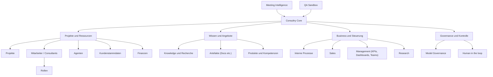
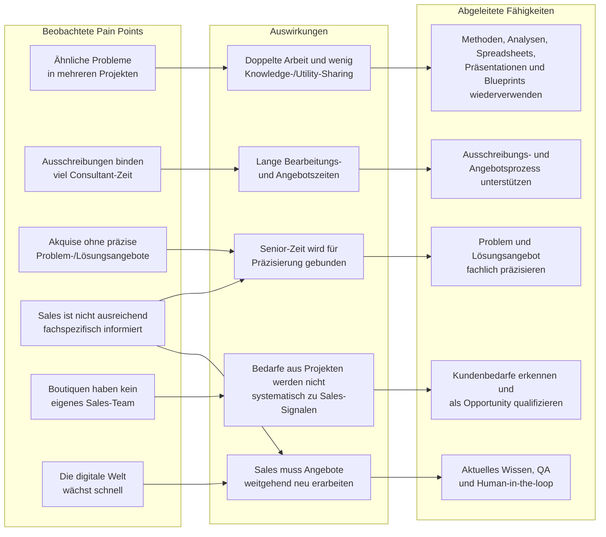

# Consultry — Whiteboard-Derived Mermaid Diagrams v0.1

**Status:** Discovery-Artefakt; fachlich zu validieren  
**Datum:** 02.08.2026  
**Quelle:** Zwei Workshop-Whiteboards zu Consultry Core, Meeting Intelligence, QA Sandbox und den adressierten Consulting-Pain-Points.  
**Bezug:** [Product Vision](./Consultry-Product-Vision-v1.0.md), [Feature ↔ Pain Map](../archive/superseded-product-baseline-2026-08/Consultry-Feature-Pain-Map-v1.0.md), [Business Domain Definition](./Consultry-Business-Domain-Definition-v1.0.md), [Project Intelligence](./Consultry-Project-Intelligence-Symbiosis-Graph-v1.0.md).

> **Interpretationshinweis:** Die vier Architekturgruppen und die Pfeilrichtungen sind strukturierende Ableitungen. Auf dem ersten Whiteboard waren die Verbindungen zwischen Meeting Intelligence, QA Sandbox und Consultry Core ohne Pfeilspitzen dargestellt. Schwer lesbare Begriffe wurden als „Knowledge-/Utility-Sharing“, „externe Projekte“ und „Management (KPIs, Dashboards, Teams)“ normalisiert.

---

## 1. Consultry-Plattformarchitektur

## 2. Von den Pain Points zu den benötigten Fähigkeiten

## 3. Zielprozess vom Kundenbedarf bis zum Wissenskreislauf

```mermaid
flowchart LR
    subgraph DISCOVERY["1. Bedarf entdecken"]
        direction TB
        START["Kundentermin oder<br/>laufende Projektarbeit"]
        START --> MI["Meeting Intelligence"]
        MI --> NEED["Weitere Kundenbedarfe erkennen"]
        NEED --> SIGNAL["Sales-Indikator / Opportunity"]
    end

    subgraph QUALIFY["2. Opportunity qualifizieren"]
        direction TB
        ANALYSIS["Problem und Lösungsangebot präzisieren"]
        ANALYSIS --> MATCH["Interne oder externe<br/>Consultants identifizieren"]
        MATCH --> CHECK["Skill-Match, Kapazität, Budget,<br/>Auslastung, Projektstatus und Kosten prüfen"]
    end

    subgraph PROPOSAL["3. Angebot entwickeln"]
        direction TB
        FEEDBACK["Mehrstufige Feedback-Runden"]
        FEEDBACK --> REVIEW["QA Sandbox und<br/>Human-in-the-loop"]
        REVIEW --> READY{"Freigabereif?"}
        READY -- Nein --> FEEDBACK
        READY -- Ja --> OFFER["Finales Angebot<br/>im Corporate Design"]
    end

    subgraph DELIVERY["4. Liefern und lernen"]
        direction TB
        PROJECT["Projekt durchführen"]
        PROJECT --> KNOW["Methoden, Analysen und<br/>Artefakte im Core sichern"]
        PROJECT --> DEVELOPMENT["Skill-Profile weiterentwickeln"]
        DEVELOPMENT --> OPP["Neue Opportunities"]
    end

    SIGNAL --> ANALYSIS
    CHECK --> FEEDBACK
    OFFER --> PROJECT

    KNOW --> ANALYSIS
    OPP --> SIGNAL

    CORE["Consultry Core"] -. Datenbasis .-> ANALYSIS
    CORE -.-> MATCH
    CORE -.-> CHECK
    CORE -.-> KNOW

    CI["Corporate Identity / Design"] -. Vorgabe .-> OFFER
```

---

*Ende v0.1. Die Diagramme dokumentieren den aus den Workshop-Whiteboards abgeleiteten Zwischenstand und ersetzen keine freigegebene Architektur- oder Produktspezifikation.*
