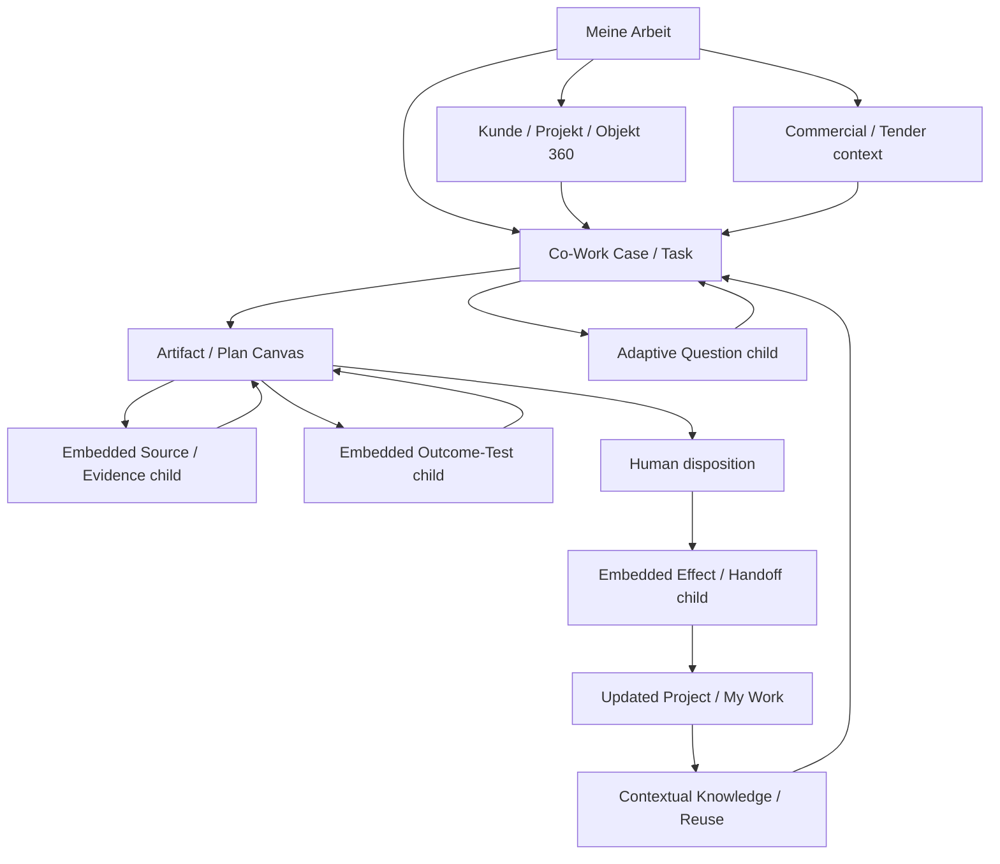

# Consultry — Systemic MVP Mock UI · Claude Design Handover v0.2

**Status:** execution-ready design handover for the connected Click Dummy; interaction details remain prototype hypotheses  
**Target:** [Claude Design](https://claude.ai/design)  
**Primary output:** one connected, clickable, frontend-only Consultry Product Experience  
**Prompt language:** English · **UI language:** German  
**Visual baseline:** existing Consultry App Design System v1.1, Figma library and supplied example components  
**Date:** 2026-08-07

> This handover supersedes [Consultry Mock UI — Claude Design Handover v0.1](./Consultry-Mock-UI-Claude-Design-Handover-v0.1.md) as the full-product mock brief. The older document remains reference material for one ERP active-work moment; it is not the information architecture or the complete journey.

## How to use this handover

1. Give Claude Design this document.
2. Attach or link the existing Consultry design-system source, Figma file and representative components listed below. Do not ask Claude Design to invent a replacement visual system.
3. Build in WBS order. Preserve shared shell, components, state and interactions across all routes.
4. Treat route grouping, exact screen boundaries and choreography as hypotheses to be improved during prototyping. Preserve the semantic contracts even when Claude Design finds a clearer composition.
5. Use the final acceptance and test scripts to review the result before moderated sessions.

### Design package to provide

- [Consultry App Design System v1.1](../../../design/DESIGN_SYSTEM/consultry_app_design_system/Consultry-App-Design-System-v1.1.md)
- [Figma Library Manifest v1.1](../../../design/DESIGN_SYSTEM/consultry_app_design_system/Figma-Library-Manifest-v1.1.md)
- [Application Shell & Scoped Assistant](../../../design/DESIGN_SYSTEM/consultry_app_design_system/patterns/application-shell-and-scoped-assistant.md)
- [Co-Work / Consultant Workspace](../../../design/DESIGN_SYSTEM/consultry_app_design_system/patterns/cowork-workspace.md)
- [Artifact Review](../../../design/DESIGN_SYSTEM/consultry_app_design_system/patterns/artifact-review.md)
- [Prompt Workspace](../../../design/DESIGN_SYSTEM/consultry_app_design_system/patterns/prompt-workspace.md)
- Figma: [Consultry App](https://www.figma.com/design/ISADUb31I52guGXElec3df/Consultry-App?node-id=23-9228&m=dev)

The frozen design system is authoritative for tokens, typography, focus, action hierarchy, layout behavior, overlays, accessibility and component anatomy. The current Product Definition is authoritative for destinations, Business Objects, human-agent semantics and the prototype journey. Where old example copy or old navigation labels conflict with the current Product Definition, retain the visual component and update its content—do not redesign the component.

---

## Paste-ready Claude Design brief

── PROMPT START ──

# Design one connected Consultry systemic MVP mock

You are extending an existing design system and component library to make a **connected, clickable, frontend-only mock UI** for Consultry: an AI-native operating system for specialist consultancies.

Do not redesign the brand, tokens, typography, shell, primitive components or existing component patterns. Reuse the supplied Figma library and examples. Your design effort belongs in:

1. the complete user journey;
2. the Co-Workspace and its tangible work output;
3. agent behavior that is legible, steerable and bounded;
4. dynamic, context-appropriate interactions;
5. human-agent responsibility and handoffs;
6. continuity across My Work, Business Objects, active work and firm knowledge.

The result is a comprehension, value and interaction prototype for investor walkthroughs and moderated sessions with real consultancy users. It is not a production build, a backend, an architecture decision, or three isolated demo slices.

## 1. Non-negotiable product outcome

The prototype must feel like **one Consulting OS** that carries context and work forward—not a generic AI chat, a CRM reskin, a dashboard collection, a document generator, a validation product or a presenter-led storyboard.

A Partner, Principal, Project Lead or Senior Consultant should quickly understand:

- what needs attention and why now;
- which Client, Project, Case, Task, Artifact/Plan and responsibility they are inside;
- what Consultry is trying to achieve with them;
- what the Agent has understood, retrieved, proposed, produced or tested;
- what the human can direct, edit, decide, stop or hand off;
- which tangible Artifact, Plan or Work Result has improved;
- what is supported, provisional, untestable or still waiting for real-world observation;
- what actually changed elsewhere in the Product after a human action.

The experience must make the productivity and output benefit tangible through real work. A polished answer in a chat transcript is not a sufficient result.

## 2. Target users and organization projections

Design the same Product and Business Objects for two target-customer shapes.

### Boutique specialist consultancy

One authorized person may carry compressed commercial, project and senior-review responsibilities. Consultry connects them directly to firm knowledge and supports them with tailored Agent workflows. Do not invent a second reviewer merely to make a workflow look enterprise-grade. One person must be able to take responsibility for a result with Agent support where policy permits.

### Growing specialist consultancy

Expert contributions, preparation, review and follow-through may be distributed. Keep contribution, custody, accountable decision and next responsibility distinct. More people do not justify more navigation or a mandatory approval chain.

The organization switch is a facilitator control, not a normal product setting. Both projections must use the same Clients, Projects, Cases, Artifacts, Plans, Tests and Effects; only assignment and collaboration differ.

## 3. Existing design-system contract

Use the supplied Consultry App Design System v1.1 and its existing examples as the visual source of truth.

Required pattern reuse:

- `Application Shell` for stable location and object context;
- `Co-Work / Consultant Workspace` for current work and contextual suggestions;
- `Scoped Assistant Panel` only for a bounded current scope—not a global assistant;
- `Artifact Review` for a tangible, versioned work result;
- `Prompt Workspace` only when a longer instruction genuinely needs explicit scope and attachments;
- existing Contextual Sidepanel/Drawer behavior for deeper context and child work;
- existing button hierarchy, including no more than one safe A0 focus action per active view;
- existing accessible focus, keyboard, mobile reflow and text-expansion rules.

Do not:

- create a new visual language;
- create card grids where the design system uses divider-led work surfaces;
- turn Co-Work into a new top-level module label;
- add a permanent general-chat column;
- use the brand gradient as an AI marker;
- place three equal-weight panes around the actual work;
- shrink typography to preserve a desktop composition;
- hide consequential state in a toast or hover-only affordance.

## 4. One persistent demo world

Use one deterministic fictional consultancy world so navigation has memory and actions visibly propagate.

| Context | Purpose in the prototype |
|---|---|
| `Hansa Maschinenbau AG` | Existing-client ERP work spanning opportunity, project, active work, Artifact output and learning/reuse. |
| `ERP Rollout Acceleration` | Active Project context. |
| `Wave-1 Readiness-Empfehlung · Entscheidungsgrundlage Client Steering v7` | A versioned Work Artifact used to make tangible output, source and revision behavior visible. |
| `Abstimmungsbericht v2` / `Abstimmungsbericht v3` | Exact source versions that can change the basis of a claim. |
| `KRITIS Security Transformation` | Net-new tender contrast anchored in an Ausschreibung and criteria, not client history. |
| `Project Nord` | Cross-project overlap and potential governed reuse; the system retrieves the overlap rather than asking consultants to maintain patterns. |
| `Tobias Rehm · Principal` | Primary Boutique actor and a valid responsible single-human completion path. |

These are prototype fixtures, not final scenario copy or domain canon. Keep their relationships stable, but improve moment grouping and microcopy when a clearer user test requires it. Never invent numeric evidence merely to fill a chart.

## 5. Information architecture

### 5.1 Product shell

The prototype starts in the Product, not in a demo selector. Reuse the existing shell component with these current Product destinations:

- `Meine Arbeit`
- `Kunden`
- `Projekte`
- `Wissen & Assets`
- `Menschen & Teams`
- `Commercials`
- `Operations`

Global utilities where appropriate:

- scoped Search/Ask;
- Quick Capture;
- current Client/Project context;
- requests/notifications;
- Consultry co-worker entry bound to the visible object.

Adjacent destinations may be shallow, but they must show credible connected objects and never use dead fake controls. Demo seed, role projection and reset controls live outside product landmarks and are explicitly labeled `Demo-Steuerung`.

### 5.2 Core work surfaces

Build a small number of reusable compositions, not a page for every lifecycle state:

| Surface | User question |
|---|---|
| `Meine Arbeit` | What needs attention or continued work, and why now? |
| Client/Project/Object 360 | What is the current business context and connected work? |
| Co-Work Case/Task Workspace | What are we trying to achieve and how are human and Agent working together? |
| Artifact/Plan Canvas | What tangible result are we producing, revising or testing? |
| Contextual Knowledge/Reuse | Which source, expert knowledge or governed reusable capability applies here? |

### 5.3 Mandatory parent-child rule

There is **no standalone global area** for:

- sources or evidence validation;
- outcome testing;
- confirmations or approvals;
- Trust/Assurance;
- Effect or Handoff review.

These are **child surfaces inside the associated Case, Task, Artifact/Plan, Decision or Handoff flow**.

A child surface may:

- expand inline;
- open in the existing contextual sidepanel/drawer;
- temporarily become a focused sub-canvas when comparison or review needs more room.

It must always retain or immediately expose:

- parent Case/Task/Artifact/Plan;
- current Goal;
- exact version or selection;
- responsible Owner;
- current work state;
- clear return path.

`Meine Arbeit`, Search or a notification may deep-link directly to an open child state, but the user must still perceive the parent flow. Closing or completing the child returns to the exact selection and draft. Never add `Quellen`, `Validierung`, `Approvals` or `Outcome Tests` to global navigation.

## 6. Agent-native Co-Workspace

### 6.1 Work contract

Every substantive Agent interaction is bound to:

`Responsible Job + Business Subject + Goal + intended Artifact/Plan/Work Result + permitted Context + current Sources + Authority boundary`.

The workspace must keep the actual work dominant. Conversation is an optional control inside the current work object, never the primary product structure or a second source of truth.

### 6.2 Legible working loop

The interface may compress the loop, but these states must remain recoverable:

```text
Responsible Job
→ Bounded Goal
→ Proposed / human-edited Plan
→ Human + Agent work
→ Tangible Result / Artifact / Plan
→ Applicable Outcome Tests
→ Human disposition or next responsibility
→ Effect / learning
↘ insufficient basis or failed test → replan, narrow, request context, hold or return to human
```

### 6.3 Co-Workspace anatomy

Compose the existing workspace and artifact patterns around:

1. **Context header** — Account, Project, Case/Task, owner, horizon, state and one focus action.
2. **Goal brief** — bounded purpose, intended result, what is explicitly out of scope.
3. **Editable plan** — proposed versus accepted steps, open questions, human edits, stop/replan.
4. **Agent work state** — current operation, scope, sources used, progress phase, partial result and safe interruption.
5. **Dominant Work Result** — Artifact, Plan, comparison, recommendation, meeting brief, tender response or other real consulting output.
6. **Contextual dynamic interaction** — diagram, matrix, questions or examples only where they reduce cognitive work.
7. **Applicable checks** — child surface attached to the exact Task/Artifact/Plan version.
8. **Human disposition** — edit, accept for bounded use, reject, hold, narrow, request more context or assign the next responsibility.
9. **Effect preview and result** — child surface showing what the action will and will not change, then the actual simulated effect or recoverable failure.

Do not show all nine regions at equal prominence. Use progressive disclosure and the current job to decide what is dominant.

### 6.4 Human-Agent responsibility grammar

Keep these semantic containers distinct wherever they matter:

| Layer | Meaning | Allowed actions |
|---|---|---|
| Source / business fact | Exact source, version, system state or human-provided context | inspect, compare, add, remove from scope, report missing/permission issue |
| Agent observation / candidate | Retrieved relationship, hypothesis, option, question, draft, plan or test evidence | edit, challenge, retry, dismiss, request context, use as input |
| Human contribution / disposition | Judgment, edit, acceptance, rejection, hold, waiver or assignment by a named person | record rationale, revise, confirm bounded next state |
| Effect | State that actually changed after an authorized action | inspect, recover, correct or reopen where permitted |

AI origin never creates Business Authority. Multiple Agent outputs are not independent evidence and do not constitute a vote. An Agent may retrieve, synthesize, draft, compare, test verifiable parts, replan, pause and escalate. It may not silently approve, publish, send, commit the consultancy, change project truth or claim a real-world outcome.

### 6.5 Agent states to prototype

| State | What the UI communicates | Human control |
|---|---|---|
| Ready in context | Goal, scope, intended output and usable context | adjust goal/scope, start |
| Plan proposed | AI-origin plan and unresolved choices | edit, accept, ask for alternative, stop |
| Needs context | exactly what is missing and why it blocks progress | answer, attach context, choose `mehr Kontext nötig`, narrow goal |
| Working | current phase, bounded scope, sources and partial result policy | stop, background, redirect where safe |
| Partial result | usable output plus missing or failed parts | continue, edit, retry part, accept bounded result |
| Result ready | tangible output, provenance and applicable checks | edit result, open child check, choose disposition |
| Test issue | failing, unsupported, untestable or not-yet-observable claim | rework, narrow claim, accept limitation, hold |
| Awaiting human | exact decision or contribution and its consequence | decide, abstain, request input, reassign if authorized |
| Effect pending/failed/completed | what was attempted and what actually changed | retry, correct, reopen or continue |

Avoid anthropomorphic filler such as “I’m thinking.” Prefer precise work language such as `Vergleicht Quellenstände`, `Entwurf wird aktualisiert` or `Wartet auf Scope-Entscheidung`.

## 7. Progressive disclosure

Use four contextual depths, not a wizard:

| Level | Show by default | Purpose |
|---|---|---|
| L0 Attention | why now, affected context, owner, horizon, one next action | decide whether to open, route, defer or dismiss |
| L1 Work Brief | Goal, current state, key basis, intended result, next step | understand and take responsibility |
| L2 Co-Work Detail | plan, questions, active work, Artifact/Plan, Agent progress, applicable checks | direct, create, refine and test |
| L3 Assurance | exact lineage, uncertainty, testability, Claim Ceiling, policy/run/audit context | investigate trust, boundary or failure |

Rules:

- Default depth follows the job, risk and horizon.
- Material missing basis or blocked responsibility may be promoted upward.
- Opening deeper detail preserves the active result and selection.
- Returning preserves drafts, answers and open obligations.
- L3 is contextual child depth, never a permanent evidence dashboard.

## 8. Dynamic and visual interactions

The Agent may compose only approved, typed interaction blocks from existing or clearly marked prototype-extension components. It must not generate arbitrary interface code.

### 8.1 Minimum block coverage

| ID | Block | Required prototype moment |
|---|---|---|
| DS-1 | Context/relationship visual | Show relevant Client–Project–Artifact–Source, stakeholder/dependency or cross-project relationship. |
| DS-2 | Adaptive question set | Single/multi-choice plus `Eigene Antwort` and `mehr Kontext nötig` where the answer space is open. |
| DS-3 | Editable few-shot suggestions | Non-selected examples with visible origin and a path to edit or ignore. |
| DS-4 | Comparison/evidence matrix | Compare exact criteria, claims, options or source versions. |
| DS-5 | Process/decision/handoff diagram or timeline | Explain current position, branch, change or next responsibility. |
| DS-6 | Outcome-test/claim surface | Separate supported, provisional, untestable and not-yet-observable outcomes for the exact result. |
| DS-7 | Quantitative chart, optional | Only if a real numeric fixture changes the decision; always include definition, unit, range, source and table equivalent. |

### 8.2 Selection grammar

Choose the representation because of the question:

- relationships or dependency → relationship visual;
- sequence, branch, handoff or change → diagram/timeline;
- differences between options, sources or claims → matrix;
- actual numeric distribution/trend/variance → chart;
- missing intent or judgment → adaptive question;
- blank-page reduction → editable examples;
- supportability of a result → attached outcome-test/claim child.

Do not decorate every screen with a chart or diagram. Do not show an opaque aggregate “AI confidence,” “alignment,” “readiness” or “quality” score.

### 8.3 Human explanation grammar

Every dynamic surface should make this understandable:

1. What did Consultry notice or understand?
2. Which exact context or sources support that view?
3. What is incomplete, uncertain or conflicting?
4. Why is this representation useful now?
5. What input or decision is needed from the human?
6. What will that input update—and what will it not authorize?

Answers first update Working Context, Plan or Artifact. They do not automatically become a Decision, Approval or Effect.

## 9. Connected user-journey architecture

This is a navigable product world, not a rigid screen rail. Preserve semantic continuity while freely improving screen grouping.



### 9.1 Primary journey: existing client, Opportunity-to-Project into real work

Demonstrate a coherent route that can begin with a credible existing-client signal or continued work and can move through:

- contextual attention in `Meine Arbeit` or the Client/Project;
- bounded qualification without automatically creating an Opportunity;
- engagement framing and commitment readiness;
- explicit accepted Project handoff;
- active consulting work in Co-Work;
- a tangible Artifact/Plan improvement;
- attached source comparison or other needed Assurance;
- attached Outcome Tests and responsible claim boundary;
- human disposition and a visible state ripple.

This is the deep systemic spine. Do not reduce it to blind-spot handling. Active work may begin from planned deliverables, client input, analysis, meeting preparation, project change or an intentional challenge.

### 9.2 Contrast journey: net-new KRITIS tender

Reuse the same Product and Co-Work grammar while making the starting conditions genuinely different:

- entry from an Ausschreibung and its exact criteria/amendments;
- no invented client relationship or CRM history;
- bounded Bid/No-Bid/Hold judgment;
- criteria and evidence matrix inside the tender work;
- questions only for missing human intent, constraints or judgment;
- a reviewable response/readiness Work Result;
- a valid negative or hold path.

### 9.3 Active-work continuation and output quality

Within the ERP Project, show day-to-day Co-Work on an Artifact/Plan. A source change or deliberate challenge may become relevant, but it remains one feature-level event inside broader project work.

The user should be able to:

- see and edit the intended result;
- direct the Agent plan;
- inspect a source version comparison as a child of the Artifact;
- revise the exact successor draft without inventing a version label;
- test the revised result against applicable and visibly bounded Outcome Tests;
- distinguish an improved deliverable from unobserved client outcome;
- make a responsible next move without requiring a second human by default.

### 9.4 Knowledge, overlap and governed reuse continuation

After connected project work exists, Consultry may retrieve an overlap with `Project Nord` and notify affected consultants or management.

The prototype must show:

- which problem/solution aspects overlap;
- material differences, source lineage, uncertainty and rights boundary;
- a human discussion/decision to reject, merge, hold or create a bounded Reuse Candidate;
- no expectation that consultants continuously author or maintain “patterns”;
- no automatic publication, productization or cross-client raw-data exposure.

## 10. Screen and state inventory

Treat these as reusable design states, not slide numbers.

| ID | Surface/state | Essential content | Essential interaction |
|---|---|---|---|
| `S00` | Meine Arbeit / System Home | prioritized attention, continued work, drafts, requested input; why now and parent context | open parent at relevant depth; route/defer/dismiss where valid |
| `S10` | Customer 360 | relationship, projects, commitments, active responsibilities and contextual knowledge | enter current work without losing customer context |
| `S20` | Project 360 | Goal/current work, Plans, Artifacts, decisions, risks/outcomes and next responsibilities | continue exact Work Item/Artifact |
| `S30` | Co-Work default | Goal, plan, Agent state and dominant current work | edit plan, answer contextual questions, stop/replan |
| `S31` | Co-Work working/partial | bounded live progress and partial result | redirect, background, retry part or continue manually |
| `S40` | Artifact/Plan Canvas | exact version, editable output, human/AI changes and save state | edit, inspect relevant child, prepare disposition |
| `C41` | Source/Evidence child | exact attached source/versions and claim relation | compare, add/remove scope, mark unresolved, return |
| `C42` | Outcome-Test child | exact result/version tests and Claim Ceiling | rework, bound claim, accept limitation, hold |
| `C43` | Question child | one bounded question or short adaptive set | choose, free-answer, ask for context, return |
| `C44` | Effect/Handoff child | preview, authority/recipient, changed versus unchanged state | confirm bounded action, see success/failure, return |
| `S50` | Knowledge/Reuse contextual view | retrieved source/expert/asset or overlap with applicability and rights | use as context, discuss, reject or form candidate |
| `S60` | Commercial/Tender context | opportunity/tender state, criteria, commitment basis and responsible next job | enter KRITIS Co-Work or decide hold/no-bid |
| `S70` | People/Teams shallow projection | responsibility/contribution/capability relevant to active work | inspect or request contribution without transferring authority |
| `S80` | Operations shallow projection | only scenario-relevant obligations/effects/exceptions | open responsible parent flow; no generic operations suite |

## 11. Interaction continuity rules

1. One canonical object identity is reused across all views.
2. An accepted edit updates the exact Artifact/Plan state elsewhere.
3. A human qualification/disposition updates `Meine Arbeit` and the relevant Client, Project or Commercial projection.
4. Completing a child surface does not navigate to a foreign module; it updates and returns to its parent.
5. Browser-like back/forward behavior preserves context, selection, disclosure level and unsaved drafts in the mock.
6. Changing Client/Project while a scoped Agent job or draft is open requires an explicit keep/switch/discard decision.
7. The Agent result is not business progress until a human has disposed it and an allowed state change occurs.
8. A simulated effect is shown separately from its preview and can fail without losing the work.
9. Boutique and Growing projections never fork the underlying Business Object state.
10. Reset and seed selection are deterministic facilitator actions.

## 12. Required recovery and boundary states

Prototype at least these states in context:

- missing or insufficient basis;
- stale or conflicting source version;
- source permission denied without leaking protected content;
- unanswered/ambiguous adaptive question;
- user chooses `mehr Kontext nötig`;
- Agent partial result;
- stopped or replanned Agent work;
- unsupported, untestable and not-yet-observable Outcome Test;
- unsaved Artifact draft and version conflict;
- effect pending, effect failed and retry/correction;
- hold/no-bid/reject as valid responsible outcomes;
- Boutique single-human completion;
- Growing contribution/handoff with one accountable owner.

Keep manual work available when Agent assistance is unavailable. Never erase an existing draft because an Agent job fails.

## 13. German interaction-copy direction

Use plain, precise work language. Favor:

- `Warum jetzt`
- `Ziel der Arbeit`
- `Vorgeschlagener Plan`
- `Von Consultry vorgeschlagen`
- `Von Tobias bearbeitet`
- `Grundlage und Quellen`
- `Mehr Kontext nötig`
- `Eigene Antwort`
- `Im Artefakt öffnen`
- `Anspruch eingrenzen`
- `Ergebnis überarbeiten`
- `Als Entwurf übernehmen`
- `Nächste Verantwortung`
- `Diese Aktion ändert …`
- `Diese Aktion ändert nicht …`

Avoid vague labels such as `Senden`, `AI Score`, `Optimieren`, `Alles freigeben`, `Autonom ausführen` or `Bestätigen` without a named consequence.

## 14. WBS — Claude Design execution backlog

Each item is a reviewable design increment with a concrete acceptance check. Do not combine items merely to reduce file count. If Claude Design emits implementation code, keep each item below **800 authored/generated LOC including local interaction tests**; split before exceeding the limit. Shared design-system source and supplied fixture data are not to be duplicated per item.

### Wave 0 — source intake and interaction model, sequential

| ID | Deliverable | Depends on | Acceptance |
|---|---|---|---|
| `CD-00` | Import/read the supplied design system, Figma manifest and example components | — | component and pattern names are referenced; no replacement token set or visual theme is invented |
| `CD-01` | Component reuse map: required experience element → existing component/pattern → prototype-only extension | CD-00 | every proposed new component has a semantic gap reason; cosmetic alternatives are rejected |
| `CD-02` | Persistent demo-world/state ledger | CD-00 | Hansa, ERP, KRITIS and Project Nord objects use stable identities and shared states |
| `CD-03` | Navigation + parent/child route map | CD-01, CD-02 | no Source/Validation/Approval/Test global destination; every child has parent and return state |
| `CD-04` | Human-Agent semantic legend and visual differentiation | CD-01 | Source, Agent candidate, human disposition and Effect cannot be confused in grayscale or by labels |
| `CD-05` | Prototype interaction/state registry | CD-02–CD-04 | every click that changes state has precondition, event, visible result and affected projections |

### Wave 1 — shared Product shell and system orientation

| ID | Deliverable | Depends on | Acceptance |
|---|---|---|---|
| `SH-01` | Reuse Application Shell with current Product destinations | CD-03 | stable current location and Client/Project context; keyboard and responsive shell behavior inherited |
| `SH-02` | Global scoped Search/Ask and Quick Capture entry states | SH-01 | entries declare/bind context before governed work; no blank general chat |
| `SH-03` | Separate Demo-Steuerung for seed, organization projection and reset | CD-02, SH-01 | facilitator controls are visually and semantically outside Product navigation |
| `SH-04` | Meine Arbeit default and populated states | SH-01, CD-05 | attention, continued work, drafts and requests are distinct and each shows why now + parent context |
| `SH-05` | Customer 360 connected projection | SH-01, CD-02 | projects, commitments and current work resolve to canonical objects, not generic CRM forms |
| `SH-06` | Project 360 connected projection | SH-01, CD-02 | plans, artifacts, work, decisions and outcome state agree with the rest of the prototype |
| `SH-07` | Honest shallow states for Knowledge, People/Teams, Commercials and Operations | SH-01 | each supports the system mental model without fake depth, dead controls or dashboard filler |

### Wave 2 — Co-Workspace and Agent behavior, sequential foundation

| ID | Deliverable | Depends on | Acceptance |
|---|---|---|---|
| `CW-01` | Context/Goal header composition | CD-04, SH-06 | responsible Job, subject, goal, intended result, owner, horizon and one focus action are legible |
| `CW-02` | Editable proposed/accepted Plan | CW-01 | AI-origin plan is never silently accepted; user edits persist and are marked as human input |
| `CW-03` | Agent state/progress composition | CW-02 | phase, bounded scope, sources and stop/background behavior are visible without equating run progress with business progress |
| `CW-04` | Needs-context and adaptive-response behavior | CW-02 | exact information gap, free answer and `mehr Kontext nötig` path are available |
| `CW-05` | Partial result, retry-part and replan behavior | CW-03 | existing human work/draft survives; failed portions are isolated |
| `CW-06` | Dominant tangible Work Result slot | CW-03 | Artifact/Plan/analysis is visually primary; Agent conversation is optional and subordinate |
| `CW-07` | Human disposition and next-responsibility composition | CW-06 | edit/accept/reject/hold/narrow/assign have named consequences; abstain/request-input remains possible |
| `CW-08` | Optional object-bound conversation control | CW-06 | conversation edits shared Goal/Plan/Result state and does not create independent truth/history |

### Wave 3 — dynamic interactions and embedded child surfaces

| ID | Deliverable | Depends on | Acceptance |
|---|---|---|---|
| `DY-01` | Prototype extension host for allowlisted dynamic blocks | CD-01, CW-06 | blocks inherit existing tokens, action hierarchy, focus and responsive behavior; unsupported block fails closed |
| `DY-02` | Context/relationship visual `DS-1` | DY-01 | relevant subset, uncertainty, correction/open-object action and text equivalent are present |
| `DY-03` | Adaptive question set `DS-2` | DY-01, CW-04 | single/multi-choice, own answer, no forced default, context-recovery and consequence text work |
| `DY-04` | Editable few-shot suggestions `DS-3` | DY-01 | visible origin; examples are editable, dismissible and unselected |
| `DY-05` | Comparison/evidence matrix `DS-4` | DY-01 | exact criteria/claim/source/version links remain inspectable; no opaque aggregate score |
| `DY-06` | Process/decision/handoff timeline `DS-5` | DY-01 | current position, branch and next responsibility are clear with accessible list equivalent |
| `DY-07` | Outcome-test/claim surface `DS-6` | DY-01 | supported/provisional/untestable/not-yet-observable are distinct for one exact result/version |
| `DY-08` | Optional quantitative chart `DS-7` | DY-01 + real numeric fixture | chart is omitted unless the fixture supports definition/unit/range/source and table alternative |
| `CH-01` | Source/Evidence child interaction | DY-05, CW-06 | opens within parent Artifact/Task, preserves selection/version/owner and returns in place |
| `CH-02` | Outcome-Test child interaction | DY-07, CW-06 | attached to exact result; changing Claim Ceiling updates parent without creating separate navigation |
| `CH-03` | Confirmation/Effect/Handoff child interaction | DY-06, CW-07 | preview states changed/unchanged scope; action shows success/failure and returns to parent |
| `CH-04` | Assurance deep-link from Meine Arbeit | SH-04, CH-01–CH-03 | deep link opens child inside visible parent context and back returns to prior queue state |

### Wave 4 — tangible work and anchor-journey composition

| ID | Deliverable | Depends on | Acceptance |
|---|---|---|---|
| `AR-01` | Reuse Artifact Review for exact Artifact/Plan version | CW-06, CH-01 | version, save state, source/AI/human change and review state are distinguishable |
| `AR-02` | Artifact edit/diff and successor-draft behavior | AR-01 | user can modify real content; no auto-finalization or invented successor version label |
| `AR-03` | Corporate knowledge/design alignment inside Artifact work | AR-01, DY-05 | relevant terminology/method/template/brand/source constraints appear contextually, not as a separate compliance module |
| `JY-01` | ERP existing-client entry and qualification | SH-04–SH-06, CW-01 | signal/observation does not auto-create an Opportunity; hold/reject rationale persists |
| `JY-02` | ERP engagement and commitment readiness | JY-01, DY-02–DY-04 | Agent helps shape need/outcome/scope/constraints; human remains responsible for commitment |
| `JY-03` | ERP accepted Project handoff | JY-02, CH-03 | Project activation is distinct from commitment; Project and My Work update coherently |
| `JY-04` | ERP active consulting Co-Work | JY-03, CW-01–CW-07 | user directs Agent work toward an Artifact/Plan, not a chat answer |
| `JY-05` | ERP exact-source change/revision/test continuation | JY-04, AR-01–AR-03, CH-01–CH-02 | source comparison is embedded; Artifact improves; unobserved client outcome is not claimed |
| `JY-06` | ERP human disposition/effect/state ripple | JY-05, CH-03 | named state change appears in Project, Artifact and My Work; failed effect is recoverable |
| `KT-01` | KRITIS tender intake and amendment orientation | SH-07, CW-01, DY-06 | starts from exact tender sources, not fabricated customer history |
| `KT-02` | KRITIS Bid/No-Bid/Hold co-work | KT-01, DY-03, DY-05 | missing criteria and judgment are explicit; negative path is responsible success |
| `KT-03` | KRITIS reviewable work result | KT-02, AR-01, CH-02 | produces a tangible response/readiness result with bounded claims |
| `KR-01` | Project-Nord overlap retrieval | JY-06, DY-02, SH-07 | system retrieves overlap with basis/differences/uncertainty; no manual pattern maintenance |
| `KR-02` | Reuse-candidate disposition | KR-01, CH-03 | reject/merge/hold/candidate are distinct; publication/productization is not implied |

### Wave 5 — organization projections, recovery and integration

| ID | Deliverable | Depends on | Acceptance |
|---|---|---|---|
| `OR-01` | Boutique single-human responsibility path | JY-01–JY-06 | Tobias can responsibly complete allowed work with Agent support; no invented mandatory reviewer |
| `OR-02` | Growing contribution/handoff path | JY-01–JY-06 | contributor, accountable owner and next responsibility remain distinct |
| `RC-01` | Missing basis, permission and stale/conflict recovery states | CH-01, CW-05 | protected data is not leaked; existing work survives; safe next action is named |
| `RC-02` | Outcome-test and Claim-Ceiling recovery states | CH-02, CW-07 | failing/unsupported/untestable/not-yet-observable lead to rework/narrow/hold, not fake PASS |
| `RC-03` | Agent stop/partial/error recovery | CW-03–CW-05 | manual continuation works; no lost draft or false completion |
| `RC-04` | Effect pending/failure/retry recovery | CH-03 | attempted versus actual state stays distinct; retry/correct/reopen path is visible |
| `IN-01` | Cross-view state reconciliation | all journey items | one object shows the same status, owner, version and responsibility in every projection |
| `IN-02` | Responsive and long-German-copy pass | all shared surfaces | desktop/tablet/mobile and 200% zoom reflow without clipped labels or squeezed type |
| `IN-03` | Keyboard, focus and accessible-equivalent pass | all interactive surfaces | child close returns focus; diagrams/charts/matrices have text/table alternatives; no color-only semantics |
| `IN-04` | Prototype reset and deterministic replay | SH-03, IN-01 | each test route can be reset and replayed with predictable state |

### Wave 6 — validation package

| ID | Deliverable | Depends on | Acceptance |
|---|---|---|---|
| `QA-01` | Unmoderated system-orientation test route | IN-01–IN-04 | user can identify Product areas, current work, current object and Agent role without explanation |
| `QA-02` | ERP end-to-end task script | QA-01 | begins in Product home, changes a tangible result and demonstrates one cross-view ripple |
| `QA-03` | KRITIS contrast task script | QA-01 | participant recognizes the different source/decision basis while reusing the Product grammar |
| `QA-04` | Child-surface comprehension test | QA-01 | participant describes source/test/effect state as part of parent work and returns without disorientation |
| `QA-05` | Human-Agent boundary test | QA-01 | participant correctly distinguishes Source, Agent proposal, human decision and actual Effect |
| `QA-06` | Boutique/Growing comparison test | OR-01–OR-02 | participants see role compression/distribution without interpreting AI as accountable owner |
| `QA-07` | Findings and change log template | QA-02–QA-06 | captures observed behavior, quote, severity, hypothesis and proposed change without ratifying untested choreography |
| `HO-01` | Final clickable prototype package and handback | all QA setup | link/file, route map, component reuse map, state ledger, known gaps and testing notes are complete |

## 15. Optimal execution sequence

1. Complete Wave 0 sequentially. Do not style screens before object identity, parent-child relationships and interaction events are clear.
2. Build Wave 1 shell and Wave 2 Co-Workspace as shared compositions.
3. Build the dynamic blocks and child surfaces once; journeys only compose them.
4. Compose ERP, KRITIS and reuse corridors in parallel only after shared interaction semantics are stable.
5. Integrate shared state before polishing visual variants.
6. Validate system orientation, Co-Work, tangible result creation, child-surface comprehension and state ripple before expanding peripheral modules.

Do not create three mini-products and merge them later.

## 16. Required prototype interactions

The delivered click dummy must support, not merely illustrate:

- free navigation from Product home into and out of active work;
- direct deep-link behavior into a child state with parent context intact;
- editing a Goal, Plan step or Artifact content;
- answering an adaptive question via choice, own answer and more-context path;
- using, editing or ignoring a few-shot suggestion;
- stopping/replanning or handling a partial Agent result;
- opening/closing source comparison without losing Artifact selection;
- changing a claim/test disposition and seeing the parent update;
- previewing an Effect/Handoff, confirming a bounded action and seeing success or failure;
- one cross-view state ripple;
- switching Boutique/Growing projection without changing canonical object identity;
- deterministic reset.

## 17. Definition of Done

The mock is complete only when:

1. it starts as a credible Product, not a demo scene selector;
2. one connected shell and shared Business Objects span every deep route;
3. Agent work is bound to a real Job, Goal, intended result, context, sources and authority boundary;
4. a tangible Artifact/Plan/Work Result is created or materially improved;
5. Source, Agent candidate, human disposition and Effect are unmistakably distinct;
6. sources, tests, confirmations and Effect/Handoff review exist only as contextual child surfaces;
7. `DS-1` through `DS-6` are demonstrated where semantically useful; no fabricated chart is used;
8. ERP and KRITIS routes feel different in business context but coherent in Product grammar;
9. one valid negative/hold path and one recovery path are usable;
10. both Boutique single-human completion and Growing contribution/handoff are understandable;
11. a meaningful action visibly updates another relevant view;
12. long German text, keyboard use, focus return, 200% zoom and responsive reflow remain usable;
13. facilitator controls are not confused with Product navigation;
14. exact layout and flow assumptions remain labeled as prototype hypotheses to be changed after testing.

## 18. Explicit non-goals

Do not design or imply:

- a production backend or real AI execution;
- final Agent/Skill/Graph/Model-Bridge architecture;
- an independent Sources, Validation, Approvals or Outcome-Test product;
- a generic agent-harness framework;
- autonomous business decisions or external effects;
- a full CRM, PSA, PM, DMS, finance or operations replacement;
- exhaustive consultancy workflows;
- a manual pattern-maintenance burden;
- validated market claims or model-quality claims;
- final screen choreography before user testing.

## 19. Final delivery format

Return:

1. one connected clickable prototype;
2. route/state map;
3. component reuse/extension map;
4. persistent fixture and event ledger;
5. prototype-extension list for any dynamic blocks not yet in the frozen library;
6. validation task scripts;
7. known gaps and assumptions;
8. a short change log explaining any screen regrouping while confirming that the semantic contracts remained intact.

Work from the existing design system. Spend design judgment on the journey, Co-Workspace, dynamic Human-Agent interaction, tangible result creation and systemic continuity.

── PROMPT END ──

---

## Product-definition provenance

- [Systemic Platform Click Dummy Experience Contract v0.1](../Consultry-Systemic-Platform-Click-Dummy-Experience-Contract-v0.1.md)
- [Dynamic Co-Work Surface Moment Map v0.1](../Consultry-Dynamic-CoWork-Surface-Moment-Map-v0.1.md)
- [UX Operating Model v0.1](../Consultry-UX-Operating-Model-v0.1.md)
- [Systemic Platform Click Dummy Scope and WBS Delta v0.2](./Consultry-Systemic-Platform-Click-Dummy-Scope-and-WBS-Delta-v0.2.md)
- [Opportunity-to-Project Representative Business Thread v0.1](../Consultry-Opportunity-to-Project-Representative-Business-Thread-v0.1.md)
- [Active Project / Delivery Blind-Spot Reference Thread v0.1](../Consultry-Active-Project-Delivery-Blind-Spot-Reference-Thread-v0.1.md)
- [Knowledge Reuse and Corporate Artifact Alignment Reference Thread v0.1](../Consultry-Knowledge-Reuse-and-Corporate-Artifact-Alignment-Reference-Thread-v0.1.md)
- [Wayfinder prototype ticket](../wayfinder/consultry-product-platform-baseline/tickets/prototype-the-role-aware-human-ai-interaction-and-responsibility-contract.md)

## Handover decision record

- The frozen App Design System and example components are reused; this handover does not prescribe a visual redesign.
- The full mock is a connected Product Experience with thin platform breadth and deep anchor journeys.
- Co-Work is work-/object-bound and deliverable-centered; chat is optional and subordinate.
- Dynamic visual/question/example surfaces are typed, contextual and human-steerable.
- Source/Evidence review, Outcome Tests, confirmation/approval, Trust/Assurance and Effect/Handoff review are child surfaces within the associated parent flow, never global modules.
- Screen boundaries and choreography remain testable hypotheses; semantic identity, responsibility, provenance and effect boundaries are the invariants.
