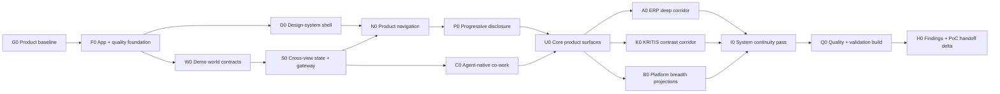

# Consultry — Systemic Platform Click Dummy Scope and WBS Delta v0.2

**Status:** Implementation-handover scope correction; build and validation pending  
**Date:** 2026-08-06  
**Supersedes:** Scope, route model, work-stream decomposition, Definition of Done and validation focus in [Three-Slice Mock UI Implementation Handover v0.1](./Consultry-Three-Slice-Mock-UI-Implementation-Handover-v0.1.md)  
**Retains from v0.1 unless contradicted:** Next.js/static frontend boundary, App Design System authority, clean-baseline gate, source hierarchy, worktree safety, `<800 authored LOC` rule, TDD, unit/component/mock-integration/E2E/accessibility/visual/mutation gates and official technical references  
**Product contract:** [Systemic Platform Click Dummy Experience Contract v0.1](../Consultry-Systemic-Platform-Click-Dummy-Experience-Contract-v0.1.md)
**Dynamic-surface mapping:** [Dynamic Co-Work Surface Moment Map v0.1](../Consultry-Dynamic-CoWork-Surface-Moment-Map-v0.1.md)

## 1. Build outcome correction

Build one navigable Consultry Product Experience with shared deterministic state. Do not build ten pages joined by a presenter rail or three feature demos that are integrated at the end.

The implementation shape is:

`system shell + connected Business Objects + agent-native co-work + progressive disclosure + deep anchor journeys + cross-view state ripple`.

The three existing Slice specifications become fixture and acceptance inputs for deep corridors. A facilitator may still jump to seeded moments, but those controls are visually separate from the Product and are not the primary route model.

## 2. Revised route and state model

Final IA remains testable, but the implementation should begin from Product routes rather than Scene routes:

```text
/work
/customers/[customerId]
/projects/[projectId]
/cases/[caseId]
/artifacts/[artifactId]
/knowledge
/commercials
/people
/operations
```

Static Export uses an enumerated fixture registry for all dynamic parameters. Exact route names may change in an explicit UX PR; the invariant is object-/work-centered navigation with durable URLs.

Optional facilitator-only routes or query state may seed a Case, recovery condition or organization projection. They never replace the Product shell and must be marked `Demo controls`.

One typed `DemoWorldState` holds only the deterministic cross-view state needed by the prototype:

- active organization projection and actor;
- Clients, Projects and relevant commitments;
- Cases, goals, current co-work plans and work state;
- Artifacts/Plans, exact versions and draft state;
- Source/Evidence bindings and open obligations;
- Outcome Tests, Evidence State and Claim Ceiling projection;
- responsibilities, accepted contributions and handoffs;
- human dispositions, simulated effects and failures;
- knowledge/overlap/reuse candidates;
- facilitator seed and reset metadata.

State changes flow through typed domain events and one in-memory gateway. Components do not mutate fixture JSON, infer Authority from visibility or maintain independent copies of the same Business Object.

## 3. Revised feature organization

Feature ownership follows Product surfaces and semantic contracts rather than Slices:

```text
src/
├── app/                         # product/object routes
├── demo-controls/               # visibly separate facilitator controls
├── domain/                      # shared prototype types + invariants
├── world/                       # fixtures, registry, reducer, selectors, reset
├── surfaces/
│   ├── my-work/
│   ├── object-360/
│   ├── co-work/
│   │   └── children/            # source/test/confirmation/effect states inside parent work
│   ├── artifact-plan/
│   └── knowledge-reuse/
├── journeys/                    # composition only, no duplicate domain logic
│   ├── erp-continuity/
│   └── kritis-tender/
├── shared/
│   ├── app-shell/
│   ├── progressive-disclosure/
│   ├── source-basis/
│   ├── responsibility/
│   ├── claim-ceiling/
│   └── recovery/
└── test/
```

The optional Harness and model-composed Surface consume the same gateway projections and events as the guided App. They do not create a second state store or authority path.

## 4. Revised dependency flow



Platform contracts and surfaces precede journey composition. This avoids three independently built mini-products that later need cosmetic integration.

## 5. Revised WBS

Every item follows the v0.1 `<800 authored LOC including tests/configuration` rule. The target remains 250–650 LOC; forecast overruns are split before implementation or review.

### 5.1 Baseline and foundation

| ID | Deliverable | Dependency | LOC target | Test-first acceptance |
|---|---|---:|---:|---|
| `G0` | Product/design baseline and supersession links checked | – | ≤150 docs | all authoritative links resolve; current dirty work is deliberately included or excluded; no silent stash/commit |
| `F0a` | isolated Next.js app, package/runtime pins, Static Export and smoke route | G0 | ≤450 | failing-then-green build/smoke; exported `/work` opens without runtime backend |
| `F0b` | lint, typecheck, Vitest, RTL, MSW, Playwright, axe, coverage and CI scripts | F0a | ≤700 | each gate is proven by a deliberate failure before green configuration |
| `F0c` | Stryker changed/full modes and LOC policy | F0b | ≤500 | known guard mutant is killed; non-mutable PR path remains explicit |
| `D0a` | App Design System tokens, fonts, focus, reduced motion and global layout | F0a | ≤550 | token/font/focus tests, 200% zoom smoke, no unapproved marketing token drift |
| `D0b` | semantic shell landmarks, responsive workspace and empty/error/loading regions | D0a | ≤700 | keyboard/landmark/axe checks; mobile and desktop layout remain operable |
| `D0c` | prototype-only visual states for dynamic explanation/question/example blocks within v1.1 tokens | D0b | ≤700 | hierarchy, selection, source/AI labels, focus and text/table alternatives work without claiming a v1.1 canon change |

### 5.2 Shared demo world and invariants

| ID | Deliverable | Dependency | LOC target | Test-first acceptance |
|---|---|---:|---:|---|
| `W0a` | identifiers and types for actor, customer, project, case, goal and work item | F0b | ≤600 | invalid cross-tenant/context identifiers and orphaned work fail fixture construction |
| `W0b` | artifact/plan, source, testability, evidence-state and claim-ceiling types | W0a | ≤700 | claim cannot exceed current evidence/testability; missing source version remains explicit |
| `W0c` | responsibility, contribution, disposition, handoff and simulated-effect types | W0b | ≤700 | AI contribution cannot create human disposition or effect authority |
| `W0d` | ERP, KRITIS and Project-Nord fixture builders | W0c | ≤750 | deterministic IDs/time; Boutique/Growing use same objects with different assignments |
| `S0a` | typed world reducer and selectors | W0d | ≤750 | events update one canonical object; unknown/forbidden transitions leave explainable state |
| `S0b` | in-memory gateway contract with success/error/latency fixtures | S0a | ≤700 | MSW/gateway parity; no unplanned network; error preserves prior state |
| `S0c` | state hydration, URL-safe selected context and reproducible reset/seed | S0b | ≤650 | route change preserves world state; reset recreates byte-equivalent seed projection |

### 5.3 System shell and progressive disclosure

| ID | Deliverable | Dependency | LOC target | Test-first acceptance |
|---|---|---:|---:|---|
| `N0a` | Product navigation and active Client/Project context | D0b, S0c | ≤700 | direct routes, back/forward, keyboard nav and context persistence work |
| `N0b` | global Quick Capture, Search/Ask and request/notification entry affordances | N0a | ≤700 | each entry resolves to a bounded context; blank Search/Ask cannot create governed effect |
| `N0c` | visibly separate facilitator controls for seed, projection and reset | N0a | ≤500 | controls are absent from Product landmarks and cannot be confused with user workflow |
| `P0a` | L0 Attention and L1 Work Brief disclosure primitives | N0a | ≤650 | default shows why-now/context/owner/action; expansion preserves focus and selection |
| `P0b` | L2 Co-Work Detail and L3 Assurance disclosure primitives | P0a | ≤700 | blocker promotion, deep-linkable assurance detail and collapse-with-state-retention |
| `P0c` | cross-level disclosure policy and long-content/mobile behavior | P0b | ≤550 | high-risk/missing-basis state cannot be hidden; 200% zoom and mobile remain understandable |

### 5.4 Agent-native co-work

`C0h–C0j` implement the bounded `DS-1–DS-6` minimum coverage from the Dynamic Co-Work Surface Moment Map. Journey items compose those shared blocks; they do not build independent one-off diagrams or questionnaires.

| ID | Deliverable | Dependency | LOC target | Test-first acceptance |
|---|---|---:|---:|---|
| `C0a` | bounded goal and current-work header bound to Case, subject, context and intended result | W0c, P0a | ≤700 | no goal without responsible Job/subject; changing context requires visible rebind |
| `C0b` | editable proposed/accepted plan with steps, open questions and stop/replan controls | C0a | ≤750 | model plan is never silently accepted; user edits survive navigation and retry |
| `C0c` | agent-work/result timeline that separates retrieval, proposal, draft and human contribution | C0b | ≤750 | status never implies business completion; provenance and failures are inspectable |
| `C0d` | Artifact/Plan result surface with applicable Outcome Tests | C0c, W0b | ≤750 | tests attach to exact result/version; unverifiable outcome cannot become PASS |
| `C0e` | human disposition, next responsibility and effect preview | C0d, W0c | ≤700 | accept/edit/reject/hold are distinct; preview creates no effect until explicit action |
| `C0f` | insufficient-basis, failed-test, replan and return-to-human recovery | C0e | ≤650 | drafts and responsibility survive recovery; Claim Ceiling drops when evidence weakens |
| `C0g` | optional conversation control over current co-work object | C0e | ≤600 | conversation changes typed plan/result state, not an independent chat history truth |
| `C0h` | typed dynamic `SurfaceSpec` contract for explanation, visual context, questions and examples | C0c, P0b | ≤700 | unknown blocks/actions fail closed; every block binds Case, purpose, source/AI origin and disclosure level |
| `C0i` | accessible relationship/process visual, comparison matrix and quantitative-chart renderers | C0h | ≤750 | diagram has text equivalent; chart requires metric/unit/range/source; unsupported numeric inference is rejected |
| `C0j` | adaptive single-/multi-choice and Few-shot renderer with free-answer paths | C0h | ≤750 | open option sets expose own answer; suggestions are editable/unselected; response is work input, not Decision/Approval |

### 5.5 Core Product surfaces

| ID | Deliverable | Dependency | LOC target | Test-first acceptance |
|---|---|---:|---:|---|
| `U0a` | My Work: attention, continued work, requests, decisions and drafts | N0, P0, C0 | ≤750 | items deep-link to same objects; completion/routing updates queue without full reload |
| `U0b` | Customer 360 projection | U0a | ≤650 | client commitments/projects/work link to canonical fixtures; no generic CRM-form default |
| `U0c` | Project 360 projection | U0a | ≤700 | active work, artifacts/plans, decisions and outcomes reflect current shared state |
| `U0d` | Co-Work Case/Task workspace composition | C0f, C0j, U0a | ≤750 | goal-plan-work-result-test-disposition can be traversed without mandatory chat; dynamic explanations remain contextual |
| `U0e` | Artifact/Plan canvas and exact-version lineage | U0d | ≤750 | editing creates draft state; source/human/AI changes remain distinguishable |
| `U0f` | Embedded Source/Evidence, Outcome/Test, confirmation and Effect/Handoff child surfaces | U0e | ≤750 | child state retains parent Case/Task/Artifact/Plan, goal, version, owner and return path; no global validation/source module; Evidence State/Claim Ceiling and simulated effect/failure remain coherent |
| `U0g` | Knowledge/retrieval/expert/reuse projection | U0a | ≤700 | applicable source/asset is contextual; overlap is system-derived and human-confirmed |

### 5.6 Platform breadth without false depth

| ID | Deliverable | Dependency | LOC target | Test-first acceptance |
|---|---|---:|---:|---|
| `B0a` | People/Teams responsibility and capability projection | U0a | ≤550 | Boutique has no invented reviewer; Growing contribution does not transfer accountability |
| `B0b` | Commercials projection for qualification, commitment and change context | U0b | ≤600 | Opportunity exists only after disposition; commitment and Project activation remain distinct |
| `B0c` | Operations projection for relevant follow-through and recoverable exceptions | U0c | ≤550 | only scenario-relevant obligations shown; no Finance/ERP replacement implication |
| `B0d` | honest shallow-state treatment for unimplemented depth | B0a–B0c | ≤400 | adjacent areas explain available context without dead-end fake controls |

### 5.7 Deep anchor corridors

| ID | Deliverable | Dependency | LOC target | Test-first acceptance |
|---|---|---:|---:|---|
| `A0a` | ERP existing-client entry and responsible qualification | U0, B0 | ≤700 | Observation does not auto-create Opportunity; hold/reject retains rationale |
| `A0b` | ERP commitment/readiness to accepted Project handoff | A0a | ≤750 | commitment acceptance and Project activation remain separate; Project view updates |
| `A0c` | ERP active-work co-work into exact Artifact/Plan and Outcome Tests | A0b | ≤750 | tangible Work Result changes; failed/uncertain checks cause bounded replan or disposition |
| `A0d` | ERP controlled continuation/effect plus state ripple | A0c | ≤700 | My Work, Project, Artifact and Outcome projections reconcile after event |
| `K0a` | KRITIS source-/criteria-bound intake and qualification contrast | U0, B0 | ≤750 | Tender does not leak ERP/client context; missing criterion evidence is explicit |
| `K0b` | KRITIS bid/no-bid/hold and commitment/readiness contrast | K0a | ≤700 | negative path is a valid responsible result; no unsupported Bid readiness |
| `R0a` | system-detected Project-Nord overlap signal in context | A0d, U0g | ≤650 | consultants do not manually author routine patterns; signal shows basis and uncertainty |
| `R0b` | discuss/reject/merge/confirm bounded reuse candidate | R0a | ≤700 | reuse decision is separate from source Artifact completion and publication |

### 5.8 Optional advanced surfaces

| ID | Deliverable | Dependency | LOC target | Test-first acceptance |
|---|---|---:|---:|---|
| `X0a` | optional Harness view over current Case/Goal/Plan/Result/Tests | C0f | ≤750 | opens same IDs/state; close returns to same App point; no authority escalation |
| `X0b` | optional extended composition spike beyond the mandatory `C0h–C0j` block set | U0d | ≤750 | demonstrates one additional allowlisted composition without arbitrary code, new Authority or critical-path dependency |

### 5.9 Integration, quality and validation

| ID | Deliverable | Dependency | LOC target | Test-first acceptance |
|---|---|---:|---:|---|
| `I0a` | cross-view selector and copy reconciliation | A0, K0, R0, B0 | ≤650 | same object has consistent status/owner/version across every projection |
| `I0b` | Boutique and Growing end-to-end projections | I0a | ≤650 | single-human completion and accepted contribution/handoff pass separately |
| `I0c` | recovery matrix across disclosure, navigation and effect failures | I0b | ≤650 | current work is never lost; next responsibility remains visible |
| `Q0a` | unit/component/mock-integration full regression | I0c | ≤550 | domain invariants, all surfaces and gateway paths pass coverage/mutation thresholds |
| `Q0b` | Playwright system routes: ERP, KRITIS, recovery and free cross-view ripple | I0c | ≤750 | tests begin in Product home, not facilitator shortcuts |
| `Q0c` | accessibility, keyboard, 200% zoom and responsive matrix | I0c | ≤700 | no critical/serious axe issue; dynamic diagrams/charts have equivalent text/table access; manual checklist attached |
| `Q0d` | visual, hydration, bundle and Static Export audit | Q0a–Q0c | ≤650 | stable regions reviewed; no hydration warning; all enumerated routes export |
| `Q0e` | Stryker full baseline and authority/claim/state-ripple survivor review | Q0a | ≤600 | no survivors in critical invariants; baseline meets retained v0.1 thresholds |
| `V0a` | moderator protocol and tasks for mental model, disclosure, co-work and continuity | Q0b | ≤600 docs | questions avoid explaining Product semantics before participant acts |
| `V0b` | local findings capture keyed by route/object/disclosure level | V0a | ≤600 | captures observed behavior, quote, severity and Product hypothesis without user data |
| `H0` | validated findings, rejected assumptions, Product Gap Register and Technical-PoC delta | real sessions | ≤600 docs | no prototype ticket closure before evidence; technical design follows surviving flows |

## 6. Revised parallel-delivery shape

The v0.1 clean-baseline and sibling-worktree rules remain. Branches change from `opportunity/delivery/artifact` ownership to platform/surface ownership.

### Wave 0 — sequential

1. `G0` reconcile and version Product sources.
2. Create `codex/mock-ui-integration` from the recorded baseline.
3. Implement `F0a` before spawning feature worktrees.

### Wave 1 — bounded parallel foundation

- `codex/mock-ui-quality`: `F0b → F0c`;
- `codex/mock-ui-design`: `D0a → D0c`;
- `codex/mock-ui-world`: `W0a → W0d`;
- integration branch absorbs them and completes `S0a → S0c`.

### Wave 2 — shared Product experience

- `codex/mock-ui-shell`: `N0a → N0c`, then `P0a → P0c`;
- `codex/mock-ui-cowork`: `C0a → C0j`;
- after both integrate, `codex/mock-ui-surfaces`: `U0a → U0g`;
- `codex/mock-ui-breadth`: `B0a → B0d` may begin once `U0a–U0c` are stable.

### Wave 3 — deep corridors in parallel

- `codex/mock-ui-erp`: `A0a → A0d`;
- `codex/mock-ui-tender`: `K0a → K0b`;
- `codex/mock-ui-reuse`: `R0a → R0b` after `A0d`;
- `codex/mock-ui-advanced`: optional `X0a/X0b`, never on the critical path.

### Wave 4 — sequential integration and validation

1. `I0a → I0c` on integration branch.
2. `Q0a–Q0e`, then `V0a–V0b`.
3. Run real moderated sessions.
4. Produce `H0`; only then derive Technical PoC scope.

## 7. Revised Definition of Done and validation gate

The authoritative Product Definition of Done is §11 of the [Systemic Platform Click Dummy Experience Contract](../Consultry-Systemic-Platform-Click-Dummy-Experience-Contract-v0.1.md). In particular:

- ten Scene deep links are no longer the build-completion criterion;
- direct Scene access is a facilitator convenience, not the Product home;
- cross-view state continuity and an understandable whole-system mental model are mandatory;
- agent-native co-work, progressive disclosure and allowlisted dynamic explanation/elicitation Surfaces are mandatory prototype hypotheses, not optional late spikes;
- the three Slices remain required depth anchors, but are composed through shared surfaces and state;
- the mandatory dynamic Surface renderer covers contextual diagrams/matrices/charts, adaptive questions with free answer and Few-shot Suggestions; only extensions beyond this bounded block set remain optional;
- the optional Harness remains a non-blocking advanced hypothesis;
- Product Definition remains open until observed user behavior validates or revises the hypotheses.

## 8. Pull-request additions

The v0.1 PR/CI contract remains. Each Product-UI PR additionally states:

- which Business Object and responsible Job it serves;
- which progressive-disclosure level is default and why;
- whether it changes Goal, Plan, Result, Outcome Test, human disposition or Effect semantics;
- why any chosen diagram, chart, Question Set or Few-shot example is the appropriate contextual representation and what accessible alternative it provides;
- which other Product projections must reflect the same event;
- how it avoids becoming a standalone chat, wizard step or mini-module;
- which system-level user-test hypothesis it enables.
