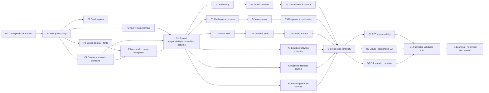

# Consultry Three-Slice Mock UI — Implementation Handover v0.1

**Stand:** 05.08.2026

**Status:** teilweise abgelöster Implementation-Handoff; Foundation- und Quality-Regeln bleiben gültig

**Ziel:** klickbare, frontend-only Mock-UI-Demo der drei ratifizierten Haupt-Slices

> **Scope correction — 2026-08-06:** Das Product wird nicht länger um zehn Scene-Routen und drei Slice-Feature-Streams gebaut. Scope, Route-/State-Modell, WBS/Dependency Flow, Definition of Done und Validierungsfokus werden durch [Systemic Platform Click Dummy Scope and WBS Delta v0.2](./Consultry-Systemic-Platform-Click-Dummy-Scope-and-WBS-Delta-v0.2.md) und den [Product Experience Contract](../Consultry-Systemic-Platform-Click-Dummy-Experience-Contract-v0.1.md) ersetzt. Next.js-/Static-Frontend-Grenze, Design-System-Autorität, Clean-Baseline-Anforderung, `<800 LOC`-WBS-Regel, Worktree-Sicherheit und Test-/Mutation-Gates dieses Dokuments bleiben anwendbar, soweit das Delta ihnen nicht widerspricht.

**Technologieentscheidung für diesen Mock:** Next.js App Router, React, TypeScript

**Nachgelagerter Gate:** erst validieren, dann den Technical PoC definieren

## 1. Executive decision

Der nächste Build ist eine isolierte Next.js-App unter `apps/consultry-mock-ui/`. Sie macht die bereits ratifizierte Product Story praktisch testbar, ohne Backend, echte AI, Persistenz, Authentifizierung, produktive Integrationen oder eine Agent-/Graph-/Model-Bridge-Architektur vorzutäuschen.

Die frühere Vite-Annahme für den Mock ist damit abgelöst. Next.js ist hier sinnvoll, weil es:

- einen belastbaren App-Router und tiefe, teilbare Szenen-URLs liefert;
- Server Components für statische Szenario-Projektionen und kleine Client-Islands für Interaktion trennt;
- denselben React-/Next.js-Korridor wie die bestehende Consultry Marketing Site nutzt;
- einen späteren Übergang vom Mock zum Technical PoC erlaubt, ohne den Mock bereits als dessen Architektur zu behandeln;
- mit Static Export eine leicht deploybare Demo ohne Runtime-Backend ermöglicht.

Die App wird als **responsible-work experience** gebaut, nicht als Chat-App, Prozess-Wizard oder Sammlung unabhängiger Feature-Demos. Das Layout bleibt anpassbar. Verbindlich sind Product-Semantik, Scene Contracts, Human-AI-Verantwortungsgrenzen und das Consultry App Design System v1.1; die explorierten Frames sind nur Evidenz.

## 2. Outcome, Scope und Nicht-Ziele

### 2.1 Erwartetes Ergebnis

Eine Testperson kann:

1. aus `My Work` in einen nachvollziehbaren Consulting-Fall einsteigen;
2. den Bestandskunden-ERP-Fall über alle drei Slices als zusammenhängende Arbeitskontinuität erleben;
3. im ersten Slice den net-new KRITIS Tender als echten Kontrastfall durchlaufen;
4. AI-Unterstützung, Quellen, menschliche Verantwortung, Entscheidung und erwarteten Effect auseinanderhalten;
5. mindestens einen negativen beziehungsweise Recovery-Pfad pro Slice verstehen;
6. Boutique und Growing Specialist Consultancy als unterschiedliche Responsibility-/Handoff-Projektionen derselben App vergleichen;
7. optional aus demselben Case in ein simuliertes Harness-Cameo wechseln;
8. anschließend Verständlichkeit, Value, Trust, Scope und Product Gaps bewerten.

### 2.2 Im Mock enthalten

- zehn provisorische Testszenen `M0`, `A1–A3`, `B1–B3`, `C1–C3`;
- ERP Continuity Spine über alle drei Slices;
- KRITIS-Tender-Kontrast in `A1–A3`;
- positive, negative und Recovery States gemäß Storyboard;
- simulierte Sources, AI Candidates, Human Decisions, Effects, Handoffs und Reuse Signals;
- deterministische Demo-Steuerung, Reset und direkte Szenen-Navigation;
- responsive Desktop-/Compact-Reflow und grundlegende mobile Nutzbarkeit;
- zugängliche Tastatur-, Fokus-, Status- und Zoom-Pfade;
- optionale Boutique-/Growing-Projektion und optionales Harness-Cameo.

### 2.3 Explizit nicht enthalten

- Backend, Datenbank, Login, Mandantenfähigkeit oder echte Persistenz;
- echte CRM-, DMS-, Knowledge-, Tender- oder Project-System-Integration;
- echte AI-Ausführung, Agenten, Skills, Graph-Loops, Validation Graph oder Model Bridge;
- technisches Harness Framework oder allgemeines Agent Framework;
- produktive Writebacks, Freigaben, Client-Kommunikation oder externe Effects;
- produktionsreife Informationsarchitektur oder ratifiziertes finales Screen Layout;
- vollständige Mobile Product Experience;
- Generalisierung über die drei Slices hinaus;
- Full-Backend-MVP-Entscheidungen.

## 3. Source-of-truth und Ableitungsreihenfolge

Bei Konflikten gilt diese Reihenfolge:

1. ratifizierte geschlossene Wayfinder-Entscheidungen sowie aktueller [Context & Memory](../_CONTEXT-AND-MEMORY.md);
2. [Three-Slice Mock UI Demo Flow](../Consultry-Three-Slice-Mock-UI-Demo-Flow-v0.1.md);
3. die drei Reference Threads:
   - [Opportunity-to-Project](../Consultry-Opportunity-to-Project-Representative-Business-Thread-v0.1.md),
   - [Active Project / Delivery Blind Spot](../Consultry-Active-Project-Delivery-Blind-Spot-Reference-Thread-v0.1.md),
   - [Knowledge, Reuse and Corporate Artifact Alignment](../Consultry-Knowledge-Reuse-and-Corporate-Artifact-Alignment-Reference-Thread-v0.1.md);
4. [Consultry UX Operating Model](../Consultry-UX-Operating-Model-v0.1.md);
5. [Consultry App Design System v1.1](../../../design/DESIGN_SYSTEM/consultry_app_design_system/Consultry-App-Design-System-v1.1.md) und dessen maschinenlesbare [CSS Tokens](../../../design/DESIGN_SYSTEM/consultry_app_design_system/tokens/consultry-app.css);
6. [Visual Direction Checkpoint](../prototypes/three-slice-mock-ui/visual-options/README.md) und [Combined Reference](../prototypes/three-slice-mock-ui/combined-reference/README.md) nur als visuelle Hypothesen;
7. dieser Implementation-Handoff für technische Organisation und Qualität.

Technische Convenience darf keine fachliche Wahrheit erfinden. Besteht ein Widerspruch, wird ein Gap erfasst und gegen die höhere Quelle entschieden; die Implementierung füllt ihn nicht stillschweigend.

## 4. Verbindliche Next.js-/React-Best-Practice-Skills

Diese lokalen Skills sind für Bootstrap, Implementierung und jeden Review-Pass verbindlich:

- [Next.js Best Practices](/Users/jules/.codex/plugins/cache/plugins-cli/vercel-plugin/0.32.7/skills/nextjs/upstream/SKILL.md) — App-Router-Dateikonventionen, RSC-Grenzen, Data Patterns, Error-/Suspense-/Hydration-Verhalten, Images und Fonts;
- [Next.js 16 Guidance](/Users/jules/.codex/plugins/cache/plugins-cli/vercel-plugin/0.32.7/skills/nextjs/SKILL.md) — App Router, asynchrone `params`/`searchParams`, `next/navigation`, `proxy.ts`, Static Export und React-19-Besonderheiten;
- [React/Next.js Performance Best Practices](/Users/jules/.codex/plugins/cache/plugins-cli/vercel-plugin/0.32.7/skills/react-best-practices/SKILL.md) — Waterfalls, Bundle-Grenzen, Serialisierung, Re-Renders und Client-Bundle-Disziplin.

Aus ihnen folgen für diesen Mock:

- App Router; kein Pages Router und kein `getServerSideProps`/`getStaticProps`;
- Server Components sind Default; `'use client'` nur am kleinsten notwendigen Interaktionsrand;
- keine asynchronen Client Components;
- nur serialisierbare und möglichst kleine Props über RSC-Grenzen;
- dynamische `params` werden in Next.js 16 awaited;
- keine `useEffect`-Synchronisation für ableitbaren State;
- keine Komponenten-Definitionen innerhalb anderer Komponenten;
- unabhängige asynchrone Arbeit läuft parallel;
- direkte Imports beziehungsweise `optimizePackageImports` statt kostspieliger Barrel-Imports;
- schwere, optionale UI – insbesondere das Harness-Cameo – wird mit `next/dynamic` geladen;
- `next/font` für Inter und JetBrains Mono; `next/image` für Rasterbilder;
- Default-Node-Runtime; für diesen statischen Mock weder Edge Runtime noch Custom Server;
- explizite `error.tsx`-/`not-found.tsx`-Pfade und keine Hydration durch Zufallswerte, Live-Zeit oder Zeitzonen;
- falls `useSearchParams` später eingeführt wird, nur unter einer Suspense-Grenze.

## 5. Technischer Mock-Schnitt

### 5.1 Versions- und Tooling-Baseline

Beim Bootstrap werden die Versionen exakt im Lockfile fixiert. Startpunkt ist die bereits im Repository verwendete Linie:

- Next.js `16.2.3`;
- React / React DOM `19.2.4`;
- TypeScript `5.x`, `strict: true`;
- pnpm `10.x`;
- Node.js `24 LTS`, per `.nvmrc` und `engines` festgehalten;
- Lucide React `1.8.0` gemäß App Design System v1.1;
- Vitest, React Testing Library, `user-event`, MSW, Playwright, `axe-core` und StrykerJS.

Gate `F0` verifiziert diese Kombination einmal lokal und in CI. Versions-Upgrades sind ein eigenes WBS-Item und werden nicht nebenbei in Slice-PRs gezogen.

### 5.2 Deployment-Form

Der Mock nutzt zunächst `output: 'export'`:

- keine serverseitige Runtime im Zielsystem;
- alle dynamischen Szenen werden über `generateStaticParams` enumeriert;
- Images werden bei Bedarf für Static Export als `unoptimized` konfiguriert;
- keine Route Handler oder Server Actions;
- ein späterer Wechsel zu einer Next.js Runtime ist möglich, aber kein Mock-Scope.

### 5.3 URL- und Szenenmodell

Die kanonische Deep-Link-Form lautet:

```text
/demo/{caseKey}/{sceneKey}
```

Beispiele:

```text
/demo/erp/m0
/demo/erp/a1
/demo/tender/a2
/demo/erp/b3
/demo/erp/c2
```

`caseKey` und `sceneKey` werden gegen eine typisierte Scenario Registry validiert. Der Modus `boutique | growing` ist zunächst Demo-State im Client und keine eigene Route oder App. So bleiben Scene Identity und Consultancy Projection getrennt.

### 5.4 Komponenten- und State-Grenzen

- `page.tsx` lädt und validiert die statische Scene Projection als Server Component.
- `DemoScene` ist eine kleine Client-Island und besitzt nur den transienten Interaktions-State der geöffneten Szene.
- Fachliche Übergänge laufen über einen typisierten Reducer (`DemoEvent → DemoState`), nicht über verstreute Booleans.
- Der Reducer simuliert keine produktive Workflow Engine und wird nicht als spätere State-Machine ratifiziert.
- Szene, Fall und Fixture-Uhr sind deterministisch; keine direkte Verwendung von `Date.now()` oder `Math.random()` im Renderpfad.
- Ein navigierbarer Scene Index ersetzt versteckte Demo-Magie.
- URL-Wechsel transportiert Scene Identity; innerhalb einer Szene bleiben Draft, Auswahl und Recovery lokal.

### 5.5 Mock-Service-Grenze

UI-Komponenten importieren keine rohen JSON-Fixtures. Sie sprechen mit einer kleinen, typisierten `DemoGateway`-Schnittstelle:

```ts
interface DemoGateway {
  loadScene(input: LoadSceneInput): Promise<SceneProjection>
  propose(input: ProposalInput): Promise<ProposalResult>
  applySimulatedEffect(input: EffectInput): Promise<EffectResult>
  requestContribution(input: ContributionInput): Promise<ContributionResult>
}
```

Die App verwendet eine deterministische In-Memory-Implementierung. MSW bildet in Tests die HTTP-/Connector-Grenze ab und prüft Request, Fehler, Latenz und Response Contracts. Damit bleiben Mock-Tests realistisch, ohne im Runtime-Mock ein Fake-Backend zu bauen.

Jeder simulierte Effect schreibt nur in ein lokales, sichtbares `EffectLedger`. Er muss mit `simuliert`, Actor, Ziel, Grundlage und Resultat gekennzeichnet sein. Ein Reset stellt die Fixture-Ausgangslage vollständig wieder her.

### 5.6 Styling

- bestehende Consultry CSS Tokens werden als Quelle übernommen, nicht manuell nachgebaut;
- CSS Modules für lokale Komposition; kein neues Utility-/Component-Framework im ersten Pass;
- Dark Shell + warm-light workspace;
- eine dominante Arbeitsfläche, maximal ein eingeklapptes beziehungsweise überlagerndes Context Panel;
- Standard Density; Compact nur für Queue/Table;
- 44 × 44 px Mindestziele, sichtbarer Focus, semantische Headings;
- Status immer mit Text + Icon + Farbe;
- Source, Status, Consequence und Human Ownership an entscheidungsrelevanten Stellen;
- keine Border um jedes Objekt, keine Chat-zentrierte Primärfläche;
- deutsche Labels werden mit mindestens 30 % Längenreserve und bei 200 % Zoom getestet.

### 5.7 Optionaler Model-composed-Surface-Spike

Nach der verständlichen Core-Demo darf ein kleiner Spike prüfen, ob ein modellartig erzeugtes QA-/Evidence-/Artifact-Element gegenüber einem statischen Frame zusätzlichen Wert schafft. Der Mock ruft dafür kein echtes Modell auf. Eine deterministische Fixture liefert einen typisierten `SurfaceSpec`; ein Renderer bildet nur freigegebene Consultry-Komponenten ab.

Der Spike muss:

- mindestens ein dynamisches QA-Fragenset und eine strukturierte Evidence-/Artifact-Sektion rendern;
- unbekannte Component Types, Actions, freie Scripts, beliebiges HTML/CSS und nicht erlaubte Effects ablehnen;
- Design-System-Tokens, Accessibility und lange deutsche Inhalte erhalten;
- Generated State, Sources, Purpose, Case-/Artifact-Bindung und Human Ownership zeigen;
- Antworten als lokalen Draft behandeln und keine Approval-, Publish- oder Domain-Write-Autorität erzeugen.

Claude-/Codex-artige Artifact-/Workbench-Experiences sind Interaction-Inspiration. Der Spike ist weder eine allgemeine Generative-UI-Plattform noch ein Website Builder. Publizierbarer Website-/Page-Content bleibt eine separate spätere Spezialisierung mit Brand-, Proof- und Publication-Gates.

## 6. Zielstruktur der App

```text
apps/consultry-mock-ui/
├── app/
│   ├── (demo)/
│   │   └── demo/[caseKey]/[sceneKey]/
│   │       ├── page.tsx
│   │       ├── loading.tsx
│   │       ├── error.tsx
│   │       └── not-found.tsx
│   ├── _components/
│   │   ├── demo-shell/
│   │   ├── scene-navigation/
│   │   └── demo-controls/
│   ├── global-error.tsx
│   ├── globals.css
│   ├── layout.tsx
│   └── page.tsx
├── src/
│   ├── domain/
│   │   ├── case.ts
│   │   ├── scene.ts
│   │   ├── authority.ts
│   │   ├── source.ts
│   │   ├── effect.ts
│   │   └── invariants.ts
│   ├── scenarios/
│   │   ├── registry.ts
│   │   ├── erp/
│   │   └── tender/
│   ├── gateway/
│   │   ├── demo-gateway.ts
│   │   ├── in-memory-demo-gateway.ts
│   │   └── contracts.ts
│   ├── features/
│   │   ├── opportunity-to-project/
│   │   ├── delivery-challenge/
│   │   ├── artifact-alignment/
│   │   ├── consultancy-projection/
│   │   └── harness-cameo/
│   ├── shared/
│   │   ├── source-basis/
│   │   ├── responsibility/
│   │   ├── decision-frame/
│   │   ├── effect-ledger/
│   │   └── recovery-state/
│   └── test/
│       ├── fixtures/
│       ├── msw/
│       └── render.tsx
├── e2e/
│   ├── opportunity.spec.ts
│   ├── delivery-challenge.spec.ts
│   ├── artifact-alignment.spec.ts
│   ├── accessibility.spec.ts
│   └── visual.spec.ts
├── public/
├── next.config.ts
├── playwright.config.ts
├── stryker.config.mjs
├── vitest.config.ts
├── package.json
├── pnpm-lock.yaml
└── README.md
```

Keine pauschalen `index.ts`-Barrels über ganze Feature-Bäume. Komponenten und Icons werden direkt importiert. Shared Code wird erst nach der zweiten echten Wiederholung extrahiert.

## 7. Delivery- und Dependency-Flow



`A`, `B` und `C` können nach `S1` parallel laufen. Innerhalb eines Slices bleibt die Reihenfolge bewusst sequentiell, weil spätere Szenen die Semantik und Fixtures der vorherigen Szene übernehmen. `I1` integriert keine drei Mini-Produkte, sondern prüft die gemeinsame Case-/Artifact-Lineage.

## 8. WBS-Regel

Jedes WBS-Item bleibt unter **800 authored LOC inklusive Tests und Konfiguration**. Ausgenommen sind ausschließlich generierte Lockfiles, Playwright-Binärartefakte und genehmigte Snapshot-Dateien. Zielkorridor ist 250–650 LOC. Überschreitet ein Item in der Forecast- oder Review-Phase 800 LOC, wird es vor Merge entlang einer fachlichen Grenze geteilt.

Ein PR enthält normalerweise genau ein WBS-Item. Kein PR darf seine Größe durch das Verschieben von Testcode, große generierte Fixtures oder Copy-Blöcke verschleiern.

## 9. In-depth WBS

### 9.1 Gate und Foundation

| ID | Deliverable | Abhängigkeit | LOC-Ziel | Test-first- und Abnahmekriterium |
|---|---|---:|---:|---|
| `G0` | Clean baseline: relevante Product-/Design-Artefakte versioniert; Baseline-Commit notiert; keine Implementierung | – | ≤120 Docs | Source-of-truth-Links auflösbar; `git status` für den Baseline-Checkout sauber; keine stillen Stashes |
| `F0` | isolierte `apps/consultry-mock-ui` Next.js-16-App, pnpm/Node-Pins, Static Export, Startseite | G0 | ≤450 | zunächst failing smoke test; dann `dev`, `typecheck`, `build` und statischer Export erfolgreich |
| `F1` | ESLint, Format-Check, Typecheck, Vitest, Coverage, Playwright und CI-Scripts | F0 | ≤600 | absichtlich fehlschlagender Beispielcheck beweist jedes Gate; danach grüne Pipeline |
| `F2` | Consultry Tokens, `next/font` Inter/JetBrains Mono, Lucide-Baseline, globale Accessibility Styles | F0 | ≤500 | Token-Smoke, Font-Klassen, Focus-Style und kein manuelles Google-Font-Link; 200-%-Zoom-Check |
| `F3` | Test-Render-Helper, deterministic clock, fixture builders, MSW server, gateway contract suite | F0 | ≤700 | Success/Error/Latency-Contract-Tests; Netzwerkzugriff außerhalb MSW schlägt Tests fehl |
| `F4a` | Case-, Scene-, Source-, Responsibility-, Authority- und Effect-Typen | F0 | ≤550 | Compile-time Fixtures + Unit-Tests für ungültige Scene-/Authority-Kombinationen |
| `F4b` | ERP-/Tender-Scenario Registry und statische Parametererzeugung | F4a | ≤650 | jeder erlaubte Deep Link ist generierbar; unbekannte Kombination führt zu Not Found |
| `F5a` | Dark Shell, warm workspace, Skip Link, Landmark-/Heading-Struktur | F2, F4b | ≤700 | RTL Keyboard-/Landmark-Tests; axe ohne kritische Verstöße |
| `F5b` | Demo Navigation, Case-/Scene-Kontext, Boutique-/Growing-Indikator | F5a | ≤650 | Back/Forward, direkter Deep Link, sichtbarer aktueller Kontext, mobile Reflow |
| `F5c` | Error, Not Found, Loading und deterministic reset states | F3, F5b | ≤500 | Fehler- und Reset-Integrationstests; Fokus wird sinnvoll wiederhergestellt |

### 9.2 Gemeinsame Product Patterns

| ID | Deliverable | Abhängigkeit | LOC-Ziel | Test-first- und Abnahmekriterium |
|---|---|---:|---:|---|
| `S1a` | Source Basis: exact source, version, freshness, evidence class und open source action | F3, F4b, F5c | ≤650 | fehlende/alte/widersprüchliche Quelle; Status nicht nur über Farbe; vollständige Tastaturbedienung |
| `S1b` | Responsibility + Authority frame: owner, contributor, AI role, permitted decision/effect | S1a | ≤700 | AI kann keinen Human Decision Status erzeugen; Mutation-Test tötet Authority-Guard-Mutanten |
| `S1c` | Proposal/Decision/Effect pattern mit sichtbarem simuliertem Effect Ledger | S1b | ≤750 | propose ≠ decide ≠ effect; failed effect bleibt sichtbar und recovery-fähig |
| `S1d` | Recovery pattern: missing basis, request context, retry, hold und return-to-work | S1c | ≤650 | Recovery verliert weder Draft noch aktuelle Responsibility; Fokus- und Live-Region-Test |

### 9.3 Slice A — Opportunity-to-Project / External Commitment

| ID | Deliverable | Abhängigkeit | LOC-Ziel | Test-first- und Abnahmekriterium |
|---|---|---:|---:|---|
| `A1a` | ERP Observation Entry: aktive Project-Beobachtung, Scope-Trennung, Qualification | S1d | ≤700 | Observation wird nicht automatisch Opportunity; Boutique kann allein qualifizieren |
| `A1b` | Qualification Recovery: insufficient basis / hold / dismiss with reason | A1a | ≤550 | kein Commitment ohne Grundlage; Reason und nächste Prüfung sichtbar |
| `A2a` | KRITIS Tender Entry als vollwertiger Kontrastfall | S1d | ≤750 | Tender nutzt Kriterien-/Evidence-Modus; kein dekoratives Intake-Card-Surrogat |
| `A2b` | Tender No-Bid/Hold und Context Request | A2a | ≤550 | negative Entscheidung bleibt erklärbar; kein erfundener Bestandskunden-Kontext |
| `A3a` | Engagement-/Commitment-Arbeit für ERP Follow-on | A1b | ≤750 | Scope, client-facing commitment und Human Owner getrennt; Source Lineage sichtbar |
| `A3b` | Readiness, simuliertes Commitment und accepted Delivery Handoff | A3a | ≤750 | erst Readiness, dann simulierter Effect; aktives Folgeprojekt referenziert exakte Basis |
| `A3c` | Tender Commitment-/Readiness-Variante auf gemeinsamen Contracts | A2b, A3b | ≤650 | Wiederverwendung ohne ERP-Semantik-Leak; unterschiedliche Kriterien bleiben sichtbar |

### 9.4 Slice B — Active Project / Delivery Blind Spot

| ID | Deliverable | Abhängigkeit | LOC-Ziel | Test-first- und Abnahmekriterium |
|---|---|---:|---:|---|
| `B1a` | admissible Challenge auf Wave-1 Artifact `v7` versus source `v3` | S1d | ≤750 | aktuelle Human Assessment, früherer Status und AI Candidate sind getrennte Objekte |
| `B1b` | intentional challenge / inadmissible / duplicate recovery | B1a | ≤600 | irrelevante Challenge wird begründet verworfen; kein blindes AI Alerting |
| `B2a` | source-bound assessment: substantiated, refuted, inconclusive | B1b | ≤750 | Ergebnis setzt Source + Human Assessment voraus; Materiality ist separate Entscheidung |
| `B2b` | Materiality und Rebuttal-Simulation mit sichtbarer Unsicherheit | B2a | ≤700 | Rebuttal ist Arbeitsunterstützung, keine Freigabe; fehlende Evidenz bleibt offen |
| `B3a` | responsible response: revise, justify or accept conditionally | B2b | ≤750 | eine accountable Boutique-Person kann mit AI-Hilfe abschließen; Ownership bleibt menschlich |
| `B3b` | contribution / revalidation / conditional result | B3a | ≤700 | Growing-Expert-Contribution wird angenommen, ohne finale Verantwortung automatisch zu übertragen |

### 9.5 Slice C — Knowledge/Reuse + Corporate Artifact Alignment

| ID | Deliverable | Abhängigkeit | LOC-Ziel | Test-first- und Abnahmekriterium |
|---|---|---:|---:|---|
| `C1a` | alignment-aware successor artifact work canvas | S1d | ≤750 | `Nachfolgeversion · Entwurf`, nicht vorschnell `v8`; exakte Source-/Artifact-Lineage |
| `C1b` | wrong/missing corporate basis recovery | C1a | ≤600 | keine scheinbar aligned Ausgabe ohne Basis; Context Request erhält Draft |
| `C2a` | human disposition und preview of controlled client-steering effect | C1b | ≤750 | AI Draft, Human Change und freizugebender Output unterscheidbar |
| `C2b` | simulated export/writeback success and failure | C2a | ≤650 | Ledger zeigt simulierten Zielzustand; Fehler bleibt recoverable und erzeugt keine falsche Freigabe |
| `C3a` | overlapping project issue/solution signal to affected consultant/management | C2b | ≤750 | Signal nennt Gemeinsamkeit, Differenz, Herkunft und zuständige Personen |
| `C3b` | discuss → reject/merge/confirm Reuse Candidate → blueprint candidate | C3a | ≤750 | Artifact Completion hängt nicht von Productization ab; kein automatisches Canonical Knowledge |

### 9.6 Cross-cutting Experience

| ID | Deliverable | Abhängigkeit | LOC-Ziel | Test-first- und Abnahmekriterium |
|---|---|---:|---:|---|
| `X1a` | Boutique responsibility projection | S1d | ≤500 | keine fiktive zweite Person; ein Owner kann innerhalb Authority verantwortet abschließen |
| `X1b` | Growing Specialist projection und accepted handoff/contribution | X1a | ≤650 | Custody, Contribution und Accountability bleiben unterscheidbar |
| `X2` | optional, dynamisch geladenes Harness-Cameo | S1d | ≤750 | gleiche Case-/Source-/Authority-/Effect-Grenzen; Default-Flow bleibt ohne Harness vollständig |
| `X3` | Presenter Bar: scene jump, positive/recovery state, reset, projection switch | F5c | ≤650 | Controls sind klar als Demo-Steuerung markiert und nicht Teil der Product Experience |
| `X4` | Learning Capture: lokale strukturierte Notizen/Export ohne Nutzerdaten | I1 | ≤600 | exportiert Scene, Projection und Finding; kein Analytics-/Backend-Zwang |
| `X5` | optionaler Model-composed-Surface-Spike mit allowlisted `SurfaceSpec` Renderer | I1c | ≤750 | rendert QA- und Artifact-/Evidence-Fixture; unbekannte Components/Actions werden abgewiesen; kein echter Model Call |

### 9.7 Integration, Quality und Validation

| ID | Deliverable | Abhängigkeit | LOC-Ziel | Test-first- und Abnahmekriterium |
|---|---|---:|---:|---|
| `I1a` | ERP continuity: A3 Handoff → B Artifact → C successor/reuse | A3, B3, C3 | ≤700 | IDs, Sources, Owners und Versionsbezüge stimmen über alle Slices |
| `I1b` | My Work `M0` als gemeinsamer Einstieg und Rückkehrpunkt | F5, I1a | ≤650 | Aufgaben wirken als eine Consultancy-Arbeit, nicht als drei Produktmodule |
| `I1c` | copy/semantic reconciliation against source docs | I1b | ≤450 | kontrollierte Terminologie; alle Abweichungen als Product Gap dokumentiert |
| `Q1` | Playwright E2E für Happy + Recovery Path aller drei Slices | I1c | ≤750 | mindestens ein kompletter ERP-Pfad, Tender-Kontrast und je ein Recovery-Pfad grün |
| `Q2` | Accessibility suite: axe, Keyboard, Focus, status semantics, 200 % zoom | I1c | ≤700 | keine critical/serious axe defects; manuelle Checkliste als PR-Artefakt |
| `Q3` | Visual/responsive regression für 1440, 1024, 768 und 390 px | I1c | ≤650 | Snapshots nur für stabile Regions; kein Snapshot der gesamten dynamischen Textwelt |
| `Q4` | Stryker full baseline, incremental PR mode, thresholds und report artifact | F1, I1c | ≤600 | kritische Guards ohne Survivor; Baseline dokumentiert; CI bricht bei Regression |
| `Q5` | Bundle/hydration/static-export audit | Q1–Q4 | ≤500 | keine Hydration-Warnung; keine unnötige große Client-Island; Export lokal servierbar |
| `V1` | facilitated validation build + moderator script + seeded test states | Q5 | ≤650 | alle zehn Szenen in ≤2 Klicks erreichbar; Reset reproduzierbar; Beobachtungspunkte notiert |
| `H1` | Findings, rejected assumptions, Product Gaps und Technical-PoC handoff delta | V1 | ≤500 Docs | Prototype-Ticket nur nach realer Validierung schließen; technische Details aus Learnings ableiten |

## 10. Optimale Git-Worktree-Struktur

### 10.1 Prerequisite

Der aktuelle `dev`-Checkout enthält bereits viele uncommittete Product-/Design-Änderungen. Parallele Implementation beginnt **nicht** direkt daraus. `G0` muss zuerst einen bewusst geprüften, sauberen Baseline-Commit erzeugen. Dieser Handoff autorisiert keinen automatischen Commit und keinen stillen Stash.

Worktrees liegen als Geschwister neben dem Repository, nicht innerhalb von `.claude/worktrees` oder dem Repository selbst. Sie werden pro Delivery-Wave neu aufgesetzt, damit alte Foundation-Branches nicht als dauerhaftes Integrationsmodell weiterleben.

**Wave 1 — Foundation:**

```text
/Users/jules/dev/consultry/                         # Product control + source docs
/Users/jules/dev/consultry-wt/mock-integration/     # integration branch
/Users/jules/dev/consultry-wt/mock-quality/         # F1
/Users/jules/dev/consultry-wt/mock-design/          # F2
/Users/jules/dev/consultry-wt/mock-test/            # F3
/Users/jules/dev/consultry-wt/mock-contracts/       # F4
```

**Wave 2 — Slices und Experience, nach Entfernung der vier Foundation-Worktrees:**

```text
/Users/jules/dev/consultry/                         # Product control + source docs
/Users/jules/dev/consultry-wt/mock-integration/     # integration branch
/Users/jules/dev/consultry-wt/mock-opportunity/     # Slice A
/Users/jules/dev/consultry-wt/mock-delivery/        # Slice B
/Users/jules/dev/consultry-wt/mock-artifact/        # Slice C
/Users/jules/dev/consultry-wt/mock-experience/      # X1–X3
```

Branch-Gruppen:

```text
codex/mock-ui-integration
codex/mock-ui-quality
codex/mock-ui-design
codex/mock-ui-test
codex/mock-ui-contracts
codex/mock-ui-opportunity
codex/mock-ui-delivery
codex/mock-ui-artifact
codex/mock-ui-experience
```

Beispiel nach `G0` – nicht vorab ausführen:

```bash
git worktree add ../consultry-wt/mock-integration -b codex/mock-ui-integration <baseline-sha>
git worktree add ../consultry-wt/mock-quality -b codex/mock-ui-quality codex/mock-ui-integration
git worktree add ../consultry-wt/mock-design -b codex/mock-ui-design codex/mock-ui-integration
git worktree add ../consultry-wt/mock-test -b codex/mock-ui-test codex/mock-ui-integration
git worktree add ../consultry-wt/mock-contracts -b codex/mock-ui-contracts codex/mock-ui-integration
```

Nach deren Merge werden die vier Foundation-Worktrees entfernt. Opportunity, Delivery, Artifact und Experience werden dann mit demselben Muster frisch vom integrierten `S1`-Stand angelegt.

### 10.2 Execution waves

**Wave 0 — sequential**

1. `G0` Product baseline bereinigen und fixieren.
2. Integration Worktree erstellen.
3. `F0` Bootstrap direkt auf `codex/mock-ui-integration`, bevor parallele Branches entstehen.

**Wave 1 — Foundation, begrenzt parallel**

- Worktree Quality: `F1`;
- Worktree Design: `F2`;
- Worktree Test: `F3`;
- Worktree Contracts: `F4a → F4b`;
- danach `F5a → F5b → F5c → S1a → S1b → S1c → S1d` auf kurzen, nacheinander integrierten PRs.

Foundation-Arbeit wird zuerst in `codex/mock-ui-integration` gemerged. Slice-Branches werden anschließend frisch von diesem integrierten Stand erstellt. Kein Slice dupliziert Shared Contracts während Foundation noch driftet.

**Wave 2 — drei Slice-Streams parallel**

- Opportunity Worktree: `A1 → A2 → A3`;
- Delivery Worktree: `B1 → B2 → B3`;
- Artifact Worktree: `C1 → C2 → C3`;
- Experience Worktree: `X1 → X2 → X3`;
- Integration Worktree: Reviews, Contract-Support und Merge-Gates; kein paralleles Feature-Coding.

Innerhalb jedes Streams ein Item nach dem anderen. Jeder WBS-PR geht gegen `codex/mock-ui-integration`, nicht direkt gegen `dev`.

**Wave 3 — sequential integration**

1. Slice A mergen und Contract Suite laufen lassen.
2. Slice B mergen und ERP-Lineage prüfen.
3. Slice C mergen und Artifact-/Reuse-Lineage prüfen.
4. `I1a–I1c` auf Integration-Branch.
5. `Q1–Q5`, dann `V1`.
6. Ein finaler Integration-PR geht von `codex/mock-ui-integration` nach `dev`.

`X5` darf nach `I1c` parallel zu den Quality-Pässen untersucht werden, sofern er die Core-Demo oder `V1` nicht blockiert. Wird er nicht rechtzeitig verständlich, bleibt die dokumentierte Hypothese offen statt den ersten Prototype künstlich zu vergrößern.

### 10.3 Worktree-Regeln

- Eine Branch darf nie gleichzeitig in zwei Worktrees ausgecheckt sein.
- Jeder Worktree führt `pnpm install --frozen-lockfile` beziehungsweise `pnpm install` nur nach bewusstem Lockfile-Update aus; `node_modules` wird nicht geteilt.
- Pro Worktree eigener Port, z. B. `3100`, `3101`, `3102`.
- Keine Worktree-übergreifenden Stashes als Übergabemechanismus.
- Shared Contract Changes zuerst als eigener Foundation-PR; Slice-PRs vendoren keine Kopien.
- Nach Merge wird der Slice-Branch zeitnah entfernt und der Worktree gepruned.
- Konflikte werden semantisch am Integration-Branch gelöst, nicht durch pauschales Bevorzugen einer Seite.

## 11. Test-driven Delivery Contract

### 11.1 Red–Green–Refactor pro WBS-Item

1. ein beobachtbares Acceptance-Verhalten oder eine Invariante als failing Test formulieren;
2. kleinstmögliche Implementierung bis grün;
3. Refactor ohne Verhaltensänderung;
4. Mutation-Run auf den geänderten produktiven Dateien;
5. überlebende Mutanten entweder mit einem besseren Test töten oder als begründetes Equivalent dokumentieren;
6. gesamte betroffene Testpyramide und Static Build ausführen.

Test-Commits müssen nicht künstlich getrennt sein, aber der PR muss erkennbar machen, welche Invarianten vor der Implementierung festgelegt wurden.

### 11.2 Testpyramide

**Unit Tests — Vitest**

- Reducer und erlaubte Scene Transitions;
- Authority-/Responsibility-Guards;
- Source-, Lineage-, Version- und Effect-Invarianten;
- Scenario Registry und Fixture Builder;
- Formatierung und kontrollierte Statusableitungen.

**Component Behavior — React Testing Library + user-event**

- Nutzerinteraktion über Rolle, zugänglichen Namen und sichtbaren Text;
- Tastatur, Focus Restore, Drawer/Panel, Form Errors und Live Regions;
- keine Tests gegen interne State- oder CSS-Implementierung.

**Mock Integration — MSW**

- Gateway Success, Error, empty/missing basis und latency;
- korrekte Request Contracts und Actor-/Source-/Authority-Daten;
- keine ungeplanten echten Netzwerkaufrufe;
- simulated Effects bleiben sichtbar und recoverable.

**E2E — Playwright**

- vollständige Nutzerpfade und Back/Forward/Deep Links;
- ERP-Kontinuität und Tender-Kontrast;
- Boutique single-human completion und Growing accepted contribution;
- je ein Recovery-Pfad pro Slice;
- optionales Harness öffnet denselben Case und kann keine Authority eskalieren.

**Accessibility**

- axe als automatische Basis, nicht als Ersatz für manuelle Prüfung;
- vollständiger Keyboard-Pfad, sichtbarer Focus, logische Heading-/Landmark-Struktur;
- Status verständlich ohne Farbe;
- 200 % Zoom, Text Spacing, Reduced Motion und lange deutsche Labels.

**Visual Regression**

- stabile Shell-, Workspace-, Source-/Decision-/Effect-Regionen;
- vier Viewports;
- Snapshot-Update nur mit Review-Kommentar und Bilddiff;
- explorierte Referenzframes sind Vergleichsmaterial, kein Pixel-Match-Ziel.

### 11.3 Mutation Testing in jedem PR

StrykerJS läuft in jedem PR inkrementell auf allen geänderten mutierbaren Produktivdateien:

```bash
pnpm test:mutation:changed
```

Der vollständige Run läuft auf Integration-PRs und zusätzlich regelmäßig:

```bash
pnpm test:mutation:full
```

Mutation-Schwerpunkt:

- Guards, Reducer, Contracts, Mapping, Status-/Effect-Ableitungen;
- keine künstliche Mutation von generierten Typen, statischen Content-Fixtures, reinen CSS-Dateien oder trivialen Next.js Route-Wrappern;
- ein PR ohne mutierbaren Produktionscode führt den Changed-Run trotzdem aus und dokumentiert `no mutable files`, statt das Gate still zu überspringen.

Startschwelle nach der ersten Full Baseline:

- geänderte fachliche Logik: mindestens 80 % Mutation Score;
- projektweite Baseline: zunächst mindestens 75 %, danach Ratchet ohne Regression;
- kein überlebender Mutant in Authority-, Responsibility-, Source- oder Effect-Invarianten;
- Ziel nach Stabilisierung: 85 % für fachliche Logik.

Der Stryker Vitest Runner parallelisiert selbst; Vitest Browser Mode wird dafür nicht verwendet. Incremental Cache wird als CI-Artefakt zwischen PR-Runs weitergereicht.

## 12. PR- und CI-Gates

Jeder PR enthält:

- WBS-ID und Purpose;
- verlinkte Product-/Scene-Quelle;
- explizite Nicht-Ziele;
- LOC-Zahl ohne Lockfiles/Snapshots und Begründung, falls >650;
- Acceptance Tests und Mutation Result;
- Screenshots oder kurzes Capture bei UI-Änderung;
- Accessibility-Auswirkung;
- bekannte Gaps und Folge-WBS;
- Bestätigung, dass die drei Next.js-/React-Skills geprüft wurden.

Pflicht-Gates:

```text
format/check
eslint
tsc --noEmit
vitest unit + component + mock integration
coverage thresholds
next build + static export
playwright chromium smoke
axe smoke
stryker incremental
LOC policy
```

Zusätzliche Integration-Gates:

```text
playwright full matrix
visual regression
manual keyboard + 200 % zoom checklist
stryker full
bundle/client-boundary audit
all static deep links served
```

## 13. Definition of Done für den klickbaren Mock

Der Mock ist nur dann implementierungsfertig, wenn:

- alle zehn Testszenen als echte Deep Links erreichbar sind;
- ERP über A → B → C nachvollziehbare Case-, Project-, Artifact- und Source-Lineage behält;
- Tender `A1–A3` als echter Kontrast und nicht nur als Karte vorhanden ist;
- pro Slice Happy Path sowie mindestens ein relevanter Recovery-Pfad funktioniert;
- Proposal, Human Decision und simulated Effect nicht visuell oder semantisch verschmelzen;
- eine Boutique-Person die verantwortete Arbeit ohne fiktiven zweiten Mitarbeiter abschließen kann;
- Growing Contribution/Handoff möglich ist, ohne Accountability unbemerkt zu übertragen;
- Corporate Alignment am exakten Artifact Output erlebbar ist;
- Overlap Signal → Diskussion → Reuse/Blueprint Candidate optional erlebbar ist, ohne Artifact Completion zu blockieren;
- das Harness optional bleibt und keine zweite Semantik erzeugt;
- Design-System-, Accessibility-, Test-, Mutation- und Static-Export-Gates grün sind;
- reale moderierte Sessions vorbereitet sind.

Das Wayfinder-Prototype-Ticket bleibt bis nach der tatsächlichen Validierung `open`.

## 14. Validierungsübergang statt vorschneller Technical PoC

Nach dem Build folgen moderierte Sessions. Zu erfassen sind mindestens:

- versteht die Person den verantworteten Job ohne Erklärung des Systems?
- erkennt sie, was aus Source, AI Candidate, früherem Human Status und aktueller Entscheidung stammt?
- versteht sie, welche Handlung nur simuliert ist und welchen Business Effect sie später hätte?
- fühlt sich der Wechsel zwischen Sales, Delivery und Artifact Work wie eine zusammenhängende Consultancy-Arbeit an?
- hilft Boutique die Single-Human Completion, ohne Scheinautonomie zu erzeugen?
- sind Contribution und Handoff im Growing-Modus klar genug?
- ist der konkrete Output-/Artifact-Boost sichtbar und wertvoll?
- entsteht durch Overlap/Reuse ein glaubwürdiger Mehrwert oder nur zusätzlicher Prozess?
- wird das Harness freiwillig gewählt und, wenn ja, wofür?
- welche UI-, Flow-, Domain- oder Trust-Annahmen werden widerlegt?

Erst die Findings aus diesen Sessions speisen den `Definition-complete Three-Slice Technical PoC Handoff`. Skills, Agents, Execution-/Validation-/Skill-Graphs, Harness Engineering und Model Bridge werden dann nur für validierte Probleme und Flows technisch spezifiziert.

## 15. Hauptrisiken und Gegenmaßnahmen

| Risiko | Gegenmaßnahme |
|---|---|
| Beispiel-Frames werden als Layout-Spezifikation behandelt | In jedem UI-PR Product Contract und Design System verlinken; kein Pixel-Match-Abnahmekriterium |
| Mock wird unbemerkt zur Backend-Architektur | In-Memory Gateway, Static Export, keine Route Handler/Server Actions, technische Gaps separat notieren |
| drei Slices driften zu Mini-Produkten auseinander | gemeinsame Registry, Shell, Source-/Authority-/Effect-Patterns und verpflichtender `I1` Continuity Pass |
| Chat wird zum Default | objekt-/artifact-/work-zentrierte Hauptfläche; Conversation nur als situative Oberfläche |
| AI Candidate sieht wie menschliche Freigabe aus | typisierte Guards, getrennte Status, Mutation Gate auf Authority-Invarianten |
| parallele Branches duplizieren Shared Code | Foundation vor Slice-Wave stabilisieren; Shared Contract Change als eigener PR |
| Mutation Testing wird zu langsam oder kosmetisch | incremental pro PR, full auf Integration, fachliche Mutationsfläche und Ratchet |
| Visual Snapshots blockieren UX-Lernen | nur stabile Regions snapshotten; UX-Änderung mit begründetem Bilddiff zulassen |
| LOC-Limit erzeugt künstliche Fragmentierung | nach fachlicher Boundary schneiden; WBS darf mehrere kleine PRs erhalten, nie umgekehrt |
| uncommittete Product-Quellen fehlen in Worktrees | `G0` clean baseline ist harter Start-Gate |

## 16. Offizielle technische Referenzen

- [Next.js App Router](https://nextjs.org/docs/app)
- [Next.js Project Structure](https://nextjs.org/docs/app/getting-started/project-structure)
- [Next.js Server and Client Components](https://nextjs.org/docs/app/getting-started/server-and-client-components)
- [Next.js Static Exports](https://nextjs.org/docs/app/guides/static-exports)
- [React Testing Library](https://testing-library.com/docs/react-testing-library/intro/)
- [Testing Library user-event](https://testing-library.com/docs/user-event/intro/)
- [Vitest](https://vitest.dev/guide/)
- [Mock Service Worker](https://mswjs.io/)
- [Playwright Test](https://playwright.dev/docs/intro)
- [Playwright Accessibility Testing](https://playwright.dev/docs/accessibility-testing)
- [StrykerJS Vitest Runner](https://stryker-mutator.io/docs/stryker-js/vitest-runner/)
- [StrykerJS Incremental Mode](https://stryker-mutator.io/docs/stryker-js/incremental/)
- [Git Worktree](https://git-scm.com/docs/git-worktree.html)

## 17. Immediate start sequence

1. `G0`: die derzeit uncommitteten relevanten Product-/Design-Artefakte prüfen und als sauberen Baseline-Commit bereitstellen.
2. Integration- und Foundation-Worktree anlegen.
3. `F0` als ersten Build-PR ausführen.
4. `F1–F4` parallelisieren, dann `F5` und `S1` integrieren.
5. Slice A, B und C parallel umsetzen.
6. Cross-Slice Continuity und Quality Gates schließen.
7. moderierte Validierung durchführen.
8. erst danach Technical-PoC-Handoff ableiten.
